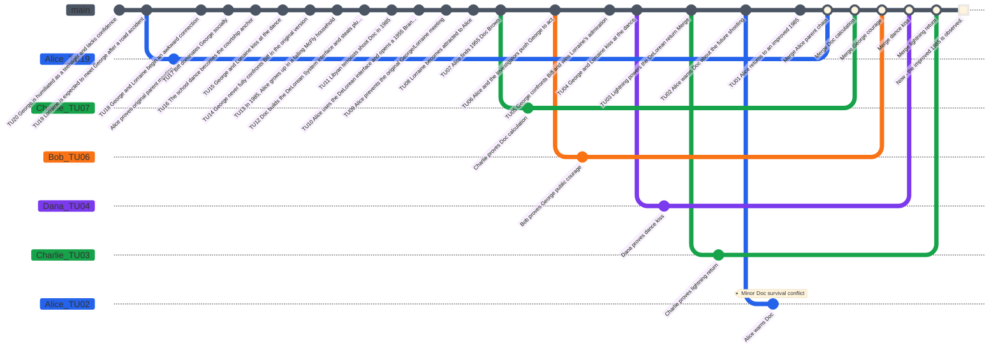

# Back to the Future Case - Game Master Prep

This is a playtest case structure for **Causality**, based on the provided summary of *Back to the Future*. It is written as Game Master preparation, not as player-facing text.

The scenario works best as a family-origin paradox investigation: the Investigators believe the mission is to return Marty to 1985, while the real playable objective is more precise: preserve Marty's birth, repair the broken courtship between George and Lorraine, warn Doc Brown without collapsing the timeline, and accept that a coherent **Main Timeline** may still return improved but changed.

For this playable table, **Alice** replaces Marty McFly as the displaced child of the McFly family. **Bob**, **Charlie**, and **Dana** are other **Investigators** observing, advising, or entering **Branched Timelines** through the **System**. Marty can be removed, kept as an alias, or used as an archived identity if the table wants to echo the source more closely.

## Scenario Premise

In 1985, Alice wants to become a successful guitarist, but the McFly family looks trapped in a pattern of humiliation and resignation. George McFly is dominated by Biff Tannen and mocked as a lifelong slacker. Lorraine is unhappy, Alice's siblings seem stuck, and Alice fears that family history may be stronger than personal will.

One night, Doctor Emmett Brown reveals a plutonium-powered DeLorean interface for the System. The plutonium was stolen from Libyan terrorists, who track Doc and shoot him. Alice uses the DeLorean interface during the crisis and is projected into a 1955 Branched Timeline state.

In 1955, Alice contacts the younger Doc Brown, but accidentally prevents George and Lorraine from meeting correctly. Lorraine becomes fascinated with Alice instead of George. If George and Lorraine do not fall in love, Alice's own existence becomes impossible.

The Investigators must rebuild the causal chain that leads to Alice's birth, push George to stand up to Biff, preserve Lorraine's attraction to George, use the lightning event to support the return Merge into 1985, and decide whether warning Doc Brown about his future death can merge without breaking the origin.

## Core Game Master Truth

- The McFly family failure in 1985 is not a fixed destiny; it is the consequence of George never fully confronting Biff.
- Alice's accidental intervention in 1955 breaks the original parent-meeting chain.
- Lorraine's misplaced attraction to Alice is the central paradox pressure.
- If George and Lorraine do not kiss at the dance, Alice and the McFly siblings cannot be explained by the final Now.
- George must confront Biff in a way that preserves the courtship and changes his own future confidence.
- Doc Brown can use lightning to stabilize Alice's return Merge because the DeLorean interface no longer has plutonium.
- Doc's 1985 shooting is a dangerous warning target: saving him improves the Now, but the warning must be compatible with his survival and Alice's trip.
- A better 1985 can be coherent if the key causal chain remains intact: Alice exists, Doc survives, and the McFly family transformation has a clear cause.
- Doc's return from the future is a hook, not a required resolution for this scenario.

## Main Timeline

The **Time Flow** has **20 Atomic Time Units** numbered from **Time Unit 20** as the oldest prepared event to **Time Unit 1** as the latest prepared event before the present. **Now** is **Time Unit 0**. The Game Master prepares the following **Main Timeline**. Players should not receive the hidden notes at first.

| Time Unit | Visible or Discoverable Event | Hidden GM Note |
|---|---|---|
| 20 | George is humiliated as a teenager and lacks confidence. | This is the root of the weak McFly family pattern. |
| 19 | Lorraine is expected to meet George after a road accident. | The original meeting depends on George being hit by Lorraine's father. |
| 18 | George and Lorraine begin an awkward connection. | It is fragile and easy to disrupt. |
| 17 | Biff dominates George socially. | Biff is the pressure keeping George passive. |
| 16 | The school dance becomes the courtship anchor. | The kiss is the key observable event for Alice's existence. |
| 15 | George and Lorraine kiss at the dance. | This preserves the McFly children. |
| 14 | George never fully confronts Biff in the original version. | This leads to adult George's submission. |
| 13 | In 1985, Alice grows up in a failing McFly household. | The original Now is coherent but unhappy. |
| 12 | Doc builds the DeLorean System interface and steals plutonium. | The return mechanism exists because Doc survives long enough to build it. |
| 11 | Libyan terrorists shoot Doc in 1985. | This event motivates Alice's escape. |
| 10 | Alice uses the DeLorean interface and opens a 1955 Branched Timeline state. | Alice becomes the causal intruder. |
| 9 | Alice prevents the original George/Lorraine meeting. | The central paradox begins. |
| 8 | Lorraine becomes attracted to Alice. | Alice's existence starts becoming unstable. |
| 7 | Alice finds 1955 Doc Brown. | Doc can understand the temporal problem and the lightning solution. |
| 6 | Alice and the Investigators push George to act. | George must become an active cause, not a passive accident. |
| 5 | George confronts Biff and wins Lorraine's admiration. | This can improve the future if it merges cleanly. |
| 4 | George and Lorraine kiss at the dance. | Alice's existence stabilizes. |
| 3 | Lightning powers the DeLorean return Merge. | This replaces plutonium as the return energy. |
| 2 | Alice warns Doc about the future shooting. | The warning must not prevent the original time trip. |
| 1 | Alice returns to an improved 1985. | George is confident, Doc survives, and the family Now is changed but coherent. |
| 0 | Now: the improved 1985 is observed. | This is the present observable state after the final merge attempt. |

### Main Timeline Mermaid Graph

```mermaid
flowchart LR
  TU20["TU20<br/>George is humiliated as a teenager and la..."] --> TU19["TU19<br/>Lorraine is expected to meet George after..."]
  TU19 --> TU18["TU18<br/>George and Lorraine begin an awkward conn..."]
  TU18 --> TU17["TU17<br/>Biff dominates George socially"]
  TU17 --> TU16["TU16<br/>The school dance becomes the courtship an..."]
  TU16 --> TU15["TU15<br/>George and Lorraine kiss at the dance"]
  TU15 --> TU14["TU14<br/>George never fully confronts Biff in the..."]
  TU14 --> TU13["TU13<br/>In 1985, Alice grows up in a failing McFl..."]
  TU13 --> TU12["TU12<br/>Doc builds the DeLorean System interface..."]
  TU12 --> TU11["TU11<br/>Libyan terrorists shoot Doc in 1985"]
  TU11 --> TU10["TU10<br/>Alice uses the DeLorean interface and ope..."]
  TU10 --> TU09["TU09<br/>Alice prevents the original George/Lorrai..."]
  TU09 --> TU08["TU08<br/>Lorraine becomes attracted to Alice"]
  TU08 --> TU07["TU07<br/>Alice finds 1955 Doc Brown"]
  TU07 --> TU06["TU06<br/>Alice and the Investigators push George t..."]
  TU06 --> TU05["TU05<br/>George confronts Biff and wins Lorraine's..."]
  TU05 --> TU04["TU04<br/>George and Lorraine kiss at the dance"]
  TU04 --> TU03["TU03<br/>Lightning powers the DeLorean return Merge"]
  TU03 --> TU02["TU02<br/>Alice warns Doc about the future shooting"]
  TU02 --> TU01["TU01<br/>Alice returns to an improved 1985"]
  TU01 --> TU00["TU00 / Now<br/>Now - the improved 1985 is observed"]
```

## Initial Player Briefing

Give the players only the following:

- Alice is a teenager in 1985 who dreams of becoming a musician.
- The McFly family seems trapped in failure and low confidence.
- George McFly is dominated by Biff Tannen.
- Doctor Emmett Brown has created a DeLorean-based System interface.
- Doc has stolen plutonium and dangerous people are looking for him.
- Alice may be trapped in a 1955 Branched Timeline state with no obvious way to merge home.
- The mission appears to be: return Alice to 1985 and keep her family from disappearing.

Do not reveal at first exactly which event created Alice's existence, how the lightning return works, or whether saving Doc can merge safely.

## Hidden Causal Table

Use two condition types:

- **Simple condition:** a required state of the world.
- **Dependency condition:** a required antecedent fact, written as `Dependency: Fxx`.

| ID | Condition Type | Conditions | Fact | Evidence |
|---|---|---|---|---|
| F01 | Simple | George is passive and socially humiliated in 1955. | George fails to assert himself in the original chain. | School records, Biff bullying, George's notebook. |
| F02 | Dependency | Dependency: F01. George is hit by Lorraine's father's car. | Lorraine meets George through pity and curiosity. | Family story, road location, Lorraine's memory. |
| F03 | Dependency | Dependency: F02. George and Lorraine reach the school dance together. | The courtship anchor becomes possible. | Dance flyer, school schedule, student witnesses. |
| F04 | Dependency | Dependency: F03. George and Lorraine kiss at the dance. | Alice and her siblings can exist in the final Now. | Family photo, fading siblings, restored coherence. |
| F05 | Dependency | Dependency: F04. George remains passive after 1955. | The original weak 1985 McFly household exists. | Biff's adult dominance, unhappy family evidence, Alice's memory. |
| F06 | Simple | Doc builds the DeLorean System interface and obtains plutonium. | Opening the 1955 Branched Timeline becomes possible. | DeLorean, plutonium case, Doc's test notes. |
| F07 | Dependency | Dependency: F06. Libyan terrorists attack Doc. | Alice opens the 1955 Branched Timeline through the DeLorean interface. | Bullet impacts, dead Doc record, DeLorean System trace. |
| F08 | Dependency | Dependency: F07. Alice interferes with the road accident. | Lorraine becomes attached to Alice instead of George. | Changed encounter, Lorraine's attention, fading photo. |
| F09 | Dependency | Dependency: F08. Alice finds 1955 Doc. | The lightning return plan becomes possible. | Clock tower flyer, Doc's calculations, cable route. |
| F10 | Dependency | Dependency: F08. George confronts Biff. | George becomes a credible romantic cause. | Biff defeated, Lorraine's reaction, witnesses at dance. |
| F11 | Dependency | Dependency: F10. George and Lorraine kiss at the dance. | Alice's existence stabilizes again. | Restored photo, physical stabilization, dance testimony. |
| F12 | Dependency | Dependency: F09 and F11. Lightning strikes the clock tower at the right moment. | Alice can attempt the return Merge into 1985. | Weather record, clock tower damage, DeLorean energy trace. |
| F13 | Dependency | Dependency: F12. Alice warns Doc without preventing the time trip. | Doc survives the 1985 shooting. | Letter, bulletproof vest, Doc's survival. |
| F14 | Dependency | Dependency: F10 and F13. George's confidence and Doc's survival both merge. | The final 1985 is improved but coherent. | Successful George, healthy family, surviving Doc, Alice's memories. |

### Causal Table Mermaid Graph

```mermaid
flowchart LR
  classDef condition fill:#fef3c7,stroke:#a16207,color:#0f172a
  classDef dependency fill:#fde68a,stroke:#a16207,color:#0f172a
  classDef fact fill:#dcfce7,stroke:#166534,color:#0f172a
  classDef evidence fill:#ede9fe,stroke:#7c3aed,color:#0f172a

  C01["C01 Simple<br/>George is passive"]:::condition --> F01["F01<br/>George fails to assert himself"]:::fact --> E01["E01<br/>Biff bullying"]:::evidence
  F01 --> C02["C02 Dependency<br/>Road accident"]:::dependency --> F02["F02<br/>Lorraine meets George"]:::fact --> E02["E02<br/>Family story"]:::evidence
  F02 --> C03["C03 Dependency<br/>Dance together"]:::dependency --> F03["F03<br/>Courtship anchor possible"]:::fact --> E03["E03<br/>Dance flyer"]:::evidence
  F03 --> C04["C04 Dependency<br/>Dance kiss"]:::dependency --> F04["F04<br/>Alice can exist"]:::fact --> E04["E04<br/>Family photo"]:::evidence
  F04 --> C05["C05 Dependency<br/>George remains passive"]:::dependency --> F05["F05<br/>Weak 1985 household"]:::fact --> E05["E05<br/>Adult Biff dominance"]:::evidence
  C06["C06 Simple<br/>Doc builds DeLorean interface"]:::condition --> F06["F06<br/>1955 branch possible"]:::fact --> E06["E06<br/>DeLorean notes"]:::evidence
  F06 --> C07["C07 Dependency<br/>Doc attacked"]:::dependency --> F07["F07<br/>Alice opens 1955 branch"]:::fact --> E07["E07<br/>System trace"]:::evidence
  F07 --> C08["C08 Dependency<br/>Road interference"]:::dependency --> F08["F08<br/>Lorraine likes Alice"]:::fact --> E08["E08<br/>Fading photo"]:::evidence
  F08 --> C09["C09 Dependency<br/>Alice finds Doc"]:::dependency --> F09["F09<br/>Lightning plan possible"]:::fact --> E09["E09<br/>Clock tower flyer"]:::evidence
  F08 --> C10["C10 Dependency<br/>George confronts Biff"]:::dependency --> F10["F10<br/>George becomes credible"]:::fact --> E10["E10<br/>Witnesses"]:::evidence
  F10 --> C11["C11 Dependency<br/>Dance kiss restored"]:::dependency --> F11["F11<br/>Alice stabilizes"]:::fact --> E11["E11<br/>Restored photo"]:::evidence
  F09 --> C12["C12 Dependency<br/>Lightning timed"]:::dependency
  F11 --> C12
  C12 --> F12["F12<br/>Return Merge possible"]:::fact --> E12["E12<br/>Clock tower damage"]:::evidence
  F12 --> C13["C13 Dependency<br/>Warning preserved"]:::dependency --> F13["F13<br/>Doc survives"]:::fact --> E13["E13<br/>Bulletproof vest"]:::evidence
  F10 --> C14["C14 Dependency<br/>Improved confidence merges"]:::dependency
  F13 --> C14
  C14 --> F14["F14<br/>Improved coherent 1985"]:::fact --> E14["E14<br/>Successful George"]:::evidence
```

## Special Rule: Fading Existence

The fading photo and Alice's unstable body are scenario tools for paradox pressure. They represent Willpower pressure and conflicts, not an automatic physical erasure rule.

- When the parent-courtship chain is broken, Alice takes one temporary `-10` Willpower penalty.
- If George and Lorraine remain separated at the end of Alice's turn when that turn should move them closer, add one unresolved minor conflict to Alice.
- If George and Lorraine cannot kiss at the dance, this becomes a major conflict: Alice's existence is blocked.
- The family photo is **Evidence**. It can show the state of the causal chain, but it does not solve the chain by itself.
- When George and Lorraine kiss, remove fading penalties caused by the broken courtship chain.
- If the final 1985 is improved, do not treat that as failure by itself. It is coherent if the causal chain explains why the improvement happened.

## Key Characters

| Name | Role | GM Use |
|---|---|---|
| Alice | Displaced McFly Investigator | Must preserve her own birth while trying to improve the family future. |
| Bob | Social pressure Investigator | Tracks Biff, Strickland, and school status conflicts. |
| Charlie | Technical Investigator | Works with Doc on the DeLorean, lightning timing, and return plan. |
| Dana | Family and identity Investigator | Tracks Lorraine, George, fading evidence, and emotional consequences. |
| George McFly | Alice's father | Must become an active cause instead of a passive accident. |
| Lorraine Baines | Alice's mother | Must redirect attraction from Alice to George. |
| Biff Tannen | Bully and future oppressor | Main social antagonist. |
| Doctor Emmett Brown | Scientist ally | Builds the return plan and can be warned about his future death. |
| Mr. Strickland | School authority | Reinforces the slacker label and can create minor conflicts. |
| Libyan terrorists | 1985 threat | Create the escape cause and Doc survival problem. |

## Character Stats and Rewind Dice

Every Investigator is a baseline human:

- maximum Willpower: `100`;
- starting current Willpower: `100`;
- Health: `10`;
- one classic D&D dice set;
- Rewind Dice are single-use.

| Investigator | Role | Max Willpower | Current Willpower | Health | Rewind Dice Available |
|---|---|---:|---:|---:|---|
| Alice | Displaced child and paradox anchor | 100 | 100 | 10 | d4, d6, d8, d10, d12, d20 |
| Bob | School pressure and Biff tracking | 100 | 100 | 10 | d4, d6, d8, d10, d12, d20 |
| Charlie | DeLorean and clock tower plan | 100 | 100 | 10 | d4, d6, d8, d10, d12, d20 |
| Dana | Family relationship chain | 100 | 100 | 10 | d4, d6, d8, d10, d12, d20 |

## Recommended Branched Timeline Hooks

| Target Time Unit | Rewind Distance | Suggested Rewind Die | Useful Question |
|---|---:|---|---|
| 19 | 19 | d4 | Can Doc be warned without preventing Alice's branch opening? |
| 18 | 18 | d4 | Can lightning power the return precisely? |
| 17 | 17 | d4 | Do George and Lorraine kiss at the dance? |
| 16 | 16 | d4 | Can George defeat or displace Biff? |
| 15 | 15 | d6 | What makes George act instead of hide? |
| 14 | 14 | d6 | Can 1955 Doc build the return plan? |
| 13 | 13 | d8 | How dangerous is Lorraine's attraction to Alice? |
| 12 | 12 | d8 | What exactly broke the original meeting? |
| 10 | 10 | d10 | Why did Alice open the 1955 branch? |
| 2 | 2 | d20 | What was the original parent-meeting chain? |

## Conflict Rules for This Scenario

Minor conflicts:

- Lorraine spends more time with Alice than George.
- George avoids the dance or refuses to act.
- Biff humiliates George again and reinforces the old future.
- Strickland marks Alice, George, or Bob as troublemakers.
- Doc refuses to read future information.
- Charlie's clock tower plan changes the lightning timing.
- Dana reveals too much family knowledge to Lorraine.

Major conflicts:

- George and Lorraine never attend the dance together.
- The kiss fails and no replacement courtship anchor exists.
- Biff prevents George from becoming the admired cause.
- The DeLorean cannot receive lightning at the correct Time Unit.
- Alice returns to 1985 but no longer has a coherent family origin.
- Doc is saved in a way that prevents the original DeLorean branch opening.

## Merge Requirements

For complete convergence, the final **Main Timeline** must preserve these facts:

1. Doc builds the DeLorean.
2. Alice opens the 1955 Branched Timeline.
3. Alice disrupts the original meeting, creating real paradox pressure.
4. George becomes the visible cause of Lorraine's admiration.
5. George and Lorraine kiss at the dance.
6. Lightning powers the return Merge into 1985.
7. Alice exists in the final Now.
8. Doc survives only if his survival does not prevent the initial branch opening.
9. The improved 1985 has a clear cause in George's changed confidence.

## Possible Endings

| Ending | Condition | Result |
|---|---|---|
| Complete convergence | Alice returns, exists, Doc survives, and the improved 1985 has a coherent cause. | The McFly family is transformed and Alice keeps memory of the old Now. |
| Original Now restored | Alice returns and exists, but George remains mostly passive. | The family survives, but little improves. |
| Improved but unstable Now | George changes, but the kiss or return chain is weakly proven. | Alice exists with unstable memories and the GM may add lingering Willpower pressure. |
| Erasure | George and Lorraine do not become a couple. | Alice and her siblings are removed from the final Now. |
| Stranded in 1955 | The lightning return fails. | Alice survives but cannot reach the original Now without another causal solution. |
| Doc paradox | Doc survives in a way that prevents the original escape. | The final Main Timeline diverges and must be repaired by another branch. |

## Simulated Playthrough

This replay was recalculated after adopting the official numbering convention: **Time Unit 20** is the oldest prepared event, **Time Unit 1** is the latest prepared event before the present, and **Now** is **Time Unit 0**. Every Rewind roll uses `distance = target Time Unit`.

**GM turn.** The GM opens the Time Flow at the 1985 Now, Time Unit `0`. The visible facts are the weak McFly household, Doc's DeLorean System interface, and the unstable family photo.

**Alice turn.** Alice spends her d20 to target Time Unit `19` and reconstruct the original parent-meeting chain. The script result from the replay is `d20 -> 16`, so `r = (16 / 19) x 100 = 84.21%`: critical success. The branch opens cleanly and proves that George must be present at Lorraine's family home for Alice to exist. End-of-turn Willpower is `70`.

**Bob turn.** Bob spends his d12 to target Time Unit `6` and make George visible as the cause of Lorraine's admiration. The replay result is `d12 -> 7`, so `r = 116.67%`: critical success. The branch opens cleanly and proves that George must publicly oppose Biff before the dance can stabilize. End-of-turn Willpower is `70`.

**Charlie turn.** Charlie spends his d10 to target Time Unit `7` and contact 1955 Doc. The replay result is `d10 -> 9`, so `r = 128.57%`: critical success. Doc can build the return calculation without creating a visible contradiction. End-of-turn Willpower is `70`.

**Dana turn.** Dana spends her d8 to target Time Unit `4` and secure the dance kiss. The replay result is `d8 -> 2`, so `r = 50%`: partial success. The consequence roll is `d10 -> 1`: frightened bystanders. The branch opens, several students panic, and Dana still proves the kiss can occur after George's public stand. End-of-turn Willpower is `70`.

**GM turn.** The GM checks dependencies. The parent-meeting requirement, George's public courage, Doc's technical cooperation, and the dance kiss are proven. The return still needs the lightning timing.

**Charlie turn.** Charlie spends his d12 to target Time Unit `3` and build the lightning return plan. The replay result is `d12 -> 11`, so `r = 366.67%`: critical success. The branch opens cleanly and proves the lightning strike can power the return. Charlie temporarily has two non-Merged branches, so his lowest Willpower is `40`. The GM merges Charlie's Doc and lightning branches because they preserve the departure and return chain.

**GM turn.** The GM merges Alice's parent-meeting branch, Bob's courage branch, and Dana's kiss branch. The family-origin chain is stable. Alice now wants to save Doc without preventing the original DeLorean escape.

**Alice turn.** Alice spends her d8 to target Time Unit `2` and warn Doc. The replay result is `d8 -> 1`, so `r = 50%`: partial success. The new consequence roll is `d10 -> 5`: Alice arrives separated from the tool/contact she expected. The branch opens, but the merge is difficult because Doc's survival must not erase the shooting that caused Alice to use the DeLorean. Alice's current Willpower is `70`; difficult effective Willpower is `35`, threshold `65`. The percentile roll remains `20`, so the merge test fails. The warning branch remains non-Merged and creates one unresolved minor Doc-survival conflict. End-of-turn Willpower is `50`.

**Final GM resolution.** The family-origin chain converges: Alice returns, exists, and the improved 1985 has a coherent cause in George's public transformation. Doc's rescue does not converge because Alice failed the difficult merge. The ending is **improved but incomplete convergence**.

### Scenario GitGraph

### Simulation Statistics

| Investigator | Rewind Dice spent | Stable branches opened | Branches Merged | Minor conflicts created | Major conflicts created | Final Willpower | Notes |
|---|---:|---:|---:|---:|---:|---:|---|
| Alice | d20, d8 | 2 | 1 | 1 | 0 | 50 | Stabilized the parent chain, but failed to merge Doc's survival. |
| Bob | d12 | 1 | 1 | 0 | 0 | 100 | Proved George's public courage. |
| Charlie | d10, d12 | 2 | 2 | 0 | 0 | 100 | Proved Doc's calculation and the lightning return. |
| Dana | d8 | 1 | 1 | 0 | 0 | 100 | Proved the dance kiss despite frightened bystanders. |

| Investigator | Total Branched Timelines | Merged Branched Timelines | Open Branched Timelines | Minor Conflicts Created | Minor Conflicts Resolved | Major Conflicts Created | Major Conflicts Resolved | Critical Successes | Partial Successes | Partial Failures | Critical Failures | Consequence Rolls | Gain Rolls | Willpower Tests | Willpower Test Successes | Lowest Willpower | Final Health |
|---|---:|---:|---:|---:|---:|---:|---:|---:|---:|---:|---:|---:|---:|---:|---:|---:|---:|
| Alice | 2 | 1 | 1 | 1 | 0 | 0 | 0 | 1 | 1 | 0 | 0 | 1 | 0 | 1 | 0 | 50 | 10 |
| Bob | 1 | 1 | 0 | 0 | 0 | 0 | 0 | 1 | 0 | 0 | 0 | 0 | 0 | 0 | 0 | 70 | 10 |
| Charlie | 2 | 2 | 0 | 0 | 0 | 0 | 0 | 2 | 0 | 0 | 0 | 0 | 0 | 0 | 0 | 40 | 10 |
| Dana | 1 | 1 | 0 | 0 | 0 | 0 | 0 | 0 | 1 | 0 | 0 | 1 | 0 | 0 | 0 | 70 | 10 |
| **Total** | **6** | **5** | **1** | **1** | **0** | **0** | **0** | **4** | **2** | **0** | **0** | **2** | **0** | **1** | **0** | **40** | **40** |

Outcome analysis: the new numbering makes late historical interventions slightly harder than before. Alice can still open Doc's warning branch, but it now enters as a partial success and the failed Willpower test keeps it outside the final Main Timeline.
