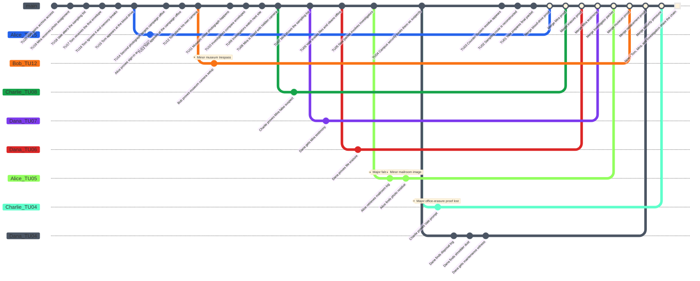

# Candid Chainletter Case - Game Master Prep

This is a playtest case structure for **Causality**, inspired by the *Continuum: Roleplaying in the Yet* scenario idea "You're on Candid Chainletter". It is written as Game Master preparation, not as player-facing text.

The scenario works best as a compact causal mystery: the Investigators receive impossible dated photographs, discover that the apparent photographer is not the real author of the chain, expose a professor using a **Counter-System**, and prevent the chain from turning the Investigators themselves into trapped evidence.

## Scenario Premise

In the Now, Tom Calder asks the Investigators for help. For several days, he has received envelopes containing photographs of himself at specific places and times. Each envelope arrives before Tom remembers deciding to go there. When he ignores a photograph, the System detects incoherent memory pressure. When he obeys, public records prove that he was there.

Tom has tried surveillance. At the museum incident, he placed a camera in advance, but the footage shows no visible photographer. The photographs still exist.

The visible culprit appears to be Mira Lin, a university student doing a random public-photography statistics project. She has been placing hidden cameras at the relevant sites, but she does not understand why Tom keeps appearing in her sample. The true source is Professor Samuel Vale, her statistics professor. Vale is a **Time Offender** using a **Counter-System** to select moments where a person can be forced into public records, then pressured by contradictions until their Willpower breaks.

## Core Game Master Truth

- Tom Calder is a victim, not the source of the photographs.
- Mira Lin is a false suspect. She takes the pictures, but she is being manipulated.
- Professor Samuel Vale is the true **Time Offender**.
- Vale uses a **Counter-System** to select observation points where a target can be turned into evidence.
- The photographs are not future images. They are physical evidence pulled from possible states inside the opened **Time Flow** and then forced into the **Main Timeline** through mail records, cameras, witnesses, and public logs.
- Vale wants to identify Investigators, make them spend **Rewind Dice**, and create unresolved conflicts around their public identities.
- Vale keeps no obvious notes in his office. The absence of notes is itself evidence.
- If the chain reaches the Investigators cleanly, their own public records become weapons against them.
- The final coherent solution is to prove that Mira's sampling list was altered, expose Vale's **Counter-System** residue, and preserve the photographed public events as evidence of manipulation rather than as commands the Investigators must obey.

## Main Timeline

The **Time Flow** has **20 Atomic Time Units** numbered from **Time Unit 20** as the oldest prepared event to **Time Unit 1** as the latest prepared event before the present. **Now** is **Time Unit 0**. The Game Master prepares the following **Main Timeline**. Players should not receive the hidden notes at first.

| Time Unit | Visible or Discoverable Event | Hidden GM Note |
|---|---|---|
| 20 | Professor Samuel Vale gains access to an experimental archive room at Eastbridge University. | The room contains a dormant Counter-System fragment hidden in outdated statistical hardware. |
| 19 | Mira Lin receives a public-photography statistics assignment. | Vale can use the assignment as innocent cover. |
| 18 | Vale alters Mira's random sampling list. | Tom Calder is selected as a target without Mira knowing. |
| 17 | Tom receives the first envelope, showing him at a community blood drive. | The envelope arrives before Tom understands the event. |
| 16 | Tom ignores the first photograph and experiences a memory break. | The System detects Willpower pressure from conflicting records. |
| 15 | Tom appears at the blood drive and is photographed. | Public sign-in records make the event provable. |
| 14 | Tom receives a second photograph tied to a campaign office. | The chain escalates from private confusion to public embarrassment. |
| 13 | Tom appears at the campaign office and is logged by staff. | Witnesses make denial harder. |
| 12 | Tom plants his own camera before the museum photograph. | This creates the key contradiction: no visible photographer. |
| 11 | Tom appears dressed as a street mime at the museum. | Mira's hidden camera takes the image, but Tom's camera sees no operator. |
| 10 | The Investigators begin comparing envelopes, postmarks, and timestamps. | The first player-facing evidence bundle forms. |
| 9 | Alice, Bob, Charlie, and Dana watch the next predicted site. | The group enters the observation chain. |
| 8 | The Investigators discover Mira placing a hidden camera. | Mira looks guilty but is frightened and confused. |
| 7 | Mira explains the assignment and shows the sampling list. | The list has been altered by Vale. |
| 6 | Vale erases the source files and cleans his office. | The absence of notes becomes evidence. |
| 5 | Vale mails a new packet involving the Investigators. | Alice appears in a photograph she does not remember. |
| 4 | Campus security begins treating the Investigators as suspects. | Vale turns public records into pressure. |
| 3 | The Counter-System residue appears across photo paper and mailroom logs. | This is the technical proof that the chain is not mundane. |
| 2 | The Investigators reconstruct the altered sampling route. | Mira can be cleared if the route is preserved. |
| 1 | Vale prepares one final chain packet. | If it lands cleanly, one Investigator will carry an unresolved identity conflict. |
| 0 | Now: Tom, Mira, and the Investigators stand inside the same photo chain. | The final Main Timeline must prove manipulation without erasing every photographed event. |

### Main Timeline Mermaid Graph

```mermaid
flowchart LR
  TU20["TU20<br/>Vale gains archive access"] --> TU19["TU19<br/>Mira receives photo assignment"]
  TU19 --> TU18["TU18<br/>Vale alters the sampling list"]
  TU18 --> TU17["TU17<br/>Tom receives the first envelope"]
  TU17 --> TU16["TU16<br/>Tom ignores it and memory breaks"]
  TU16 --> TU15["TU15<br/>Tom appears at the blood drive"]
  TU15 --> TU14["TU14<br/>Second photograph targets campaign office"]
  TU14 --> TU13["TU13<br/>Tom appears at the campaign office"]
  TU13 --> TU12["TU12<br/>Tom plants his own camera"]
  TU12 --> TU11["TU11<br/>Museum mime photograph happens"]
  TU11 --> TU10["TU10<br/>Investigators compare envelopes"]
  TU10 --> TU09["TU09<br/>Investigators watch next site"]
  TU09 --> TU08["TU08<br/>Mira is found with hidden camera"]
  TU08 --> TU07["TU07<br/>Mira shows the sampling list"]
  TU07 --> TU06["TU06<br/>Vale erases files and cleans office"]
  TU06 --> TU05["TU05<br/>New packet involves Investigators"]
  TU05 --> TU04["TU04<br/>Campus security treats them as suspects"]
  TU04 --> TU03["TU03<br/>Counter-System residue appears"]
  TU03 --> TU02["TU02<br/>Sampling route is reconstructed"]
  TU02 --> TU01["TU01<br/>Vale prepares final packet"]
  TU01 --> TU00["TU00 / Now<br/>Tom, Mira, and Investigators share the chain"]
```

## Initial Player Briefing

Give the players only the following:

- Tom Calder has received impossible dated photographs of himself.
- The photographs are tied to public places, public records, and embarrassing actions.
- Tom's own surveillance found no visible photographer at the museum.
- A university student named Mira Lin may be connected to the cameras.
- The most recent envelope includes Alice in a place she does not remember visiting.
- The mission is to identify who is building the chain and stop it without destroying the evidence needed to prove Tom and Mira were manipulated.

Do not reveal at first that Professor Vale is a **Time Offender** or that Mira's sampling list was altered.

## Hidden Causal Table

Use two condition types:

- **Simple condition:** a required state of the world.
- **Dependency condition:** a required antecedent fact, written as `Dependency: Fxx`.

| ID | Condition Type | Conditions | Fact | Evidence |
|---|---|---|---|---|
| F01 | Simple | Vale has archive-room access and finds a dormant Counter-System fragment. | Vale can observe possible photo-chain states. | Archive key log, hardware residue, old statistical terminal. |
| F02 | Simple | Mira receives a public-photography statistics assignment. | Mira places hidden cameras in public sites. | Syllabus, camera checkout form, project notebook. |
| F03 | Dependency | Dependency: F01 and F02. Vale alters Mira's sampling list. | Tom becomes the first target. | Altered list, terminal timestamp, overwritten random seed. |
| F04 | Dependency | Dependency: F03. Vale mails the first envelope. | Tom receives a photograph before he understands why he appears in it. | Envelope, postmark, photo paper residue. |
| F05 | Dependency | Dependency: F04. Tom tries to reject the chain. | Tom suffers a memory break and System pressure. | Tom's testimony, ring warning, contradictory diary entry. |
| F06 | Dependency | Dependency: F04. Tom appears at the blood drive. | The chain gains public confirmation. | Sign-in sheet, donor volunteer statement, Mira photo. |
| F07 | Dependency | Dependency: F06. Vale escalates the chain. | Tom is tied to the campaign-office record. | Staff log, pamphlet box, second envelope. |
| F08 | Dependency | Dependency: F07. Tom sets his own camera before the museum incident. | The museum scene proves an invisible operator problem. | Tom's footage, museum camera, mime photograph. |
| F09 | Dependency | Dependency: F08. The Investigators follow the camera trail. | Mira is discovered but remains a false suspect. | Hidden camera, student ID, frightened testimony. |
| F10 | Dependency | Dependency: F09. Mira reveals her assignment data. | Vale's altered sampling list can be detected. | Sampling list, missing source file, professor comments. |
| F11 | Dependency | Dependency: F10. Vale cleans his office and erases notes. | The absence of notes becomes suspicious evidence. | Empty office, shredder dust, maintenance disposal log. |
| F12 | Dependency | Dependency: F01 and F11. Vale targets the Investigators. | Alice appears in a new chain photograph. | Alice photo, mailroom log, Counter-System residue. |
| F13 | Dependency | Dependency: F12. Campus security accepts the records at face value. | The Investigators become public suspects. | Security report, camera still, visitor badge mismatch. |
| F14 | Dependency | Dependency: F10 and F12. The altered route is reconstructed. | Mira can be cleared and Vale can be exposed. | Route map, random-seed proof, residue match. |
| F15 | Dependency | Dependency: F14. The final packet is intercepted or reclassified as evidence. | The chain stops controlling the Investigators. | Sealed packet, lab analysis, corrected campus report. |

### Causal Table Mermaid Graph

```mermaid
flowchart LR
  classDef condition fill:#fef3c7,stroke:#a16207,color:#0f172a
  classDef dependency fill:#fde68a,stroke:#a16207,color:#0f172a
  classDef fact fill:#dcfce7,stroke:#166534,color:#0f172a
  classDef evidence fill:#ede9fe,stroke:#7c3aed,color:#0f172a

  C01["C01 Simple<br/>Vale archive access"]:::condition --> F01["F01<br/>Vale observes photo-chain states"]:::fact --> E01["E01<br/>Archive log and residue"]:::evidence
  C02["C02 Simple<br/>Mira assignment"]:::condition --> F02["F02<br/>Mira places cameras"]:::fact --> E02["E02<br/>Syllabus and camera form"]:::evidence
  F01 --> C03["C03 Dependency<br/>Altered sampling list"]:::dependency
  F02 --> C03
  C03 --> F03["F03<br/>Tom is selected"]:::fact --> E03["E03<br/>Altered list"]:::evidence
  F03 --> C04["C04 Dependency<br/>First envelope mailed"]:::dependency --> F04["F04<br/>Tom receives photo"]:::fact --> E04["E04<br/>Envelope and residue"]:::evidence
  F04 --> C05["C05 Dependency<br/>Tom rejects chain"]:::dependency --> F05["F05<br/>Memory break"]:::fact --> E05["E05<br/>Testimony and ring warning"]:::evidence
  F04 --> C06["C06 Dependency<br/>Tom appears at blood drive"]:::dependency --> F06["F06<br/>Public confirmation"]:::fact --> E06["E06<br/>Sign-in sheet"]:::evidence
  F06 --> C07["C07 Dependency<br/>Escalation"]:::dependency --> F07["F07<br/>Campaign record"]:::fact --> E07["E07<br/>Staff log"]:::evidence
  F07 --> C08["C08 Dependency<br/>Tom plants camera"]:::dependency --> F08["F08<br/>Invisible operator proof"]:::fact --> E08["E08<br/>Tom footage"]:::evidence
  F08 --> C09["C09 Dependency<br/>Camera trail followed"]:::dependency --> F09["F09<br/>Mira false suspect"]:::fact --> E09["E09<br/>Hidden camera"]:::evidence
  F09 --> C10["C10 Dependency<br/>Assignment data revealed"]:::dependency --> F10["F10<br/>Altered list detected"]:::fact --> E10["E10<br/>Sampling list"]:::evidence
  F10 --> C11["C11 Dependency<br/>Vale erases notes"]:::dependency --> F11["F11<br/>Empty office is evidence"]:::fact --> E11["E11<br/>Shredder dust"]:::evidence
  F01 --> C12["C12 Dependency<br/>Vale targets Investigators"]:::dependency
  F11 --> C12
  C12 --> F12["F12<br/>Alice appears in photo"]:::fact --> E12["E12<br/>Alice packet"]:::evidence
  F12 --> C13["C13 Dependency<br/>Security believes records"]:::dependency --> F13["F13<br/>Investigators framed"]:::fact --> E13["E13<br/>Security report"]:::evidence
  F10 --> C14["C14 Dependency<br/>Route reconstructed"]:::dependency
  F12 --> C14
  C14 --> F14["F14<br/>Mira cleared and Vale exposed"]:::fact --> E14["E14<br/>Route map and residue match"]:::evidence
  F14 --> C15["C15 Dependency<br/>Final packet intercepted"]:::dependency --> F15["F15<br/>Chain stops controlling targets"]:::fact --> E15["E15<br/>Sealed packet"]:::evidence
```

## Key Characters

| Character | Public Role | Real Function |
|---|---|---|
| Alice | Investigator appearing in the new packet | Becomes the first player target of the chain. |
| Bob | Investigator focused on public records and security | Tracks logs, staff reports, and security pressure. |
| Charlie | Investigator focused on System traces and data | Finds altered randomization, residue, and missing files. |
| Dana | Investigator focused on witnesses and social pressure | Clears Mira and stabilizes frightened witnesses. |
| Tom Calder | Victim and first briefing source | Carries the initial evidence chain. |
| Mira Lin | Student photographer | False suspect and innocent evidence producer. |
| Professor Samuel Vale | Statistics professor | Time Offender using a Counter-System. |
| Campus Security | Local authority pressure | Turns records into conflicts against Investigators. |
| Mailroom Clerk | Procedural witness | Can prove the packets entered normal delivery. |

### Professor Vale as Time Offender

Vale is the active temporal enemy controlled by the GM. He uses a **Counter-System** hidden in obsolete university hardware. He is not omniscient: he knows that his chain can expose temporal investigators, but he does not know which people are Investigators at the start.

Track Vale with three awareness states:

| Awareness State | Trigger | GM Use |
|---|---|---|
| Unaware of identities | Start of play. Vale only knows Tom attracted outside help. | He protects the sampling list and watches Mira. |
| Alerted | Investigators examine postmarks, residue, randomization data, or Mira's camera trail. | He erases files, changes mailroom timing, or creates public suspicion. |
| Identified target | Vale connects a name or face to impossible knowledge. | He sends a packet involving that Investigator or frames them through campus security. |

Vale has one **Counter-System Rewind Dice** set: d4, d6, d8, d10, d12, and d20. These dice are single-use. Mundane actions such as lying, deleting a local file, or calling campus security do not spend Counter-System energy. Any action that rewinds causality, inserts a photo from a possible state, contaminates evidence across a **Branched Timeline**, or adds memory pressure spends a Counter-System die.

| Time Offender Action | Mechanical Effect | Fictional Example |
|---|---|---|
| Send a target packet | Add one unresolved minor conflict to the target Investigator. | A photo places the Investigator at a suspicious campus door. |
| Corrupt a source file | One Evidence route cannot support a merge until repaired. | Mira's random seed no longer matches the camera route. |
| Frame a witness | Upgrade a false suspect into a major conflict if not corrected. | Mira appears to have planned the entire chain. |
| Contaminate photo paper | Add a Counter-System trace but make the immediate clue dangerous. | The residue proves Vale acted, but campus security sees forged access. |
| Force a public record | Force the group to open another branch or accept an identity conflict. | A visitor badge claims Bob entered a restricted archive. |

## Character Stats and Rewind Dice

Every Investigator is a baseline human:

- maximum Willpower: `100`;
- starting current Willpower: `100`;
- Health: `10`;
- one classic D&D dice set;
- **Rewind Dice** are single-use: each d4, d6, d8, d10, d12, and d20 can be spent once.

NPCs never consume Rewind Dice in this preparation. Their Willpower is calculated from the Branched Timelines, contradictions, or memory pressure they have experienced in the story.

### Investigators

| Investigator | Role | Max Willpower | Current Willpower | Health | Rewind Dice Available | Rewind Dice Spent |
|---|---|---:|---:|---:|---|---|
| Alice | First Investigator target | 100 | 100 | 10 | d4, d6, d8, d10, d12, d20 | None |
| Bob | Public records and security | 100 | 100 | 10 | d4, d6, d8, d10, d12, d20 | None |
| Charlie | System and data analysis | 100 | 100 | 10 | d4, d6, d8, d10, d12, d20 | None |
| Dana | Witnesses and social pressure | 100 | 100 | 10 | d4, d6, d8, d10, d12, d20 | None |

### NPCs

| NPC | Role | Relevant Branched Timelines or Pressure | Max Willpower | Current Willpower | Health |
|---|---|---:|---:|---:|---:|
| Tom Calder | Victim and briefing source | 3 | 100 | 10 | 10 |
| Mira Lin | False suspect | 1 | 100 | 70 | 10 |
| Professor Samuel Vale | Time Offender | 2 | 100 | 40 | 10 |
| Mailroom Clerk | Procedural witness | 0 | 100 | 100 | 10 |
| Campus Security Guard | Local authority pressure | 0 | 100 | 100 | 10 |

### Counter-System Rewind Dice Tracker

| Time Offender | d4 | d6 | d8 | d10 | d12 | d20 |
|---|---|---|---|---|---|---|
| Professor Vale | available | available | available | available | available | available |

## Complete Playthrough

This replay intentionally demonstrates all four Rewind outcomes, partial-success consequences, partial-failure gains, Minor Conflicts, Major Conflicts, a Time Offender action, a conflict resolved by another player's branch, and a branch that creates several **Visible or Discoverable Events**.

### Complete Replay Log

**GM turn.** The GM opens the Time Flow and gives the briefing: Tom has impossible photographs, his own camera saw no visible photographer, Mira is connected to the cameras, and Alice appears in the newest packet.

**Alice turn.** Alice spends her d20 to target Time Unit `15`, the blood-drive photograph. Forced teaching value: `d20 -> 14`, so `r = 93.33%`: critical success. Alice proves Tom appeared at the blood drive and that the sign-in sheet matches the first envelope. One non-Merged branch gives `100 - 30 = 70` Willpower.

**Bob turn.** Bob spends his d12 to target Time Unit `12`, Tom's museum surveillance setup. Forced teaching value: `d12 -> 7`, so `r = 58.33%`: partial success. Forced consequence `d10 -> 8`: minor conflict. Bob proves Tom planted a camera before the museum photograph, but a security report identifies Bob as a trespasser near the museum archive. Bob has one non-Merged branch and one unresolved Minor Conflict: `100 - 30 - 20 = 50` Willpower.

**Charlie turn.** Charlie spends his d10 to target Time Unit `8`, where Mira is discovered. Forced teaching value: `d10 -> 3`, so `r = 37.5%`: partial failure. No stable branch opens. Forced gain `d10 -> 6`: missing Evidence type. The GM reveals that the missing proof is not another photograph; it is the original statistics source file. Charlie stays at `100` Willpower.

**Dana turn.** Dana spends her d8 to target Time Unit `18`, the altered sampling list. Forced teaching value: `d8 -> 1`, so `r = 5.56%`: critical failure. No branch opens, no gain is rolled, and the d8 is spent. Dana stays at `100` Willpower.

**GM turn.** Vale becomes **Alerted** because the Investigators are following the camera trail and postmarks. He does not yet know their exact capabilities.

**Alice turn.** Alice merges her blood-drive branch. The GM accepts the merge because it preserves the public sign-in sheet and clarifies that Tom was manipulated. Alice returns to `100` Willpower.

**Bob turn.** Bob tries to resolve the museum trespass Minor Conflict at average difficulty. His current Willpower is `50`, threshold `50`, and the percentile roll is forced to `30`. The roll fails, so the museum report still identifies him. Bob remains at `50` Willpower and his branch is blocked.

**Charlie turn.** Charlie spends his d12 to target Time Unit `8` again. Forced teaching value: `d12 -> 10`, so `r = 125%`: critical success. Charlie finds Mira's hidden camera, project notebook, and the camera checkout form. He proves Mira took the picture but did not choose Tom. His branch merges cleanly and he returns to `100` Willpower.

**Dana turn.** Dana spends her d20 to target Time Unit `6`, Vale's file erasure. Forced teaching value: `d20 -> 12`, so `r = 200%`: critical success. Dana proves that Vale erased the sampling source files and cleaned his office. Her branch merges and she returns to `100` Willpower.

**GM turn.** Vale identifies Alice as a target after seeing her name in Tom's packet. He spends his Counter-System d8 to target Time Unit `5`. Forced teaching value: `d8 -> 4`, so `r = 80%`: critical success. Vale creates a false packet showing Alice stealing Mira's camera. This creates **Major false camera theft**, a Major Conflict for Alice because it would make Mira look guilty and break the false-suspect correction.

**Alice turn.** Alice spends her d6 to target Time Unit `5`, the Investigator packet. Forced teaching value: `d6 -> 3`, so `r = 60%`: partial success. Forced consequence `d10 -> 7`: visible trace. Alice retrieves the mailroom log and photo paper residue, but her first action leaves a camera image of her inside the mailroom. Alice has one non-Merged branch and one unresolved Major Conflict: `100 - 30 - 40 = 30` Willpower.

**Bob turn.** Bob spends his d10 to target Time Unit `14`, the second envelope. Forced teaching value: `d10 -> 4`, so `r = 28.57%`: partial failure. No branch opens. Forced gain `d10 -> 8`: dependency clue. The GM reveals the dependency in fictional terms: the photograph chain requires Mira's camera route to exist before Vale can force Tom into the public record.

**Charlie turn.** Charlie spends his d8 to target Time Unit `11`, the museum photograph. Forced teaching value: `d8 -> 5`, so `r = 45.45%`: partial failure. No branch opens. Forced gain `d10 -> 9`: conflict preview. The GM warns that erasing Tom's museum footage would create a Major Conflict because it is the cleanest proof that the operator was invisible.

**Dana turn.** Dana spends her d10 to target Time Unit `7`, Mira's explanation. Forced teaching value: `d10 -> 8`, so `r = 114.29%`: critical success. Dana gets Mira's frightened testimony and the assignment list before Vale can fully contaminate it. This creates the corrective cause that resolves Alice's Major Conflict: Mira was manipulated and Alice did not need to steal the camera to prove it. Dana's branch merges and she returns to `100` Willpower.

**GM turn.** Vale identifies Dana and uses the Counter-System to protect his sampling route. He spends his Counter-System d12 to target Time Unit `6`. Forced teaching value: `d12 -> 8`, so `r = 133.33%`: critical success. Vale contaminates the statistics source file, making it look as if Mira wrote the altered route herself. Dana gains one unresolved Minor Conflict: **Mira self-authored list**.

**Alice turn.** Alice attempts to merge her Time Unit `5` branch. Dana's branch has already resolved the Major Conflict, but Alice still has the visible-trace Minor Conflict from the mailroom. Alice's effective pressure is one non-Merged branch and one unresolved Minor Conflict: `100 - 30 - 20 = 50` Willpower. She rolls percentile `80` against threshold `50`, succeeds, and resolves the Minor Conflict: the camera image becomes an anonymous mailroom blur instead of a clear Alice identification. Alice's branch merges and she returns to `100` Willpower.

**Bob turn.** Bob retries his unresolved museum trespass conflict. His Willpower is `50`, threshold `50`, and the percentile roll is forced to `70`. The test succeeds. The security report becomes a generic after-hours alarm, and Bob's branch merges. Bob returns to `100` Willpower.

**Charlie turn.** Charlie spends his d6 to target Time Unit `4`, campus security pressure. Forced teaching value: `d6 -> 2`, so `r = 50%`: partial success. Forced consequence `d10 -> 10`: major conflict. Charlie proves campus security was prompted by Vale, but his first action removes the cleaned-office absence before the group can prove Vale erased his notes. This creates **Major office-erasure proof lost**. Charlie has one non-Merged branch and one unresolved Major Conflict: `100 - 30 - 40 = 30` Willpower.

**Dana turn.** Dana spends her d6 to target Time Unit `4`. Forced teaching value: `d6 -> 6`, so `r = 150%`: critical success. Dana creates replacement evidence: a maintenance disposal log, shredder dust, and a witness who saw Vale carry a sealed archive box. This resolves Charlie's Major Conflict and also resolves the **Mira self-authored list** Minor Conflict because the disposal log proves Vale controlled the files. Dana's branch merges and she returns to `100` Willpower.

**GM turn.** Vale makes one final Counter-System move. He spends his d20 to target Time Unit `3`. Forced teaching value: `d20 -> 7`, so `r = 233.33%`: critical success. He sends the final packet to campus security, trying to frame the group as the source of the chain. Because the players already have route, residue, mailroom, and disposal evidence, this becomes final pressure rather than an automatic block.

**Charlie turn.** Charlie merges his Time Unit `4` branch using Dana's replacement evidence. The Major Conflict is resolved by another player's branch, so the branch can merge. Charlie returns to `100` Willpower.

**Final GM resolution.** Campus security tries to detain Bob during the final handoff. No attack roll is made. The guard uses a baton, an improvised nonlethal object, so the GM rolls `d6 -> 2` damage. Bob drops from `10` to `8` Health. The final packet is intercepted and reclassified as evidence. Vale is exposed as a Time Offender, Mira is cleared, Tom's public records remain on the Main Timeline as proof of manipulation, and the Investigators preserve a coherent Now.

### Complete Scenario GitGraph

In this GitGraph, every white point on the `main` branch corresponds to a merge on the Now. The white square represents the Now itself.

### Final Play State

| Investigator | Final Willpower | Final Health | Rewind Dice Spent | Open Conflicts | Final State |
|---|---:|---:|---|---:|---|
| Alice | 100 | 10 | d20, d6 | 0 | Cleared from the packet; mailroom trace corrected |
| Bob | 100 | 8 | d12, d10 | 0 | Museum report corrected; injured during final detention |
| Charlie | 100 | 10 | d10, d12, d8, d6 | 0 | Vale's technical chain exposed |
| Dana | 100 | 10 | d8, d20, d10, d6 | 0 | Mira cleared and replacement evidence secured |

### Player Statistics

| Investigator | Total Branched Timelines | Merged Branched Timelines | Open Branched Timelines | Minor Conflicts Created | Minor Conflicts Resolved | Major Conflicts Created | Major Conflicts Resolved | Rewind Dice Spent | Rewind Dice Full Successes | Rewind Dice Partial Successes | Rewind Dice Partial Failures | Rewind Dice Full Failures | Willpower Tests | Willpower Test Successes | Lowest Willpower | Final Health |
|---|---:|---:|---:|---:|---:|---:|---:|---:|---:|---:|---:|---:|---:|---:|---:|---:|
| Alice | 2 | 2 | 0 | 1 | 1 | 1 | 1 | 2 | 1 | 1 | 0 | 0 | 1 | 1 | 30 | 10 |
| Bob | 1 | 1 | 0 | 1 | 1 | 0 | 0 | 2 | 0 | 1 | 1 | 0 | 2 | 1 | 50 | 8 |
| Charlie | 2 | 2 | 0 | 0 | 0 | 1 | 1 | 4 | 1 | 1 | 2 | 0 | 0 | 0 | 30 | 10 |
| Dana | 3 | 3 | 0 | 1 | 1 | 0 | 0 | 4 | 3 | 0 | 0 | 1 | 0 | 0 | 70 | 10 |
| **Total** | **8** | **8** | **0** | **3** | **3** | **2** | **2** | **12** | **5** | **3** | **3** | **1** | **3** | **2** | **30** | **38** |
