# Edge of Tomorrow Case - Game Master Prep

This is a playtest case structure for **Causality**, based on the provided summary of *Edge of Tomorrow*. It is written as Game Master preparation, not as player-facing text.

The scenario works best as a tactical investigation loop: the Investigators believe the mission is to survive a beach assault, while the real playable objective is to understand the Mimic command structure, identify the Omega as a Time Offender using a Counter-System, reject the false target, identify the Omega location, and preserve a coherent final Now after the loop breaks.

For this playable table, **Alice** is the **Loop Bearer Investigator**. She replaces the William Cage role as the unwilling public-relations officer forced into the front line. **Bob**, **Charlie**, and **Dana** are other Investigators embedded with J-Squad and the coalition command structure. William Cage can be removed, kept as an alias, or used as an off-screen propaganda file.

## Scenario Premise

The Mimics have invaded Europe. Germany has fallen, France is close to collapse, and London will be next if the coalition fails. General Brigham is confident that **Operation Twilight** will break the alien front. He sends Alice to cover the operation as a public-relations symbol, but she refuses front-line duty. Brigham has her arrested, labels her a deserter, and transfers her to J-Squad.

The assault is an ambush. The Mimics know the attack is coming because their command organism, the **Omega**, is a Time Offender using a Counter-System through Alpha Mimics. Alice kills an Alpha and is soaked in its blood. From that moment, her death lets the Omega's Counter-System force the same Branched Timeline state open again: Alice returns to the morning before deployment with memories of previous attempts.

Rita Vrataski and Doctor Carter know enough to identify the pattern. Rita had the same loop power after Verdun and lost it after a transfusion. Carter understands that the Alpha is not the leader: it is a node. The Omega is the head. The first apparent location, Switzerland, is a false signal. The real Omega is hidden beneath the Louvre.

## Core Game Master Truth

- Operation Twilight is not a breakthrough; it is an ambush.
- The Mimics are not merely predicting the coalition. The Omega is correcting failed outcomes through a Counter-System network.
- Alice becomes the Loop Bearer after killing an Alpha and receiving its blood.
- The loop always returns Alice to the same Branched Timeline starting point until the power is lost.
- Rita Vrataski had the same power at Verdun and lost it after a transfusion.
- Doctor Carter knows the enemy is a distributed organism: Drones act, Alphas signal, and Omega uses the Counter-System to reopen failed branches.
- The Switzerland vision is a trap or false signal created by the Omega network.
- The Omega is hidden beneath the Louvre.
- A transfusion severs Alice from the loop. After that, there is no automatic reset.
- Killing the Omega neutralizes the Mimic Counter-System and allows the Investigators to attempt a final Merge into a victory Now.
- If the final Main Timeline kills the Omega but makes Alice's loop impossible, reality diverges unless the Alpha-blood loop anchor or an equivalent causal explanation is preserved.

## Main Timeline

The **Time Flow** always has **20 Atomic Time Units**. The Game Master prepares the following **Main Timeline**. Players should not receive the hidden notes at first.

| Time Unit | Visible or Discoverable Event | Hidden GM Note |
|---|---|---|
| 1 | The Mimics invade Europe. | The Omega network is already active. |
| 2 | Germany falls. | Coalition strategy becomes desperate and overconfident. |
| 3 | France weakens and London becomes the next strategic target. | Brigham needs a public victory before collapse spreads. |
| 4 | General Brigham prepares Operation Twilight. | The operation is based on false confidence. |
| 5 | Alice is ordered to the front as public-relations cover. | Refusal allows Brigham to remove her authority. |
| 6 | Alice is arrested, labeled a deserter, and assigned to J-Squad. | Her identity and credibility are damaged before the loop begins. |
| 7 | J-Squad deploys in exoskeletons. | Alice does not know how to use her suit. |
| 8 | The beach assault becomes a massacre. | The Mimics knew the assault plan. |
| 9 | Alice kills an Alpha and dies in its blood. | This links Alice to the Omega's Counter-System and creates the Blood Loop. |
| 10 | The Omega's Counter-System reopens the deployment-morning Branched Timeline state. | Alice remembers. The rest of the world does not. |
| 11 | Alice repeats the assault and improves through failure. | Treat repeated attempts as loop Evidence, not full scenes every time. |
| 12 | Rita recognizes Alice's impossible knowledge. | Rita is the credibility bridge for the loop. |
| 13 | Carter explains the Alpha/Omega structure. | The enemy can be beaten only by finding Omega. |
| 14 | Alice trains with Rita through many deaths. | Willpower pressure rises because Alice remembers each failure. |
| 15 | Alice follows the Switzerland signal. | The signal is false or incomplete. |
| 16 | Alice is injured and transfused. | The Blood Loop is lost. No more automatic reset. |
| 17 | Carter identifies the Louvre as the real Omega location. | This is the key dependency for the final assault. |
| 18 | Alice, Rita, Bob, Charlie, Dana, and J-Squad assault the Louvre. | This is the no-error final branch. |
| 19 | Rita dies and Alice reaches the Omega. | Alice must accept a coherent sacrifice. |
| 20 | Alice destroys the Omega and is exposed to Alpha blood again. | The final Merge can produce a coherent victory Now before Brigham's meeting. |

### Main Timeline Mermaid Graph

```mermaid
flowchart LR
  TU01["TU01<br/>Mimics invade Europe"] --> TU02["TU02<br/>Germany falls"]
  TU02 --> TU03["TU03<br/>London threatened"]
  TU03 --> TU04["TU04<br/>Operation Twilight planned"]
  TU04 --> TU05["TU05<br/>Alice ordered to front"]
  TU05 --> TU06["TU06<br/>Alice assigned to J-Squad"]
  TU06 --> TU07["TU07<br/>J-Squad deploys"]
  TU07 --> TU08["TU08<br/>Beach ambush"]
  TU08 --> TU09["TU09<br/>Alpha blood creates loop"]
  TU09 --> TU10["TU10<br/>Counter-System reopens branch"]
  TU10 --> TU11["TU11<br/>Repeated loop learning"]
  TU11 --> TU12["TU12<br/>Rita recognizes Alice"]
  TU12 --> TU13["TU13<br/>Carter explains Omega"]
  TU13 --> TU14["TU14<br/>Training deaths"]
  TU14 --> TU15["TU15<br/>Switzerland signal"]
  TU15 --> TU16["TU16<br/>Transfusion breaks loop"]
  TU16 --> TU17["TU17<br/>Louvre location proven"]
  TU17 --> TU18["TU18<br/>Final assault"]
  TU18 --> TU19["TU19<br/>Rita dies, Alice reaches Omega"]
  TU19 --> TU20["TU20<br/>Omega destroyed, victory Merge"]
```

## Initial Player Briefing

Give the players only the following:

- Europe is collapsing under the Mimic invasion.
- Germany has fallen and London will soon be threatened.
- General Brigham believes Operation Twilight will be decisive.
- Alice has been forced into J-Squad after refusing front-line propaganda duty.
- Rita Vrataski is a legendary soldier from Verdun.
- Doctor Carter is discredited, but still tracks unusual Mimic behavior.
- The mission appears to be: survive the landing, expose why it failed, and find a way to stop the Mimics.

Do not reveal at first that Alice's death lets the Omega reopen the same branch, that Switzerland is false, or that the Omega is beneath the Louvre.

## Hidden Causal Table

Use two condition types:

- **Simple condition:** a required state of the world.
- **Dependency condition:** a required antecedent fact, written as `Dependency: Fxx`.

| ID | Condition Type | Conditions | Fact | Evidence |
|---|---|---|---|---|
| F01 | Simple | Mimics control continental Europe. | London is under strategic threat. | War map, refugee reports, ruined German front. |
| F02 | Dependency | Dependency: F01. Brigham trusts Operation Twilight. | The coalition commits to the beach assault. | Briefing file, invasion schedule, propaganda order. |
| F03 | Dependency | Dependency: F02. Alice refuses front-line duty. | Alice is stripped of status and assigned to J-Squad. | Arrest order, deserter label, squad transfer record. |
| F04 | Dependency | Dependency: F02. Mimics know the assault plan. | The beach landing is an ambush. | Repeated landing deaths, enemy positions, impossible response timing. |
| F05 | Dependency | Dependency: F04. Alice kills an Alpha while dying. | Alice becomes linked to the Omega's Counter-System and receives the Blood Loop. | Alpha corpse, black blood exposure, reset memory. |
| F06 | Dependency | Dependency: F05. Alice dies after the Alpha blood transfer. | The Omega's Counter-System reopens the deployment-morning Branched Timeline state. | Repeated wake-up scene, unchanged barracks, retained memory. |
| F07 | Dependency | Dependency: F06. Alice demonstrates impossible knowledge. | Rita identifies the loop pattern. | Rita test, predicted battlefield events, training reaction. |
| F08 | Dependency | Dependency: F07. Carter explains the enemy organism. | Alphas are signal nodes and Omega is the command source. | Carter notes, Verdun data, alien biology diagrams. |
| F09 | Dependency | Dependency: F08. Alice follows the Switzerland signal. | Switzerland is false, incomplete, or manipulated. | Failed route, empty target site, contradictory vision. |
| F10 | Dependency | Dependency: F08. Alice is transfused after injury. | Alice loses the Blood Loop. | Hospital record, mixed blood, failed reset test. |
| F11 | Dependency | Dependency: F09 and F10. Carter reinterprets the signal after the loop is lost. | The Omega is beneath the Louvre. | Map overlay, underwater access, Mimic movement pattern. |
| F12 | Dependency | Dependency: F11. J-Squad reaches the Louvre after the loop is lost. | The final assault has no automatic reset. | J-Squad route, stolen transport, no-loop risk. |
| F13 | Dependency | Dependency: F12. Alice reaches the Omega after Rita dies. | Alice can destroy the Omega. | Rita's last stand, explosive payload, Omega chamber. |
| F14 | Dependency | Dependency: F13. Alpha blood reaches Alice during the Omega death event. | The final Merge can produce a coherent victory Now. | Mimic collapse, pre-meeting continuity, Rita alive at barracks. |

### Causal Table Mermaid Graph

```mermaid
flowchart LR
  classDef condition fill:#fef3c7,stroke:#a16207,color:#0f172a
  classDef dependency fill:#fde68a,stroke:#a16207,color:#0f172a
  classDef fact fill:#dcfce7,stroke:#166534,color:#0f172a
  classDef evidence fill:#ede9fe,stroke:#7c3aed,color:#0f172a

  C01["C01 Simple<br/>Mimics control Europe"]:::condition --> F01["F01<br/>London threatened"]:::fact --> E01["E01<br/>War map"]:::evidence
  F01 --> C02["C02 Dependency<br/>Brigham trusts Operation Twilight"]:::dependency --> F02["F02<br/>Coalition commits assault"]:::fact --> E02["E02<br/>Briefing file"]:::evidence
  F02 --> C03["C03 Dependency<br/>Alice refuses duty"]:::dependency --> F03["F03<br/>Alice joins J-Squad"]:::fact --> E03["E03<br/>Arrest order"]:::evidence
  F02 --> C04["C04 Dependency<br/>Mimics know plan"]:::dependency --> F04["F04<br/>Beach ambush"]:::fact --> E04["E04<br/>Repeated deaths"]:::evidence
  F04 --> C05["C05 Dependency<br/>Alice kills Alpha"]:::dependency --> F05["F05<br/>Blood Loop begins"]:::fact --> E05["E05<br/>Alpha blood"]:::evidence
  F05 --> C06["C06 Dependency<br/>Alice dies"]:::dependency --> F06["F06<br/>Counter-System reopens branch"]:::fact --> E06["E06<br/>Retained memory"]:::evidence
  F06 --> C07["C07 Dependency<br/>Impossible knowledge"]:::dependency --> F07["F07<br/>Rita identifies loop"]:::fact --> E07["E07<br/>Rita test"]:::evidence
  F07 --> C08["C08 Dependency<br/>Carter explains organism"]:::dependency --> F08["F08<br/>Omega is command source"]:::fact --> E08["E08<br/>Carter notes"]:::evidence
  F08 --> C09["C09 Dependency<br/>Switzerland signal followed"]:::dependency --> F09["F09<br/>False target"]:::fact --> E09["E09<br/>Empty site"]:::evidence
  F08 --> C10["C10 Dependency<br/>Alice transfused"]:::dependency --> F10["F10<br/>Loop lost"]:::fact --> E10["E10<br/>Hospital record"]:::evidence
  F09 --> C11["C11 Dependency<br/>Signal reinterpreted"]:::dependency
  F10 --> C11
  C11 --> F11["F11<br/>Omega under Louvre"]:::fact --> E11["E11<br/>Map overlay"]:::evidence
  F11 --> C12["C12 Dependency<br/>J-Squad final route"]:::dependency --> F12["F12<br/>No-reset assault"]:::fact --> E12["E12<br/>Stolen transport"]:::evidence
  F12 --> C13["C13 Dependency<br/>Alice reaches Omega"]:::dependency --> F13["F13<br/>Omega can be destroyed"]:::fact --> E13["E13<br/>Explosive payload"]:::evidence
  F13 --> C14["C14 Dependency<br/>Alpha blood in Omega death"]:::dependency --> F14["F14<br/>Victory Now Merge"]:::fact --> E14["E14<br/>Mimic collapse"]:::evidence
```

## Special Rule: Blood Loop

The Blood Loop is a scenario rule, not a default power. It represents the Omega's Counter-System forcing a known Branched Timeline state to reopen around Alice.

- Only the Loop Bearer has automatic memory continuity.
- Before transfusion, the Loop Bearer's death does not end the scenario. The Omega's Counter-System reopens the Loop Bearer's state at Time Unit 10.
- Each loop can reveal one new **Evidence**, confirm one **Condition**, or test one combat route.
- Do not play every repeated loop in full. Use montage unless the loop introduces a new **Fact**, **Evidence**, or conflict.
- Every three remembered deaths create one temporary `-5` Willpower penalty for the Loop Bearer until the next clean **Merge**.
- The transfusion at Time Unit 16 ends the Blood Loop. After that point, death is final unless another explicit scenario rule or the final Omega Merge preserves a coherent Now.
- A loop reopening does not automatically **Merge** facts. The group must still prove the causal chain through Evidence.

## Key Characters

| Name | Role | GM Use |
|---|---|---|
| Alice | Loop Bearer Investigator | Starts unwilling and untrained, then becomes the memory carrier. |
| Bob | J-Squad tactical Investigator | Tracks beach routes, enemy positions, and final assault logistics. |
| Charlie | Scientific Investigator | Works with Carter to interpret Alpha/Omega evidence. |
| Dana | Medic and morale Investigator | Tracks injuries, transfusion risk, and squad survival. |
| Rita Vrataski | Veteran soldier | Recognizes the loop and trains Alice. |
| Doctor Carter | Discredited scientist | Explains the enemy organism and translates evidence into strategy. |
| General Brigham | Coalition commander | Creates the initial pressure and can become an obstacle to J-Squad access. |
| J-Squad | Assault squad | Provides human stakes and final-assault resources. |
| Alpha Mimic | Signal node | Creates the Blood Loop and can protect Omega's network. |
| Omega | Time Offender command source | Hidden final target beneath the Louvre; uses a Counter-System through Alpha Mimics. |

## Character Stats and Rewind Dice

Every Investigator is a baseline human:

- maximum Willpower: `100`;
- starting current Willpower: `100`;
- Health: `10`;
- one classic D&D dice set;
- Rewind Dice are single-use.

Recommended simple handling: the Blood Loop reopens scene position and knowledge, but not spent Rewind Dice. This keeps System energy meaningful and prevents infinite mechanical attempts.

| Investigator | Role | Max Willpower | Current Willpower | Health | Rewind Dice Available |
|---|---|---:|---:|---:|---|
| Alice | Loop Bearer | 100 | 100 | 10 | d4, d6, d8, d10, d12, d20 |
| Bob | Tactical routes | 100 | 100 | 10 | d4, d6, d8, d10, d12, d20 |
| Charlie | Science and Evidence | 100 | 100 | 10 | d4, d6, d8, d10, d12, d20 |
| Dana | Medicine and squad survival | 100 | 100 | 10 | d4, d6, d8, d10, d12, d20 |

## Recommended Branched Timeline Hooks

| Target Time Unit | Rewind Distance | Suggested Rewind Die | Useful Question |
|---|---:|---|---|
| 18 | 2 | d4 | Can J-Squad reach the Louvre chamber after the loop is lost? |
| 17 | 3 | d4 | What proves the Louvre location? |
| 16 | 4 | d4 | What exactly breaks the Blood Loop? |
| 15 | 5 | d6 | Why is Switzerland the wrong target? |
| 14 | 6 | d6 | What training route keeps Alice alive longest? |
| 12 | 8 | d8 | Why does Rita believe Alice? |
| 10 | 10 | d10 | What reopens when Alice dies? |
| 9 | 11 | d12 | What did the Alpha blood do? |
| 8 | 12 | d12 | Why was the beach assault an ambush? |
| 4 | 16 | d20 | Why did Brigham commit to Operation Twilight? |

## Conflict Rules for This Scenario

Minor conflicts:

- Alice exposes impossible knowledge too early and is restrained.
- J-Squad treats Alice as a coward, deserter, or unstable officer.
- A training loop changes Rita's trust but not the external Main Timeline.
- The group follows the Switzerland signal without proving the Louvre dependency.
- Carter's notes are seized before Charlie can preserve them.
- Dana prevents the transfusion, but Alice remains too injured to continue.

Major conflicts:

- The coalition cancels Operation Twilight before the Blood Loop exists.
- Alice never kills the Alpha and never becomes Loop Bearer.
- Rita dies before identifying the loop.
- Carter is removed before explaining the Alpha/Omega structure.
- Alice avoids the transfusion but the group uses loop reopenings forever instead of reaching final convergence.
- Omega is destroyed without a coherent explanation for the final victory Now.

## Merge Requirements

For complete convergence, the final **Main Timeline** must preserve these facts:

1. Operation Twilight happens or an equivalent assault exposes the Mimic ambush.
2. Alice kills an Alpha and becomes Loop Bearer.
3. Rita and Carter identify the Alpha/Omega structure.
4. Switzerland is rejected as the final target.
5. The Blood Loop is lost before the final assault.
6. The Louvre location is proven through Evidence.
7. J-Squad reaches Omega without relying on another reset.
8. Omega is destroyed.
9. The final Now remains coherent: Mimics collapse, and Alice returns to a stable pre-meeting state or another equivalent victory state.

## Possible Endings

| Ending | Condition | Result |
|---|---|---|
| Complete convergence | Omega is destroyed and the final Now remains coherent. | Mimics collapse, Alice remembers enough to find Rita again, and the coalition victory becomes observable. |
| Tactical victory, causal rupture | Omega is destroyed, but no stable loop anchor explains the final Now. | The war is won, but the Investigators' reality diverges from origin. |
| Loop exhaustion | Alice loses Willpower or System energy before proving the Louvre. | The loop becomes psychological collapse rather than victory. |
| False target failure | The group commits to Switzerland as final truth. | Omega survives, the beach defeat remains inevitable, and London falls. |
| Final assault failure | The loop is lost and J-Squad cannot reach Omega. | Death is final; the Mimic network continues. |

## Simulated Playthrough

This playthrough was resolved with `scripts/simulate_dice_rolls.py`. Dice results are written exactly as rolled.

**GM turn.** The GM opens the Time Flow at the Now and places the visible war facts on the Main Timeline. No Branched Timeline exists yet.

**Alice turn.** Alice spends her d12 to target Time Unit 9 and learn what the Alpha blood did. The script rolls `d12 -> 5`, a partial success. The branch opens, and the consequence roll is `d10 -> 3`: pursuit. The GM says Alice kills the Alpha, dies in its blood, and wakes with retained memory while military police are already chasing the anomaly. Alice proves that the Blood Loop is tied to Alpha blood. End-of-turn Willpower: one non-Merged branch, `100 - 30 = 70`.

**Bob turn.** Bob spends his d12 to target Time Unit 8 and inspect the beach ambush. The script rolls `d12 -> 3`, a partial success. The consequence roll is `d10 -> 1`: frightened bystanders. Bob proves that the Mimics know the assault plan, but J-Squad panics when Bob predicts the first artillery strike. End-of-turn Willpower: one non-Merged branch, `70`.

**Charlie turn.** Charlie spends his d8 to target Time Unit 12 and prove why Rita believes Alice. The script rolls `d8 -> 4`, a partial success. The consequence roll is `d10 -> 6`: closer to the Now. The branch opens at Time Unit 16 instead of 12. Charlie misses Rita's first recognition scene, but finds the transfusion record that breaks the Blood Loop. End-of-turn Willpower: one non-Merged branch, `70`.

**Dana turn.** Dana spends her d4 to target Time Unit 16 and understand the transfusion. The script rolls `d4 -> 3`, a partial failure. The branch does not open and the d4 is spent. The small gain roll is `d10 -> 7`: Time Offender trace. Dana does not stabilize the hospital branch, but the GM reveals a direct trace of the Omega Counter-System in the failed reset test. End-of-turn Willpower remains `100`.

**GM turn.** The GM summarizes the active chain: Alpha blood starts the loop, the beach is an ambush, transfusion breaks the loop, and Omega is now clearly a Time Offender using a Counter-System. The Louvre is still unproven.

**Alice turn.** Alice spends her d6 to target Time Unit 15 and test the Switzerland signal. The script rolls `d6 -> 3`, a partial success. The consequence roll is `d10 -> 6`: closer to the Now. The branch opens at Time Unit 18, during final route preparation. Alice proves that Switzerland is false, but she does not get a clean path through the Louvre. End-of-turn Willpower: two non-Merged branches, `100 - 60 = 40`.

**Bob turn.** Bob tries to solve the final route and spends his d4 on Time Unit 18. The script rolls `d4 -> 3`, a partial failure. The small gain roll is `d10 -> 3`: Evidence status marked. The branch does not open, but the GM marks the stolen transport Evidence as incomplete. Bob knows J-Squad can move, but not how to make the route merge cleanly. End-of-turn Willpower remains `70` because no new stable branch opens.

**Charlie turn.** Charlie spends his d4 to target Time Unit 17 and prove the Louvre location. The script rolls `d4 -> 2`, a partial success. The consequence roll is `d10 -> 4`: wrong entry point. Charlie enters the right Time Unit at the wrong access point, reaches Carter late, and proves the Louvre through map overlays and Mimic movement. End-of-turn Willpower: two non-Merged branches, `40`.

**Dana turn.** Dana tries to merge the transfusion Evidence with Alice's Blood Loop proof. No die is rolled because this is a merge check against already proven Facts. The GM accepts the dependency: the Blood Loop exists, and the transfusion ends it. Dana's Willpower remains `100`.

**GM turn.** The GM calls final convergence. The group has proven the Alpha blood, the ambush, the false Switzerland signal, the transfusion loss, the Louvre location, and the Omega Counter-System. The J-Squad route remains weak because Bob's Time Unit 18 branch failed.

**Alice turn.** Alice attempts the final Omega action inside the unstable final branch. The GM treats the explosive payload as lethal damage after the prepared condition is met. The script rolls `d10 -> 5`. The Omega is destroyed in the fiction, but the route evidence is incomplete.

**Final result.** The table gets **tactical victory, causal rupture**. Omega is destroyed, but the final route into the Louvre is not stable enough to explain the victory Now. The war is won in the branch, but the Investigators' origin reality diverges instead of producing complete convergence.

### Simulation Statistics

| Investigator | Rewind Dice spent | Stable branches opened | Branches Merged | Minor conflicts created | Major conflicts created | Final Willpower | Notes |
|---|---:|---:|---:|---:|---:|---:|---|
| Alice | d12, d6 | 2 | 1 | 0 | 0 | 70 | Proved Blood Loop and rejected Switzerland, but carried one unstable final branch. |
| Bob | d12, d4 | 1 | 0 | 0 | 0 | 70 | Proved beach ambush; failed to stabilize the J-Squad route. |
| Charlie | d8, d4 | 2 | 1 | 0 | 0 | 70 | Proved transfusion and Louvre location. |
| Dana | d4 | 0 | 0 | 0 | 0 | 100 | Failed the transfusion branch but found the Omega Counter-System trace. |

| Investigator | Critical successes | Partial successes | Partial failures | Critical failures | Negative consequence rolls | Small gain rolls |
|---|---:|---:|---:|---:|---:|---:|
| Alice | 0 | 2 | 0 | 0 | 2 | 0 |
| Bob | 0 | 1 | 1 | 0 | 1 | 1 |
| Charlie | 0 | 2 | 0 | 0 | 2 | 0 |
| Dana | 0 | 0 | 1 | 0 | 0 | 1 |

Outcome analysis: the mechanics created enough discovery to solve the mystery but punished the missing final route dependency. This is a useful stress test: `Blood Loop` gives strong information momentum, but single-use Rewind Dice still make an incomplete causal chain dangerous.
