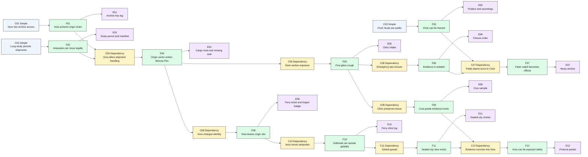
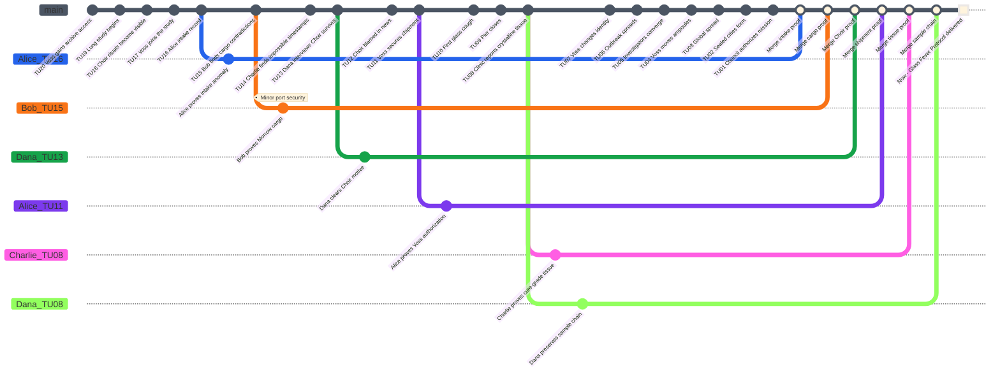
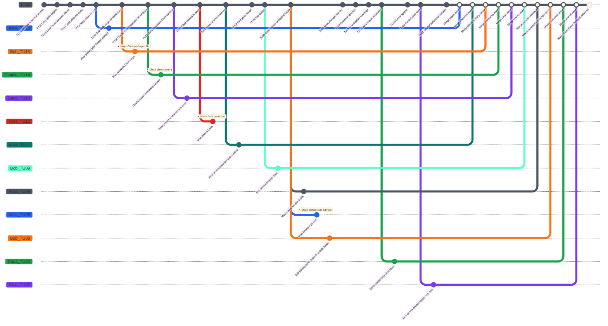

# Glass Fever Protocol - Game Master Prep

This original **Causality** case is the recommended first scenario. It is built to teach the game twice: first as a starter investigation without active Time Offender pressure, then as a complete rules demonstration with Doctor Ilya Voss using a Counter-System.

## Scenario Premise

In the Now of 2142, several sealed cities survive after the Glass Fever crystallized lung tissue across the coastal world in 2117. The official archive blames a public ritual group called the **Meridian Choir**, but the evidence is too theatrical and too convenient.

The Investigators open the **Time Flow** to identify the true origin vector, recover cure-grade evidence, and preserve a coherent Now. The real source is Doctor Ilya Voss, a materials physician from the Now who used a **Counter-System** to seed the Glass Fever through a medical shipment at Morrow Pier.

## Core Game Master Truth

- The Meridian Choir is a false culprit.
- Doctor Ilya Voss is the true origin carrier.
- In starter mode, Voss is only the hidden historical cause.
- In complete mode, Voss is a Time Offender from the Now who wants the sealed-city order to exist.
- The Glass Fever outbreak must remain explainable at final resolution, but the Investigators can expose the true source and preserve cure evidence.
- Preventing the outbreak completely breaks the original Now unless a replacement causal origin is created.

## Main Timeline

The Time Flow has exactly 20 Atomic Time Units before the Now. Time Unit 20 is the oldest prepared state. Time Unit 1 is the latest prepared state before the present. Time Unit 0 is the Now.

| Time Unit | Visible or Discoverable Event | Hidden GM Note |
|---:|---|---|
| 20 | Voss gains access to sealed-city medical archives. | He finds a Counter-System fragment in quarantine hardware. |
| 19 | The coastal health network begins a glass-fiber lung study. | This creates a legal route for sample transfers. |
| 18 | The Meridian Choir performs public breath rituals. | The false culprit becomes visible. |
| 17 | Voss joins the study as a consultant. | He can alter shipment handling. |
| 16 | Alice appears in a damaged quarantine intake record. | The System has already touched this case once. |
| 15 | Bob finds conflicting cargo routes for Morrow Pier. | The shipment path is unstable evidence. |
| 14 | Charlie detects impossible archive timestamps. | Counter-System residue is present. |
| 13 | Dana interviews a Choir survivor. | The Choir knows symbols, not pathogens. |
| 12 | The Choir is blamed in public news. | This protects Voss. |
| 11 | Voss secures the medical shipment. | True origin vector. |
| 10 | A dock worker develops the first glass cough. | First observable infection chain. |
| 9 | Morrow Pier closes under emergency order. | Evidence becomes hard to reach. |
| 8 | The first clinic reports crystalline lung tissue. | Cure evidence exists here. |
| 7 | Voss changes his travel identity. | He starts watching for Investigators. |
| 6 | The outbreak spreads to three coastal cities. | Original Now becomes likely. |
| 5 | Alice, Bob, Charlie, and Dana converge on Morrow Pier. | Security pressure begins. |
| 4 | Voss moves the source ampoules through a ferry clinic. | Final carrier route. |
| 3 | The Glass Fever becomes global. | Catastrophe is locked. |
| 2 | Sealed cities form under emergency rule. | The future System can exist. |
| 1 | The sealed-city council authorizes the mission. | Final prepared state before Now. |
| 0 | Now: the Investigators receive the Glass Fever Protocol. | The present must remain coherent. |

### Main Timeline Mermaid Graph

## Initial Player Briefing

- The Now is 2142.
- The Glass Fever began at Morrow Pier in 2117.
- The Meridian Choir is blamed in public records.
- Several archive timestamps are impossible.
- Doctor Ilya Voss appears in clean records but never in public blame.
- The mission is to identify the true origin, preserve cure evidence, and avoid erasing the sealed-city Now.

## Hidden Causal Table

| ID | Condition Type | Conditions | Fact | Evidence |
|---|---|---|---|---|
| F01 | Simple | Voss has archive access and a Counter-System fragment. | Voss can protect the origin chain. | Archive key log, residue, quarantine terminal. |
| F02 | Simple | The lung study allows medical shipments. | Contaminated ampoules can move legally. | Study permit, cargo manifest. |
| F03 | Simple | The Meridian Choir performs public rituals. | The Choir can be framed. | Posters, recordings, witness panic. |
| F04 | Dependency | Dependency: F01 and F02. Voss alters shipment handling. | The true origin vector enters Morrow Pier. | Cargo route, lab notation, missing seal. |
| F05 | Dependency | Dependency: F04. Dock worker exposure occurs. | First glass cough begins. | Clinic intake, worker testimony. |
| F06 | Dependency | Dependency: F05. Emergency order closes the pier. | Evidence is isolated. | Closure order, security log. |
| F07 | Dependency | Dependency: F03 and F06. Public blame turns toward the Choir. | False culprit becomes official. | News archive, arrest record. |
| F08 | Dependency | Dependency: F04. Voss changes travel identity. | Voss can leave the origin site. | Ferry ticket, forged badge. |
| F09 | Dependency | Dependency: F05. Clinic preserves tissue samples. | Cure-grade evidence exists. | Cryo sample, pathologist note. |
| F10 | Dependency | Dependency: F08. Voss moves the ampoules. | The outbreak can spread globally. | Ferry clinic log, broken ampoule case. |
| F11 | Dependency | Dependency: F10. Global spread happens. | The sealed-city Now exists. | Population record, sealed-city charter. |
| F12 | Dependency | Dependency: F09 and F11. Evidence survives into Now. | The Investigators can expose Voss without erasing Now. | Protocol packet, sample chain. |

### Causal Table Mermaid Graph

## Key Characters

| Character | Public Role | Real Function |
|---|---|---|
| Alice | Investigator with damaged intake record | Anchor for prior System contact and medical evidence. |
| Bob | Investigator tracking public security records | Finds route contradictions and crowd pressure. |
| Charlie | Investigator tracking System residue | Reads timestamps and Counter-System traces. |
| Dana | Investigator tracking witnesses and samples | Clears the Choir and preserves cure evidence. |
| Doctor Ilya Voss | Materials physician | Time Offender and true origin carrier in complete mode. |
| Meridian Choir | Public ritual group | False culprit. |
| Dock Worker Sera Holt | First known patient | Human proof of the real exposure chain. |
| Pathologist Ren Arco | Clinic evidence keeper | Holds cure-grade sample evidence. |

## Doctor Voss as Time Offender

Voss begins **Unaware of identities**, becomes **Alerted** when the group touches Morrow Pier records, and reaches **Identified target** when an Investigator reveals impossible knowledge of the ampoule route.

Voss has one single-use **Counter-System Rewind Dice** set: d4, d6, d8, d10, d12, d20.

| Action | Mechanical Effect | Evidence Left Behind |
|---|---|---|
| Reframe the Choir | Add one Minor Conflict to an Investigator clearing the Choir. | Edited news archive. |
| Move ampoules | Force a corrective branch or keep a Major Conflict. | Ferry route mismatch. |
| Contaminate clinic sample | Block one merge until replacement evidence exists. | Broken cryo seal. |
| Identify an Investigator | Add public security pressure. | Watchlist entry. |

## Rewind Dice Trackers

Use these tables during play. Mark a die as spent immediately when an Investigator or Time Offender opens a Branched Timeline with it.

| Investigator | d4 | d6 | d8 | d10 | d12 | d20 |
|---|---|---|---|---|---|---|
| Alice | available | available | available | available | available | available |
| Bob | available | available | available | available | available | available |
| Charlie | available | available | available | available | available | available |
| Dana | available | available | available | available | available | available |

| Time Offender | d4 | d6 | d8 | d10 | d12 | d20 |
|---|---|---|---|---|---|---|
| Doctor Ilya Voss | available | available | available | available | available | available |

## Starter Playthrough - Without Time Offender

Use this version first when teaching the scenario. Voss is only the historical source in this version. Ignore Counter-System dice, Time Offender awareness states, and Time Offender actions. The table still uses the normal turn order: GM, Alice, Bob, Charlie, Dana.

### Starter Replay Log

**GM turn.** The GM opens the Time Flow at Now. The visible briefing says the Meridian Choir is blamed, Morrow Pier is the first known outbreak site, and the archive contains impossible timestamps. The GM keeps Voss hidden as the true carrier.

**Alice turn.** Alice spends her d20 to target Time Unit `16`. Forced teaching value: `d20 -> 13`, so `r = 13 / 16 x 100 = 81.25%`: critical success. Alice proves that her damaged quarantine intake record was produced by an earlier System contact. The branch can merge immediately because it does not contradict any dependency. Alice ends at `0` Mental Load.

**Bob turn.** Bob spends his d12 to target Time Unit `15`. Forced teaching value: `d12 -> 8`, so `r = 53.33%`: partial success. Consequence `d10 -> 8`: Minor Conflict. Bob proves that the medical cargo route passed through Morrow Pier, but a port security report places an Investigator near a restricted manifest terminal. Bob has one non-Merged branch and one unresolved Minor Conflict: `30 + 20 = 50` Mental Load.

**Charlie turn.** Charlie spends his d10 to target Time Unit `14`. Forced teaching value: `d10 -> 4`, so `r = 28.57%`: partial failure. No stable Branched Timeline opens and the d10 is spent. Gain `d10 -> 5`: the GM reveals one Evidence direction, a timestamp pattern tied to the clinic archive. Charlie has no open branch and stays at `0` Mental Load.

**Dana turn.** Dana spends her d20 to target Time Unit `13`. Forced teaching value: `d20 -> 11`, so `r = 84.62%`: critical success. Dana interviews a Choir survivor and proves that the group prepared public breath rituals and animal releases, not pathogen handling. The branch merges and Dana ends at `0` Mental Load.

**GM turn.** The GM states the visible dependencies: the cargo route must be proven before Voss can be connected to the outbreak, and clinic samples must be preserved before a cure-grade Evidence chain can survive into the Now.

**Alice turn.** Alice spends her d12 to target Time Unit `11`. Forced teaching value: `d12 -> 8`, so `r = 72.73%`: partial success. Consequence `d10 -> 4`: wrong entry point. Alice enters the study office instead of the shipment dock, but still proves Voss signed the medical shipment authorization. The branch stays open until another Investigator confirms the sample chain. Alice has one non-Merged branch: `30` Mental Load.

**Bob turn.** Bob tries to resolve his port security Minor Conflict at easy difficulty. His current Mental Load is `50`, so forced percentile `70` gives a final result of `70 - 50 = 20`, meeting the easy threshold `20`: success. The security report becomes an anonymous maintenance alert, Bob's branch merges, and Bob returns to `0` Mental Load.

**Charlie turn.** Charlie spends his d12 to target Time Unit `14` and follow the timestamp pattern. Forced teaching value: `d12 -> 11`, so `r = 78.57%`: partial success. Consequence `d10 -> 6`: the branch opens closer to the Now than planned. The target moves from Time Unit `14` to Time Unit `8` because `14 - 6 = 8`. Charlie misses the archive terminal but reaches the first clinic report and proves cure-grade crystalline tissue exists. Charlie has one non-Merged branch: `30` Mental Load.

**Dana turn.** Dana spends her d10 to target Time Unit `8`. Forced teaching value: `d10 -> 9`, so `r = 112.5%`: critical success. Dana preserves the clinic sample chain and links Ren Arco's cryo sample to Alice's Voss shipment proof. The GM allows Alice's TU11 branch and Charlie's TU8 branch to merge. Alice, Charlie, and Dana return to `0` Mental Load.

**Final GM resolution.** The group has cleared the Meridian Choir, proven Voss handled the shipment, and preserved cure-grade evidence. The outbreak still exists, so the sealed-city Now remains coherent. The ending is **complete starter convergence**.

### Starter Scenario GitGraph

In this GitGraph, every white point on the `main` branch corresponds to a merge on the Now. The white square represents the Now itself.

### Starter Final Play State

| Investigator | Final Mental Load | Final Health | Rewind Dice Spent | Open Conflicts | Final State |
|---|---:|---:|---|---:|---|
| Alice | 0 | 10 | d20, d12 | 0 | Prior System contact and Voss authorization merged. |
| Bob | 0 | 10 | d12 | 0 | Cargo route merged after resolving the port report. |
| Charlie | 0 | 10 | d10, d12 | 0 | Timestamp failure becomes a clinic Evidence route. |
| Dana | 0 | 10 | d20, d10 | 0 | Choir cleared and clinic sample preserved. |

### Starter Player Statistics

| Investigator | Total Branched Timelines | Merged Branched Timelines | Open Branched Timelines | Minor Conflicts Created | Minor Conflicts Resolved | Major Conflicts Created | Major Conflicts Resolved | Rewind Dice Spent | Critical Successes | Partial Successes | Partial Failures | Critical Failures | Percentage Action Rolls | Percentage Action Successes | Highest Mental Load | Final Health |
|---|---:|---:|---:|---:|---:|---:|---:|---:|---:|---:|---:|---:|---:|---:|---:|---:|
| Alice | 2 | 2 | 0 | 0 | 0 | 0 | 0 | 2 | 1 | 1 | 0 | 0 | 0 | 0 | 30 | 10 |
| Bob | 1 | 1 | 0 | 1 | 1 | 0 | 0 | 1 | 0 | 1 | 0 | 0 | 1 | 1 | 50 | 10 |
| Charlie | 1 | 1 | 0 | 0 | 0 | 0 | 0 | 2 | 0 | 1 | 1 | 0 | 0 | 0 | 30 | 10 |
| Dana | 2 | 2 | 0 | 0 | 0 | 0 | 0 | 2 | 2 | 0 | 0 | 0 | 0 | 0 | 0 | 10 |
| **Total** | **6** | **6** | **0** | **1** | **1** | **0** | **0** | **7** | **3** | **3** | **1** | **0** | **1** | **1** | **50** | **40** |

## Complete Playthrough - With Time Offender

Use this version after the starter replay. It intentionally demonstrates the full rules surface: all four Rewind outcomes, forced teaching dice values where useful, partial-success consequences, partial-failure gains, Minor Conflicts, Major Conflicts, cross-player conflict correction, percentage action rolls, damage without attack rolls, Time Offender awareness, and Counter-System actions.

### Complete Replay Log

**GM turn.** The GM opens the Time Flow and secretly marks Doctor Ilya Voss as a Time Offender with a Counter-System. Voss starts **Unaware of identities**. The GM reminds the table that the hidden dependency chain is shipment access, first infection, evidence isolation, false public blame, final ampoule movement, and sealed-city Now.

**Alice turn.** Alice spends her d20 to target Time Unit `16`. Forced teaching value: `d20 -> 17`, so `r = 106.25%`: critical success. Alice proves her damaged intake record and the prior System contact. The branch remains open while the group checks whether the old System contact helps or threatens Voss's origin chain. Alice ends at `30` Mental Load.

**Bob turn.** Bob spends his d12 to target Time Unit `15`. Forced teaching value: `d12 -> 6`, so `r = 40%`: partial failure. No stable branch opens. Gain `d10 -> 6`: the GM reveals that one cargo manifest line has been moved closer to the Now by an unknown edit. Bob has no open branch and stays at `0` Mental Load.

**Charlie turn.** Charlie spends his d10 to target Time Unit `14`. Forced teaching value: `d10 -> 1`, so `r = 7.14%`: critical failure. No branch opens, no gain is rolled, and the d10 is spent. Charlie stays at `0` Mental Load.

**Dana turn.** Dana spends her d8 to target Time Unit `13`. Forced teaching value: `d8 -> 5`, so `r = 38.46%`: partial failure. No stable branch opens. Gain `d10 -> 7`: Time Offender trace. The GM reveals that the Choir witness remembers a clean medical badge in the crowd, not only ritual symbols. Dana stays at `0` Mental Load.

**GM turn.** Voss notices the System pressure around the Morrow Pier cargo line and becomes **Alerted**. He does not know any Investigator identity yet, so he takes no targeted Counter-System action.

**Alice turn.** Alice spends her d12 to target Time Unit `11`. Forced teaching value: `d12 -> 9`, so `r = 81.82%`: critical success. She proves Voss signed the medical shipment and that the signature depends on the lung study permit. Alice merges her intake and shipment branches because they now preserve the origin chain. Alice returns to `0` Mental Load.

**Bob turn.** Bob spends his d20 to target Time Unit `15`. Forced teaching value: `d20 -> 9`, so `r = 60%`: partial success. Consequence `d10 -> 10`: Major Conflict. Bob proves the cargo route, but his first action makes the port authority classify the Meridian Choir as a pathogen-smuggling group. The branch cannot merge until another cause clears the Choir. Bob has one non-Merged branch and one unresolved Major Conflict: `30 + 40 = 70` Mental Load.

**Charlie turn.** Charlie spends his d12 to target Time Unit `14`. Forced teaching value: `d12 -> 8`, so `r = 57.14%`: partial success. Consequence `d10 -> 8`: Minor Conflict. Charlie proves Counter-System timestamp residue, but a clinic camera places him near the archive terminal. Charlie has one non-Merged branch and one unresolved Minor Conflict: `30 + 20 = 50` Mental Load.

**Dana turn.** Dana spends her d20 to target Time Unit `13`. Forced teaching value: `d20 -> 18`, so `r = 138.46%`: critical success. Dana proves the Choir survivor saw animal-release tools, not pathogen equipment. This creates the corrective cause that resolves Bob's Major Conflict. Bob's branch can merge, and Bob returns to `0` Mental Load. Dana's branch also merges.

**GM turn.** Voss identifies Dana because she revealed impossible knowledge of the witness memory. He spends his Counter-System d8 to target Time Unit `12`. Forced teaching value: `d8 -> 6`, so `r = 50%`: partial success. Consequence `d10 -> 8`: Minor Conflict. Voss edits a news archive so Dana appears as the source of a false correction. Dana has one unresolved Minor Conflict and no open branch, so her Mental Load is `20`.

**Alice turn.** Alice spends her d8 to target Time Unit `8`. Forced teaching value: `d8 -> 5`, so `r = 62.5%`: partial success. Consequence `d10 -> 4`: wrong entry point. Alice enters the clinic after the sample freezer alarm, but she still proves that Ren Arco preserved crystalline tissue. Alice has one non-Merged branch: `30` Mental Load.

**Bob turn.** Bob spends his d10 to target Time Unit `9`. Forced teaching value: `d10 -> 9`, so `r = 100%`: critical success. Bob proves the emergency closure chain and creates a lawful reason why the sample room remained sealed. This supports Alice's clinic branch but does not yet resolve Charlie's camera conflict. Bob's branch merges and he stays at `0` Mental Load.

**Charlie turn.** Charlie attempts to resolve the clinic camera Minor Conflict at average difficulty. His current Mental Load is `50`, so forced percentile `40` gives a final result of `40 - 50 = -10`, below the average threshold `50`: failure. The camera still identifies him, his branch cannot merge, and Charlie remains at `50` Mental Load.

**Dana turn.** Dana attempts to resolve Voss's archive frame at average difficulty because another Investigator has already exposed the cargo pattern. Her current Mental Load is `20`, so forced percentile `70` gives a final result of `70 - 20 = 50`, meeting the average threshold `50`: success. The false correction becomes an anonymous disputed edit, the Minor Conflict resolves, and Dana returns to `0` Mental Load.

**GM turn.** Voss escalates. He spends his Counter-System d12 to target Time Unit `8`. Forced teaching value: `d12 -> 10`, so `r = 125%`: critical success. He opens a branch where the cryo sample seal is broken before Alice can preserve it. This creates **Major broken cure sample**, a Major Conflict that blocks final convergence until replacement Evidence exists.

**Alice turn.** Alice spends her d6 to target Time Unit `8` and tries to preserve the original sample directly. Forced teaching value: `d6 -> 4`, so `r = 50%`: partial success. Consequence `d10 -> 6`: the branch opens closer to the Now than planned. The target moves from Time Unit `8` to Time Unit `2` because `8 - 6 = 2`. Alice misses the clinic but proves the sealed-city council needs cure-grade origin data. Alice now has two non-Merged branches and one unresolved Major Conflict: `60 + 40 = 100`. At the end of her turn, Alice falls into madness and can no longer maintain coherence with the observable Now.

**Bob turn.** Bob spends his d4 to target Time Unit `8`. Forced teaching value: `d4 -> 4`, so `r = 50%`: partial success. Consequence `d10 -> 3`: pursuit. Bob reaches the clinic sample room, finds the broken cryo seal, and creates replacement Evidence by photographing the chain-of-custody labels before security catches him. A guard strikes him with a nonlethal baton. No attack roll is made; the GM rolls only damage: `d6 -> 4`. Bob drops from `10` to `6` Health. Bob's replacement Evidence resolves Alice's Major Conflict and lets Alice's clinic branch merge, but Alice remains mad.

**Charlie turn.** Charlie tries the clinic camera Minor Conflict again at easy difficulty because Bob's replacement Evidence has weakened Voss's camera chain. His current Mental Load is `50`, so forced percentile `90` gives a final result of `90 - 50 = 40`, beating the easy threshold `20`: success. The camera record becomes incomplete, Charlie's timestamp branch merges, and Charlie returns to `0` Mental Load.

**Dana turn.** Dana spends her d10 to target Time Unit `4`. Forced teaching value: `d10 -> 8`, so `r = 200%`: critical success. Dana proves Voss moved the ampoules through the ferry clinic by connecting ticket data, baggage Evidence, and the broken ampoule case. Her branch merges.

**Final GM resolution.** The group exposes Voss, clears the Choir, preserves replacement cure Evidence, and keeps the outbreak explainable. Alice's Health remains `10`, but her final Mental Load is `100` because she reached madness during the unresolved sample conflict and never recovered coherence. The ending is **complete convergence with one Investigator mentally lost**.

### Complete Scenario GitGraph

In this GitGraph, every white point on the `main` branch corresponds to a merge on the Now. The white square represents the Now itself.

### Complete Final Play State

| Investigator | Final Mental Load | Final Health | Rewind Dice Spent | Open Conflicts | Final State |
|---|---:|---:|---|---:|---|
| Alice | 100 | 10 | d20, d12, d8, d6 | 0 | Falls into madness after reaching 100 Mental Load during the broken-sample conflict. |
| Bob | 0 | 6 | d12, d20, d10, d4 | 0 | Resolves the Choir Major Conflict and creates replacement sample Evidence. |
| Charlie | 0 | 10 | d10, d12 | 0 | Resolves the clinic-camera Minor Conflict and merges timestamp proof. |
| Dana | 0 | 10 | d8, d20, d10 | 0 | Clears the Choir, defeats Voss's frame, and proves the final route. |

### Complete Player Statistics

| Investigator | Total Branched Timelines | Merged Branched Timelines | Open Branched Timelines | Minor Conflicts Created | Minor Conflicts Resolved | Major Conflicts Created | Major Conflicts Resolved | Rewind Dice Spent | Critical Successes | Partial Successes | Partial Failures | Critical Failures | Consequence Rolls | Gain Rolls | Percentage Action Rolls | Percentage Action Successes | Highest Mental Load | Final Health |
|---|---:|---:|---:|---:|---:|---:|---:|---:|---:|---:|---:|---:|---:|---:|---:|---:|---:|---:|
| Alice | 4 | 4 | 0 | 0 | 0 | 1 | 1 | 4 | 2 | 2 | 0 | 0 | 2 | 0 | 0 | 0 | 100 | 10 |
| Bob | 3 | 3 | 0 | 0 | 0 | 1 | 1 | 4 | 1 | 2 | 1 | 0 | 2 | 1 | 0 | 0 | 70 | 6 |
| Charlie | 1 | 1 | 0 | 1 | 1 | 0 | 0 | 2 | 0 | 1 | 0 | 1 | 1 | 0 | 2 | 1 | 50 | 10 |
| Dana | 2 | 2 | 0 | 1 | 1 | 0 | 0 | 3 | 2 | 0 | 1 | 0 | 0 | 1 | 1 | 1 | 20 | 10 |
| **Total** | **10** | **10** | **0** | **2** | **2** | **2** | **2** | **13** | **5** | **5** | **2** | **1** | **5** | **2** | **3** | **2** | **0** | **36** |

Counter-System statistics:

| Time Offender | Counter-System Dice Spent | Stable branches opened | Minor Conflicts Created | Major Conflicts Created | Critical Successes | Partial Successes | Partial Failures | Critical Failures | Final Counter-System Note |
|---|---:|---:|---:|---:|---:|---:|---:|---:|---|
| Doctor Ilya Voss | d8, d12 | 2 | 1 | 1 | 1 | 1 | 0 | 0 | Identifies Dana, frames her, breaks the sample seal, then loses to replacement Evidence. |

### Complete Mechanics Coverage

| Mechanic | Where it is played |
|---|---|
| Main Timeline vs hidden causal table | The GM reveals playable Facts while keeping Voss's Time Offender role hidden until Evidence exposes it. |
| Simple Condition | Choir public rituals, lung study permit, and Voss archive access. |
| Dependency Condition | Voss shipment access precedes dock exposure; clinic sample survival plus sealed-city Now permits safe exposure. |
| Critical Rewind success | Alice `d20 -> 17`, Alice `d12 -> 9`, Bob `d10 -> 9`, Dana `d20 -> 18`, Dana `d10 -> 8`. |
| Partial Rewind success | Bob `d20 -> 9`, Charlie `d12 -> 8`, Alice `d8 -> 5`, Alice `d6 -> 4`, Bob `d4 -> 4`. |
| Partial Rewind failure with gain | Bob `d12 -> 6`; Dana `d8 -> 5`. |
| Critical Rewind failure | Charlie `d10 -> 1`. |
| Minor Conflict | Charlie's clinic camera and Voss's false correction against Dana. |
| Major Conflict | Bob's Choir pathogen file and Voss's broken cure sample. |
| Cross-player correction | Dana resolves Bob's Major Conflict; Bob resolves Alice's sample Major Conflict. |
| Mental Load recalculation | Bob reaches `70`, Charlie reaches `50`, Dana reaches `20`, Alice reaches `100`. |
| Percentage action rolls | Charlie fails once and succeeds once; Dana succeeds against Voss's frame. |
| Madness at 100 Mental Load | Alice reaches `100` after two non-Merged branches and one Major Conflict. |
| Damage without attack roll | Bob takes nonlethal `d6 -> 4` after pursuit. |
| Time Offender awareness | Voss moves from Unaware to Alerted to Identified target. |
| Counter-System | Voss spends d8 and d12 with the same Rewind Percentage rule. |

## Evidence Deck

- Damaged quarantine intake record naming Alice.
- Sealed-city archive key log tied to Voss.
- Lung study permit allowing medical shipment movement.
- Morrow Pier cargo manifest with a missing seal line.
- Meridian Choir ritual poster and survivor statement.
- News archive blaming the Choir.
- Dock worker Sera Holt's clinic intake.
- Emergency Morrow Pier closure order.
- Ren Arco's cryo sample record.
- Ferry clinic log and broken ampoule case.
- Forged Voss travel badge.
- Final protocol packet from the sealed-city council.

## Merge Requirements

For complete convergence, the final Main Timeline should preserve these Facts:

1. The Glass Fever still has an explainable origin.
2. Voss is exposed as the true origin carrier.
3. The Meridian Choir is understood as a false culprit.
4. Cure-grade Evidence or replacement cure Evidence survives into the Now.
5. The sealed-city Now remains possible.
6. The Investigators return enough origin data to support a cure effort.

## Possible Endings

Complete convergence:

- Voss is exposed, the Choir is cleared, the outbreak remains causally explainable, and cure Evidence survives.

Incomplete convergence:

- The Choir is cleared, but Voss is not fully proven or the sample chain is incomplete.

Psychological divergence:

- One or more Investigators remember a prevented or altered outbreak that cannot exist in the final Now.

Causal rupture:

- The group prevents the outbreak so completely that the sealed-city System and the original mission no longer have a coherent cause.
