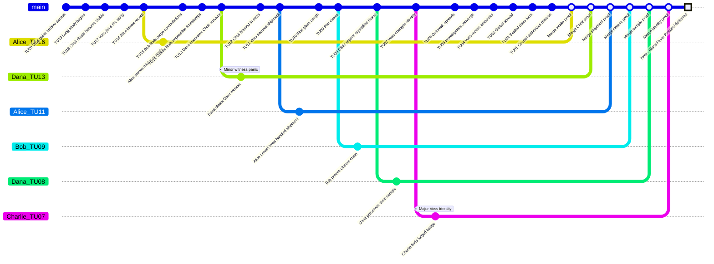

# Glass Fever Protocol - Game Master Prep

This original **Causality** case presents a causal outbreak mystery built for starter and advanced play.

The scenario works best as the recommended starter case. It has a starter mode without a **Time Offender**, then an advanced mode where the carrier is actively protected by a **Counter-System**.

## Scenario Premise

In the Now of 2142, several sealed cities survive after the Glass Fever crystallized lung tissue across the coastal world in 2117. The official archive blames a public ritual group called the **Meridian Choir**, but the evidence is too theatrical and too convenient.

The Investigators open the **Time Flow** to identify the true origin vector, recover cure-grade evidence, and preserve a coherent Now. The real source is Doctor Ilya Voss, a materials physician from the Now who used a **Counter-System** to seed the Glass Fever through a medical shipment at Morrow Pier.

## Core Game Master Truth

- The Meridian Choir is a false culprit.
- Doctor Ilya Voss is the true origin carrier.
- Voss is a **Time Offender** from the Now who wants the sealed-city order to exist.
- The Glass Fever outbreak must remain explainable at final resolution, but the Investigators can expose the true source and preserve cure evidence.
- Preventing the outbreak completely breaks the original Now unless a replacement causal origin is created.

## Main Timeline

| Time Unit | Visible or Discoverable Event | Hidden GM Note |
|---|---|---|
| 20 | Voss gains access to sealed-city medical archives. | He finds a Counter-System fragment in quarantine hardware. |
| 19 | The coastal health network begins a glass-fiber lung study. | This creates a legal route for sample transfers. |
| 18 | The Meridian Choir performs public breath rituals. | The false culprit becomes visible. |
| 17 | Voss joins the study as a consultant. | He can alter shipment handling. |
| 16 | Alice appears in a damaged quarantine intake record. | The System has already touched this case once. |
| 15 | Bob finds conflicting cargo routes for Morrow Pier. | The shipment path is unstable evidence. |
| 14 | Charlie detects impossible archive timestamps. | Counter-System residue is present. |
| 13 | Dana interviews a Choir survivor. | The Choir knows symbols, not pathogens. |
| 12 | The Choir is blamed in public news. | This protects Voss. |
| 11 | Voss secures the medical shipment. | True origin vector. |
| 10 | A dock worker develops the first glass cough. | First observable infection chain. |
| 9 | Morrow Pier closes under emergency order. | Evidence becomes hard to reach. |
| 8 | The first clinic reports crystalline lung tissue. | Cure evidence exists here. |
| 7 | Voss changes his travel identity. | He starts watching for Investigators. |
| 6 | The outbreak spreads to three coastal cities. | Original Now becomes likely. |
| 5 | Alice, Bob, Charlie, and Dana converge on Morrow Pier. | Security pressure begins. |
| 4 | Voss moves the source ampoules through a ferry clinic. | Final carrier route. |
| 3 | The Glass Fever becomes global. | Catastrophe is locked. |
| 2 | Sealed cities form under emergency rule. | The future System can exist. |
| 1 | The sealed-city council authorizes the mission. | Final prepared state before Now. |
| 0 | Now: the Investigators receive the Glass Fever Protocol. | The present must remain coherent. |

## Initial Player Briefing

- The Now is 2142.
- The Glass Fever began at Morrow Pier in 2117.
- The Meridian Choir is blamed in public records.
- Several archive timestamps are impossible.
- Doctor Ilya Voss appears in clean records but never in public blame.
- The mission is to identify the true origin, preserve cure evidence, and avoid erasing the sealed-city Now.

## Hidden Causal Table

| ID | Condition Type | Conditions | Fact | Evidence |
|---|---|---|---|---|
| F01 | Simple | Voss has archive access and a Counter-System fragment. | Voss can protect the origin chain. | Archive key log, residue, quarantine terminal. |
| F02 | Simple | The lung study allows medical shipments. | Contaminated ampoules can move legally. | Study permit, cargo manifest. |
| F03 | Simple | The Meridian Choir performs public rituals. | The Choir can be framed. | Posters, recordings, witness panic. |
| F04 | Dependency | Dependency: F01 and F02. Voss alters shipment handling. | The true origin vector enters Morrow Pier. | Cargo route, lab notation, missing seal. |
| F05 | Dependency | Dependency: F04. Dock worker exposure occurs. | First glass cough begins. | Clinic intake, worker testimony. |
| F06 | Dependency | Dependency: F05. Emergency order closes the pier. | Evidence is isolated. | Closure order, security log. |
| F07 | Dependency | Dependency: F03 and F06. Public blame turns toward the Choir. | False culprit becomes official. | News archive, arrest record. |
| F08 | Dependency | Dependency: F04. Voss changes travel identity. | Voss can leave the origin site. | Ferry ticket, forged badge. |
| F09 | Dependency | Dependency: F05. Clinic preserves tissue samples. | Cure-grade evidence exists. | Cryo sample, pathologist note. |
| F10 | Dependency | Dependency: F08. Voss moves the ampoules. | The outbreak can spread globally. | Ferry clinic log, broken ampoule case. |
| F11 | Dependency | Dependency: F10. Global spread happens. | The sealed-city Now exists. | Population record, sealed-city charter. |
| F12 | Dependency | Dependency: F09 and F11. Evidence survives into Now. | The Investigators can expose Voss without erasing Now. | Protocol packet, sample chain. |

## Key Characters

| Character | Public Role | Real Function |
|---|---|---|
| Alice | Investigator with damaged intake record | Loop-like anchor for prior System contact. |
| Bob | Investigator tracking public security records | Finds route contradictions and crowd pressure. |
| Charlie | Investigator tracking System residue | Reads timestamps and Counter-System traces. |
| Dana | Investigator tracking witnesses and samples | Clears the Choir and preserves cure evidence. |
| Doctor Ilya Voss | Materials physician | Time Offender and true origin carrier. |
| Meridian Choir | Public ritual group | False culprit. |
| Dock Worker Sera Holt | First known patient | Human proof of the real exposure chain. |
| Pathologist Ren Arco | Clinic evidence keeper | Holds cure-grade sample evidence. |

## Doctor Voss as Time Offender

Voss begins **Unaware of identities**, becomes **Alerted** when the group touches Morrow Pier records, and reaches **Identified target** when an Investigator reveals impossible knowledge of the ampoule route.

Voss has one single-use **Counter-System Rewind Dice** set: d4, d6, d8, d10, d12, d20.

| Action | Mechanical Effect | Evidence Left Behind |
|---|---|---|
| Reframe the Choir | Add one Minor Conflict to an Investigator clearing the Choir. | Edited news archive. |
| Move ampoules | Force a corrective branch or keep a Major Conflict. | Ferry route mismatch. |
| Contaminate clinic sample | Block one merge until replacement evidence exists. | Broken cryo seal. |
| Identify an Investigator | Add public security pressure. | Watchlist entry. |

## Starter Mode

For a first table, remove Voss's active Counter-System actions. Keep him as the true carrier, but do not let him spend dice. The players only need to clear the Choir, prove the shipment route, and preserve clinic samples.

## Complete Playthrough Summary

Use the normal turn order: GM, Alice, Bob, Charlie, Dana.

| Turn | Action | Resolution |
|---|---|---|
| Alice | Opens TU16 with d20 -> 18, r = 112.5%. | Critical success; proves prior intake record. |
| Bob | Opens TU15 with d12 -> 7, r = 46.67%. | Partial failure; gain reveals missing cargo manifest. |
| Charlie | Opens TU14 with d10 -> 6, r = 42.86%. | Partial failure; gain reveals Counter-System residue. |
| Dana | Opens TU13 with d8 -> 7, r = 53.85%. | Partial success; consequence creates Minor Conflict with Choir witness. |
| Voss | Uses Counter-System d8 at TU11 -> 5, r = 45.45%. | Partial failure; he fails to hide all ampoule evidence but learns Dana's name. |
| Alice | Opens TU11 with d12 -> 11, r = 100%. | Critical success; proves Voss handled shipment. |
| Bob | Opens TU9 with d10 -> 8, r = 88.89%. | Critical success; proves pier closure chain. |
| Charlie | Opens TU7 with d8 -> 4, r = 57.14%. | Partial success; consequence creates Major Conflict: forged Voss identity replaces real badge. |
| Dana | Opens TU8 with d20 -> 17, r = 212.5%. | Critical success; preserves clinic sample and resolves Charlie's Major Conflict. |
| Final | Group merges evidence chain. | Voss exposed, Choir cleared, Glass Fever origin remains coherent, cure evidence survives. |

### Final State

| Investigator | Final Willpower | Final Health | Open Conflicts | Notes |
|---|---:|---:|---:|---|
| Alice | 100 | 10 | 0 | Prior System contact stabilized. |
| Bob | 100 | 10 | 0 | Cargo and closure records merged. |
| Charlie | 100 | 10 | 0 | Counter-System residue proved. |
| Dana | 100 | 10 | 0 | Choir cleared and sample preserved. |

### GitGraph

In this GitGraph, white points on `main` correspond to merges on the Now. The white square represents the Now.

