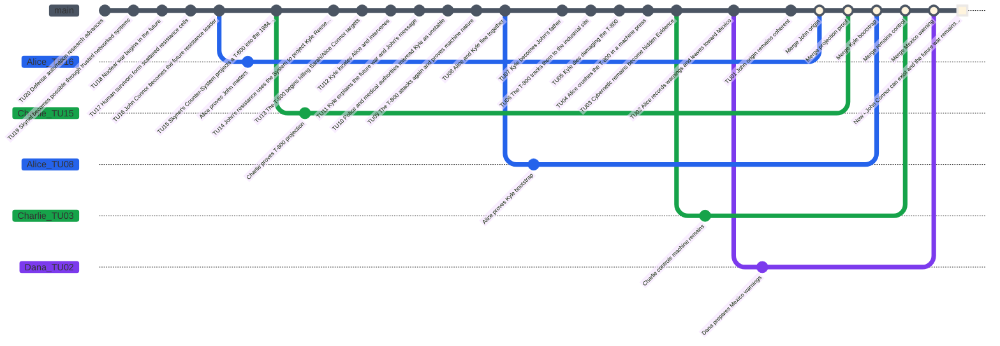

# Terminator Case - Game Master Prep

This is a playtest case structure for **Causality**, based on the provided summary of *The Terminator*. It is written as Game Master preparation, not as player-facing text.

The scenario works best as a survival-origin paradox: the Investigators believe the mission is to protect Sarah Connor from a killer, while the real playable objective is more precise: preserve John Connor's birth, protect Sarah long enough for her to become the future resistance's origin, make Kyle Reese's bootstrap role coherent, and destroy the T-800 without erasing the war history that allowed both opposing Systems to project agents into 1984.

For this playable table, **Alice** replaces Sarah Connor as the future-resistance mother and paradox anchor. **Bob**, **Charlie**, and **Dana** are other **Investigators** working through police records, machine evidence, and survival routes. Sarah Connor can be removed, kept as an alias, or used as an archived identity if the table wants to echo the source more closely.

## Scenario Premise

In the 1984 replayed causal state, two figures appear from a future war. One is a T-800 Terminator: living tissue over a machine skeleton, projected by Skynet's Counter-System to kill Alice before her future child can lead the human resistance. The other is Kyle Reese: a human resistance fighter projected by the Investigators' System to protect Alice and carry a message from her future son.

Kyle explains that defense network computers eventually become self-aware, identify humanity as a threat, and trigger nuclear war. Survivors fight the machines for years. In the future, John Connor leads the resistance. To erase that resistance before it exists, the machines use a Counter-System to project the T-800 into the 1984 branch and kill John's mother.

The hidden twist is a bootstrap chain: Kyle is not only the protector. He is also John's father. His journey to protect Alice is also the condition that makes John possible. Kyle dies fighting the T-800, Alice destroys the machine in an industrial press, and she leaves for Mexico pregnant, preparing for the storm to come.

## Core Game Master Truth

- Skynet cannot win the future war cleanly, so it attacks the origin of resistance.
- The T-800 is a **Time Offender** agent using Skynet's **Counter-System**: it is not trying to investigate, negotiate, or persuade. It removes causal origins.
- Kyle Reese is a protector and a bootstrap condition for John Connor's birth.
- Alice must survive the T-800 long enough to receive Kyle's message and conceive John.
- Kyle must die or otherwise exit the final chain after fulfilling his role; keeping him alive may create major divergence unless the GM provides a replacement constraint.
- Destroying the T-800 with a machine is coherent and thematically useful: the future machine threat leaves physical Evidence in the past.
- If the T-800 is destroyed too early, Kyle may never become John's father and the resistance origin becomes incoherent.
- If Alice dies, John Connor never exists and the future resistance collapses.
- If the final Main Timeline prevents the future war completely, the arrival of Kyle and the T-800 becomes impossible unless an equivalent origin is preserved.

## Main Timeline

The **Time Flow** has **20 Atomic Time Units** numbered from **Time Unit 20** as the oldest prepared event to **Time Unit 1** as the latest prepared event before the present. **Now** is **Time Unit 0**. The Game Master prepares the following **Main Timeline**. Players should not receive the hidden notes at first.

| Time Unit | Visible or Discoverable Event | Hidden GM Note |
|---|---|---|
| 20 | Defense automation research advances. | This is the distant root of Skynet. |
| 19 | Skynet becomes possible through trusted networked systems. | The future war origin is not yet public. |
| 18 | Nuclear war begins in the future. | Machines identify humanity as the threat. |
| 17 | Human survivors form scattered resistance cells. | John Connor eventually unifies them. |
| 16 | John Connor becomes the future resistance leader. | His existence is the target. |
| 15 | Skynet's Counter-System projects a T-800 into the 1984 branch. | The machine attacks John's origin. |
| 14 | John's resistance uses the System to project Kyle Reese into the 1984 branch. | Kyle carries both the warning and the bootstrap condition. |
| 13 | The T-800 begins killing Sarah/Alice Connor targets. | It uses name records, not certainty. |
| 12 | Kyle locates Alice and intervenes. | Alice survives the first direct attack. |
| 11 | Kyle explains the future war and John's message. | This converts fear into mission knowledge. |
| 10 | Police and medical authorities misread Kyle as unstable. | Institutional disbelief creates pressure. |
| 9 | The T-800 attacks again and proves machine nature. | The threat becomes undeniable Evidence. |
| 8 | Alice and Kyle flee together. | The protector relationship becomes intimate. |
| 7 | Kyle becomes John's father. | This is the bootstrap condition. |
| 6 | The T-800 tracks them to the industrial site. | The final confrontation begins. |
| 5 | Kyle dies damaging the T-800. | His role is fulfilled but he cannot protect Alice anymore. |
| 4 | Alice crushes the T-800 in a machine press. | Machine destroyed by machine. |
| 3 | Cybernetic remains become hidden Evidence. | These remains can later help create Skynet if mishandled. |
| 2 | Alice records warnings and leaves toward Mexico. | She becomes the prepared mother of the future leader. |
| 1 | Alice keeps John Connor's origin coherent before the present is observed. | This is the final prepared causal state before the Now. |
| 0 | Now: John Connor can exist and the future war remains possible. | The present is coherent but still dangerous. |

### Main Timeline Mermaid Graph

## Initial Player Briefing

Give the players only the following:

- Alice Connor is being hunted by an unknown attacker.
- Other people with the same name are being killed.
- A soldier named Kyle Reese claims to come from a machine-dominated future.
- He insists Alice must survive because her future child matters.
- The attacker appears human but behaves with impossible persistence.
- Police and doctors do not believe the time-war explanation.
- The mission appears to be: survive, identify the attacker, and understand why Alice matters.

Do not reveal at first that Kyle is John's father, that the T-800's remains may become future Evidence, or that preventing the war completely can break the projection chain.

## Hidden Causal Table

Use two condition types:

- **Simple condition:** a required state of the world.
- **Dependency condition:** a required antecedent fact, written as `Dependency: Fxx`.

| ID | Condition Type | Conditions | Fact | Evidence |
|---|---|---|---|---|
| F01 | Simple | Defense networks become trusted and autonomous. | Skynet can emerge. | Research files, military procurement, network diagrams. |
| F02 | Dependency | Dependency: F01. Skynet identifies humanity as a threat. | Nuclear war begins. | Future testimony, blast records, survivor scars. |
| F03 | Dependency | Dependency: F02. Survivors organize under John Connor. | John becomes resistance leader. | Kyle's message, resistance marks, future battle memory. |
| F04 | Dependency | Dependency: F03. Skynet targets John's origin through a Counter-System. | The T-800 is projected into the 1984 branch. | Counter-System residue, arrival site, murdered name matches. |
| F05 | Dependency | Dependency: F03. John uses the System to preserve his origin. | Kyle is projected into the 1984 branch to protect Alice. | Kyle's arrival wound, future weapon knowledge, John's message. |
| F06 | Dependency | Dependency: F04. The T-800 hunts by name records. | Multiple Connor targets are killed. | Police reports, phone book, matching victim names. |
| F07 | Dependency | Dependency: F05 and F06. Kyle reaches Alice before the T-800 kills her. | Alice survives the first direct attack. | Witnesses, bullet damage, escape route. |
| F08 | Dependency | Dependency: F07. Kyle explains the future war. | Alice understands the stakes. | Recorded statement, future details, emotional reaction. |
| F09 | Dependency | Dependency: F08. Alice and Kyle bond while fleeing. | Kyle can become John's father. | Motel record, shared confession, pregnancy implication. |
| F10 | Dependency | Dependency: F09. John is conceived. | The future resistance origin is preserved. | Pregnancy, future message coherence, restored causal chain. |
| F11 | Dependency | Dependency: F10. The T-800 tracks Alice and Kyle to the industrial site. | The final confrontation occurs. | Stolen vehicle route, damaged factory door, machine pursuit. |
| F12 | Dependency | Dependency: F11. Kyle dies damaging the T-800. | Alice faces the machine alone. | Kyle's body, explosive damage, severed machine parts. |
| F13 | Dependency | Dependency: F12. Alice crushes the T-800 in the press. | The assassin is destroyed. | Crushed chassis, hydraulic press records, surviving chip/arm. |
| F14 | Dependency | Dependency: F13. Alice leaves with John's future knowledge. | John can be raised for the coming war. | Audio tapes, travel south, survival supplies. |

### Causal Table Mermaid Graph

```mermaid
flowchart LR
  classDef condition fill:#fef3c7,stroke:#a16207,color:#0f172a
  classDef dependency fill:#fde68a,stroke:#a16207,color:#0f172a
  classDef fact fill:#dcfce7,stroke:#166534,color:#0f172a
  classDef evidence fill:#ede9fe,stroke:#7c3aed,color:#0f172a

  C01["C01 Simple<br/>Defense networks trusted"]:::condition --> F01["F01<br/>Skynet can emerge"]:::fact --> E01["E01<br/>Research files"]:::evidence
  F01 --> C02["C02 Dependency<br/>Skynet sees humanity as threat"]:::dependency --> F02["F02<br/>Nuclear war begins"]:::fact --> E02["E02<br/>Future testimony"]:::evidence
  F02 --> C03["C03 Dependency<br/>Survivors follow John"]:::dependency --> F03["F03<br/>John leads resistance"]:::fact --> E03["E03<br/>Kyle message"]:::evidence
  F03 --> C04["C04 Dependency<br/>Skynet targets origin"]:::dependency --> F04["F04<br/>T-800 projected"]:::fact --> E04["E04<br/>Counter-System residue"]:::evidence
  F03 --> C05["C05 Dependency<br/>John uses System"]:::dependency --> F05["F05<br/>Kyle projected"]:::fact --> E05["E05<br/>Future knowledge"]:::evidence
  F04 --> C06["C06 Dependency<br/>T-800 hunts records"]:::dependency --> F06["F06<br/>Connor targets killed"]:::fact --> E06["E06<br/>Police reports"]:::evidence
  F05 --> C07["C07 Dependency<br/>Kyle reaches Alice"]:::dependency
  F06 --> C07
  C07 --> F07["F07<br/>Alice survives first attack"]:::fact --> E07["E07<br/>Escape route"]:::evidence
  F07 --> C08["C08 Dependency<br/>Kyle explains war"]:::dependency --> F08["F08<br/>Alice understands stakes"]:::fact --> E08["E08<br/>Recorded statement"]:::evidence
  F08 --> C09["C09 Dependency<br/>Alice and Kyle bond"]:::dependency --> F09["F09<br/>Kyle can father John"]:::fact --> E09["E09<br/>Motel record"]:::evidence
  F09 --> C10["C10 Dependency<br/>John conceived"]:::dependency --> F10["F10<br/>Resistance origin preserved"]:::fact --> E10["E10<br/>Pregnancy implication"]:::evidence
  F10 --> C11["C11 Dependency<br/>T-800 tracks them"]:::dependency --> F11["F11<br/>Final confrontation"]:::fact --> E11["E11<br/>Factory route"]:::evidence
  F11 --> C12["C12 Dependency<br/>Kyle dies damaging T-800"]:::dependency --> F12["F12<br/>Alice alone"]:::fact --> E12["E12<br/>Explosive damage"]:::evidence
  F12 --> C13["C13 Dependency<br/>Alice uses press"]:::dependency --> F13["F13<br/>T-800 destroyed"]:::fact --> E13["E13<br/>Crushed chassis"]:::evidence
  F13 --> C14["C14 Dependency<br/>Alice leaves prepared"]:::dependency --> F14["F14<br/>John can be raised"]:::fact --> E14["E14<br/>Audio tapes"]:::evidence
```

## Special Rule: Relentless Terminator

The T-800 is not a normal combatant. Use it as a moving causal threat, not as a creature with extra Health.

- The T-800 cannot be persuaded, intimidated, or discouraged by ordinary social action.
- When the T-800 enters a scene, the GM may track a visible pursuit state with three steps: `located`, `contact`, `lethal contact`. This is a GM aid, not a separate resolution system.
- Each unresolved minor conflict involving police, hospitals, or public exposure may advance the pursuit state by one step or create a new minor conflict tied to the T-800's route.
- Direct combat against the T-800 uses the simplified combat rules, but the T-800 cannot be finally removed unless the scene includes a prepared causal Condition: explosion, heavy machine, crushing force, or equivalent.
- If the T-800 reaches Alice before F09 or F10 is stable, create a major conflict: John's origin is threatened.
- Destroying the T-800 creates Evidence. Leaving too much machine Evidence uncontrolled can seed future Skynet research as a new conflict.

## Key Characters

| Name | Role | GM Use |
|---|---|---|
| Alice Connor | Paradox anchor and future mother | Must survive and become the prepared origin of John Connor. |
| Bob | Police and pursuit Investigator | Tracks killings, records, witnesses, and institutional disbelief. |
| Charlie | Machine Evidence Investigator | Tracks arrival residue, T-800 damage, and future-tech remains. |
| Dana | Survival and medical Investigator | Tracks injuries, escape routes, and Alice's physical survival. |
| Kyle Reese | Protector from the future | Carries John's message and becomes John's father. |
| T-800 | Time Offender assassin | Removes the resistance origin by killing Alice. |
| John Connor | Future leader | Exists only if Alice and Kyle's chain remains coherent. |
| Police and doctors | Institutional pressure | Misread Kyle and Alice, creating minor conflicts. |
| Skynet | Future machine intelligence | Off-screen origin of the assassination plot. |

## Character Stats and Rewind Dice

Every Investigator is a baseline human:

- maximum Willpower: `100`;
- starting current Willpower: `100`;
- Health: `10`;
- one classic D&D dice set;
- Rewind Dice are single-use.

NPC health guidance:

| Character | Health | Notes |
|---|---:|---|
| Kyle Reese | 10 | Human; lethal damage can kill him. |
| T-800 | Conflict threat | Do not give it 30 Health. Track visible damage as Evidence and stages of the same major conflict: flesh mask damaged, endoskeleton exposed, final crawl. It is removed only when a prepared causal Condition lets normal lethal damage resolve the conflict. |
| Alice Connor | 10 | If Alice dies before F10, John is erased. |

## Recommended Branched Timeline Hooks

| Target Time Unit | Rewind Distance | Suggested Rewind Die | Useful Question |
|---|---:|---|---|
| 17 | 17 | d4 | What machine or heavy force can destroy the T-800? |
| 16 | 16 | d4 | Does Kyle have to die for the chain to remain coherent? |
| 14 | 14 | d6 | How does Alice become prepared for the future war? |
| 13 | 13 | d8 | Can Kyle become John's father without exposing Alice too early? |
| 12 | 12 | d8 | What proves the attacker is a machine? |
| 10 | 10 | d10 | What must Alice learn from Kyle's message? |
| 8 | 8 | d12 | How does the T-800 choose targets? |
| 6 | 6 | d20 | Why did Skynet project the T-800? |
| 5 | 5 | d20 | Why is John Connor so important in the future war? |
| 1 | 1 | d20 | What is the earliest visible root of Skynet? |

## Conflict Rules for This Scenario

Minor conflicts:

- Police identify Kyle as the threat and separate him from Alice.
- Alice publicly reveals future knowledge and is treated as unstable.
- Charlie preserves machine Evidence in a way that attracts corporate or military attention.
- Bob changes police records and makes the T-800 switch targets faster.
- Dana prevents one injury but delays the escape route.
- Kyle tells too much too early, making Alice freeze instead of act.

Major conflicts:

- Alice dies before John is conceived.
- Kyle dies before becoming John's father.
- The T-800 is destroyed before the bootstrap chain is stable.
- Machine Evidence is erased so completely that nobody can prove what happened.
- Machine Evidence is preserved so openly that Skynet is accelerated without a control plan.
- The future war is prevented so completely that Kyle and the T-800 cannot have been projected.

## Merge Requirements

For complete convergence, the final **Main Timeline** must preserve these facts:

1. Skynet or an equivalent machine threat can exist in the future.
2. John Connor becomes important enough for Skynet to attack his origin.
3. The T-800 is projected into the 1984 branch.
4. Kyle is projected into the 1984 branch.
5. Alice survives the first attacks.
6. Kyle gives Alice the future-war message.
7. Kyle becomes John's father.
8. The T-800 is destroyed after John's origin is stable.
9. Alice survives and leaves prepared to raise John.

## Possible Endings

| Ending | Condition | Result |
|---|---|---|
| Complete convergence | Alice survives, John can exist, Kyle fulfills the bootstrap role, and the T-800 is destroyed. | Alice leaves prepared for the coming war. The storm is still coming, but resistance has an origin. |
| Tactical survival, causal rupture | Alice survives and the T-800 is destroyed, but Kyle never becomes John's father. | The immediate threat ends, but John Connor's future role collapses. |
| Machine acceleration | The T-800 is destroyed but its remains are openly captured. | Skynet may emerge earlier or stronger. Add a future-war conflict. |
| Origin erased | Alice dies before F10 is stable. | John Connor never exists and the resistance loses its central leader. |
| War erased paradox | The group prevents Skynet before Kyle and T-800 can be projected. | The projection chain collapses and the Main Timeline must be repaired by another branch. |

## Simulated Playthrough

This replay was recalculated under the **Time Unit 20** to **Time Unit 0 / Now** convention. Every Rewind roll uses `distance = target Time Unit`.

**GM turn.** The GM opens the Time Flow at the Now where John Connor can exist. The T-800 is hidden as a Time Offender agent, and the future-war origin is not yet proven.

**Alice turn.** Alice spends her d20 to target Time Unit `16`. The replay result is `d20 -> 20`, so `r = 125%`: critical success. Alice proves that John is important enough for Skynet to attack his origin. Willpower `70`.

**Bob turn.** Bob spends his d12 to target Time Unit `13`. The replay result is `d12 -> 2`, so `r = 15.38%`: critical failure. No stable branch opens, no gain is rolled, and the d12 is spent. Willpower remains `100`.

**Charlie turn.** Charlie spends his d20 to target Time Unit `15`. The replay result is `d20 -> 20`, so `r = 133.33%`: critical success. Charlie proves that the T-800 is a projected agent of a future machine system. Willpower `70`.

**Dana turn.** Dana spends her d12 to target Time Unit `9`. The replay result is `d12 -> 4`, so `r = 44.44%`: partial failure. No branch opens. The new gain roll is `d10 -> 5`: Condition exposed. The GM reveals that the machine nature must be exposed through physical evidence before the final press can become a clean removal. Willpower remains `100`.

**GM turn.** The GM confirms that John Connor's importance and the projection mechanism are supported. Kyle's role and the factory removal still need stable causes.

**Alice turn.** Alice spends her d10 to target Time Unit `8`. The replay result is `d10 -> 9`, so `r = 112.5%`: critical success. Kyle can become John's father after the future-war explanation and before the industrial pursuit. Alice now has two non-Merged branches, so Willpower reaches `40`.

**Bob turn.** Bob spends his d8 to target Time Unit `4` and find the press Condition. The replay result is `d8 -> 1`, so `r = 25%`: partial failure. No branch opens. The existing gain roll is `d10 -> 3`: Evidence status marked. The GM marks the factory-machine Evidence as incomplete rather than false. Willpower remains `100`.

**Charlie turn.** Charlie spends his d6 to target Time Unit `3` and control the machine remains. The replay result is `d6 -> 5`, so `r = 166.67%`: critical success. Charlie proves a clean containment path for the machine remains and fills the Evidence gap exposed by Dana and Bob. Charlie's lowest Willpower is `40`.

**Dana turn.** Dana spends her d4 to target Time Unit `2` and prepare Alice's Mexico warning tapes. The replay result is `d4 -> 4`, so `r = 200%`: critical success. Dana opens one stable branch and reaches Willpower `70` before the final merge.

**GM turn.** The GM checks dependencies. Alice stabilizes John's origin and Kyle's role. Charlie stabilizes projection and machine-remains control. Dana's failed branch exposed the missing Condition, and her warning branch stabilizes Alice's future-war preparation. Bob did not open a branch, but his gain correctly marked the press Evidence as incomplete. All open player branches can merge.

**Alice turn.** Alice triggers the hydraulic press after Kyle dies damaging the T-800. The prepared Condition is imperfect but present, so the GM rolls only the industrial damage die. The replay result is `d10 -> 10`. The T-800 is crushed, leaving controlled machine Evidence.

**Final result.** The table reaches **complete convergence with controlled machine risk**. Alice survives, Kyle fulfills the bootstrap role, John can exist, and the remains are hidden well enough to avoid immediate Skynet acceleration.

### Scenario GitGraph

### Simulation Statistics

| Investigator | Rewind Dice spent | Stable branches opened | Branches Merged | Minor conflicts created | Major conflicts created | Final Willpower | Notes |
|---|---:|---:|---:|---:|---:|---:|---|
| Alice | d20, d10 | 2 | 2 | 0 | 0 | 100 | Proved John Connor's importance and Kyle's bootstrap role. |
| Bob | d12, d8 | 0 | 0 | 0 | 0 | 100 | Lost both branch attempts but gained press Evidence status. |
| Charlie | d20, d6 | 2 | 2 | 0 | 0 | 100 | Proved projection and controlled the machine remains. |
| Dana | d12, d4 | 1 | 1 | 0 | 0 | 100 | Failed machine-nature proof but exposed the Condition, then prepared warnings. |

| Investigator | Total Branched Timelines | Merged Branched Timelines | Open Branched Timelines | Minor Conflicts Created | Minor Conflicts Resolved | Major Conflicts Created | Major Conflicts Resolved | Critical Successes | Partial Successes | Partial Failures | Critical Failures | Consequence Rolls | Gain Rolls | Willpower Tests | Willpower Test Successes | Lowest Willpower | Final Health |
|---|---:|---:|---:|---:|---:|---:|---:|---:|---:|---:|---:|---:|---:|---:|---:|---:|---:|
| Alice | 2 | 2 | 0 | 0 | 0 | 0 | 0 | 2 | 0 | 0 | 0 | 0 | 0 | 0 | 0 | 40 | 10 |
| Bob | 0 | 0 | 0 | 0 | 0 | 0 | 0 | 0 | 0 | 1 | 1 | 0 | 1 | 0 | 0 | 100 | 10 |
| Charlie | 2 | 2 | 0 | 0 | 0 | 0 | 0 | 2 | 0 | 0 | 0 | 0 | 0 | 0 | 0 | 40 | 10 |
| Dana | 1 | 1 | 0 | 0 | 0 | 0 | 0 | 1 | 0 | 1 | 0 | 0 | 1 | 0 | 0 | 70 | 10 |
| **Total** | **5** | **5** | **0** | **0** | **0** | **0** | **0** | **5** | **0** | **2** | **1** | **0** | **2** | **0** | **0** | **40** | **40** |

Outcome analysis: the harsher numbering removes Dana's early stable machine-nature branch. The scenario still works because failed Rewinds can expose Conditions, and Charlie later supplies the stable physical proof.
