# Twelve Monkeys Case - Game Master Prep

This is a playtest case structure for **Causality**, based on the provided summary of *12 Monkeys*. It is written as Game Master preparation, not as player-facing text.

The scenario works best if the Investigators believe the mission is to stop the catastrophe, while the real playable objective is more precise: identify the true viral source, expose the **Time Offender**, and preserve a coherent Now.

For this simulated table, **Alice** is the **Loop Anchor Investigator**. **Bob**, **Charlie**, and **Dana** are the other Investigators active in the prepared Main Timeline. Alice replaces James Cole as the active figure inside the prepared Main Timeline. James Cole can be removed entirely, kept as an archived alias, or used only as a damaged future record depending on how closely the table wants to echo the source material.

## Scenario Premise

In the Now of 2035, humanity survives underground after a lethal virus emerged in 1996 and destroyed most of civilization. The future scientists have incomplete records. They know the name **Army of the 12 Monkeys**, they know Alice was already entangled with the past, and they know an airport is central to the loop.

The Investigators use the **System** to open the **Time Flow**, rewind **causality**, and test earlier **Atomic Time Units**. The **Main Timeline** prepared by the Game Master is not a neutral chronology: it is a closed causal trap where a false culprit hides the real carrier. That carrier, Doctor Peters, is not merely a historical virologist. He is a **Time Offender** from the Now who uses a rival **Counter-System** to protect his own version of causality.

## Core Game Master Truth

- The Army of the 12 Monkeys is a false culprit.
- Jeffrey Goines is dangerous, unstable, and connected to the symbols, but his group mainly wants to free animals.
- Doctor Peters is the true viral carrier and the source of the causal problem.
- Peters is a **Time Offender** from the Now. He has access to a **Counter-System**, an equivalent of the System used by the Investigators.
- Peters knows that Investigators exist, but he does not know their identities at the start of play.
- Peters can identify Investigators during play when they act with information, timing, or behavior that would be abnormal for a non-time-aware person.
- Peters has access to the virus through the virology lab connected to Jeffrey's father, and he uses temporal knowledge to protect that access.
- The airport event is a loop anchor: adult Alice is killed while young Alice watches.
- The original Now exists because the virus was released in 1996.
- If the final Main Timeline prevents the 1996 outbreak completely, the original Now is no longer coherent and the Investigators' reality is lost.

## Main Timeline

The **Time Flow** always has **20 Atomic Time Units**. The Game Master prepares the following **Main Timeline**. Players should not receive the hidden notes at first.

| Time Unit | Visible or Discoverable Event | Hidden GM Note |
|---|---|---|
| 1 | Alice is projected into a 1990 Branched Timeline state instead of the intended target year. | The System or future calculations are inaccurate. This creates psychiatric records tied to Alice in the replayed causal state. |
| 2 | Alice is interned in an asylum. | She meets Kathryn Railly and Jeffrey Goines. |
| 3 | Alice warns people about a future plague. | Her warnings look like delusions but leave useful testimony. |
| 4 | Railly records Alice as a patient with apocalyptic beliefs. | Her professional skepticism becomes later evidence. |
| 5 | Jeffrey leaves the asylum and radical ecological ideas grow around him. | Alice's presence helps shape the false trail. |
| 6 | Alice, Bob, Charlie, and Dana open a corrected 1996 Branched Timeline after a later System correction. | The full group is closer to the viral release window. |
| 7 | Bob and Dana pressure Railly to help the investigation while Alice remains the visible fugitive. | This creates police attention and damages the group's credibility. |
| 8 | Railly finds impossible links between Alice's claims, Charlie's archive checks, and Bob's security records. | She starts believing the causal loop is real. |
| 9 | Alice, Bob, Charlie, Dana, and Railly focus on the Army of the 12 Monkeys. | The false culprit becomes convincing. |
| 10 | Army of the 12 Monkeys symbols appear in public places. | These signs point to activism, not viral terrorism. |
| 11 | Jeffrey appears to be the responsible leader. | His father and the lab connection hide the real access route. |
| 12 | The Army prepares a public animal liberation action. | This action distracts from Peters. |
| 13 | Doctor Peters secures access to viral samples. | Peters is a Time Offender from the Now. His Counter-System tells him this is the critical source point. |
| 14 | Peters prepares travel with the samples. | He watches for abnormal behavior and may identify Investigators if they expose future knowledge. |
| 15 | Alice, Bob, Charlie, Dana, and Railly converge on the airport. | Their actions attract armed security. |
| 16 | Alice tries to stop Peters and is shot by airport police. | This is a loop anchor witnessed by young Alice. |
| 17 | Peters boards or reaches the departure chain with the samples. | His Counter-System protects this departure path unless the Investigators expose him without breaking the Now. |
| 18 | The 1996 outbreak begins and spreads beyond containment. | The catastrophe becomes historically locked. |
| 19 | By 2035, survivors live underground and use prisoners in experiments. | The future System exists because of the catastrophe. |
| 20 | Now: Alice, Bob, Charlie, and Dana receive the mission. | The current observable state must remain coherent at final merge. |

### Main Timeline Mermaid Graph

```mermaid
flowchart LR
  TU01["TU01<br/>Alice projected to 1990 branch"] --> TU02["TU02<br/>Alice interned"]
  TU02 --> TU03["TU03<br/>Alice warns about plague"]
  TU03 --> TU04["TU04<br/>Railly records Alice"]
  TU04 --> TU05["TU05<br/>Jeffrey leaves asylum"]
  TU05 --> TU06["TU06<br/>Corrected 1996 branch"]
  TU06 --> TU07["TU07<br/>Bob and Dana pressure Railly"]
  TU07 --> TU08["TU08<br/>Railly finds impossible links"]
  TU08 --> TU09["TU09<br/>Group focuses on the Army"]
  TU09 --> TU10["TU10<br/>Army symbols appear"]
  TU10 --> TU11["TU11<br/>Jeffrey looks responsible"]
  TU11 --> TU12["TU12<br/>Animal liberation action"]
  TU12 --> TU13["TU13<br/>Peters gets samples<br/>Time Offender revealed"]
  TU13 --> TU14["TU14<br/>Peters watches anomalies"]
  TU14 --> TU15["TU15<br/>Group reaches airport"]
  TU15 --> TU16["TU16<br/>Alice is shot"]
  TU16 --> TU17["TU17<br/>Peters departs"]
  TU17 --> TU18["TU18<br/>Outbreak begins"]
  TU18 --> TU19["TU19<br/>2035 underground survivors"]
  TU19 --> TU20["TU20<br/>Now: mission begins"]
```



## Initial Player Briefing

Give the players only the following:

- The Now is 2035.
- A virus appeared in 1996 and destroyed surface civilization.
- The phrase "Army of the 12 Monkeys" appears repeatedly in damaged records.
- Alice appears to have already been projected into an earlier Branched Timeline and became linked to the case.
- Kathryn Railly and Jeffrey Goines are recurring names.
- An airport memory appears in several corrupted files.
- The mission is to identify the original viral source and create a coherent path to a cure.

Do not tell them at first that Peters is the true carrier or that a Time Offender is active in the case.

## Hidden Causal Table

Use two condition types:

- **Simple condition:** a required state of the world.
- **Dependency condition:** a required antecedent fact, written as `Dependency: Fxx`.

| ID | Condition Type | Conditions | Fact | Evidence |
|---|---|---|---|---|
| F01 | Simple | Future scientists activate the System with inaccurate target coordinates. | Alice is projected into a 1990 Branched Timeline state. | Arrest record, asylum intake form, police report. |
| F02 | Dependency | Dependency: F01. Alice speaks openly about the future plague. | Railly records Alice as delusional. | Psychiatric notes, lecture fragments, memory of interview. |
| F03 | Dependency | Dependency: F01. Alice meets Jeffrey in the asylum. | Jeffrey's activism becomes linked to apocalyptic language. | Witness statements, later graffiti, activist rhetoric. |
| F04 | Simple | Army of the 12 Monkeys symbols are visible in 1996. | The Investigators suspect Jeffrey's group. | Posters, photos, newspaper clippings. |
| F05 | Dependency | Dependency: F03. Jeffrey's group focuses on animal liberation. | The Army is not the viral release mechanism. | Zoo plan, animal transport records, activist manifestos. |
| F06 | Simple | Peters is a Time Offender from the Now, uses a Counter-System, and works near Jeffrey's father with lab access. | Peters can obtain viral samples and anticipate temporal interference. | Lab access logs, badge records, sample inventory gap, Counter-System residue. |
| F07 | Dependency | Dependency: F06. Peters prepares air travel while monitoring for abnormal behavior. | The virus can spread globally. | Ticket records, airport camera logs, baggage records, route changes after anomalies. |
| F08 | Dependency | Dependency: F07. Alice, Bob, Charlie, Dana, and Railly identify Peters too late. | Alice confronts Peters at the airport. | Security radio traffic, eyewitness accounts. |
| F09 | Dependency | Dependency: F08. Police read Alice as the threat. | Alice is shot. | Ballistics, airport police statement, Railly's testimony. |
| F10 | Dependency | Dependency: F09. Young Alice is present at the airport. | The loop imprints Alice's death as a childhood memory. | Child witness description, recurring dream, future psych profile. |
| F11 | Dependency | Dependency: F07. Peters leaves with samples. | The 1996 outbreak begins. | Outbreak map, flight path, first infection cluster. |
| F12 | Dependency | Dependency: F11. The outbreak occurs. | The 2035 underground Now exists. | Future survival records, System archive, prisoner program. |

### Causal Table Mermaid Graph


## Key Characters

| Character | Public Role | Real Function |
|---|---|---|
| Alice | Loop Anchor Investigator sent by future scientists | Loop anchor and unreliable warning signal |
| Bob | Investigator operating under pressure in public spaces | Security reading, pursuit handling, airport route analysis |
| Charlie | Investigator analyzing System and archive records | Finds impossible links, corrupted records, and access logs |
| Dana | Investigator focused on witnesses and survival data | Tracks injuries, testimony, and cure-relevant evidence |
| Kathryn Railly | Psychiatrist | Credibility bridge between delusion and evidence |
| Jeffrey Goines | Unstable activist | False culprit and source of noisy evidence |
| Doctor Peters | Virologist | Time Offender, true carrier, and viral release vector |
| Future Scientists | Mission controllers | Preserve the System and seek usable viral origin data |
| Young Alice | Child witness | Proof that Alice's airport death is part of the original Now |

### Doctor Peters as Time Offender

Doctor Peters is the active temporal enemy controlled by the GM. He comes from the Now and uses a **Counter-System**, a rival equivalent of the System. He is not omniscient: he begins the scenario knowing that Investigators may interfere with his plan, but he does not know who they are.

Track Peters with three awareness states:

| Awareness State | Trigger | GM Use |
|---|---|---|
| Unaware of identities | Start of play. Peters only knows Investigators exist. | He follows the prepared Main Timeline and protects his sample access. |
| Alerted | An Investigator creates visible evidence, causes premature security attention, or uses knowledge no local person should have. | He changes routes, destroys mundane evidence, or frames the anomaly as madness or crime. |
| Identified target | Peters directly connects a name, face, or behavior to temporal interference. | He avoids that Investigator, redirects security toward them, or uses the Counter-System to preserve his departure path. |

Peters should pressure the table without becoming impossible to beat. His Counter-System can:

- notice abnormal timing, impossible records, and repeated names across Branched Timelines;
- move Peters to a nearby route, gate, lab corridor, or witness chain;
- erase or contaminate one piece of evidence unless the branch is Merged cleanly;
- create a minor conflict by making an Investigator look unstable, criminal, or dangerous;
- create a major conflict only if the Investigators try to prevent the outbreak completely before preserving a coherent Now.

Peters has one Counter-System Rewind Dice set: d4, d6, d8, d10, d12, and d20. These dice are single-use. Mundane actions such as walking, lying, calling security, or hiding paperwork do not spend Counter-System energy. Any action that rewinds causality, rewrites a route, contaminates Evidence across a Branched Timeline, or applies memory pressure must spend the smallest available Counter-System Rewind Die that can reach the affected Time Unit.

Once Peters has an **Identified target**, he can take one **Time Offender action** during each GM turn against one identified Investigator. The action must increase pressure on the Investigator's Main Timeline coherence; it should not simply deal damage. If the action uses the Counter-System, mark the spent Counter-System Rewind Die immediately. If Peters has no suitable die left, he can only act through ordinary historical means.

| Time Offender Action | Mechanical Effect | Fictional Example |
|---|---|---|
| Frame the Investigator | Add one unresolved minor conflict to that Investigator. | Peters makes the Investigator appear to be a hoax caller, trespasser, or violent suspect. |
| Escalate an unresolved conflict | Upgrade one unresolved minor conflict into one major conflict. | Peters uses the Counter-System to make security records prove the Investigator caused the crisis. |
| Drain table energy | Force the group to choose: spend a usable Rewind Die for a corrective Branched Timeline, or keep the added conflict. | Peters moves the samples to a route that only a new branch can verify. |
| Contaminate evidence | One clue cannot support a merge until an Investigator resolves a minor conflict. | Lab logs now contradict the airport ticket unless someone restores the causal chain. |
| Attack sanity through memory | Add one temporary Willpower penalty of `-5` until the next clean merge. | The Investigator remembers two incompatible versions of the same Time Unit. |

Peters' goal is to make Investigators fall into madness through accumulated conflicts or spend all their Rewind Dice before they can complete the mission.

## Character Stats and Rewind Dice

For this first simulation, every Investigator is a baseline human:

- maximum Willpower: `100`;
- starting current Willpower: `100`;
- Health: `10`;
- one classic D&D dice set;
- Rewind Dice are single-use: each d4, d6, d8, d10, d12, and d20 can be spent once.

NPCs never consume Rewind Dice in this preparation. Their Willpower is calculated from the Branched Timelines they have experienced, witnessed, or been causally exposed to in the story:

```text
NPC current Willpower = 100 - (30 x relevant Branched Timelines)
```

Their Health is calculated only from physical damage confirmed by the story:

```text
NPC current Health = 10 - confirmed story damage
```

If the Main Timeline or a Branched Timeline does not show an NPC being harmed, that NPC stays at 10 Health.

Unresolved conflicts affecting the NPC can also apply the normal Willpower modifier if the Game Master needs that pressure in play.

### Investigators

| Investigator | Role | Max Willpower | Current Willpower | Health | Rewind Dice Available | Rewind Dice Spent |
|---|---|---:|---:|---:|---|---|
| Alice | Loop Anchor Investigator | 100 | 100 | 10 | d4, d6, d8, d10, d12, d20 | None |
| Bob | Security and pursuit reading | 100 | 100 | 10 | d4, d6, d8, d10, d12, d20 | None |
| Charlie | System and archive analysis | 100 | 100 | 10 | d4, d6, d8, d10, d12, d20 | None |
| Dana | Witnesses, injuries, survival data | 100 | 100 | 10 | d4, d6, d8, d10, d12, d20 | None |

### NPCs

| NPC | Role | Relevant Branched Timelines | Max Willpower | Current Willpower | Story Health Calculation | Current Health |
|---|---|---:|---:|---:|---|---:|
| Kathryn Railly | Psychiatrist and credibility bridge | 2 | 100 | 40 | No confirmed injury in the prepared Main Timeline | 10 |
| Jeffrey Goines | False culprit and activist signal | 1 | 100 | 70 | No confirmed injury in the prepared Main Timeline | 10 |
| Doctor Peters | Time Offender, true carrier, and viral release vector | 3 | 100 | 10 | No confirmed injury in the prepared Main Timeline | 10 |
| Future Scientists | Mission controllers in 2035 | 0 | Not tracked | Not tracked | Not physically present in tracked scenes | Not tracked |
| Young Alice | Child witness and loop anchor evidence | 1 | 100 | 70 | Witnesses the shooting but is not physically harmed | 10 |
| Airport Police | Armed opposition at the airport | 0 | 100 | 100 | No confirmed injury unless the Investigators harm them in play | 10 each |

### Counter-System Rewind Dice Tracker

Doctor Peters uses this tracker only in the advanced version with Time Offender pressure.

| Time Offender | d4 | d6 | d8 | d10 | d12 | d20 |
|---|---|---|---|---|---|---|
| Doctor Peters | available | available | available | available | available | available |

### Rewind Dice Tracker

Use this table during the first simulation. Mark a die as spent immediately when an Investigator opens a Branched Timeline with it.

| Investigator | d4 | d6 | d8 | d10 | d12 | d20 |
|---|---|---|---|---|---|---|
| Alice | Available | Available | Available | Available | Available | Available |
| Bob | Available | Available | Available | Available | Available | Available |
| Charlie | Available | Available | Available | Available | Available | Available |
| Dana | Available | Available | Available | Available | Available | Available |

## Simple Playthrough - Without Time Offender

Use this version first when teaching the scenario. Doctor Peters is only the historical viral carrier. Ignore the Counter-System, Time Offender awareness states, and Time Offender actions. The mystery becomes: clear the false culprit, identify Peters as the carrier, and keep the Now coherent.

For the simple version, replace the advanced Peters facts locally:

| Advanced element | Simple replacement |
|---|---|
| F06 Condition | Peters works near Jeffrey's father and has lab access. |
| F06 Fact | Peters can obtain viral samples. |
| F06 Evidence | Lab access logs, badge records, and sample inventory gap. |
| F07 Condition | Dependency: F06. Peters prepares air travel with the samples. |
| F07 Fact | The virus can spread globally. |
| F07 Evidence | Ticket records, airport camera logs, and baggage records. |
| Doctor Peters NPC pressure | Do not use Time Offender Willpower pressure or Counter-System actions. |

This playthrough uses fixed dice results so the Game Master can read the example as a complete table log. The turn order is always **GM, Alice, Bob, Charlie, Dana**. The GM still speaks inside player turns whenever a rule, reveal, or NPC reaction is needed.

At the start of play, every Investigator has Willpower `100`, Health `10`, and all six Rewind Dice available.

### Round 1 - Opening The Time Flow

**GM turn.** The GM says: "The System opens the Time Flow at the Now. You see twenty Atomic Time Units. The outbreak, Alice's airport death, and the Army of the 12 Monkeys are all hidden inside the causal structure. For this first version, there is no Time Offender. Doctor Peters is a normal historical actor." The GM records that no Branched Timeline exists yet.

**Alice turn.** Alice says: "I want the oldest possible cause. I spend my d20 and rewind to Time Unit 1." The rewind distance is `19`, so a d20 is sufficient. Alice rolls `1` on the d20: critical success. The Branched Timeline opens at Time Unit 1 with no negative consequence. The GM describes Alice appearing in 1990, being treated as delusional, and leaving traces in Kathryn Railly's asylum notes. Alice gains evidence for F01 and F02. End-of-turn Willpower: `100 - 30` for one non-Merged Branched Timeline = `70`.

**Bob turn.** Bob says: "I follow the Army symbols in the 1996 records. I spend my d10 for Time Unit 10." The rewind distance is `10`, so a d10 is sufficient. Bob rolls `4` on the d10. On a d10, `2-5` is a mitigated success. Bob rolls the negative consequence d10 and gets `2`: local authorities or security notice something is wrong. The GM says Bob is seen near Army graffiti and security begins tracking him. Bob gains evidence for F03 and F04, but creates one unresolved minor conflict: police attention shifts onto an Investigator. End-of-turn Willpower: `100 - 30 - 20 = 50`.

**Charlie turn.** Charlie says: "I spend my d12 to inspect when Railly starts believing us." The target is Time Unit 8. The rewind distance is `12`, so a d12 is sufficient. Charlie rolls `2` on the d12. On a d12, `2-6` is a mitigated success. Charlie rolls the negative consequence d10 and gets `7`: the first action leaves visible evidence of the intervention. The GM says Charlie's System query leaves an impossible archive trace. Charlie gains evidence linking Railly's changing belief to repeated impossible details, but the visible trace becomes one unresolved minor conflict. End-of-turn Willpower: `100 - 30 - 20 = 50`.

**Dana turn.** Dana says: "I spend my d8 to inspect what the Army is actually planning at Time Unit 12." The rewind distance is `8`, so a d8 is sufficient. Dana rolls `3` on the d8. On a d8, `2-4` is a mitigated success. Dana rolls the negative consequence d10 and gets `6`: the Branched Timeline opens closer to the Now than planned. The GM moves the start from Time Unit 12 to Time Unit `15`, using the opening roll value `3`, without passing Time Unit 20. Dana misses the animal liberation planning, but sees airport travel records around Doctor Peters and a lab courier reference. Dana gains partial evidence for Peters' travel path. End-of-turn Willpower: `100 - 30 = 70`.

**End of round.** The GM summarizes: Alice has asylum evidence, Bob has Army symbol evidence with police attention, Charlie has Railly evidence with a visible trace, and Dana has a Peters travel lead. The Army still looks guilty, but Peters has entered the evidence chain.

### Round 2 - First Merges

**GM turn.** The GM says: "You have enough evidence to separate experience from shared reality. Branches without conflicts can merge. Branches with minor conflicts need a choice and a Willpower roll." The GM reminds the table that the Willpower test threshold is `100 - effective Willpower`.

**Alice turn.** Alice says: "I merge the 1990 asylum branch without changing the outcome. Railly still records me as delusional." The GM accepts the merge because it preserves F01 and F02 and creates no conflict with the Main Timeline. No Willpower roll is required. Alice's d20 remains spent, but the branch is Merged. End-of-turn Willpower: `100`.

**Bob turn.** Bob says: "I resolve the security attention by making myself an anonymous trespasser instead of a named suspect." Bob has Willpower `50`. Average difficulty uses effective Willpower `50`, so the threshold is `100 - 50 = 50`. Bob rolls `60` on the percentile d10. Because `60 >= 50`, the test succeeds. The GM says the police report exists, but it does not identify Bob. The minor conflict is resolved and the branch can merge as a record trail pointing at Jeffrey. End-of-turn Willpower: `100`.

**Charlie turn.** Charlie says: "I resolve the archive trace by making it look like a corrupted hospital backup." Charlie has Willpower `50`, so the threshold is `50`. Charlie rolls `50` on the percentile d10. Because `50 >= 50`, the test succeeds. The GM says the impossible trace becomes mundane enough to merge. Charlie confirms that Railly's belief changes because of repeated exposure to the Investigators, not because Jeffrey is the true source. End-of-turn Willpower: `100`.

**Dana turn.** Dana says: "I merge the Peters travel lead." The GM says: "Not yet. The branch names Peters near the airport, but the causal table still needs the earlier cause: Peters must be able to obtain viral samples." No roll is made because a dependency is missing. Dana keeps the Branched Timeline open. End-of-turn Willpower: `100 - 30 = 70`.

**End of round.** The GM marks F01, F02, F03, and F04 as supported. F05 is suspected but not proven. The missing cause is now clear: the group must prove how Peters reaches the samples.

### Round 3 - Proving The Carrier

**GM turn.** The GM says: "The false culprit is useful, but it is not enough. If you only stop the Army, the real viral carrier remains unexplained. Find how Peters reaches the samples, and prove that the Army is only a distraction."

**Alice turn.** Alice says: "I spend my d6 to target Time Unit 14 and find how Peters reaches the samples." The rewind distance is `6`, so a d6 is sufficient. Alice rolls `3` on the d6. On a d6, `2-3` is a mitigated success. Alice rolls the negative consequence d10 and gets `5`: separated or badly prepared. The GM says Alice arrives without the System recorder. She shadows Peters and sees a lab badge, a missing inventory entry, and a handoff opportunity near Jeffrey's father. Alice gains evidence for the sample-access condition, but the branch remains non-Merged until she proves it by memory. End-of-turn Willpower: `100 - 30 = 70`.

**Bob turn.** Bob says: "I spend my d4 for Time Unit 16. I want to understand why airport security shoots Alice." The rewind distance is `4`, so a d4 is sufficient. Bob rolls `1` on the d4: critical success. The GM shows Alice rushing toward Peters at the airport, security reading Alice as the armed threat, and the fatal shot that young Alice witnesses. Bob gains evidence for the airport confrontation, the police shooting, and the loop memory. End-of-turn Willpower: `100 - 30 = 70`.

**Charlie turn.** Charlie says: "I spend my d8 for Time Unit 12 and verify the Army's real plan." The rewind distance is `8`, so a d8 is sufficient. Charlie rolls `4` on the d8. On a d8, `2-4` is a mitigated success. Charlie rolls the negative consequence d10 and gets `9`: an important witness changes behavior. The GM says Jeffrey notices Charlie's questions and becomes more theatrical, making himself look even guiltier. Charlie confirms the Army plans an animal liberation action, not a viral release, but creates one unresolved minor conflict around Jeffrey's behavior. End-of-turn Willpower: `100 - 30 - 20 = 50`.

**Dana turn.** Dana says: "I keep my Time Unit 15 branch open and connect Alice's lab clue to the airport ticket." The GM says this is now allowed because Alice found the missing cause. Dana records that Peters is moving from sample access toward air travel. The branch remains open until Alice's lab memory is merged. End-of-turn Willpower: `100 - 30 = 70`.

**End of round.** The GM marks the carrier theory as identified but not yet stable. Alice must merge the lab-access memory, Charlie must clear the Army conflict, and Bob's airport branch must merge without changing the loop.

### Round 4 - Closing The Simple Case

**GM turn.** The GM says: "You can now close the case. Complete convergence requires the outbreak to remain possible, Peters to be identified as the viral carrier, the Army to be cleared, and Alice's airport death to remain coherent."

**Alice turn.** Alice says: "I merge the lab branch from memory." Because Alice lacked the System recorder, the GM calls for a difficult Willpower test. Alice's current Willpower is `70`. Difficult tests divide Willpower by `2`, so effective Willpower is `35`. The threshold is `100 - 35 = 65`. Alice rolls `70` on the percentile d10. Because `70 >= 65`, the test succeeds. The GM accepts Alice's memory as coherent enough to prove Peters' lab access. End-of-turn Willpower: `100`.

**Bob turn.** Bob says: "I merge the airport shooting branch and keep the security reaction intact." The branch has no conflict because it matches the prepared Main Timeline. The GM merges Bob's branch and records the airport shooting and young Alice's memory as stable. End-of-turn Willpower: `100`.

**Charlie turn.** Charlie says: "I resolve Jeffrey's altered behavior by letting him look guilty in public while proving the Army only frees animals." Charlie has Willpower `50`. Average threshold is `100 - 50 = 50`. Charlie rolls `60` on the percentile d10. Because `60 >= 50`, the test succeeds. The GM merges the branch: Jeffrey remains a false culprit, the Army action remains animal liberation, and the false lead is proven. End-of-turn Willpower: `100`.

**Dana turn.** Dana says: "I merge the Peters travel branch now that Alice has proven sample access." The GM accepts the merge: Peters has access to the samples, has a viable airport route, and can still trigger the outbreak. No Willpower roll is needed because Dana creates no unresolved conflict. End-of-turn Willpower: `100`.

**Final GM resolution.** The GM plays the airport event in the merged Main Timeline. Security fires at Alice. Combat is simplified: the shot hits, and only damage is rolled. Airport Police use the lethal weapon category, so the damage die is `d10`. The GM rolls `10`. Alice's Health is `10 - 10 = 0`; Alice dies in front of young Alice. The Now remains coherent because the outbreak is not erased.

The GM says: "The final state is still the original Now. Doctor Peters is identified as the viral carrier, the Army is cleared as the release mechanism, and the future receives enough origin data to work toward a cure." The game ends with **complete convergence**.

### Simple Final Play State

| Investigator | Final Willpower | Final Health | Rewind Dice Spent | Open Conflicts | Final State |
|---|---:|---:|---|---:|---|
| Alice | 100 | 0 | d20, d6 | 0 | Dead in the coherent airport loop |
| Bob | 100 | 10 | d10, d4 | 0 | Returns with security and loop evidence |
| Charlie | 100 | 10 | d12, d8 | 0 | Returns with false-culprit proof |
| Dana | 100 | 10 | d8 | 0 | Returns with Peters travel evidence |

### Simple Player Statistics

| Investigator | Total Branched Timelines | Merged Branched Timelines | Open Branched Timelines | Minor Conflicts Created | Minor Conflicts Resolved | Major Conflicts Created | Major Conflicts Resolved | Rewind Dice Spent | Rewind Dice Full Successes | Rewind Dice Partial Successes | Rewind Dice Partial Failures | Rewind Dice Full Failures | Willpower Tests | Willpower Test Successes | Lowest Willpower | Final Health |
|---|---:|---:|---:|---:|---:|---:|---:|---:|---:|---:|---:|---:|---:|---:|---:|---:|
| Alice | 2 | 2 | 0 | 0 | 0 | 0 | 0 | 2 | 1 | 1 | 0 | 0 | 1 | 1 | 70 | 0 |
| Bob | 2 | 2 | 0 | 1 | 1 | 0 | 0 | 2 | 1 | 1 | 0 | 0 | 1 | 1 | 50 | 10 |
| Charlie | 2 | 2 | 0 | 2 | 2 | 0 | 0 | 2 | 0 | 2 | 0 | 0 | 2 | 2 | 50 | 10 |
| Dana | 1 | 1 | 0 | 0 | 0 | 0 | 0 | 1 | 0 | 1 | 0 | 0 | 0 | 0 | 70 | 10 |
| **Total** | **7** | **7** | **0** | **3** | **3** | **0** | **0** | **7** | **2** | **5** | **0** | **0** | **4** | **4** | **50** | **30** |

Simple mechanical observations:

- No Time Offender action occurs, so the GM only manages facts, evidence, dependencies, and normal conflicts.
- The group has one clear dependency chain: prove Peters' sample access before the travel evidence can merge.
- The example still teaches Rewind Dice, negative consequences, Willpower pressure, merge logic, and the need to preserve the Now.
- The lowest Willpower reached is `50`, so the simple version is less punishing than the advanced version.

## Advanced Playthrough - With Time Offender

This playthrough uses fixed dice results so the Game Master can read the example as a complete table log. The turn order is always **GM, Alice, Bob, Charlie, Dana**. The GM still speaks inside player turns whenever a rule, reveal, or NPC reaction is needed.

At the start of play, every Investigator has Willpower `100`, Health `10`, and all six Rewind Dice available.

### Round 1 - Opening the Time Flow

**GM turn.** The GM says: "The System opens the Time Flow at the Now. You see twenty Atomic Time Units. The outbreak, Alice's airport death, the Army of the 12 Monkeys, and Doctor Peters are all hidden inside the causal structure." The GM records that no Branched Timeline exists yet and secretly sets Peters' awareness state to **Unaware of identities**.

**Alice turn.** Alice says: "I want the oldest possible cause. I spend my d20 and rewind to Time Unit 1." The rewind distance is `19`, so a d20 is sufficient. Alice rolls `1` on the d20: critical success. The Branched Timeline opens at Time Unit 1 with no negative consequence. The GM describes Alice appearing in 1990, being treated as delusional, and leaving traces in Kathryn Railly's asylum notes. Alice gains evidence for F01 and F02. End-of-turn Willpower: `100 - 30` for one non-Merged Branched Timeline = `70`. Alice stays above `0`.

**Bob turn.** Bob says: "I follow the symbols and the future records. I spend my d10 for Time Unit 10." The rewind distance is `10`, so a d10 is sufficient. Bob rolls `4` on the d10. On a d10, `2-5` is a mitigated success, so the Branched Timeline opens and Bob rolls the negative consequence d10. He rolls `2`: local authorities or security notice something is wrong. The GM says that Bob is seen near Army graffiti and security begins tracking him. Bob gains evidence for F03 and F04, but creates one unresolved minor conflict: police attention shifts onto an Investigator. End-of-turn Willpower: `100 - 30` for one non-Merged Branched Timeline `- 20` for one unresolved minor conflict = `50`. Bob stays above `0`.

**Charlie turn.** Charlie says: "I spend my d12 to inspect when Railly starts believing us." The target is Time Unit 8. The rewind distance is `12`, so a d12 is sufficient. Charlie rolls `2` on the d12. On a d12, `2-6` is a mitigated success. Charlie rolls the negative consequence d10 and gets `7`: the first action leaves visible evidence of the intervention. The GM says Charlie's System query leaves an impossible archive trace. Charlie gains evidence linking Railly's changing belief to the false Jeffrey lead, but the visible trace becomes one unresolved minor conflict. End-of-turn Willpower: `100 - 30 - 20 = 50`. Charlie stays above `0`.

**Dana turn.** Dana says: "I spend my d8 to inspect what the Army is actually planning at Time Unit 12." The rewind distance is `8`, so a d8 is sufficient. Dana rolls `3` on the d8. On a d8, `2-4` is a mitigated success. Dana rolls the negative consequence d10 and gets `6`: the Branched Timeline opens closer to the Now than planned. The GM moves the start from Time Unit 12 to Time Unit `15`, using the opening roll value `3`, without passing Time Unit 20. Dana misses the animal liberation planning, but sees travel records starting to converge around Doctor Peters and notices that one airport route changed immediately after an impossible archive access. Dana gains partial evidence for F08, the Peters travel path, and the first hint that Peters reacts to anomalies. End-of-turn Willpower: `100 - 30` for one non-Merged Branched Timeline = `70`. Dana stays above `0`.

**End of round.** The GM summarizes: Alice has F01 and F02, Bob has F03 and F04 with police attention, Charlie has Railly evidence with a visible trace, and Dana has a Peters travel lead. The Army still looks guilty, but Peters has entered the evidence chain. Because Charlie left visible evidence and Dana saw a route change, the GM secretly moves Peters to **Alerted**.

### Round 2 - First Merges

**GM turn.** The GM says: "You have enough evidence to separate experience from shared reality. Branches without conflicts can merge. Branches with minor conflicts need a choice and a Willpower roll." The GM reminds the table that the Willpower test threshold is `100 - effective Willpower`.

**Alice turn.** Alice says: "I merge the 1990 asylum branch without changing the outcome. Railly still records me as delusional." The GM accepts the merge because it preserves F01 and F02 and creates no conflict with the Main Timeline. No Willpower roll is required. Alice's d20 remains spent, but the branch is Merged. End-of-turn Willpower: no non-Merged Branched Timeline and no unresolved conflict = `100`.

**Bob turn.** Bob says: "I resolve the security attention by making myself an anonymous trespasser instead of a named suspect." Bob has Willpower `50`. Average difficulty uses effective Willpower `50`, so the threshold is `100 - 50 = 50`. Bob rolls `60` on the percentile d10. Because `60 >= 50`, the Willpower test succeeds. The GM says the police report exists, but it does not identify Bob. The minor conflict is resolved and the branch can merge as a record trail pointing at Jeffrey. End-of-turn Willpower: no non-Merged Branched Timeline and no unresolved conflict = `100`.

**Charlie turn.** Charlie says: "I resolve the archive trace by making it look like a corrupted hospital backup." Charlie has Willpower `50`, so the threshold is `50`. Charlie rolls `50` on the percentile d10. Because `50 >= 50`, the test succeeds. The GM says the impossible trace becomes mundane enough to merge. Charlie confirms that Railly's belief changes because of repeated exposure to the Investigators, not because Jeffrey is the true source. End-of-turn Willpower: `100`.

**Dana turn.** Dana says: "I merge the Peters travel lead." The GM says: "Not yet. The branch names Peters near the airport, but the causal table still needs F06: Peters must be able to obtain viral samples and the group must explain why he can react to temporal interference." No roll is made because a dependency is missing. Dana keeps the Branched Timeline open. End-of-turn Willpower: `100 - 30 = 70`.

**End of round.** The GM marks F01, F02, F03, and F04 as supported. F05 is suspected but not proven. F06 is now the required dependency.

### Round 3 - Proving The True Carrier

**GM turn.** The GM says: "The false culprit is useful, but it is not enough. If you stop the Army without proving Peters, the Main Timeline still collapses into uncertainty. If Peters detects you before you prove him, his Counter-System can redirect the evidence chain."

**Alice turn.** Alice says: "I spend my d6 to target Time Unit 14 and find how Peters reaches the samples." The rewind distance is `6`, so a d6 is sufficient. Alice rolls `3` on the d6. On a d6, `2-3` is a mitigated success. Alice rolls the negative consequence d10 and gets `5`: separated or badly prepared. The GM says Alice arrives without the System recorder. She shadows Peters and sees a lab badge, a missing inventory entry, a handoff opportunity, and a short Counter-System pulse that rewrites a corridor camera timestamp. Alice gains evidence for F06, but the branch remains non-Merged until she proves it by memory. End-of-turn Willpower: `100 - 30 = 70`.

**Bob turn.** Bob says: "I spend my d4 for Time Unit 16. I want to understand why airport security shoots Alice." The rewind distance is `4`, so a d4 is sufficient. Bob rolls `1` on the d4: critical success. The GM shows Alice rushing toward Peters at the airport, security reading Alice as the armed threat, and the fatal shot that young Alice witnesses. Bob gains evidence for F08, F09, and F10. End-of-turn Willpower: `100 - 30 = 70`.

**Charlie turn.** Charlie says: "I spend my d8 for Time Unit 12 and verify the Army's real plan." The rewind distance is `8`, so a d8 is sufficient. Charlie rolls `4` on the d8. On a d8, `2-4` is a mitigated success. Charlie rolls the negative consequence d10 and gets `9`: an important witness changes behavior. The GM says Jeffrey notices Charlie's questions and becomes more theatrical, making himself look even guiltier. Charlie confirms the Army plans an animal liberation action, not a viral release, but creates one unresolved minor conflict around Jeffrey's behavior. End-of-turn Willpower: `100 - 30 - 20 = 50`.

**Dana turn.** Dana says: "I keep my Time Unit 15 branch open and use Alice's lab clue to connect Peters to the airport ticket." The GM now allows the dependency because Alice has found F06. Dana merges the Time Unit 15 branch as evidence that Peters is moving the samples toward global travel and using anomaly-driven route changes. No conflict remains in Dana's branch, so no Willpower roll is required. End-of-turn Willpower: `100`.

**End of round.** The GM marks F08, F09, and F10 as supported. F06 has been identified but is not stable yet because Alice's lab branch still needs to merge. F05 also needs a clean merge because Charlie's Jeffrey conflict is active.

### Round 4 - Clearing The False Culprit

**GM turn.** The GM says: "You can now choose the final shape of the Main Timeline. Complete convergence requires the outbreak to remain possible, Peters to be identified as a Time Offender, the Army to be cleared, and Alice's loop anchor to remain coherent."

**Alice turn.** Alice says: "I merge the lab branch from memory." Because Alice lacked the System recorder, the GM calls for a difficult Willpower test. Alice's current Willpower is `70`. Difficult tests divide Willpower by `2`, so effective Willpower is `35`. The threshold is `100 - 35 = 65`. Alice rolls `70` on the percentile d10. Because `70 >= 65`, the test succeeds. The GM accepts Alice's memory as coherent enough to merge F06. End-of-turn Willpower: `100`.

**Bob turn.** Bob says: "I merge the airport shooting branch and keep the security reaction intact." The branch has no conflict because it matches the prepared Main Timeline. The GM merges Bob's branch and records F08, F09, and F10 as stable. Bob's d4 remains spent. End-of-turn Willpower: `100`.

**Charlie turn.** Charlie says: "I resolve Jeffrey's altered behavior by letting him look guilty in public while proving the Army only frees animals." Charlie has Willpower `50`. Average threshold is `100 - 50 = 50`. Charlie rolls `60` on the percentile d10. Because `60 >= 50`, the test succeeds. The GM merges the branch: Jeffrey remains a false culprit, the Army action remains animal liberation, and F05 is proven. End-of-turn Willpower: `100`.

**Dana turn.** Dana says: "I spend my d4 for Time Unit 16 and watch Peters at the airport gate." The rewind distance is `4`, so a d4 is sufficient. Dana rolls `2` on the d4. On a d4, `2` is a mitigated success. Dana rolls the negative consequence d10 and gets `8`: the first action creates a minor conflict with the known Main Timeline. The GM says Dana calls airport security too early; Peters recognizes that the call contains information a local witness should not have. Peters identifies Dana as an Investigator, changes gates, and makes the police response unstable. Dana gets the final ticket and gate evidence, but has one unresolved minor conflict. Peters' awareness state becomes **Identified target**. End-of-turn Willpower: `100 - 30 - 20 = 50`.

**End of round.** The GM marks F05 and F06 as supported. All core dependencies are now known, but Dana's airport conflict must be resolved before final convergence.

### Round 5 - Closing The Loop

**GM turn.** The GM says: "This is the final convergence check. You may expose Peters as the Time Offender and return origin data, but if you prevent the outbreak completely, the 2035 Now and the System that projected you into these branches become incoherent." Peters has identified Dana, so the GM takes one Time Offender action against her: **Frame the Investigator**. Peters uses the Counter-System to make Dana's early security call look like a coordinated threat. Dana gains one additional unresolved minor conflict. Her current pressure is now one non-Merged Branched Timeline and two unresolved minor conflicts: `100 - 30 - 20 - 20 = 30`.

**Alice turn.** Alice says: "I accept that the airport death remains the loop anchor. I do not try to erase young Alice's memory." The GM calls this a difficult psychological Willpower test because Alice is choosing a coherent death over a comforting contradiction. Alice has Willpower `100`. Difficult tests divide by `2`, so effective Willpower is `50`. The threshold is `100 - 50 = 50`. Alice rolls `50` on the percentile d10. Because `50 >= 50`, the test succeeds. No branch is opened. End-of-turn Willpower remains `100`.

**Bob turn.** Bob says: "I organize the security report, the airport shooting evidence, and Dana's gate record so Peters is the carrier, not Alice." The GM says no die roll is needed because Bob is not opening a branch or resolving a conflict. Bob contributes his Merged facts F08, F09, and F10 to the final causal proof. End-of-turn Willpower remains `100`.

**Charlie turn.** Charlie says: "I run the System dependency check: F06 proves Peters is a Time Offender who can take samples and anticipate interference, F07 proves the samples can spread, F05 clears the Army, and F12 keeps 2035 possible." The GM confirms that the causal chain is complete enough to attempt the final merge. No roll is required. End-of-turn Willpower remains `100`.

**Dana turn.** Dana says: "I will not spend another Rewind Die. I resolve both airport conflicts inside the existing branch." First, she resolves the early security call: the police still shoot Alice because Alice runs toward Peters, not because Dana changed the gate. Dana has Willpower `30`, so the average threshold is `100 - 30 = 70`. Dana rolls `70` on the percentile d10. Because `70 >= 70`, the first test succeeds. Second, she resolves Peters' frame: the suspicious call becomes an anonymous airport noise report, not proof that Dana coordinated the crisis. With one minor conflict already resolved, her pressure is now one non-Merged Branched Timeline and one unresolved minor conflict: `100 - 30 - 20 = 50`, so the second threshold is `100 - 50 = 50`. Dana rolls `60`. Because `60 >= 50`, the second test succeeds. Both minor conflicts are resolved, and Dana's final airport branch merges. End-of-turn Willpower: `100`.

**Final GM resolution.** The GM plays the airport event in the merged Main Timeline. Security fires at Alice. Combat is simplified: the shot hits, and only damage is rolled. Airport Police use the lethal weapon category, so the damage die is `d10`. The GM rolls `10`. Alice's Health is `10 - 10 = 0`; Alice is removed from the scene and dies in front of young Alice. This preserves F09 and F10.

The GM checks the complete convergence requirements:

| Requirement | Result |
|---|---|
| A virus still emerges in 1996 | Preserved through Peters and the viral samples |
| Doctor Peters is identified as the Time Offender and true carrier | Proven by Alice, Dana, and Charlie's merged facts |
| The Army of the 12 Monkeys is understood as a false culprit | Proven by Charlie's merged branch |
| Alice's airport death remains coherent | Preserved by Bob's branch and the final damage result |
| The 2035 Now remains possible | Preserved because the outbreak is not erased |
| Origin data supports a cure effort | Preserved through the lab inventory, ticket record, carrier identity, and Counter-System residue |

The GM says: "The final state is still the original Now. Reality does not diverge from the origin. Alice is lost in the loop, but Bob, Charlie, and Dana return enough causal data for the future scientists to work on a cure." The game ends with **complete convergence**.

### Final Play State

| Investigator | Final Willpower | Final Health | Rewind Dice Spent | Open Conflicts | Final State |
|---|---:|---:|---|---:|---|
| Alice | 100 | 0 | d20, d6 | 0 | Dead in the coherent airport loop |
| Bob | 100 | 10 | d10, d4 | 0 | Returns with security and loop evidence |
| Charlie | 100 | 10 | d12, d8 | 0 | Returns with false-culprit and dependency proof |
| Dana | 100 | 10 | d8, d4 | 0 | Returns with Peters travel evidence |

### Player Statistics

Use this table to analyze how the mechanics behaved during the complete playthrough.

| Investigator | Total Branched Timelines | Merged Branched Timelines | Open Branched Timelines | Minor Conflicts Created | Minor Conflicts Resolved | Major Conflicts Created | Major Conflicts Resolved | Rewind Dice Spent | Rewind Dice Full Successes | Rewind Dice Partial Successes | Rewind Dice Partial Failures | Rewind Dice Full Failures | Willpower Tests | Willpower Test Successes | Lowest Willpower | Final Health |
|---|---:|---:|---:|---:|---:|---:|---:|---:|---:|---:|---:|---:|---:|---:|---:|---:|
| Alice | 2 | 2 | 0 | 0 | 0 | 0 | 0 | 2 | 1 | 1 | 0 | 0 | 2 | 2 | 70 | 0 |
| Bob | 2 | 2 | 0 | 1 | 1 | 0 | 0 | 2 | 1 | 1 | 0 | 0 | 1 | 1 | 50 | 10 |
| Charlie | 2 | 2 | 0 | 2 | 2 | 0 | 0 | 2 | 0 | 2 | 0 | 0 | 2 | 2 | 50 | 10 |
| Dana | 2 | 2 | 0 | 2 | 2 | 0 | 0 | 2 | 0 | 2 | 0 | 0 | 2 | 2 | 30 | 10 |
| **Total** | **8** | **8** | **0** | **5** | **5** | **0** | **0** | **8** | **2** | **6** | **0** | **0** | **7** | **7** | **30** | **30** |

Additional mechanical observations:

- Branch pressure is evenly distributed: every Investigator opens exactly two Branched Timelines.
- Rewind Dice results are all successful in this example: `2` critical successes, `6` partial successes, `0` partial failures, and `0` critical failures.
- The playthrough creates five minor conflicts and no major conflicts. One minor conflict is created directly by Peters after he identifies Dana, showing how a Time Offender can pressure Willpower without forcing a new Branched Timeline.
- Every opened Branched Timeline is Merged by the end, which supports the complete convergence ending.
- The lowest Willpower reached by any Investigator is `30`, so Peters' pressure becomes a real threat even though no character falls into madness in this example.
- Alice is the only Investigator who takes Health damage. The final lethal `d10` result removes exactly `10` Health and preserves the loop anchor.

### Scripted Dice Replay

This replay uses the local ignored dice script for every roll:

```bash
python3 scripts/simulate_dice_rolls.py <die> --causality --distance <rewind-distance>
```

Unlike the fixed example above, these rolls do not produce complete convergence. Alice survives the airport shooting, so the loop anchor breaks and the game ends in **causal rupture**.

| Step | Roll | Script Result | Resolution |
|---|---|---|---|
| Alice opens Time Unit 1 | d20 | 12, partial failure; gain d10 = 1 | d20 spent; no stable branch opens; sensory detail from E01 asylum intake record |
| Bob opens Time Unit 10 | d10 | 2, partial success | branch opens |
| Bob consequence | d10 | 7 | visible trace; minor conflict |
| Charlie opens Time Unit 8 | d12 | 4, partial success | branch opens |
| Charlie consequence | d10 | 7 | visible trace; minor conflict |
| Dana opens Time Unit 12 | d8 | 7, partial failure; gain d10 = 8 | d8 spent; no stable branch opens; dependency clue: Peters must first gain laboratory access to the viral samples before the travel path can matter |
| Bob resolves trace | percentile d10 | 30 | failure against threshold 50 |
| Charlie resolves trace | percentile d10 | 70 | success against threshold 50 |
| Alice opens Time Unit 14 | d6 | 2, partial success | branch opens |
| Alice consequence | d10 | 2 | attention drawn; minor conflict |
| Bob opens Time Unit 16 | d4 | 1, critical success | branch opens cleanly |
| Charlie opens Time Unit 12 | d8 | 1, critical success | branch opens cleanly |
| Dana opens Time Unit 15 | d6 | 5, partial failure; gain d10 = 8 | d6 spent; no stable branch opens; dependency clue: Peters must first prepare a viable airport route with the samples before the airport confrontation can occur |
| Alice tries to merge lab memory | percentile d10 | 50 | failure against difficult threshold 75 |
| Bob resolves first trace | percentile d10 | 90 | success against threshold 50 |
| Dana opens Time Unit 16 | d4 | 1, critical success | branch opens cleanly |
| Alice corrective lab branch | d8 | 5, partial failure; gain d10 = 5 | d8 spent; no stable branch opens; Condition exposed: Peters must have lab access near Jeffrey's father |
| Alice corrective lab branch | d10 | 6, partial failure; gain d10 = 7 | d10 spent; no stable branch opens; Time Offender trace detected: Counter-System camera timestamp rewrite |
| Alice last lab branch | d12 | 12, critical failure | d12 spent; no stable branch opens |
| Charlie tries lab branch | d10 | 9, partial failure; gain d10 = 5 | d10 spent; no stable branch opens; Condition exposed: viral sample inventory gap must exist |
| Bob tries lab branch | d8 | 8, critical failure | d8 spent; no stable branch opens |
| Dana tries lab branch | d10 | 10, critical failure | d10 spent; no stable branch opens |
| Bob tries lab branch again | d12 | 2, partial success | branch opens |
| Bob consequence | d10 | 3 | pursuit; minor conflict |
| Bob tries to merge F06 | percentile d10 | 00 | failure against threshold 50 |
| Bob retries merge F06 | percentile d10 | 60 | success against threshold 50 |
| Alice accepts loop death | percentile d10 | 10 | failure against difficult threshold 75 |
| Alice tries escape branch | d4 | 4, critical failure | escape branch fails |
| Airport police damage | d10 | 3 | Alice Health becomes 7 |

Partial failure table replay:

| Failed opening | Partial failure d10 | Internal GM source | What the GM gives to the players | Game effect |
|---|---:|---|---|---|
| Alice opens Time Unit 1 | 1, Evidence sensory detail | E01, asylum intake record | "The first useful image is not the virus. It is an intake desk, disinfectant, a 1990 date stamp, and Railly's handwriting on a medical form." | The branch does not open. Alice spends the d20, but the table now knows the asylum record is the first concrete clue. |
| Dana opens Time Unit 12 | 8, Dependency clue | F07 depends on F06 | "The travel trail is premature. Before the airport route matters, Peters must first have a way to reach the viral samples and bypass normal lab control." | The branch does not open. Dana spends the d8, but the group learns that the next useful target is Peters' lab access. |
| Dana opens Time Unit 15 | 8, Dependency clue | F08 depends on F07 | "The confrontation cannot be forced yet. Peters must first create a viable airport route while carrying or protecting the samples." | The branch does not open. Dana spends the d6, but the group learns that the airport route must be proven before the confrontation. |
| Alice corrective lab branch | 5, Condition exposed | F06 simple condition | "Peters needs authorized or disguised lab access near Jeffrey's father before he can touch the samples." | The branch does not open. Alice spends the d8, but the GM exposes the exact condition needed for F06. |
| Alice corrective lab branch | 7, Time Offender trace | Doctor Peters and Counter-System | "A camera timestamp changes by itself after a short Counter-System pulse. That is not a normal laboratory error." | The branch does not open. Alice spends the d10, but the group gains a direct Time Offender trace. |
| Charlie tries lab branch | 5, Condition exposed | F06 Evidence requirement | "The sample inventory must contain a gap. Without a missing vial, the lab-access theory is only suspicion." | The branch does not open. Charlie spends the d10, but the group learns what Evidence is required to prove the lab chain. |

Final scripted replay state:

| Investigator | Final Willpower | Final Health | Rewind Dice Spent | Open Conflicts | Final State |
|---|---:|---:|---|---:|---|
| Alice | 10 | 7 | d20, d6, d8, d10, d12, d4 | 2 | Alive; loop anchor broken |
| Bob | 100 | 10 | d10, d4, d8, d12 | 0 | Returns with F06 after severe pressure |
| Charlie | 100 | 10 | d12, d8, d10 | 0 | Returns with Army false-culprit proof |
| Dana | 100 | 10 | d8, d6, d4, d10 | 0 | Returns with partial airport route proof |

Scripted replay statistics:

| Investigator | Total Branched Timelines | Merged Branched Timelines | Open Branched Timelines | Minor Conflicts Created | Minor Conflicts Resolved | Major Conflicts Created | Major Conflicts Resolved | Rewind Dice Spent | Rewind Dice Full Successes | Rewind Dice Partial Successes | Rewind Dice Partial Failures | Partial Failure Gains | Rewind Dice Full Failures | Willpower Tests | Willpower Test Successes | Lowest Willpower | Final Health |
|---|---:|---:|---:|---:|---:|---:|---:|---:|---:|---:|---:|---:|---:|---:|---:|---:|---:|
| Alice | 1 | 0 | 1 | 1 | 0 | 1 | 0 | 6 | 0 | 1 | 3 | 3 | 2 | 2 | 0 | 10 | 7 |
| Bob | 3 | 3 | 0 | 2 | 2 | 0 | 0 | 4 | 1 | 2 | 0 | 0 | 1 | 4 | 2 | 20 | 10 |
| Charlie | 2 | 2 | 0 | 1 | 1 | 0 | 0 | 3 | 1 | 1 | 1 | 1 | 0 | 1 | 1 | 50 | 10 |
| Dana | 1 | 1 | 0 | 0 | 0 | 0 | 0 | 4 | 1 | 0 | 2 | 2 | 1 | 0 | 0 | 70 | 10 |
| **Total** | **7** | **6** | **1** | **4** | **3** | **1** | **0** | **17** | **3** | **4** | **6** | **6** | **4** | **7** | **3** | **10** | **37** |

The scripted replay shows the new Willpower costs working as intended: failed openings consume energy quickly, partial failures still produce small investigative gains, unresolved branches become dangerous, and one surviving loop anchor can break the entire final Main Timeline.

## Evidence Deck

Use these as clue cards:

- 1990 asylum intake form for Alice.
- Railly's psychiatric notes.
- Photo of Army of the 12 Monkeys graffiti.
- Animal liberation flyer.
- Jeffrey interview or recorded rant.
- Lab access log with Peters' badge.
- Missing viral sample inventory.
- Airport ticket record under Peters' travel identity.
- Airport security report naming Alice as the armed threat.
- Child witness note describing Alice being shot.
- 2035 archive fragment: "Find the pure strain, not the slogan."

## False Leads

- The Army of the 12 Monkeys looks like the culprit because the name survives in future records.
- Jeffrey looks guilty because he is unstable, dramatic, and connected to the lab through his father.
- Alice looks dangerous because she pressures Railly and behaves like a violent fugitive.
- Railly looks unreliable because her belief changes after exposure to the Investigators.

## Recommended Branched Timeline Hooks

| Target Time Unit | Rewind Distance | Suggested Rewind Die | Useful Question |
|---|---:|---|---|
| 16 | 4 | d4 | Why does airport security shoot Alice? |
| 14 | 6 | d6 | Can Peters be exposed as a Time Offender before boarding? |
| 12 | 8 | d8 | What is the Army actually planning? |
| 10 | 10 | d10 | Why do the symbols point at Jeffrey? |
| 8 | 12 | d12 | When does Railly start believing Alice, Bob, Charlie, and Dana? |
| 1 | 19 | d20 | What did Alice's wrong arrival in 1990 create? |

## Conflict Rules for This Scenario

Minor conflicts:

- Railly believes too early or too late.
- Jeffrey is exposed as harmless before the group has enough proof.
- Police attention shifts onto an Investigator.
- An animal liberation event happens at the wrong Time Unit.
- Peters frames an identified Investigator as unstable, criminal, or dangerous.
- Peters contaminates one clue with Counter-System interference.

Major conflicts:

- Peters is arrested before acquiring the samples without another cause preserving the outbreak.
- Peters upgrades a minor conflict so security records name an Investigator as the cause of the airport crisis.
- Peters forces the group to spend a corrective Rewind Die or lose the evidence chain.
- Alice survives the airport shooting without a replacement loop anchor.
- Young Alice does not witness the airport death.
- The 1996 outbreak is prevented completely.
- The 2035 System no longer has a coherent reason to exist.

## Merge Requirements

For a complete convergence ending, the final Main Timeline should preserve these facts:

1. A virus still emerges in 1996.
2. Doctor Peters is identified as the Time Offender and true carrier.
3. The Army of the 12 Monkeys is understood as a false culprit.
4. Alice's airport death remains coherent, or an equally strong loop anchor replaces it.
5. The 2035 Now remains possible.
6. The Investigators recover enough origin data to support a cure effort.

## Possible Endings

Complete convergence:

- The Investigators identify Peters, preserve the Now, and return origin data to 2035.

Incomplete convergence:

- The Army is cleared, but Peters is not fully proven or the viral source is incomplete.

Psychological divergence:

- One or more Investigators remember a prevented outbreak that cannot exist in the final Now.

Causal rupture:

- The outbreak is fully prevented, Alice's loop collapses, and the 2035 Now becomes incoherent.
