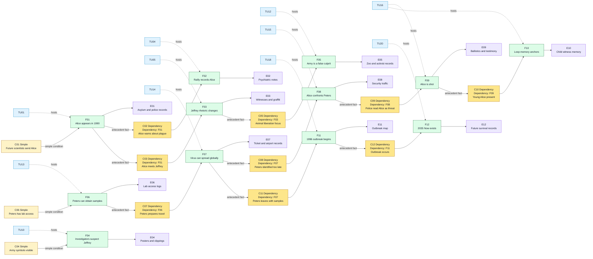

# Twelve Monkeys Case - Game Master Prep

This is a playtest case structure for **Causality**, based on the provided summary of *12 Monkeys*. It is written as Game Master preparation, not as player-facing text.

The scenario works best if the Investigators believe the mission is to stop the catastrophe, while the real playable objective is more precise: identify the true viral source and preserve a coherent Now.

For this simulated table, **Alice** is the **Loop Anchor Investigator**. **Bob**, **Charlie**, and **Dana** are the other Investigators active in the prepared Main Timeline. Alice replaces James Cole as the active figure inside the prepared Main Timeline. James Cole can be removed entirely, kept as an archived alias, or used only as a damaged future record depending on how closely the table wants to echo the source material.

## Scenario Premise

In the Now of 2035, humanity survives underground after a lethal virus emerged in 1996 and destroyed most of civilization. The future scientists have incomplete records. They know the name **Army of the 12 Monkeys**, they know Alice was already entangled with the past, and they know an airport is central to the loop.

The Investigators use the **System** to open the **Time Flow**, rewind **causality**, and test earlier **Atomic Time Units**. The **Main Timeline** prepared by the Game Master is not a neutral chronology: it is a closed causal trap where a false culprit hides the real carrier.

## Core Game Master Truth

- The Army of the 12 Monkeys is a false culprit.
- Jeffrey Goines is dangerous, unstable, and connected to the symbols, but his group mainly wants to free animals.
- Doctor Peters is the true viral carrier.
- Peters has access to the virus through the virology lab connected to Jeffrey's father.
- The airport event is a loop anchor: adult Alice is killed while young Alice watches.
- The original Now exists because the virus was released in 1996.
- If the final Main Timeline prevents the 1996 outbreak completely, the original Now is no longer coherent and the Investigators' reality is lost.

## Main Timeline

The **Time Flow** always has **20 Atomic Time Units**. The Game Master prepares the following **Main Timeline**. Players should not receive the hidden notes at first.

| Time Unit | Visible or Discoverable Event | Hidden GM Note |
|---|---|---|
| 1 | Alice appears in 1990 instead of the intended target year. | The System or future calculations are inaccurate. This creates psychiatric records tied to Alice. |
| 2 | Alice is interned in an asylum. | She meets Kathryn Railly and Jeffrey Goines. |
| 3 | Alice warns people about a future plague. | Her warnings look like delusions but leave useful testimony. |
| 4 | Railly records Alice as a patient with apocalyptic beliefs. | Her professional skepticism becomes later evidence. |
| 5 | Jeffrey leaves the asylum and radical ecological ideas grow around him. | Alice's presence helps shape the false trail. |
| 6 | Alice, Bob, Charlie, and Dana reach 1996 after a later System correction. | The full group is closer to the viral release window. |
| 7 | Bob and Dana pressure Railly to help the investigation while Alice remains the visible fugitive. | This creates police attention and damages the group's credibility. |
| 8 | Railly finds impossible links between Alice's claims, Charlie's archive checks, and Bob's security records. | She starts believing the causal loop is real. |
| 9 | Alice, Bob, Charlie, Dana, and Railly focus on the Army of the 12 Monkeys. | The false culprit becomes convincing. |
| 10 | Army of the 12 Monkeys symbols appear in public places. | These signs point to activism, not viral terrorism. |
| 11 | Jeffrey appears to be the responsible leader. | His father and the lab connection hide the real access route. |
| 12 | The Army prepares a public animal liberation action. | This action distracts from Peters. |
| 13 | Doctor Peters secures access to viral samples. | This is the real critical source point. |
| 14 | Peters prepares travel with the samples. | He can still be identified, delayed, or tracked. |
| 15 | Alice, Bob, Charlie, Dana, and Railly converge on the airport. | Their actions attract armed security. |
| 16 | Alice tries to stop Peters and is shot by airport police. | This is a loop anchor witnessed by young Alice. |
| 17 | Peters boards or reaches the departure chain with the samples. | Viral spread becomes global. |
| 18 | The 1996 outbreak begins and spreads beyond containment. | The catastrophe becomes historically locked. |
| 19 | By 2035, survivors live underground and use prisoners in experiments. | The future System exists because of the catastrophe. |
| 20 | Now: Alice, Bob, Charlie, and Dana receive the mission. | The current observable state must remain coherent at final merge. |

### Main Timeline Mermaid Graph

## Initial Player Briefing

Give the players only the following:

- The Now is 2035.
- A virus appeared in 1996 and destroyed surface civilization.
- The phrase "Army of the 12 Monkeys" appears repeatedly in damaged records.
- Alice appears to have already been sent into the past and became linked to the case.
- Kathryn Railly and Jeffrey Goines are recurring names.
- An airport memory appears in several corrupted files.
- The mission is to identify the original viral source and create a coherent path to a cure.

Do not tell them at first that Peters is the true carrier.

## Hidden Causal Table

Use two condition types:

- **Simple condition:** a required state of the world.
- **Dependency condition:** a required antecedent fact, written as `Dependency: Fxx`.

| ID | Condition Type | Conditions | Fact | Evidence |
|---|---|---|---|---|
| F01 | Simple | Future scientists send Alice with inaccurate coordinates. | Alice appears in 1990. | Arrest record, asylum intake form, police report. |
| F02 | Dependency | Dependency: F01. Alice speaks openly about the future plague. | Railly records Alice as delusional. | Psychiatric notes, lecture fragments, memory of interview. |
| F03 | Dependency | Dependency: F01. Alice meets Jeffrey in the asylum. | Jeffrey's activism becomes linked to apocalyptic language. | Witness statements, later graffiti, activist rhetoric. |
| F04 | Simple | Army of the 12 Monkeys symbols are visible in 1996. | The Investigators suspect Jeffrey's group. | Posters, photos, newspaper clippings. |
| F05 | Dependency | Dependency: F03. Jeffrey's group focuses on animal liberation. | The Army is not the viral release mechanism. | Zoo plan, animal transport records, activist manifestos. |
| F06 | Simple | Peters works near Jeffrey's father and has lab access. | Peters can obtain viral samples. | Lab access logs, badge records, sample inventory gap. |
| F07 | Dependency | Dependency: F06. Peters prepares air travel. | The virus can spread globally. | Ticket records, airport camera logs, baggage records. |
| F08 | Dependency | Dependency: F07. Alice, Bob, Charlie, Dana, and Railly identify Peters too late. | Alice confronts Peters at the airport. | Security radio traffic, eyewitness accounts. |
| F09 | Dependency | Dependency: F08. Police read Alice as the threat. | Alice is shot. | Ballistics, airport police statement, Railly's testimony. |
| F10 | Dependency | Dependency: F09. Young Alice is present at the airport. | The loop imprints Alice's death as a childhood memory. | Child witness description, recurring dream, future psych profile. |
| F11 | Dependency | Dependency: F07. Peters leaves with samples. | The 1996 outbreak begins. | Outbreak map, flight path, first infection cluster. |
| F12 | Dependency | Dependency: F11. The outbreak occurs. | The 2035 underground Now exists. | Future survival records, System archive, prisoner program. |

### Causal Table Mermaid Graph

## Key Characters

| Character | Public Role | Real Function |
|---|---|---|
| Alice | Loop Anchor Investigator sent by future scientists | Loop anchor and unreliable warning signal |
| Bob | Investigator operating under pressure in public spaces | Security reading, pursuit handling, airport route analysis |
| Charlie | Investigator analyzing System and archive records | Finds impossible links, corrupted records, and access logs |
| Dana | Investigator focused on witnesses and survival data | Tracks injuries, testimony, and cure-relevant evidence |
| Kathryn Railly | Psychiatrist | Credibility bridge between delusion and evidence |
| Jeffrey Goines | Unstable activist | False culprit and source of noisy evidence |
| Doctor Peters | Virologist | True carrier and viral release vector |
| Future Scientists | Mission controllers | Preserve the System and seek usable viral origin data |
| Young Alice | Child witness | Proof that Alice's airport death is part of the original Now |

## Evidence Deck

Use these as clue cards:

- 1990 asylum intake form for Alice.
- Railly's psychiatric notes.
- Photo of Army of the 12 Monkeys graffiti.
- Animal liberation flyer.
- Jeffrey interview or recorded rant.
- Lab access log with Peters' badge.
- Missing viral sample inventory.
- Airport ticket record under Peters' travel identity.
- Airport security report naming Alice as the armed threat.
- Child witness note describing Alice being shot.
- 2035 archive fragment: "Find the pure strain, not the slogan."

## False Leads

- The Army of the 12 Monkeys looks like the culprit because the name survives in future records.
- Jeffrey looks guilty because he is unstable, dramatic, and connected to the lab through his father.
- Alice looks dangerous because she pressures Railly and behaves like a violent fugitive.
- Railly looks unreliable because her belief changes after exposure to the Investigators.

## Recommended Branched Timeline Hooks

| Target Time Unit | Rewind Distance | Minimum Rewind Die | Useful Question |
|---|---:|---|---|
| 16 | 4 | d4 | Why does airport security shoot Alice? |
| 14 | 6 | d6 | Can Peters be identified before boarding? |
| 12 | 8 | d8 | What is the Army actually planning? |
| 10 | 10 | d10 | Why do the symbols point at Jeffrey? |
| 8 | 12 | d12 | When does Railly start believing Alice, Bob, Charlie, and Dana? |
| 1 | 19 | d20 | What did Alice's wrong arrival in 1990 create? |

## Conflict Rules for This Scenario

Minor conflicts:

- Railly believes too early or too late.
- Jeffrey is exposed as harmless before the group has enough proof.
- Police attention shifts onto an Investigator.
- An animal liberation event happens at the wrong Time Unit.

Major conflicts:

- Peters is arrested before acquiring the samples without another cause preserving the outbreak.
- Alice survives the airport shooting without a replacement loop anchor.
- Young Alice does not witness the airport death.
- The 1996 outbreak is prevented completely.
- The 2035 System no longer has a coherent reason to exist.

## Merge Requirements

For a complete convergence ending, the final Main Timeline should preserve these facts:

1. A virus still emerges in 1996.
2. Doctor Peters is identified as the true carrier.
3. The Army of the 12 Monkeys is understood as a false culprit.
4. Alice's airport death remains coherent, or an equally strong loop anchor replaces it.
5. The 2035 Now remains possible.
6. The Investigators recover enough origin data to support a cure effort.

## Possible Endings

Complete convergence:

- The Investigators identify Peters, preserve the Now, and return origin data to 2035.

Incomplete convergence:

- The Army is cleared, but Peters is not fully proven or the viral source is incomplete.

Psychological divergence:

- One or more Investigators remember a prevented outbreak that cannot exist in the final Now.

Causal rupture:

- The outbreak is fully prevented, Alice's loop collapses, and the 2035 Now becomes incoherent.
