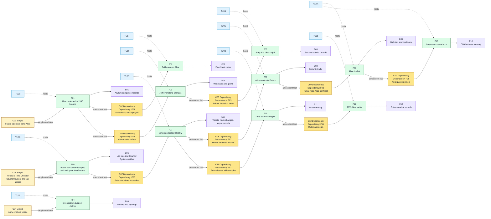
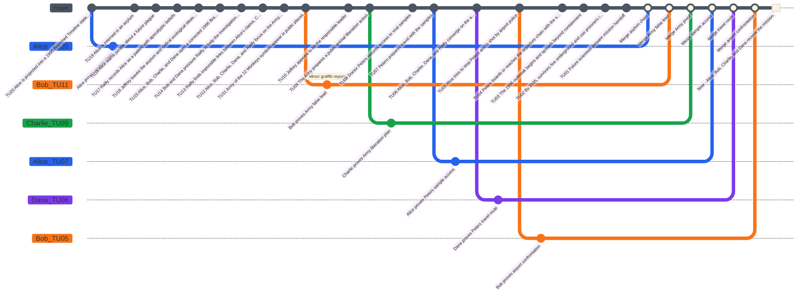
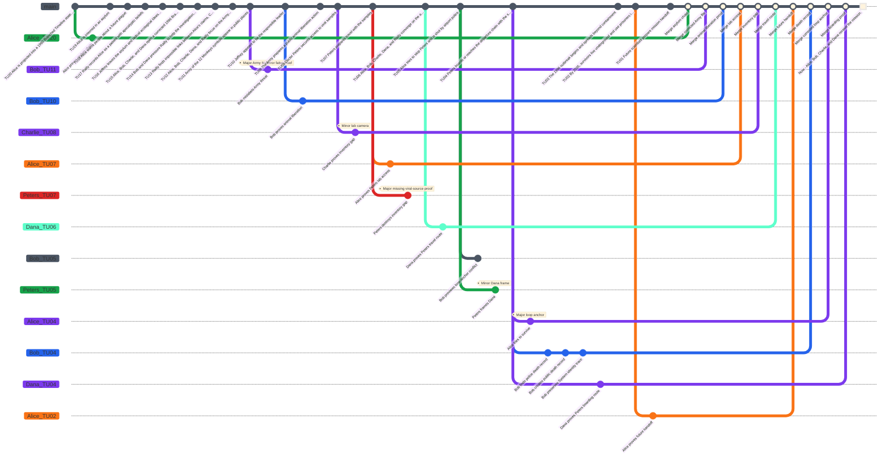

# Twelve Monkeys Case - Game Master Prep

This is a playtest case structure for **Causality**, based on the provided summary of *12 Monkeys*. It is written as Game Master preparation, not as player-facing text.

The scenario works best if the Investigators believe the mission is to stop the catastrophe, while the real playable objective is more precise: identify the true viral source, expose the **Time Offender**, and preserve a coherent Now.

For this simulated table, **Alice** is the **Loop Anchor Investigator**. **Bob**, **Charlie**, and **Dana** are the other Investigators active in the prepared Main Timeline. Alice replaces James Cole as the active figure inside the prepared Main Timeline. James Cole can be removed entirely, kept as an archived alias, or used only as a damaged future record depending on how closely the table wants to echo the source material.

## Scenario Premise

In the Now of 2035, humanity survives underground after a lethal virus emerged in 1996 and destroyed most of civilization. The future scientists have incomplete records. They know the name **Army of the 12 Monkeys**, they know Alice was already entangled with the past, and they know an airport is central to the loop.

The Investigators use the **System** to open the **Time Flow**, rewind **causality**, and test earlier **Atomic Time Units**. The **Main Timeline** prepared by the Game Master is not a neutral chronology: it is a closed causal trap where a false culprit hides the real carrier. That carrier, Doctor Peters, is not merely a historical virologist. He is a **Time Offender** from the Now who uses a rival **Counter-System** to protect his own version of causality.

## Core Game Master Truth

- The Army of the 12 Monkeys is a false culprit.
- Jeffrey Goines is dangerous, unstable, and connected to the symbols, but his group mainly wants to free animals.
- Doctor Peters is the true viral carrier and the source of the causal problem.
- Peters is a **Time Offender** from the Now. He has access to a **Counter-System**, an equivalent of the System used by the Investigators.
- Peters knows that Investigators exist, but he does not know their identities at the start of play.
- Peters can identify Investigators during play when they act with information, timing, or behavior that would be abnormal for a non-time-aware person.
- Peters has access to the virus through the virology lab connected to Jeffrey's father, and he uses temporal knowledge to protect that access.
- The airport event is a loop anchor: adult Alice is killed while young Alice watches.
- The original Now exists because the virus was released in 1996.
- If the final Main Timeline prevents the 1996 outbreak completely, the original Now is no longer coherent and the Investigators' reality is lost.

## Main Timeline

The **Time Flow** has **20 Atomic Time Units** numbered from **Time Unit 20** as the oldest prepared event to **Time Unit 1** as the latest prepared event before the present. **Now** is **Time Unit 0**. The Game Master prepares the following **Main Timeline**. Players should not receive the hidden notes at first.

| Time Unit | Visible or Discoverable Event | Hidden GM Note |
|---|---|---|
| 20 | Alice is projected into a 1990 Branched Timeline state instead of the intended target year. | The System or future calculations are inaccurate. This creates psychiatric records tied to Alice in the replayed causal state. |
| 19 | Alice is interned in an asylum. | She meets Kathryn Railly and Jeffrey Goines. |
| 18 | Alice warns people about a future plague. | Her warnings look like delusions but leave useful testimony. |
| 17 | Railly records Alice as a patient with apocalyptic beliefs. | Her professional skepticism becomes later evidence. |
| 16 | Jeffrey leaves the asylum and radical ecological ideas grow around him. | Alice's presence helps shape the false trail. |
| 15 | Alice, Bob, Charlie, and Dana open a corrected 1996 Branched Timeline after a later System correction. | The full group is closer to the viral release window. |
| 14 | Bob and Dana pressure Railly to help the investigation while Alice remains the visible fugitive. | This creates police attention and damages the group's credibility. |
| 13 | Railly finds impossible links between Alice's claims, Charlie's archive checks, and Bob's security records. | She starts believing the causal loop is real. |
| 12 | Alice, Bob, Charlie, Dana, and Railly focus on the Army of the 12 Monkeys. | The false culprit becomes convincing. |
| 11 | Army of the 12 Monkeys symbols appear in public places. | These signs point to activism, not viral terrorism. |
| 10 | Jeffrey appears to be the responsible leader. | His father and the lab connection hide the real access route. |
| 9 | The Army prepares a public animal liberation action. | This action distracts from Peters. |
| 8 | Doctor Peters secures access to viral samples. | Peters is a Time Offender from the Now. His Counter-System tells him this is the critical source point. |
| 7 | Peters prepares travel with the samples. | He watches for abnormal behavior and may identify Investigators if they expose future knowledge. |
| 6 | Alice, Bob, Charlie, Dana, and Railly converge on the airport. | Their actions attract armed security. |
| 5 | Alice tries to stop Peters and is shot by airport police. | This is a loop anchor witnessed by young Alice. |
| 4 | Peters boards or reaches the departure chain with the samples. | His Counter-System protects this departure path unless the Investigators expose him without breaking the Now. |
| 3 | The 1996 outbreak begins and spreads beyond containment. | The catastrophe becomes historically locked. |
| 2 | By 2035, survivors live underground and use prisoners in experiments. | The future System exists because of the catastrophe. |
| 1 | Future scientists prepare the mission handoff. | This is the final prepared causal state before the observable Now. |
| 0 | Now: Alice, Bob, Charlie, and Dana receive the mission. | The current observable state must remain coherent at final merge. |

### Main Timeline Mermaid Graph


## Initial Player Briefing

Give the players only the following:

- The Now is 2035.
- A virus appeared in 1996 and destroyed surface civilization.
- The phrase "Army of the 12 Monkeys" appears repeatedly in damaged records.
- Alice appears to have already been projected into an earlier Branched Timeline and became linked to the case.
- Kathryn Railly and Jeffrey Goines are recurring names.
- An airport memory appears in several corrupted files.
- The mission is to identify the original viral source and create a coherent path to a cure.

Do not tell them at first that Peters is the true carrier or that a Time Offender is active in the case.

## Hidden Causal Table

Use two condition types:

- **Simple condition:** a required state of the world.
- **Dependency condition:** a required antecedent fact, written as `Dependency: Fxx`.

| ID | Condition Type | Conditions | Fact | Evidence |
|---|---|---|---|---|
| F01 | Simple | Future scientists activate the System with inaccurate target coordinates. | Alice is projected into a 1990 Branched Timeline state. | Arrest record, asylum intake form, police report. |
| F02 | Dependency | Dependency: F01. Alice speaks openly about the future plague. | Railly records Alice as delusional. | Psychiatric notes, lecture fragments, memory of interview. |
| F03 | Dependency | Dependency: F01. Alice meets Jeffrey in the asylum. | Jeffrey's activism becomes linked to apocalyptic language. | Witness statements, later graffiti, activist rhetoric. |
| F04 | Simple | Army of the 12 Monkeys symbols are visible in 1996. | The Investigators suspect Jeffrey's group. | Posters, photos, newspaper clippings. |
| F05 | Dependency | Dependency: F03. Jeffrey's group focuses on animal liberation. | The Army is not the viral release mechanism. | Zoo plan, animal transport records, activist manifestos. |
| F06 | Simple | Peters is a Time Offender from the Now, uses a Counter-System, and works near Jeffrey's father with lab access. | Peters can obtain viral samples and anticipate temporal interference. | Lab access logs, badge records, sample inventory gap, Counter-System residue. |
| F07 | Dependency | Dependency: F06. Peters prepares air travel while monitoring for abnormal behavior. | The virus can spread globally. | Ticket records, airport camera logs, baggage records, route changes after anomalies. |
| F08 | Dependency | Dependency: F07. Alice, Bob, Charlie, Dana, and Railly identify Peters too late. | Alice confronts Peters at the airport. | Security radio traffic, eyewitness accounts. |
| F09 | Dependency | Dependency: F08. Police read Alice as the threat. | Alice is shot. | Ballistics, airport police statement, Railly's testimony. |
| F10 | Dependency | Dependency: F09. Young Alice is present at the airport. | The loop imprints Alice's death as a childhood memory. | Child witness description, recurring dream, future psych profile. |
| F11 | Dependency | Dependency: F07. Peters leaves with samples. | The 1996 outbreak begins. | Outbreak map, flight path, first infection cluster. |
| F12 | Dependency | Dependency: F11. The outbreak occurs. | The 2035 underground Now exists. | Future survival records, System archive, prisoner program. |

### Causal Table Mermaid Graph



## Key Characters

| Character | Public Role | Real Function |
|---|---|---|
| Alice | Loop Anchor Investigator sent by future scientists | Loop anchor and unreliable warning signal |
| Bob | Investigator operating under pressure in public spaces | Security reading, pursuit handling, airport route analysis |
| Charlie | Investigator analyzing System and archive records | Finds impossible links, corrupted records, and access logs |
| Dana | Investigator focused on witnesses and survival data | Tracks injuries, testimony, and cure-relevant evidence |
| Kathryn Railly | Psychiatrist | Credibility bridge between delusion and evidence |
| Jeffrey Goines | Unstable activist | False culprit and source of noisy evidence |
| Doctor Peters | Virologist | Time Offender, true carrier, and viral release vector |
| Future Scientists | Mission controllers | Preserve the System and seek usable viral origin data |
| Young Alice | Child witness | Proof that Alice's airport death is part of the original Now |

### Doctor Peters as Time Offender

Doctor Peters is the active temporal enemy controlled by the GM. He comes from the Now and uses a **Counter-System**, a rival equivalent of the System. He is not omniscient: he begins the scenario knowing that Investigators may interfere with his plan, but he does not know who they are.

Track Peters with three awareness states:

| Awareness State | Trigger | GM Use |
|---|---|---|
| Unaware of identities | Start of play. Peters only knows Investigators exist. | He follows the prepared Main Timeline and protects his sample access. |
| Alerted | An Investigator creates visible evidence, causes premature security attention, or uses knowledge no local person should have. | He changes routes, destroys mundane evidence, or frames the anomaly as madness or crime. |
| Identified target | Peters directly connects a name, face, or behavior to temporal interference. | He avoids that Investigator, redirects security toward them, or uses the Counter-System to preserve his departure path. |

Peters should pressure the table without becoming impossible to beat. His Counter-System can:

- notice abnormal timing, impossible records, and repeated names across Branched Timelines;
- move Peters to a nearby route, gate, lab corridor, or witness chain;
- erase or contaminate one piece of evidence unless the branch is Merged cleanly;
- create a minor conflict by making an Investigator look unstable, criminal, or dangerous;
- create a major conflict only if the Investigators try to prevent the outbreak completely before preserving a coherent Now.

Peters has one Counter-System Rewind Dice set: d4, d6, d8, d10, d12, and d20. These dice are single-use. Mundane actions such as walking, lying, calling security, or hiding paperwork do not spend Counter-System energy. Any action that rewinds causality, rewrites a route, contaminates Evidence across a Branched Timeline, or applies memory pressure must spend the smallest available Counter-System Rewind Die that can reach the affected Time Unit.

Once Peters has an **Identified target**, he can take one **Time Offender action** during each GM turn against one identified Investigator. The action must increase pressure on the Investigator's Main Timeline coherence; it should not simply deal damage. If the action uses the Counter-System, mark the spent Counter-System Rewind Die immediately. If Peters has no suitable die left, he can only act through ordinary historical means.

| Time Offender Action | Mechanical Effect | Fictional Example |
|---|---|---|
| Frame the Investigator | Add one unresolved minor conflict to that Investigator. | Peters makes the Investigator appear to be a hoax caller, trespasser, or violent suspect. |
| Escalate an unresolved conflict | Upgrade one unresolved minor conflict into one major conflict. | Peters uses the Counter-System to make security records prove the Investigator caused the crisis. |
| Drain table energy | Force the group to choose: spend a usable Rewind Die for a corrective Branched Timeline, or keep the added conflict. | Peters moves the samples to a route that only a new branch can verify. |
| Contaminate evidence | One clue cannot support a merge until an Investigator resolves a minor conflict. | Lab logs now contradict the airport ticket unless someone restores the causal chain. |
| Attack sanity through memory | Add one temporary Willpower penalty of `-5` until the next clean merge. | The Investigator remembers two incompatible versions of the same Time Unit. |

Peters' goal is to make Investigators fall into madness through accumulated conflicts or spend all their Rewind Dice before they can complete the mission.

## Character Stats and Rewind Dice

For this first simulation, every Investigator is a baseline human:

- maximum Willpower: `100`;
- starting current Willpower: `100`;
- Health: `10`;
- one classic D&D dice set;
- Rewind Dice are single-use: each d4, d6, d8, d10, d12, and d20 can be spent once.

NPCs never consume Rewind Dice in this preparation. Their Willpower is calculated from the Branched Timelines they have experienced, witnessed, or been causally exposed to in the story:

```text
NPC current Willpower = 100 - (30 x relevant Branched Timelines)
```

Their Health is calculated only from physical damage confirmed by the story:

```text
NPC current Health = 10 - confirmed story damage
```

If the Main Timeline or a Branched Timeline does not show an NPC being harmed, that NPC stays at 10 Health.

Unresolved conflicts affecting the NPC can also apply the normal Willpower modifier if the Game Master needs that pressure in play.

### Investigators

| Investigator | Role | Max Willpower | Current Willpower | Health | Rewind Dice Available | Rewind Dice Spent |
|---|---|---:|---:|---:|---|---|
| Alice | Loop Anchor Investigator | 100 | 100 | 10 | d4, d6, d8, d10, d12, d20 | None |
| Bob | Security and pursuit reading | 100 | 100 | 10 | d4, d6, d8, d10, d12, d20 | None |
| Charlie | System and archive analysis | 100 | 100 | 10 | d4, d6, d8, d10, d12, d20 | None |
| Dana | Witnesses, injuries, survival data | 100 | 100 | 10 | d4, d6, d8, d10, d12, d20 | None |

### NPCs

| NPC | Role | Relevant Branched Timelines | Max Willpower | Current Willpower | Story Health Calculation | Current Health |
|---|---|---:|---:|---:|---|---:|
| Kathryn Railly | Psychiatrist and credibility bridge | 2 | 100 | 40 | No confirmed injury in the prepared Main Timeline | 10 |
| Jeffrey Goines | False culprit and activist signal | 1 | 100 | 70 | No confirmed injury in the prepared Main Timeline | 10 |
| Doctor Peters | Time Offender, true carrier, and viral release vector | 3 | 100 | 10 | No confirmed injury in the prepared Main Timeline | 10 |
| Future Scientists | Mission controllers in 2035 | 0 | Not tracked | Not tracked | Not physically present in tracked scenes | Not tracked |
| Young Alice | Child witness and loop anchor evidence | 1 | 100 | 70 | Witnesses the shooting but is not physically harmed | 10 |
| Airport Police | Armed opposition at the airport | 0 | 100 | 100 | No confirmed injury unless the Investigators harm them in play | 10 each |

### Counter-System Rewind Dice Tracker

Doctor Peters uses this tracker only in the advanced version with Time Offender pressure.

| Time Offender | d4 | d6 | d8 | d10 | d12 | d20 |
|---|---|---|---|---|---|---|
| Doctor Peters | available | available | available | available | available | available |

### Rewind Dice Tracker

Use this table during the first simulation. Mark a die as spent immediately when an Investigator opens a Branched Timeline with it.

| Investigator | d4 | d6 | d8 | d10 | d12 | d20 |
|---|---|---|---|---|---|---|
| Alice | Available | Available | Available | Available | Available | Available |
| Bob | Available | Available | Available | Available | Available | Available |
| Charlie | Available | Available | Available | Available | Available | Available |
| Dana | Available | Available | Available | Available | Available | Available |

## Starter Playthrough - Without Time Offender

Use this version first when teaching the scenario. Doctor Peters is only the historical viral carrier. Ignore the Counter-System, Time Offender awareness states, and Time Offender actions.

For the starter version, replace the complete Peters facts locally:

| Complete element | Starter replacement |
|---|---|
| F06 Condition | Peters works near Jeffrey's father and has lab access. |
| F06 Fact | Peters can obtain viral samples. |
| F06 Evidence | Lab access logs, badge records, and sample inventory gap. |
| F07 Condition | Dependency: F06. Peters prepares air travel with the samples. |
| F07 Fact | The virus can spread globally. |
| F07 Evidence | Ticket records, airport camera logs, and baggage records. |
| Doctor Peters NPC pressure | Do not use Time Offender Willpower pressure or Counter-System actions. |

This starter replay was recalculated under the **Time Unit 20** to **Time Unit 0 / Now** convention. Every Rewind roll uses `distance = target Time Unit`.

### Starter Replay Log

**GM turn.** The GM opens the Time Flow and states that Doctor Peters is only a historical carrier in this version.

**Alice turn.** Alice spends her d20 to target Time Unit `20`. The replay result is `d20 -> 11`, so `r = 55%`: partial success. Consequence `d10 -> 4`: wrong entry point. Alice reaches the wrong asylum wing but still proves the asylum/Railly opening chain. Willpower `70`.

**Bob turn.** Bob spends his d12 to target Time Unit `11`. The replay result is `d12 -> 6`, so `r = 54.55%`: partial success. Consequence `d10 -> 8`: minor conflict. Bob proves the Army false lead, but a police report identifies an Investigator near the graffiti. Willpower `50`.

**Charlie turn.** Charlie spends his d10 to target Time Unit `13`. The replay result is `d10 -> 2`, so `r = 15.38%`: critical failure. No branch opens and no gain is rolled. Willpower `100`.

**Dana turn.** Dana spends her d8 to target Time Unit `9`. The replay result is `d8 -> 1`, so `r = 11.11%`: critical failure. No branch opens and no gain is rolled. Willpower `100`.

**GM turn.** The GM states the dependencies: Peters' sample access must precede the travel route, and the Army must still be cleared with stable Evidence.

**Alice turn.** Alice spends her d12 to target Time Unit `7`. The replay result is `d12 -> 12`, so `r = 171.43%`: critical success. The branch proves lab badge, inventory gap, and sample access. Alice merges this branch with her asylum branch. Willpower returns to `100`.

**Bob turn.** Bob spends his d10 to target Time Unit `5`. The replay result is `d10 -> 7`, so `r = 140%`: critical success. The branch proves Alice rushing Peters, airport police firing, and young Alice witnessing the event. Bob tries to resolve his graffiti conflict: Willpower `50`, threshold `50`, percentile `40`, failure. The conflict remains open and Willpower stays `50`.

**Charlie turn.** Charlie spends his d8 to target Time Unit `9` and retry the Army's real plan. The replay result is `d8 -> 2`, so `r = 22.22%`: partial failure. No branch opens. Gain `d10 -> 1`: Evidence sensory detail. The GM describes cages, animal noise, and liberation tools. Willpower `100`.

**Dana turn.** Dana spends her d12 to target Time Unit `6`. The replay result is `d12 -> 8`, so `r = 133.33%`: critical success. The branch proves that Peters can carry samples toward air travel. Willpower `70`.

**GM turn.** The GM warns that the Army is not cleared strongly enough. Peters is identified, but the false culprit remains unstable.

**Charlie turn.** Charlie spends his d12 to target Time Unit `9` for one final attempt. The replay result is `d12 -> 7`, so `r = 77.78%`: partial success. The new consequence roll is `d10 -> 4`: wrong entry point. Charlie starts away from the zoo route but still proves the Army plans animal liberation, not viral release. The branch merges. Willpower returns to `100`.

**Bob turn.** Bob retries the unresolved graffiti conflict. His Willpower is `50`, threshold `50`, and the percentile roll is `80`. The test succeeds. The police report becomes an anonymous trespass report and Bob's branch can merge.

**Final GM resolution.** Airport Police use lethal weapons, so the GM rolls `d10` damage. The replay result is `d10 -> 1`. Alice loses `1` Health and survives with `9`. The investigators identify Peters and clear the Army, but the prepared Main Timeline required Alice's airport death as the loop anchor. The ending is **causal rupture**.

### Starter Scenario GitGraph

In this GitGraph, every white point on the `main` branch corresponds to a merge on the Now. The white square represents the Now itself.



### Starter Final Play State

| Investigator | Final Willpower | Final Health | Rewind Dice Spent | Open Conflicts | Final State |
|---|---:|---:|---|---:|---|
| Alice | 100 | 9 | d20, d12 | 0 | Alive; loop anchor broken |
| Bob | 100 | 10 | d12, d10 | 0 | Returns with Army and airport evidence |
| Charlie | 100 | 10 | d10, d8, d12 | 0 | Returns with final false-culprit proof after one failed attempt |
| Dana | 100 | 10 | d8, d12 | 0 | Returns with Peters travel evidence |

### Starter Player Statistics

| Investigator | Total Branched Timelines | Merged Branched Timelines | Open Branched Timelines | Minor Conflicts Created | Minor Conflicts Resolved | Major Conflicts Created | Major Conflicts Resolved | Rewind Dice Spent | Rewind Dice Full Successes | Rewind Dice Partial Successes | Rewind Dice Partial Failures | Rewind Dice Full Failures | Willpower Tests | Willpower Test Successes | Lowest Willpower | Final Health |
|---|---:|---:|---:|---:|---:|---:|---:|---:|---:|---:|---:|---:|---:|---:|---:|---:|
| Alice | 2 | 2 | 0 | 0 | 0 | 0 | 0 | 2 | 1 | 1 | 0 | 0 | 0 | 0 | 70 | 9 |
| Bob | 2 | 2 | 0 | 1 | 1 | 0 | 0 | 2 | 1 | 1 | 0 | 0 | 2 | 1 | 50 | 10 |
| Charlie | 1 | 1 | 0 | 0 | 0 | 0 | 0 | 3 | 0 | 1 | 1 | 1 | 0 | 0 | 70 | 10 |
| Dana | 1 | 1 | 0 | 0 | 0 | 0 | 0 | 2 | 1 | 0 | 0 | 1 | 0 | 0 | 70 | 10 |
| **Total** | **6** | **6** | **0** | **1** | **1** | **0** | **0** | **9** | **3** | **3** | **1** | **2** | **2** | **1** | **50** | **39** |

## Complete Playthrough - With Time Offender

Use this version after the starter replay. It intentionally demonstrates the full rules surface: all four Rewind outcomes, forced teaching dice values where needed, partial-success consequences, partial-failure gains, Minor Conflicts, Major Conflicts, Willpower tests, madness at zero Willpower, damage rolls, Time Offender awareness, and Counter-System actions. The Counter-System uses the same `distance = target Time Unit` rule as the Investigators.

### Complete Replay Log

**GM turn.** The GM opens the Time Flow and secretly marks Doctor Peters as a Time Offender with a Counter-System. Peters starts **Unaware**. The GM reminds the table that the hidden causal dependencies are: Army false lead before airport focus, Peters' sample access before his travel route, and Alice's airport death before the 2035 loop anchor.

**Alice turn.** Alice spends her d20 to target Time Unit `20`. Forced teaching value: `d20 -> 18`, so `r = 90%`: critical success. Alice proves the asylum/Railly opening chain. One non-Merged branch gives `100 - 30 = 70` Willpower.

**Bob turn.** Bob spends his d12 to target Time Unit `11`. Forced teaching value: `d12 -> 6`, so `r = 54.55%`: partial success. Forced consequence `d10 -> 10`: major conflict. Bob proves the Army graffiti, but his first action makes an official police file identify the Army as a bioterror cell. The branch opens, but the merge is blocked until the table creates a corrective cause. Bob's pressure is one non-Merged branch and one unresolved Major Conflict: `100 - 30 - 40 = 30` Willpower.

**Charlie turn.** Charlie spends his d10 to target Time Unit `13`. Forced teaching value: `d10 -> 4`, so `r = 30.77%`: partial failure. No stable Branched Timeline opens and the d10 is spent. Forced gain `d10 -> 7`: Time Offender trace. The GM reveals a route-change trace tied to Peters' travel preparation. Charlie stays at `100` Willpower because no branch opened.

**Dana turn.** Dana spends her d8 to target Time Unit `9`. Forced teaching value: `d8 -> 1`, so `r = 11.11%`: critical failure. No branch opens, no gain is rolled, and the d8 is spent. Dana stays at `100` Willpower.

**GM turn.** Peters notices the System pressure around the Army false lead and becomes **Alerted**, but he has not identified an Investigator yet. The GM does not spend a Counter-System die this turn.

**Alice turn.** Alice spends her d12 to target Time Unit `7`. Forced teaching value: `d12 -> 7`, so `r = 100%`: critical success. She proves Peters' lab access, badge use, and inventory gap. The GM accepts merges for Alice's asylum chain and sample-access branch because they preserve the Main Timeline dependencies. Alice returns to `100` Willpower.

**Bob turn.** Bob spends his d10 to target Time Unit `10` and correct his Major Conflict. Forced teaching value: `d10 -> 8`, so `r = 80%`: critical success. Bob proves that Jeffrey's group publicly prepares animal liberation, not viral release. This creates the missing corrective cause, resolves the Major Conflict, and allows Bob's Army branch to merge. Bob returns to `100` Willpower.

**Charlie turn.** Charlie spends his d8 to target Time Unit `8`. Forced teaching value: `d8 -> 5`, so `r = 62.5%`: partial success. Forced consequence `d10 -> 8`: minor conflict. Charlie proves the inventory gap, but a lab camera places him near the sample freezer. Charlie's pressure is one non-Merged branch and one unresolved Minor Conflict: `100 - 30 - 20 = 50` Willpower.

**Dana turn.** Dana spends her d12 to target Time Unit `6`. Forced teaching value: `d12 -> 3`, so `r = 50%`: partial success. Forced consequence `d10 -> 3`: pursuit. Dana proves Peters' airport route, but security chases her. The GM rolls only damage when a guard hits Dana with a nonlethal baton: `d6 -> 4`. Dana drops from `10` to `6` Health. Peters sees the abnormal intervention and identifies Dana. Dana has one non-Merged branch: `100 - 30 = 70` Willpower.

**GM turn.** Peters uses the Counter-System against Dana. He spends his Counter-System d8 to target Time Unit `5`. Forced teaching value: `d8 -> 3`, so `r = 60%`: partial success. Forced consequence `d10 -> 8`: minor conflict. Peters frames Dana's security call as coordination with Alice's airport rush. Dana's pressure is one non-Merged branch and one unresolved Minor Conflict: `100 - 30 - 20 = 50` Willpower.

**Alice turn.** Alice spends her d6 to target Time Unit `5` and reach the airport confrontation. Forced teaching value: `d6 -> 3`, so `r = 60%`: partial success. Forced consequence `d10 -> 6`: the branch opens closer to the Now than planned. The target moves from Time Unit `5` to Time Unit `2`, because `5 - 3 = 2`. Alice misses the airport but proves the future-scientist handoff in 2035. One non-Merged branch gives `70` Willpower.

**Bob turn.** Bob spends his d6 to target Time Unit `5` and force a clean airport stop. Forced teaching value: `d6 -> 2`, so `r = 40%`: partial failure. No branch opens. Forced gain `d10 -> 9`: conflict preview. The GM warns that forcing Alice to survive the shooting would create a Major Conflict with the loop anchor.

**Charlie turn.** Charlie tries to resolve the lab-camera Minor Conflict at average difficulty. His current Willpower is `50`, threshold `50`, and the percentile roll is forced to `40`. The roll fails, so the camera still identifies him and his branch cannot merge. Charlie remains at `50` Willpower.

**Dana turn.** Dana tries to resolve Peters' frame at difficult difficulty because Peters actively controls the security report. Dana's current Willpower is `50`; difficult effective Willpower is `25`, threshold `75`. The percentile roll is forced to `80`, so the test succeeds. The report becomes an anonymous alert instead of a Dana identification. Dana's branch can merge and she rises to `100` Willpower.

**GM turn.** Peters escalates. He spends his Counter-System d12 to target Time Unit `7`. Forced teaching value: `d12 -> 6`, so `r = 85.71%`: critical success. Peters opens a branch that destroys the inventory gap before Alice can use it. This creates **Major missing viral-source proof**, a Major Conflict that blocks final convergence until the Investigators create replacement Evidence.

**Alice turn.** Alice spends her d4 to target Time Unit `4` and tries to save her adult self from the airport shooting. Forced teaching value: `d4 -> 2`, so `r = 50%`: partial success. Forced consequence `d10 -> 10`: major conflict. The branch opens, but Alice's first action breaks the loop anchor: if adult Alice survives cleanly, young Alice never witnesses the death that shaped the 2035 mission. Alice now has two non-Merged branches and one unresolved Major Conflict: `100 - 60 - 40 = 0`. At the end of her turn, Alice falls into madness and can no longer maintain coherence with the observable Now.

**Bob turn.** Bob spends his d4 to target Time Unit `4`. Forced teaching value: `d4 -> 4`, so `r = 100%`: critical success. This branch is used to show that one Branched Timeline can produce several Visible or Discoverable Events before it is Merged. First, Bob enters the airport security archive and finds the original police death record. Second, he creates a corrective public record proving that adult Alice died at the airport. Third, he preserves a System identity trace explaining why the 2035 Investigators still receive the mission. These three events are recorded as separate commits on the same branch in the GitGraph. Together, they resolve Alice's loop-anchor Major Conflict. Because Bob supplied the missing corrective cause, the GM can now merge Alice's previous `Alice_TU04` branch even though that branch originally carried a Major Conflict. Alice remains mad and cannot act again; the merge fixes branch coherence, not the already-triggered zero-Willpower state.

**Charlie turn.** Charlie tries the lab-camera Minor Conflict again, now at very difficult difficulty because Peters has attacked the evidence chain. Charlie's current Willpower is `50`; very difficult effective Willpower is `12` after truncation, threshold `88`. The percentile roll is forced to `90`, so the test succeeds. The camera record becomes incomplete, the inventory-gap branch merges, and Charlie returns to `100` Willpower.

**Dana turn.** Dana spends her d10 to target Time Unit `4`. Forced teaching value: `d10 -> 8`, so `r = 200%`: critical success. Dana proves the final boarding route and ties Peters to the samples through ticket, camera, and baggage Evidence. Her branch merges.

**Final GM resolution.** Airport Police use lethal weapons against Alice. No attack roll is made; only damage is rolled. Forced damage value: `d10 -> 10`. Alice's Health drops from `10` to `0`, so she is removed from the scene and dies at the airport. The loop anchor is preserved, the Army is cleared, Peters is identified as the viral carrier and Time Offender, and the final Now remains coherent. The ending is **complete convergence with one Investigator lost**.

### Complete Scenario GitGraph

In this GitGraph, every white point on the `main` branch corresponds to a merge on the Now. The white square represents the Now itself.



### Complete Final Play State

| Investigator | Final Willpower | Final Health | Rewind Dice Spent | Open Conflicts | Final State |
|---|---:|---:|---|---:|---|
| Alice | 0 | 0 | d20, d12, d6, d4 | 0 | Falls into madness, then dies preserving the loop anchor |
| Bob | 100 | 10 | d12, d10, d6, d4 | 0 | Resolves the Army Major Conflict and the public death record |
| Charlie | 100 | 10 | d10, d8 | 0 | Resolves the lab-camera Minor Conflict and restores inventory Evidence |
| Dana | 100 | 6 | d8, d12, d10 | 0 | Survives pursuit and proves Peters' final route |

### Complete Player Statistics

Use this table to analyze how the mechanics behaved during the complete playthrough.

| Investigator | Total Branched Timelines | Merged Branched Timelines | Open Branched Timelines | Minor Conflicts Created | Minor Conflicts Resolved | Major Conflicts Created | Major Conflicts Resolved | Rewind Dice Spent | Rewind Dice Full Successes | Rewind Dice Partial Successes | Rewind Dice Partial Failures | Rewind Dice Full Failures | Consequence Rolls | Gain Rolls | Willpower Tests | Willpower Test Successes | Lowest Willpower | Final Health |
|---|---:|---:|---:|---:|---:|---:|---:|---:|---:|---:|---:|---:|---:|---:|---:|---:|---:|---:|
| Alice | 4 | 4 | 0 | 0 | 0 | 1 | 1 | 4 | 2 | 2 | 0 | 0 | 2 | 0 | 0 | 0 | 0 | 0 |
| Bob | 3 | 3 | 0 | 0 | 0 | 1 | 1 | 4 | 2 | 1 | 1 | 0 | 1 | 1 | 0 | 0 | 30 | 10 |
| Charlie | 1 | 1 | 0 | 1 | 1 | 0 | 0 | 2 | 0 | 1 | 1 | 0 | 1 | 1 | 2 | 1 | 50 | 10 |
| Dana | 2 | 2 | 0 | 1 | 1 | 0 | 0 | 3 | 1 | 1 | 0 | 1 | 1 | 0 | 1 | 1 | 50 | 6 |
| **Total** | **10** | **10** | **0** | **2** | **2** | **2** | **2** | **13** | **5** | **5** | **2** | **1** | **5** | **2** | **3** | **2** | **0** | **26** |

Counter-System statistics:

| Time Offender | Counter-System Dice Spent | Stable branches opened | Minor conflicts created | Major conflicts created | Critical successes | Partial successes | Partial failures | Critical failures | Final Counter-System note |
|---|---:|---:|---:|---:|---:|---:|---:|---:|---|
| Doctor Peters | d8, d12 | 2 | 1 | 1 | 1 | 1 | 0 | 0 | Identifies Dana, frames her, then attacks the inventory Evidence before being defeated by replacement proof. |

### Complete Mechanics Coverage

| Mechanic | Where it is played |
|---|---|
| Main Timeline vs hidden causal table | The GM reveals only playable Facts while keeping Peters' Time Offender truth hidden until Evidence exposes it |
| Simple Condition | Alice proves asylum access, Bob proves Army symbols, and Dana proves Peters' travel route |
| Dependency Condition | Alice must prove sample access before Dana can prove the travel route; Bob must prove animal liberation before the Army file can merge |
| Evidence-driven merge | Badge logs, inventory gap, ticket records, camera records, and baggage records justify merges |
| Critical Rewind success | Alice `d20 -> 18`, Bob `d10 -> 8`, Dana `d10 -> 8` |
| Partial Rewind success | Bob `d12 -> 6`, Charlie `d8 -> 5`, Alice `d6 -> 3`, Alice `d4 -> 2` |
| Partial Rewind failure with gain | Charlie `d10 -> 4` with gain `7`; Bob `d6 -> 2` with gain `9` |
| Critical Rewind failure | Dana `d8 -> 1` |
| Negative consequence table | Consequences `3`, `6`, `8`, and `10` are used in play |
| Minor Conflict | Charlie's lab camera and Peters' frame against Dana |
| Major Conflict | Bob's false Army proof and Alice's loop-anchor break |
| Major Conflict correction | Bob creates animal-liberation proof and a public death record |
| Cross-player Major Conflict correction | Bob's `Bob_TU04` branch resolves Alice's `Alice_TU04` Major Conflict, allowing Alice's branch to merge afterward |
| Multiple events on one branch | Bob's `Bob_TU04` Branched Timeline produces three commits before it is Merged |
| Merge on the Now | Every white point on `main` in the GitGraph |
| Willpower recalculation | Bob `30`, Charlie `50`, Dana `50`, Alice `0` |
| Willpower roll failure | Charlie fails the first lab-camera roll with `40 < 50` |
| Willpower roll success with difficulty | Dana succeeds at difficult difficulty with `80 >= 75`; Charlie succeeds at very difficult difficulty with `90 >= 88` |
| Madness at zero Willpower | Alice reaches `0` and falls into madness |
| Damage without attack roll | Dana takes nonlethal `d6 -> 4`; Alice takes lethal `d10 -> 10` |
| Time Offender awareness | Peters moves from Unaware to Alerted to identified target |
| Counter-System | Peters spends Counter-System d8 and d12 with the same Rewind rules |
| Rewind Dice single-use energy | Spent dice are tracked and not reused during the Time Flow |

## Evidence Deck

Use these as clue cards:

- 1990 asylum intake form for Alice.
- Railly's psychiatric notes.
- Photo of Army of the 12 Monkeys graffiti.
- Animal liberation flyer.
- Jeffrey interview or recorded rant.
- Lab access log with Peters' badge.
- Missing viral sample inventory.
- Airport ticket record under Peters' travel identity.
- Airport security report naming Alice as the armed threat.
- Child witness note describing Alice being shot.
- 2035 archive fragment: "Find the pure strain, not the slogan."

## False Leads

- The Army of the 12 Monkeys looks like the culprit because the name survives in future records.
- Jeffrey looks guilty because he is unstable, dramatic, and connected to the lab through his father.
- Alice looks dangerous because she pressures Railly and behaves like a violent fugitive.
- Railly looks unreliable because her belief changes after exposure to the Investigators.

## Recommended Branched Timeline Hooks

| Target Time Unit | Rewind Distance | Suggested Rewind Die | Useful Question |
|---|---:|---|---|
| 16 | 16 | d4 | Why does airport security shoot Alice? |
| 14 | 14 | d6 | Can Peters be exposed as a Time Offender before boarding? |
| 12 | 12 | d8 | What is the Army actually planning? |
| 10 | 10 | d10 | Why do the symbols point at Jeffrey? |
| 8 | 8 | d12 | When does Railly start believing Alice, Bob, Charlie, and Dana? |
| 1 | 1 | d20 | What did Alice's wrong arrival in 1990 create? |

## Conflict Rules for This Scenario

Minor conflicts:

- Railly believes too early or too late.
- Jeffrey is exposed as harmless before the group has enough proof.
- Police attention shifts onto an Investigator.
- An animal liberation event happens at the wrong Time Unit.
- Peters frames an identified Investigator as unstable, criminal, or dangerous.
- Peters contaminates one clue with Counter-System interference.

Major conflicts:

- Peters is arrested before acquiring the samples without another cause preserving the outbreak.
- Peters upgrades a minor conflict so security records name an Investigator as the cause of the airport crisis.
- Peters forces the group to spend a corrective Rewind Die or lose the evidence chain.
- Alice survives the airport shooting without a replacement loop anchor.
- Young Alice does not witness the airport death.
- The 1996 outbreak is prevented completely.
- The 2035 System no longer has a coherent reason to exist.

## Merge Requirements

For a complete convergence ending, the final Main Timeline should preserve these facts:

1. A virus still emerges in 1996.
2. Doctor Peters is identified as the Time Offender and true carrier.
3. The Army of the 12 Monkeys is understood as a false culprit.
4. Alice's airport death remains coherent, or an equally strong loop anchor replaces it.
5. The 2035 Now remains possible.
6. The Investigators recover enough origin data to support a cure effort.

## Possible Endings

Complete convergence:

- The Investigators identify Peters, preserve the Now, and return origin data to 2035.

Incomplete convergence:

- The Army is cleared, but Peters is not fully proven or the viral source is incomplete.

Psychological divergence:

- One or more Investigators remember a prevented outbreak that cannot exist in the final Now.

Causal rupture:

- The outbreak is fully prevented, Alice's loop collapses, and the 2035 Now becomes incoherent.
