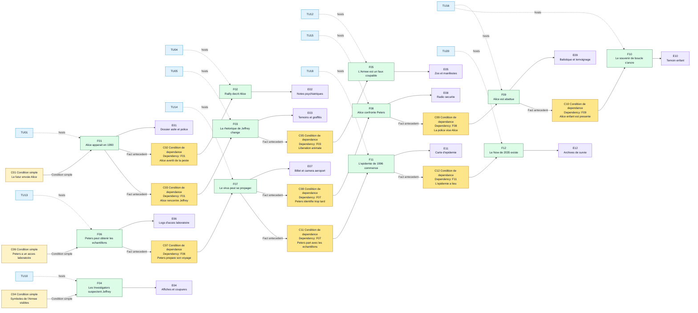

# Armee des 12 singes - Preparation MJ

Ce document est une preparation de **MJ** pour **Causality**, basee sur le resume fourni de *L'Armee des 12 singes*. Il ne s'agit pas d'un texte destine directement aux joueurs.

Le scenario fonctionne mieux si les **Investigators** pensent d'abord devoir empecher la catastrophe, alors que le vrai objectif jouable est plus precis : identifier la source virale exploitable et conserver un **Now** coherent.

Pour cette table simulee, **Alice** est le **Loop Anchor Investigator**. **Bob**, **Charlie** et **Dana** sont les autres **Investigators** actifs dans la **Main Timeline** preparee. Alice remplace James Cole comme figure active dans la **Main Timeline** preparee. James Cole peut disparaitre completement, rester un alias d'archive, ou servir seulement de trace abimee du futur selon le niveau de proximite souhaite avec l'oeuvre source.

## Premisse du scenario

Dans le **Now** de 2035, l'humanite survit sous terre apres l'apparition d'un virus mortel en 1996. Les scientifiques du futur possedent des archives incompletes. Ils connaissent le nom **Armee des 12 singes**, savent qu'Alice est deja impliquee dans le passe, et savent qu'un aeroport est central dans la boucle.

Les **Investigators** utilisent le **System** pour ouvrir le **Time Flow**, **rewind** la **causality**, et tester des **Atomic Time Units** anterieures. La **Main Timeline** preparee par le **MJ** n'est pas une chronologie neutre : c'est un piege causal ferme ou un faux coupable cache le vrai porteur.

## Verite cachee du MJ

- L'Armee des 12 singes est un faux coupable.
- Jeffrey Goines est dangereux, instable et lie aux symboles, mais son groupe veut surtout liberer des animaux.
- Le docteur Peters est le vrai porteur viral.
- Peters a acces au virus par le laboratoire lie au pere de Jeffrey.
- L'evenement de l'aeroport est un point d'ancrage de la boucle : Alice adulte est tuee sous les yeux d'Alice enfant.
- Le **Now** originel existe parce que le virus a ete libere en 1996.
- Si la **Main Timeline** finale empeche totalement l'epidemie de 1996, le **Now** originel n'est plus coherent et la realite des **Investigators** est perdue.

## Main Timeline

Le **Time Flow** possede toujours **20 Atomic Time Units**. Le **MJ** prepare la **Main Timeline** suivante. Les joueurs ne doivent pas recevoir les notes cachees au depart.

| Time Unit | Event visible ou decouvrable | Note cachee du MJ |
|---|---|---|
| 1 | Alice apparait en 1990 au lieu de l'annee cible. | Le calcul du futur est imprecis. Cela cree des dossiers psychiatriques lies a Alice. |
| 2 | Alice est internee dans un asile. | Elle rencontre Kathryn Railly et Jeffrey Goines. |
| 3 | Alice avertit les gens d'une peste future. | Ses avertissements ressemblent a des delires mais laissent des temoignages utiles. |
| 4 | Railly decrit Alice comme une patiente delirante. | Son scepticisme professionnel devient plus tard une preuve. |
| 5 | Jeffrey quitte l'asile et ses idees ecologistes radicales se structurent. | La presence d'Alice renforce la fausse piste. |
| 6 | Alice, Bob, Charlie et Dana atteignent 1996 apres une correction du **System**. | Le groupe complet se rapproche de la fenetre de liberation du virus. |
| 7 | Bob et Dana poussent Railly a aider l'enquete pendant qu'Alice reste la fugitive visible. | Cela attire la police et detruit la credibilite du groupe. |
| 8 | Railly trouve des liens impossibles entre les declarations d'Alice, les recherches d'archives de Charlie et les dossiers de securite de Bob. | Elle commence a croire que la boucle causale est reelle. |
| 9 | Alice, Bob, Charlie, Dana et Railly se concentrent sur l'Armee des 12 singes. | Le faux coupable devient convaincant. |
| 10 | Les symboles de l'Armee des 12 singes apparaissent publiquement. | Ces signes pointent vers l'activisme, pas vers le terrorisme viral. |
| 11 | Jeffrey semble etre le leader responsable. | Son pere et le laboratoire cachent le vrai chemin d'acces. |
| 12 | L'Armee prepare une action publique de liberation animale. | Cette action detourne l'attention de Peters. |
| 13 | Le docteur Peters obtient l'acces aux echantillons viraux. | C'est le vrai point critique de source. |
| 14 | Peters prepare son voyage avec les echantillons. | Il peut encore etre identifie, retarde ou suivi. |
| 15 | Alice, Bob, Charlie, Dana et Railly convergent vers l'aeroport. | Leurs actions attirent la securite armee. |
| 16 | Alice tente d'arreter Peters et est abattue par la police. | C'est un point d'ancrage de boucle observe par Alice enfant. |
| 17 | Peters embarque ou atteint la chaine de depart avec les echantillons. | La propagation virale devient mondiale. |
| 18 | L'epidemie de 1996 commence et echappe au confinement. | La catastrophe devient verrouillee historiquement. |
| 19 | En 2035, les survivants vivent sous terre et utilisent des prisonniers. | Le System du futur existe grace a la catastrophe. |
| 20 | Now : Alice, Bob, Charlie et Dana recoivent la mission. | L'etat observable actuel doit rester coherent lors du merge final. |

### Graphique Mermaid de la Main Timeline

```mermaid
flowchart LR
  TU01["TU01<br/>Alice apparait en 1990"] --> TU02["TU02<br/>Alice internee"]
  TU02 --> TU03["TU03<br/>Alice avertit de la peste"]
  TU03 --> TU04["TU04<br/>Railly decrit Alice"]
  TU04 --> TU05["TU05<br/>Jeffrey quitte l'asile"]
  TU05 --> TU06["TU06<br/>Alice, Bob, Charlie, Dana atteignent 1996"]
  TU06 --> TU07["TU07<br/>Bob et Dana poussent Railly"]
  TU07 --> TU08["TU08<br/>Railly trouve les liens impossibles"]
  TU08 --> TU09["TU09<br/>Le groupe cible l'Armee"]
  TU09 --> TU10["TU10<br/>Symboles de l'Armee"]
  TU10 --> TU11["TU11<br/>Jeffrey semble responsable"]
  TU11 --> TU12["TU12<br/>Liberation animale"]
  TU12 --> TU13["TU13<br/>Peters obtient les echantillons"]
  TU13 --> TU14["TU14<br/>Peters prepare son voyage"]
  TU14 --> TU15["TU15<br/>Le groupe arrive a l'aeroport"]
  TU15 --> TU16["TU16<br/>Alice est abattue"]
  TU16 --> TU17["TU17<br/>Peters part"]
  TU17 --> TU18["TU18<br/>L'epidemie commence"]
  TU18 --> TU19["TU19<br/>Survivants souterrains en 2035"]
  TU19 --> TU20["TU20<br/>Now: la mission commence"]
```

## Briefing initial des joueurs

Donne uniquement ces informations aux joueurs :

- Le **Now** est 2035.
- Un virus est apparu en 1996 et a detruit la civilisation de surface.
- L'expression "Armee des 12 singes" revient souvent dans les archives abimees.
- Alice semble avoir deja ete envoyee dans le passe et reste liee a l'affaire.
- Kathryn Railly et Jeffrey Goines sont des noms recurrents.
- Un souvenir d'aeroport apparait dans plusieurs fichiers corrompus.
- La mission consiste a identifier la source virale originelle et a creer une voie coherente vers un remede.

Ne revele pas d'abord que Peters est le vrai porteur.

## Table causale cachee

Utilise deux types de conditions :

- **Condition simple** : un etat du monde necessaire.
- **Condition de dependance** : un fait antecedent necessaire, note `Dependency: Fxx`.

| ID | Type de condition | Conditions | Fact | Evidence |
|---|---|---|---|---|
| F01 | Condition simple | Les scientifiques du futur envoient Alice avec des coordonnees imprecises. | Alice apparait en 1990. | Rapport d'arrestation, dossier d'admission en asile, rapport de police. |
| F02 | Condition de dependance | Dependency: F01. Alice parle ouvertement de la peste future. | Railly decrit Alice comme delirante. | Notes psychiatriques, fragments de conference, souvenir d'entretien. |
| F03 | Condition de dependance | Dependency: F01. Alice rencontre Jeffrey dans l'asile. | L'activisme de Jeffrey se lie a un langage apocalyptique. | Temoignages, graffitis ulterieurs, slogans militants. |
| F04 | Condition simple | Les symboles de l'Armee des 12 singes sont visibles en 1996. | Les Investigators suspectent le groupe de Jeffrey. | Affiches, photos, coupures de presse. |
| F05 | Condition de dependance | Dependency: F03. Le groupe de Jeffrey vise la liberation animale. | L'Armee n'est pas le mecanisme de liberation du virus. | Plan du zoo, dossiers de transport animal, manifestes militants. |
| F06 | Condition simple | Peters travaille pres du pere de Jeffrey et possede un acces laboratoire. | Peters peut obtenir les echantillons viraux. | Logs d'acces, badge, inventaire incomplet des echantillons. |
| F07 | Condition de dependance | Dependency: F06. Peters prepare un voyage en avion. | Le virus peut se propager mondialement. | Billet, camera d'aeroport, dossier de bagage. |
| F08 | Condition de dependance | Dependency: F07. Alice, Bob, Charlie, Dana et Railly identifient Peters trop tard. | Alice confronte Peters a l'aeroport. | Radio securite, temoins, rapports. |
| F09 | Condition de dependance | Dependency: F08. La police prend Alice pour la menace. | Alice est abattue. | Balistique, declaration de la police, temoignage de Railly. |
| F10 | Condition de dependance | Dependency: F09. Alice enfant est presente a l'aeroport. | La boucle imprime la mort d'Alice comme souvenir d'enfance. | Description de l'enfant temoin, reve recurrent, profil psychologique futur. |
| F11 | Condition de dependance | Dependency: F07. Peters part avec les echantillons. | L'epidemie de 1996 commence. | Carte d'epidemie, trajet aerien, premier foyer infectieux. |
| F12 | Condition de dependance | Dependency: F11. L'epidemie a lieu. | Le Now souterrain de 2035 existe. | Archives de survie, System, programme de prisonniers. |

### Graphique Mermaid de la table causale

## Personnages clefs

| Personnage | Role public | Fonction reelle |
|---|---|---|
| Alice | Loop Anchor Investigator envoyee par les scientifiques du futur | Point d'ancrage de boucle et signal d'alerte peu fiable |
| Bob | Investigator actif dans les espaces publics sous pression | Lecture de securite, gestion des poursuites, analyse de l'aeroport |
| Charlie | Investigator specialise dans le System et les archives | Trouve les liens impossibles, archives corrompues et logs d'acces |
| Dana | Investigator attentive aux temoins et aux donnees de survie | Suit les blessures, temoignages et preuves utiles au remede |
| Kathryn Railly | Psychiatre | Pont de credibilite entre delire et preuve |
| Jeffrey Goines | Activiste instable | Faux coupable et source de preuves bruyantes |
| Docteur Peters | Virologue | Vrai porteur et vecteur de liberation virale |
| Scientifiques du futur | Controleurs de mission | Preservent le System et cherchent des donnees sur la source virale |
| Alice enfant | Temoin enfant | Preuve que la mort d'Alice a l'aeroport appartient au Now originel |

## Deck de preuves

Utilise ces elements comme cartes d'indice :

- Dossier d'admission d'Alice en 1990.
- Notes psychiatriques de Railly.
- Photo d'un graffiti de l'Armee des 12 singes.
- Tract de liberation animale.
- Interview ou rant enregistre de Jeffrey.
- Log d'acces laboratoire avec le badge de Peters.
- Inventaire incomplet des echantillons viraux.
- Billet d'avion ou identite de voyage de Peters.
- Rapport de securite de l'aeroport designant Alice comme menace armee.
- Note d'un enfant temoin decrivant Alice abattue devant lui.
- Fragment d'archive de 2035 : "Trouver la souche pure, pas le slogan."

## Fausses pistes

- L'Armee des 12 singes semble coupable parce que son nom survit dans les archives futures.
- Jeffrey semble coupable parce qu'il est instable, spectaculaire et lie au laboratoire par son pere.
- Alice semble dangereuse parce qu'elle pousse Railly a l'aider et agit comme une fugitive violente.
- Railly semble peu fiable parce que sa conviction change apres son contact avec les **Investigators**.

## Hooks de Branched Timeline recommandes

| Time Unit cible | Distance de rewind | Rewind Die minimum | Question utile |
|---|---:|---|---|
| 16 | 4 | d4 | Pourquoi la securite de l'aeroport abat-elle Alice ? |
| 14 | 6 | d6 | Peters peut-il etre identifie avant l'embarquement ? |
| 12 | 8 | d8 | Que prepare reellement l'Armee ? |
| 10 | 10 | d10 | Pourquoi les symboles pointent-ils vers Jeffrey ? |
| 8 | 12 | d12 | Quand Railly commence-t-elle a croire Alice, Bob, Charlie et Dana ? |
| 1 | 19 | d20 | Qu'est-ce que l'arrivee erronee d'Alice en 1990 a cree ? |

## Regles de conflit pour ce scenario

Conflits mineurs :

- Railly croit trop tot ou trop tard.
- Jeffrey est disculpe avant que le groupe possede assez de preuves.
- L'attention de la police se deplace vers un Investigator.
- L'action de liberation animale arrive sur la mauvaise Time Unit.

Conflits majeurs :

- Peters est arrete avant d'obtenir les echantillons sans autre cause preservant l'epidemie.
- Alice survit a la fusillade de l'aeroport sans point d'ancrage de remplacement.
- Alice enfant ne voit pas la mort a l'aeroport.
- L'epidemie de 1996 est totalement empechee.
- Le System de 2035 n'a plus de raison coherente d'exister.

## Conditions de merge

Pour obtenir une convergence complete, la **Main Timeline** finale doit preserver ces facts :

1. Un virus emerge toujours en 1996.
2. Le docteur Peters est identifie comme vrai porteur.
3. L'Armee des 12 singes est comprise comme un faux coupable.
4. La mort d'Alice a l'aeroport reste coherente, ou un point d'ancrage equivalent la remplace.
5. Le **Now** de 2035 reste possible.
6. Les **Investigators** recuperent assez de donnees d'origine pour soutenir une recherche de remede.

## Fins possibles

Convergence complete :

- Les Investigators identifient Peters, preservent le Now et ramenent des donnees d'origine a 2035.

Convergence incomplete :

- L'Armee est disculpee, mais Peters n'est pas totalement prouve ou la source virale reste incomplete.

Divergence psychologique :

- Un ou plusieurs Investigators se souviennent d'une epidemie empechee qui ne peut pas exister dans le Now final.

Rupture causale :

- L'epidemie est totalement empechee, la boucle d'Alice s'effondre, et le Now de 2035 devient incoherent.
