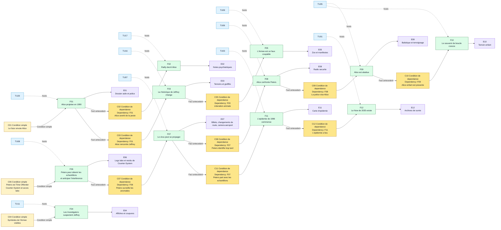
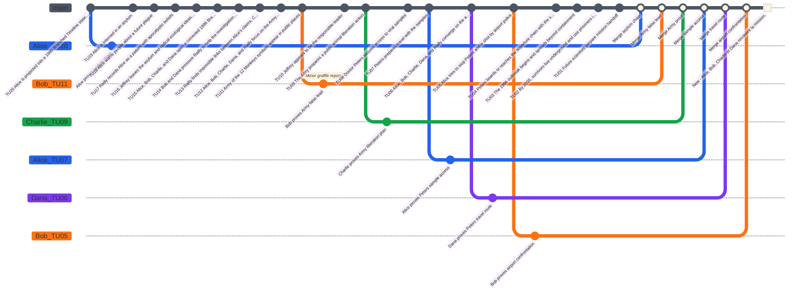
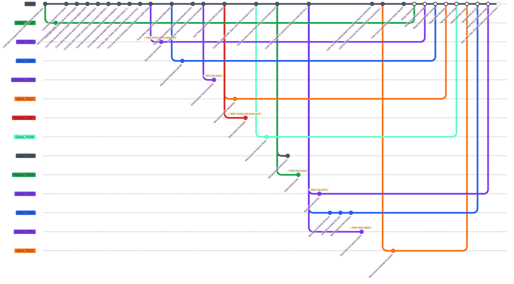

# Armee des 12 singes - Preparation MJ

Ce document est une preparation de **MJ** pour **Causality**, basee sur le resume fourni de *L'Armee des 12 singes*. Il ne s'agit pas d'un texte destine directement aux joueurs.

Le scenario fonctionne mieux si les **Investigators** pensent d'abord devoir empecher la catastrophe, alors que le vrai objectif jouable est plus precis : identifier la source virale exploitable, exposer le **Time Offender**, et conserver un **Now** coherent.

Pour cette table simulee, **Alice** est le **Loop Anchor Investigator**. **Bob**, **Charlie** et **Dana** sont les autres **Investigators** actifs dans la **Main Timeline** preparee. Alice remplace James Cole comme figure active dans la **Main Timeline** preparee. James Cole peut disparaitre completement, rester un alias d'archive, ou servir seulement de trace abimee du futur selon le niveau de proximite souhaite avec l'oeuvre source.

## Premisse du scenario

Dans le **Now** de 2035, l'humanite survit sous terre apres l'apparition d'un virus mortel en 1996. Les scientifiques du futur possedent des archives incompletes. Ils connaissent le nom **Armee des 12 singes**, savent qu'Alice est deja impliquee dans le passe, et savent qu'un aeroport est central dans la boucle.

Les **Investigators** utilisent le **System** pour ouvrir le **Time Flow**, **rewind** la **causality**, et tester des **Atomic Time Units** anterieures. La **Main Timeline** preparee par le **MJ** n'est pas une chronologie neutre : c'est un piege causal ferme ou un faux coupable cache le vrai porteur. Ce porteur, le Docteur Peters, n'est pas seulement un virologue historique. C'est un **Time Offender** venu du **Now** qui utilise un **Counter-System** rival pour proteger sa propre version de la **causality**.

## Verite cachee du MJ

- L'Armee des 12 singes est un faux coupable.
- Jeffrey Goines est dangereux, instable et lie aux symboles, mais son groupe veut surtout liberer des animaux.
- Le Docteur Peters est le vrai porteur viral et la source du probleme causal.
- Peters est un **Time Offender** venu du **Now**. Il possede un **Counter-System**, un equivalent du **System** utilise par les **Investigators**.
- Peters sait que des **Investigators** existent, mais il ne connait pas leur identite au debut de la partie.
- Peters peut identifier les **Investigators** pendant la partie lorsqu'ils agissent avec des informations, un timing ou un comportement anormal pour une personne non consciente de l'interference causale.
- Peters a acces au virus par le laboratoire lie au pere de Jeffrey, et il utilise sa connaissance temporelle pour proteger cet acces.
- L'evenement de l'aeroport est un point d'ancrage de la boucle : Alice adulte est tuee sous les yeux d'Alice enfant.
- Le **Now** originel existe parce que le virus a ete libere en 1996.
- Si la **Main Timeline** finale empeche totalement l'epidemie de 1996, le **Now** originel n'est plus coherent et la realite des **Investigators** est perdue.

## Main Timeline

Le **Time Flow** possede **20 Atomic Time Units** numerotees depuis la **Time Unit 20**, evenement prepare le plus ancien, jusqu'a la **Time Unit 1**, dernier evenement prepare avant le present. Le **Now** est la **Time Unit 0**. Le **MJ** prepare la **Main Timeline** suivante. Les joueurs ne doivent pas recevoir les notes cachees au depart.

| Time Unit | Event visible ou decouvrable | Note cachee du MJ |
|---|---|---|
| 20 | Alice est projetee dans un etat de **Branched Timeline** de 1990 au lieu de l'annee cible. | Le calcul du **System** est imprecis. Cela cree des dossiers psychiatriques lies a Alice dans l'etat causal rejoue. |
| 19 | Alice est internee dans un asile. | Elle rencontre Kathryn Railly et Jeffrey Goines. |
| 18 | Alice avertit les gens d'une peste future. | Ses avertissements ressemblent a des delires mais laissent des temoignages utiles. |
| 17 | Railly decrit Alice comme une patiente delirante. | Son scepticisme professionnel devient plus tard une preuve. |
| 16 | Jeffrey quitte l'asile et ses idees ecologistes radicales se structurent. | La presence d'Alice renforce la fausse piste. |
| 15 | Alice, Bob, Charlie et Dana ouvrent une **Branched Timeline** corrigee sur 1996 apres une correction du **System**. | Le groupe complet se rapproche de la fenetre de liberation du virus. |
| 14 | Bob et Dana poussent Railly a aider l'enquete pendant qu'Alice reste la fugitive visible. | Cela attire la police et detruit la credibilite du groupe. |
| 13 | Railly trouve des liens impossibles entre les declarations d'Alice, les recherches d'archives de Charlie et les dossiers de securite de Bob. | Elle commence a croire que la boucle causale est reelle. |
| 12 | Alice, Bob, Charlie, Dana et Railly se concentrent sur l'Armee des 12 singes. | Le faux coupable devient convaincant. |
| 11 | Les symboles de l'Armee des 12 singes apparaissent publiquement. | Ces signes pointent vers l'activisme, pas vers le terrorisme viral. |
| 10 | Jeffrey semble etre le leader responsable. | Son pere et le laboratoire cachent le vrai chemin d'acces. |
| 9 | L'Armee prepare une action publique de liberation animale. | Cette action detourne l'attention de Peters. |
| 8 | Le Docteur Peters obtient l'acces aux echantillons viraux. | Peters est un **Time Offender** venu du **Now**. Son **Counter-System** lui indique que c'est le point critique de source. |
| 7 | Peters prepare son voyage avec les echantillons. | Il surveille les comportements anormaux et peut identifier les **Investigators** s'ils exposent une connaissance future. |
| 6 | Alice, Bob, Charlie, Dana et Railly convergent vers l'aeroport. | Leurs actions attirent la securite armee. |
| 5 | Alice tente d'arreter Peters et est abattue par la police. | C'est un point d'ancrage de boucle observe par Alice enfant. |
| 4 | Peters embarque ou atteint la chaine de depart avec les echantillons. | Son **Counter-System** protege ce chemin de depart sauf si les **Investigators** l'exposent sans casser le **Now**. |
| 3 | L'epidemie de 1996 commence et echappe au confinement. | La catastrophe devient verrouillee historiquement. |
| 2 | En 2035, les survivants vivent sous terre et utilisent des prisonniers. | Le System du futur existe grace a la catastrophe. |
| 1 | Now : Alice, Bob, Charlie et Dana recoivent la mission. | L'etat observable actuel doit rester coherent lors du merge final. |
| 0 | Now : Alice, Bob, Charlie et Dana recoivent la mission. | L'etat observable actuel doit rester coherent au merge final. |

### Graphique Mermaid de la Main Timeline

```mermaid
flowchart LR
  TU20["TU20<br/>Alice est projetee dans un etat de Branch..."] --> TU19["TU19<br/>Alice est internee dans un asile"]
  TU19 --> TU18["TU18<br/>Alice avertit les gens d'une peste future"]
  TU18 --> TU17["TU17<br/>Railly decrit Alice comme une patiente de..."]
  TU17 --> TU16["TU16<br/>Jeffrey quitte l'asile et ses idees ecolo..."]
  TU16 --> TU15["TU15<br/>Alice, Bob, Charlie et Dana ouvrent une B..."]
  TU15 --> TU14["TU14<br/>Bob et Dana poussent Railly a aider l'enq..."]
  TU14 --> TU13["TU13<br/>Railly trouve des liens impossibles entre..."]
  TU13 --> TU12["TU12<br/>Alice, Bob, Charlie, Dana et Railly se co..."]
  TU12 --> TU11["TU11<br/>Les symboles de l'Armee des 12 singes app..."]
  TU11 --> TU10["TU10<br/>Jeffrey semble etre le leader responsable"]
  TU10 --> TU09["TU09<br/>L'Armee prepare une action publique de li..."]
  TU09 --> TU08["TU08<br/>Le Docteur Peters obtient l'acces aux ech..."]
  TU08 --> TU07["TU07<br/>Peters prepare son voyage avec les echant..."]
  TU07 --> TU06["TU06<br/>Alice, Bob, Charlie, Dana et Railly conve..."]
  TU06 --> TU05["TU05<br/>Alice tente d'arreter Peters et est abatt..."]
  TU05 --> TU04["TU04<br/>Peters embarque ou atteint la chaine de d..."]
  TU04 --> TU03["TU03<br/>L'epidemie de 1996 commence et echappe au..."]
  TU03 --> TU02["TU02<br/>En 2035, les survivants vivent sous terre..."]
  TU02 --> TU01["TU01<br/>Transmission de mission preparee"]
  TU01 --> TU00["TU00 / Now<br/>Now  - Alice, Bob, Charlie et Dana recoiv..."]
```



## Briefing initial des joueurs

Donne uniquement ces informations aux joueurs :

- Le **Now** est 2035.
- Un virus est apparu en 1996 et a detruit la civilisation de surface.
- L'expression "Armee des 12 singes" revient souvent dans les archives abimees.
- Alice semble avoir deja ete projetee dans une **Branched Timeline** anterieure et reste liee a l'affaire.
- Kathryn Railly et Jeffrey Goines sont des noms recurrents.
- Un souvenir d'aeroport apparait dans plusieurs fichiers corrompus.
- La mission consiste a identifier la source virale originelle et a creer une voie coherente vers un remede.

Ne revele pas d'abord que Peters est le vrai porteur ni qu'un **Time Offender** est actif dans l'affaire.

## Table causale cachee

Utilise deux types de conditions :

- **Condition simple** : un etat du monde necessaire.
- **Condition de dependance** : un fait antecedent necessaire, note `Dependency: Fxx`.

| ID | Type de condition | Conditions | Fact | Evidence |
|---|---|---|---|---|
| F01 | Condition simple | Les scientifiques du futur activent le **System** avec des coordonnees de cible imprecises. | Alice est projetee dans un etat de **Branched Timeline** de 1990. | Rapport d'arrestation, dossier d'admission en asile, rapport de police. |
| F02 | Condition de dependance | Dependency: F01. Alice parle ouvertement de la peste future. | Railly decrit Alice comme delirante. | Notes psychiatriques, fragments de conference, souvenir d'entretien. |
| F03 | Condition de dependance | Dependency: F01. Alice rencontre Jeffrey dans l'asile. | L'activisme de Jeffrey se lie a un langage apocalyptique. | Temoignages, graffitis ulterieurs, slogans militants. |
| F04 | Condition simple | Les symboles de l'Armee des 12 singes sont visibles en 1996. | Les Investigators suspectent le groupe de Jeffrey. | Affiches, photos, coupures de presse. |
| F05 | Condition de dependance | Dependency: F03. Le groupe de Jeffrey vise la liberation animale. | L'Armee n'est pas le mecanisme de liberation du virus. | Plan du zoo, dossiers de transport animal, manifestes militants. |
| F06 | Condition simple | Peters est un **Time Offender** venu du **Now**, utilise un **Counter-System**, et travaille pres du pere de Jeffrey avec un acces laboratoire. | Peters peut obtenir les echantillons viraux et anticiper l'interference temporelle. | Logs d'acces, badge, inventaire incomplet des echantillons, residu de **Counter-System**. |
| F07 | Condition de dependance | Dependency: F06. Peters prepare un voyage en avion tout en surveillant les comportements anormaux. | Le virus peut se propager mondialement. | Billet, camera d'aeroport, dossier de bagage, changements de route apres anomalie. |
| F08 | Condition de dependance | Dependency: F07. Alice, Bob, Charlie, Dana et Railly identifient Peters trop tard. | Alice confronte Peters a l'aeroport. | Radio securite, temoins, rapports. |
| F09 | Condition de dependance | Dependency: F08. La police prend Alice pour la menace. | Alice est abattue. | Balistique, declaration de la police, temoignage de Railly. |
| F10 | Condition de dependance | Dependency: F09. Alice enfant est presente a l'aeroport. | La boucle imprime la mort d'Alice comme souvenir d'enfance. | Description de l'enfant temoin, reve recurrent, profil psychologique futur. |
| F11 | Condition de dependance | Dependency: F07. Peters part avec les echantillons. | L'epidemie de 1996 commence. | Carte d'epidemie, trajet aerien, premier foyer infectieux. |
| F12 | Condition de dependance | Dependency: F11. L'epidemie a lieu. | Le Now souterrain de 2035 existe. | Archives de survie, System, programme de prisonniers. |

### Graphique Mermaid de la table causale



## Personnages clefs

| Personnage | Role public | Fonction reelle |
|---|---|---|
| Alice | Loop Anchor Investigator projetee par le **System** des scientifiques du futur | Point d'ancrage de boucle et signal d'alerte peu fiable |
| Bob | Investigator actif dans les espaces publics sous pression | Lecture de securite, gestion des poursuites, analyse de l'aeroport |
| Charlie | Investigator specialise dans le System et les archives | Trouve les liens impossibles, archives corrompues et logs d'acces |
| Dana | Investigator attentive aux temoins et aux donnees de survie | Suit les blessures, temoignages et preuves utiles au remede |
| Kathryn Railly | Psychiatre | Pont de credibilite entre delire et preuve |
| Jeffrey Goines | Activiste instable | Faux coupable et source de preuves bruyantes |
| Docteur Peters | Virologue | Time Offender, vrai porteur et vecteur de liberation virale |
| Scientifiques du futur | Controleurs de mission | Preservent le System et cherchent des donnees sur la source virale |
| Alice enfant | Temoin enfant | Preuve que la mort d'Alice a l'aeroport appartient au Now originel |

### Docteur Peters comme Time Offender

Le Docteur Peters est l'ennemi temporel actif controle par le **MJ**. Il vient du **Now** et utilise un **Counter-System**, un equivalent rival du **System**. Il n'est pas omniscient : il commence le scenario en sachant que des **Investigators** peuvent interferer avec son plan, mais il ne sait pas qui ils sont.

Suis Peters avec trois etats de conscience :

| Etat de conscience | Declencheur | Usage MJ |
|---|---|---|
| Identites inconnues | Debut de partie. Peters sait seulement que des **Investigators** existent. | Il suit la **Main Timeline** preparee et protege son acces aux echantillons. |
| En alerte | Un **Investigator** cree une preuve visible, declenche la securite trop tot, ou utilise une connaissance impossible pour une personne locale. | Il change de route, detruit une preuve ordinaire, ou transforme l'anomalie en folie ou en crime. |
| Cible identifiee | Peters relie directement un nom, un visage ou un comportement a une interference temporelle. | Il evite cet **Investigator**, redirige la securite vers lui, ou utilise le **Counter-System** pour preserver son chemin de depart. |

Peters doit mettre la table sous pression sans devenir impossible a battre. Son **Counter-System** peut :

- remarquer les timings anormaux, les dossiers impossibles et les noms qui reviennent dans plusieurs **Branched Timelines** ;
- deplacer Peters vers une route, une porte, un couloir de laboratoire ou une chaine de temoins proche ;
- effacer ou contaminer une preuve sauf si la branche est **Merged** proprement ;
- creer un conflit mineur en faisant passer un **Investigator** pour instable, criminel ou dangereux ;
- creer un conflit majeur seulement si les **Investigators** essaient d'empecher completement l'epidemie avant de preserver un **Now** coherent.

Peters possede un set de **Counter-System Rewind Dice** : d4, d6, d8, d10, d12 et d20. Ces des sont a usage unique. Les actions ordinaires comme marcher, mentir, appeler la securite ou cacher un dossier ne depensent pas l'energie du **Counter-System**. Toute action qui **rewind** la **causality**, modifie une route, contamine une **Evidence** a travers une **Branched Timeline**, ou impose une pression de memoire doit depenser le plus petit **Counter-System Rewind Die** disponible permettant d'atteindre la **Time Unit** affectee.

Une fois que Peters a une **Cible identifiee**, il peut mener une **Time Offender action** pendant chaque tour du **MJ** contre un **Investigator** identifie. L'action doit augmenter la pression sur la coherence de la **Main Timeline** de cet **Investigator** ; elle ne doit pas simplement infliger des degats. Si l'action utilise le **Counter-System**, marque immediatement le **Counter-System Rewind Die** depense. Si Peters n'a plus de de adapte, il ne peut agir que par des moyens historiques ordinaires.

| Time Offender action | Effet mecanique | Exemple fictionnel |
|---|---|---|
| Pieger l'Investigator | Ajoute un conflit mineur non resolu a cet **Investigator**. | Peters fait passer l'**Investigator** pour un faux appelant, un intrus ou une menace violente. |
| Aggraver un conflit non resolu | Transforme un conflit mineur non resolu en conflit majeur. | Peters utilise le **Counter-System** pour que les dossiers de securite prouvent que l'**Investigator** a cause la crise. |
| Epuiser l'energie de la table | Force le groupe a choisir : depenser un **Rewind Die** utilisable pour une **Branched Timeline** corrective, ou garder le conflit ajoute. | Peters deplace les echantillons vers une route que seule une nouvelle branche peut verifier. |
| Contaminer une preuve | Un indice ne peut plus soutenir un **merge** tant qu'un **Investigator** ne resout pas un conflit mineur. | Les logs de laboratoire contredisent maintenant le billet d'avion tant que la chaine causale n'est pas restauree. |
| Attaquer la sante mentale par le souvenir | Ajoute une penalite temporaire de **Volonte** de `-5` jusqu'au prochain **merge** propre. | L'**Investigator** se souvient de deux versions incompatibles de la meme **Time Unit**. |

Le but de Peters est de faire sombrer les **Investigators** dans la folie par accumulation de conflits, ou de leur faire consommer tous leurs **Rewind Dice** avant qu'ils puissent reussir la mission.

## Caracteristiques et Rewind Dice

Pour cette premiere simulation, chaque **Investigator** est un humain standard :

- Volonte maximale : `100` ;
- Volonte actuelle au depart : `100` ;
- points de vie : `10` ;
- un set de des D&D classique ;
- les **Rewind Dice** sont a usage unique : chaque d4, d6, d8, d10, d12 et d20 peut etre depense une seule fois.

Les PNJ ne consomment jamais de **Rewind Dice** dans cette preparation. Leur **Volonte** est calculee a partir des **Branched Timelines** qu'ils ont vecues, observees ou subies causalement dans l'histoire :

```text
Volonte actuelle du PNJ = 100 - (30 x Branched Timelines pertinentes)
```

Leurs points de vie sont calcules uniquement a partir des degats physiques confirmes par l'histoire :

```text
Points de vie actuels du PNJ = 10 - degats confirmes par l'histoire
```

Si la **Main Timeline** ou une **Branched Timeline** ne montre pas un PNJ blesse, ce PNJ reste a 10 points de vie.

Les conflits non resolus qui affectent le PNJ peuvent aussi appliquer le modificateur normal de **Volonte** si le **MJ** veut utiliser cette pression en jeu.

### Investigators

| Investigator | Role | Volonte max | Volonte actuelle | Points de vie | Rewind Dice disponibles | Rewind Dice depenses |
|---|---|---:|---:|---:|---|---|
| Alice | Loop Anchor Investigator | 100 | 100 | 10 | d4, d6, d8, d10, d12, d20 | Aucun |
| Bob | Lecture de securite et poursuites | 100 | 100 | 10 | d4, d6, d8, d10, d12, d20 | Aucun |
| Charlie | Analyse du System et des archives | 100 | 100 | 10 | d4, d6, d8, d10, d12, d20 | Aucun |
| Dana | Temoins, blessures et donnees de survie | 100 | 100 | 10 | d4, d6, d8, d10, d12, d20 | Aucun |

### PNJ

| PNJ | Role | Branched Timelines pertinentes | Volonte max | Volonte actuelle | Calcul des points de vie selon l'histoire | Points de vie actuels |
|---|---|---:|---:|---:|---|---:|
| Kathryn Railly | Psychiatre et pont de credibilite | 2 | 100 | 40 | Aucune blessure confirmee dans la Main Timeline preparee | 10 |
| Jeffrey Goines | Faux coupable et signal activiste | 1 | 100 | 70 | Aucune blessure confirmee dans la Main Timeline preparee | 10 |
| Docteur Peters | Time Offender, vrai porteur et vecteur de liberation virale | 3 | 100 | 10 | Aucune blessure confirmee dans la Main Timeline preparee | 10 |
| Scientifiques du futur | Controleurs de mission en 2035 | 0 | Non suivie | Non suivie | Pas physiquement presents dans les scenes suivies | Non suivis |
| Alice enfant | Temoin enfant et preuve d'ancrage de boucle | 1 | 100 | 70 | Observe la fusillade mais n'est pas blessee physiquement | 10 |
| Police de l'aeroport | Opposition armee a l'aeroport | 0 | 100 | 100 | Aucune blessure confirmee sauf si les Investigators les blessent en jeu | 10 chacun |

### Suivi des Counter-System Rewind Dice

Le Docteur Peters utilise ce tracker seulement dans la version complete avec pression de **Time Offender**.

| Time Offender | d4 | d6 | d8 | d10 | d12 | d20 |
|---|---|---|---|---|---|---|
| Docteur Peters | Disponible | Disponible | Disponible | Disponible | Disponible | Disponible |

### Suivi des Rewind Dice

Utilise cette table pendant la premiere simulation. Marque un de comme depense des qu'un **Investigator** ouvre une **Branched Timeline** avec ce de.

| Investigator | d4 | d6 | d8 | d10 | d12 | d20 |
|---|---|---|---|---|---|---|
| Alice | Disponible | Disponible | Disponible | Disponible | Disponible | Disponible |
| Bob | Disponible | Disponible | Disponible | Disponible | Disponible | Disponible |
| Charlie | Disponible | Disponible | Disponible | Disponible | Disponible | Disponible |
| Dana | Disponible | Disponible | Disponible | Disponible | Disponible | Disponible |

## Deroulement starter - Sans Time Offender

Utilisez cette version pour enseigner le scenario. Doctor Peters est seulement le porteur viral historique. Ignorez le Counter-System, les etats de conscience du Time Offender et les actions de Time Offender.

Pour cette version starter, remplacez localement les faits complets de Peters :

| Element complet | Remplacement starter |
|---|---|
| F06 Condition | Peters travaille pres du pere de Jeffrey et possede un acces laboratoire. |
| F06 Fact | Peters peut obtenir les echantillons viraux. |
| F06 Evidence | Logs laboratoire, badge et inventaire incomplet. |
| F07 Condition | Dependency: F06. Peters prepare un voyage avec les echantillons. |
| F07 Fact | Le virus peut se propager mondialement. |
| F07 Evidence | Billets, cameras aeroportuaires et dossiers de bagages. |
| Pression PNJ de Doctor Peters | Ne pas utiliser les actions de Time Offender ni le Counter-System. |

Ce replay starter est recalcule avec la convention **Time Unit 20** vers **Time Unit 0 / Now**. Chaque Rewind utilise `distance = Time Unit cible`.

### Replay starter

**Tour du MJ.** Le MJ ouvre le Time Flow et annonce que Doctor Peters n'est pas un Time Offender dans cette version.

**Tour d'Alice.** Alice depense son d20 vers la Time Unit `20`. Le replay donne `d20 -> 11`, donc `r = 55%` : reussite partielle. Consequence `d10 -> 4` : mauvais point d'entree. Alice arrive dans la mauvaise aile de l'asile mais prouve quand meme la chaine asile/Railly. Volonte `70`.

**Tour de Bob.** Bob depense son d12 vers la Time Unit `11`. Le replay donne `d12 -> 6`, donc `r = 54.55%` : reussite partielle. Consequence `d10 -> 8` : conflit mineur. Bob prouve la fausse piste de l'Armee, mais un rapport de police identifie un Investigator pres des graffitis. Volonte `50`.

**Tour de Charlie.** Charlie depense son d10 vers la Time Unit `13`. Le replay donne `d10 -> 2`, donc `r = 15.38%` : echec critique. Aucune branche et aucun gain. Volonte `100`.

**Tour de Dana.** Dana depense son d8 vers la Time Unit `9`. Le replay donne `d8 -> 1`, donc `r = 11.11%` : echec critique. Aucune branche et aucun gain. Volonte `100`.

**Tour du MJ.** Le MJ rappelle les dependances : l'acces de Peters aux echantillons doit preceder la route aeroportuaire, et l'Armee doit encore etre innocentee avec une Evidence stable.

**Tour d'Alice.** Alice depense son d12 vers la Time Unit `7`. Le replay donne `d12 -> 12`, donc `r = 171.43%` : reussite critique. Elle prouve le badge, l'inventaire manquant et l'acces aux echantillons. Sa branche merge avec la branche asile. Volonte `100`.

**Tour de Bob.** Bob depense son d10 vers la Time Unit `5`. Le replay donne `d10 -> 7`, donc `r = 140%` : reussite critique. Bob prouve Alice courant vers Peters, la police tirant, et Alice enfant temoin. Il tente de resoudre son conflit de graffiti : Volonte `50`, seuil `50`, percentile `40`, echec. Volonte `50`.

**Tour de Charlie.** Charlie depense son d8 vers la Time Unit `9`. Le replay donne `d8 -> 2`, donc `r = 22.22%` : echec partiel. Aucune branche. Gain `d10 -> 1` : detail sensoriel d'Evidence. Le MJ decrit cages, cris d'animaux et outils de liberation. Volonte `100`.

**Tour de Dana.** Dana depense son d12 vers la Time Unit `6`. Le replay donne `d12 -> 8`, donc `r = 133.33%` : reussite critique. Dana prouve que Peters peut porter les echantillons vers un vol. Volonte `70`.

**Tour du MJ.** Le MJ indique que l'Armee n'est toujours pas assez clairement innocentee.

**Tour de Charlie.** Charlie depense son d12 vers la Time Unit `9`. Le replay donne `d12 -> 7`, donc `r = 77.78%` : reussite partielle. Nouvelle consequence `d10 -> 4` : mauvais point d'entree. Charlie commence loin de la route du zoo mais prouve que l'Armee libere des animaux et ne relache pas le virus. La branche merge. Volonte `100`.

**Tour de Bob.** Bob retente son conflit de graffiti. Volonte `50`, seuil `50`, percentile `80` : succes. Le rapport devient un signalement anonyme et la branche peut merge.

**Resolution finale du MJ.** La police aeroportuaire utilise une arme letale. Degats `d10 -> 1`. Alice perd `1` point de vie et survit avec `9`. Les Investigators identifient Peters et innocentent l'Armee, mais la Main Timeline exigeait la mort d'Alice comme ancre de boucle. Fin : **rupture causale**.

### GitGraph starter du scenario

Dans ce GitGraph, tous les points blancs sur la branch `main` correspondent aux merges sur le Now. Le carre blanc represente le Now lui-meme.



### Etat final starter

| Investigator | Volonte finale | Points de vie finaux | Rewind Dice depenses | Conflits ouverts | Etat final |
|---|---:|---:|---|---:|---|
| Alice | 100 | 9 | d20, d12 | 0 | Vivante ; ancre de boucle brisee |
| Bob | 100 | 10 | d12, d10 | 0 | Revient avec Evidence de l'Armee et de l'aeroport |
| Charlie | 100 | 10 | d10, d8, d12 | 0 | Revient avec la preuve finale de fausse piste |
| Dana | 100 | 10 | d8, d12 | 0 | Revient avec Evidence de la route de Peters |

### Statistiques starter

| Investigator | Total Branched Timelines | Merged Branched Timelines | Open Branched Timelines | Minor Conflicts Created | Minor Conflicts Resolved | Major Conflicts Created | Major Conflicts Resolved | Rewind Dice depenses | Reussites critiques | Reussites partielles | Echecs partiels | Echecs critiques | Tests de Volonte | Tests reussis | Volonte la plus basse | Points de vie finaux |
|---|---:|---:|---:|---:|---:|---:|---:|---:|---:|---:|---:|---:|---:|---:|---:|---:|
| Alice | 2 | 2 | 0 | 0 | 0 | 0 | 0 | 2 | 1 | 1 | 0 | 0 | 0 | 0 | 70 | 9 |
| Bob | 2 | 2 | 0 | 1 | 1 | 0 | 0 | 2 | 1 | 1 | 0 | 0 | 2 | 1 | 50 | 10 |
| Charlie | 1 | 1 | 0 | 0 | 0 | 0 | 0 | 3 | 0 | 1 | 1 | 1 | 0 | 0 | 70 | 10 |
| Dana | 1 | 1 | 0 | 0 | 0 | 0 | 0 | 2 | 1 | 0 | 0 | 1 | 0 | 0 | 70 | 10 |
| **Total** | **6** | **6** | **0** | **1** | **1** | **0** | **0** | **9** | **3** | **3** | **1** | **2** | **2** | **1** | **50** | **39** |

## Deroulement complet - Avec Time Offender

Utilisez cette version apres le replay starter. Elle montre volontairement toute la surface de regles : les quatre resultats de Rewind, des valeurs de des forcees quand c'est utile pour l'exemple, les consequences de reussite partielle, les gains d'echec partiel, les Minor Conflicts, les Major Conflicts, les tests de Volonte, la folie a zero Volonte, les jets de degats, les etats de conscience du Time Offender et les actions du Counter-System. Le Counter-System utilise la meme regle `distance = Time Unit cible` que les Investigators.

### Replay complet

**Tour du MJ.** Le MJ ouvre le Time Flow et marque secretement Doctor Peters comme Time Offender avec un Counter-System. Peters commence **Unaware**. Le MJ rappelle les dependances cachees : la fausse piste de l'Armee precede la focalisation sur l'aeroport, l'acces de Peters aux echantillons precede sa route de voyage, et la mort d'Alice a l'aeroport precede l'ancre de boucle de 2035.

**Tour d'Alice.** Alice depense son d20 vers la Time Unit `20`. Valeur forcee pour l'exemple : `d20 -> 18`, donc `r = 90%` : reussite critique. Alice prouve la chaine asile/Railly. Une branche non Merged donne `100 - 30 = 70` de Volonte.

**Tour de Bob.** Bob depense son d12 vers la Time Unit `11`. Valeur forcee pour l'exemple : `d12 -> 6`, donc `r = 54.55%` : reussite partielle. Consequence forcee `d10 -> 10` : Major Conflict. Bob prouve les graffitis de l'Armee, mais sa premiere action fait classer l'Armee comme cellule bioterroriste dans un dossier officiel. La branche s'ouvre, mais le merge est bloque tant que la table ne cree pas une cause corrective. Pression de Bob : une branche non Merged et un Major Conflict non resolu, donc `100 - 30 - 40 = 30` de Volonte.

**Tour de Charlie.** Charlie depense son d10 vers la Time Unit `13`. Valeur forcee pour l'exemple : `d10 -> 4`, donc `r = 30.77%` : echec partiel. Aucune Branched Timeline stable ne s'ouvre et le d10 est depense. Gain force `d10 -> 7` : trace de Time Offender. Le MJ revele une trace de changement de route liee a la preparation de voyage de Peters. Charlie reste a `100` de Volonte car aucune branche ne s'est ouverte.

**Tour de Dana.** Dana depense son d8 vers la Time Unit `9`. Valeur forcee pour l'exemple : `d8 -> 1`, donc `r = 11.11%` : echec critique. Aucune branche ne s'ouvre, aucun gain n'est tire, et le d8 est depense. Dana reste a `100` de Volonte.

**Tour du MJ.** Peters remarque la pression du System autour de la fausse piste de l'Armee et devient **Alerted**, mais il n'a pas encore identifie d'Investigator. Le MJ ne depense pas encore de de Counter-System.

**Tour d'Alice.** Alice depense son d12 vers la Time Unit `7`. Valeur forcee pour l'exemple : `d12 -> 7`, donc `r = 100%` : reussite critique. Elle prouve l'acces laboratoire de Peters, l'usage du badge et l'inventaire incomplet. Le MJ accepte les merges de la chaine asile et de la branche d'acces aux echantillons, car elles preservent les dependances de la Main Timeline. Alice revient a `100` de Volonte.

**Tour de Bob.** Bob depense son d10 vers la Time Unit `10` pour corriger son Major Conflict. Valeur forcee pour l'exemple : `d10 -> 8`, donc `r = 80%` : reussite critique. Bob prouve que le groupe de Jeffrey prepare publiquement une liberation animale, pas une liberation virale. Cette cause corrective resout le Major Conflict et permet a la branche de Bob de merge. Bob revient a `100` de Volonte.

**Tour de Charlie.** Charlie depense son d8 vers la Time Unit `8`. Valeur forcee pour l'exemple : `d8 -> 5`, donc `r = 62.5%` : reussite partielle. Consequence forcee `d10 -> 8` : Minor Conflict. Charlie prouve l'ecart d'inventaire, mais une camera de laboratoire le place pres du congelateur d'echantillons. Pression de Charlie : une branche non Merged et un Minor Conflict non resolu, donc `100 - 30 - 20 = 50` de Volonte.

**Tour de Dana.** Dana depense son d12 vers la Time Unit `6`. Valeur forcee pour l'exemple : `d12 -> 3`, donc `r = 50%` : reussite partielle. Consequence forcee `d10 -> 3` : poursuite. Dana prouve la route aeroportuaire de Peters, mais la securite la poursuit. Le MJ lance seulement les degats quand un garde frappe Dana avec une matraque non letale : `d6 -> 4`. Dana passe de `10` a `6` points de vie. Peters voit l'intervention anormale et identifie Dana. Dana a une branche non Merged : `100 - 30 = 70` de Volonte.

**Tour du MJ.** Peters agit contre Dana avec le Counter-System. Il depense son d8 de Counter-System vers la Time Unit `5`. Valeur forcee pour l'exemple : `d8 -> 3`, donc `r = 60%` : reussite partielle. Consequence forcee `d10 -> 8` : Minor Conflict. Peters fait passer l'appel de securite de Dana pour une coordination avec la course d'Alice vers l'aeroport. Pression de Dana : une branche non Merged et un Minor Conflict non resolu, donc `100 - 30 - 20 = 50` de Volonte.

**Tour d'Alice.** Alice depense son d6 vers la Time Unit `5` pour atteindre la confrontation de l'aeroport. Valeur forcee pour l'exemple : `d6 -> 3`, donc `r = 60%` : reussite partielle. Consequence forcee `d10 -> 6` : la branche s'ouvre plus proche du Now que prevu. La cible passe de la Time Unit `5` a la Time Unit `2`, car `5 - 3 = 2`. Alice rate l'aeroport mais prouve le passage de mission des scientifiques de 2035. Une branche non Merged donne `70` de Volonte.

**Tour de Bob.** Bob depense son d6 vers la Time Unit `5` pour forcer un arret propre a l'aeroport. Valeur forcee pour l'exemple : `d6 -> 2`, donc `r = 40%` : echec partiel. Aucune branche ne s'ouvre. Gain force `d10 -> 9` : apercu de conflit. Le MJ avertit que forcer la survie d'Alice creerait un Major Conflict avec l'ancre de boucle.

**Tour de Charlie.** Charlie tente de resoudre le Minor Conflict de camera au niveau moyen. Sa Volonte actuelle est `50`, le seuil est `50`, et le percentile est force a `40`. Le test echoue, donc la camera l'identifie encore et sa branche ne peut pas merge. Charlie reste a `50` de Volonte.

**Tour de Dana.** Dana tente de resoudre le frame de Peters au niveau difficile, car Peters controle activement le rapport de securite. Sa Volonte actuelle est `50`; la Volonte effective difficile est `25`, seuil `75`. Le percentile est force a `80`, donc le test reussit. Le rapport devient une alerte anonyme au lieu d'une identification de Dana. Sa branche peut merge et Dana remonte a `100` de Volonte.

**Tour du MJ.** Peters escalade. Il depense son d12 de Counter-System vers la Time Unit `7`. Valeur forcee pour l'exemple : `d12 -> 6`, donc `r = 85.71%` : reussite critique. Peters ouvre une branche qui detruit l'ecart d'inventaire avant qu'Alice puisse l'utiliser. Cela cree **Major missing viral-source proof**, un Major Conflict qui bloque la convergence finale tant que les Investigators ne creent pas une Evidence de remplacement.

**Tour d'Alice.** Alice depense son d4 vers la Time Unit `4` et tente de sauver son soi adulte de la fusillade. Valeur forcee pour l'exemple : `d4 -> 2`, donc `r = 50%` : reussite partielle. Consequence forcee `d10 -> 10` : Major Conflict. La branche s'ouvre, mais la premiere action d'Alice brise l'ancre de boucle : si Alice adulte survit proprement, Alice enfant ne voit jamais la mort qui structure la mission de 2035. Alice a maintenant deux branches non Merged et un Major Conflict non resolu : `100 - 60 - 40 = 0`. A la fin de son tour, Alice sombre dans la folie et ne peut plus maintenir sa coherence avec le Now observable.

**Tour de Bob.** Bob depense son d4 vers la Time Unit `4`. Valeur forcee pour l'exemple : `d4 -> 4`, donc `r = 100%` : reussite critique. Cette branche sert a montrer qu'une meme Branched Timeline peut produire plusieurs Visible or Discoverable Events avant son merge. D'abord, Bob entre dans les archives de securite de l'aeroport et retrouve le dossier original de deces policier. Ensuite, il cree un dossier public correctif prouvant qu'Alice adulte est morte a l'aeroport. Enfin, il preserve une trace d'identite du System expliquant pourquoi les Investigators de 2035 recoivent encore la mission. Ces trois evenements sont notes comme des commits separes sur la meme branch dans le GitGraph. Ensemble, ils resolvent le Major Conflict d'ancre de boucle d'Alice. Comme Bob fournit la cause corrective manquante, le MJ peut maintenant merge la branch precedente `Alice_TU04` d'Alice, meme si cette branch portait initialement un Major Conflict. Alice reste folle et ne peut plus agir ; le merge repare la coherence de la branch, pas l'etat de Volonte zero deja declenche.

**Tour de Charlie.** Charlie n'a plus assez de temps de table pour reparer le Minor Conflict de camera avant la resolution finale. Le MJ laisse sa branche d'ecart d'inventaire ouverte : elle a produit une Evidence utile, mais la camera de laboratoire identifie encore Charlie pres du congelateur d'echantillons. Charlie termine avec une Branched Timeline non Merged et un Minor Conflict non resolu : `100 - 30 - 20 = 50` de Volonte.

**Tour de Dana.** Dana depense son d10 vers la Time Unit `4` et tente de capturer Peters avant l'embarquement. Valeur forcee pour l'exemple : `d10 -> 2`, donc `r = 50%` : reussite partielle. Consequence forcee `d10 -> 10` : Major Conflict. Dana confirme la route d'embarquement de Peters et le relie aux billets, cameras et Evidence de bagages, mais sa premiere action empeche Peters d'atteindre la chaine de depart. Cela stopperait l'epidemie et effacerait le Now originel de 2035, donc la branche ne peut pas merge. Dana termine avec une Branched Timeline non Merged et un Major Conflict non resolu : `100 - 30 - 40 = 30` de Volonte.

**Resolution finale du MJ.** Le Time Flow se ferme avant que Charlie et Dana puissent reparer leurs conflits restants. La police aeroportuaire utilise une arme letale contre Alice. Aucun jet d'attaque n'est fait ; seul le de de degats est lance. Valeur de degats forcee : `d10 -> 10`. Les points de vie d'Alice passent de `10` a `0`, elle sort de la scene et meurt a l'aeroport. L'ancre de boucle est preservee et l'Armee est innocentee, mais l'etat final conserve deux divergences personnelles hors de la Main Timeline : Charlie garde un Minor Conflict non resolu, et Dana garde un Major Conflict non resolu. Fin : **Main Timeline coherente avec divergences d'Investigators non resolues**.

### GitGraph complet du scenario

Dans ce GitGraph, tous les points blancs sur la branch `main` correspondent aux merges sur le Now. Le carre blanc represente le Now lui-meme.



### Etat final complet

| Investigator | Volonte finale | Points de vie finaux | Rewind Dice depenses | Conflits ouverts | Base de calcul de Volonte finale | Etat final |
|---|---:|---:|---|---:|---|---|
| Alice | 0 | 0 | d20, d12, d6, d4 | 0 | Verrouillee a `0` apres le declenchement de la folie. | Sombre dans la folie, puis meurt en preservant l'ancre de boucle. |
| Bob | 100 | 10 | d12, d10, d6, d4 | 0 | `100 - 0 = 100` ; aucune branche non Merged et aucun conflit non resolu. | Resout le Major Conflict de l'Armee et le dossier de mort public. |
| Charlie | 50 | 10 | d10, d8 | 1 | `100 - 30 - 20 = 50` ; une branche non Merged et un Minor Conflict non resolu. | Garde le Minor Conflict de camera non resolu. |
| Dana | 30 | 6 | d8, d12, d10 | 1 | `100 - 30 - 40 = 30` ; une branche non Merged et un Major Conflict non resolu. | Garde le Major Conflict de capture propre non resolu. |

La Volonte finale d'Alice est `0` parce que son propre tour l'a deja reduite a zero : a ce moment, elle avait deux Branched Timelines non Merged et un Major Conflict non resolu, donc `100 - 60 - 40 = 0`. Bob fournit ensuite une cause corrective qui permet a `Alice_TU04` de merge, mais cela n'annule pas l'etat de folie deja declenche. Les points de vie finaux d'Alice sont `0` parce que la police aeroportuaire utilise une arme letale et que le MJ lance seulement les degats : `d10 -> 10`, ce qui la fait passer de `10` a `0` points de vie.

### Statistiques completes

Utilise cette table pour analyser le comportement des mecaniques pendant le deroulement complet.

| Investigator | Total Branched Timelines | Merged Branched Timelines | Open Branched Timelines | Minor Conflicts Created | Minor Conflicts Resolved | Major Conflicts Created | Major Conflicts Resolved | Rewind Dice depenses | Reussites critiques | Reussites partielles | Echecs partiels | Echecs critiques | Consequences | Gains | Tests de Volonte | Tests reussis | Volonte la plus basse | Points de vie finaux |
|---|---:|---:|---:|---:|---:|---:|---:|---:|---:|---:|---:|---:|---:|---:|---:|---:|---:|---:|
| Alice | 4 | 4 | 0 | 0 | 0 | 1 | 1 | 4 | 2 | 2 | 0 | 0 | 2 | 0 | 0 | 0 | 0 | 0 |
| Bob | 3 | 3 | 0 | 0 | 0 | 1 | 1 | 4 | 2 | 1 | 1 | 0 | 1 | 1 | 0 | 0 | 30 | 10 |
| Charlie | 1 | 0 | 1 | 1 | 0 | 0 | 0 | 2 | 0 | 1 | 1 | 0 | 1 | 1 | 1 | 0 | 50 | 10 |
| Dana | 2 | 1 | 1 | 1 | 1 | 1 | 0 | 3 | 0 | 2 | 0 | 1 | 2 | 0 | 1 | 1 | 30 | 6 |
| **Total** | **10** | **8** | **2** | **2** | **1** | **3** | **2** | **13** | **4** | **6** | **2** | **1** | **6** | **2** | **2** | **1** | **0** | **26** |

Audit de Volonte finale :

| Investigator | Branched Timelines non Merged | Minor Conflicts non resolus | Major Conflicts non resolus | Calcul | Volonte finale |
|---|---:|---:|---:|---|---:|
| Alice | 0 | 0 | 0 | Verrouillee a `0` par la folie precedente ; la pression courante ordinaire serait sinon `100`. | 0 |
| Bob | 0 | 0 | 0 | `100 - 0 = 100` | 100 |
| Charlie | 1 | 1 | 0 | `100 - 30 - 20 = 50` | 50 |
| Dana | 1 | 0 | 1 | `100 - 30 - 40 = 30` | 30 |

Statistiques Counter-System :

| Time Offender | Counter-System Dice depenses | Branches ouvertes | Conflits mineurs crees | Conflits majeurs crees | Reussites critiques | Reussites partielles | Echecs partiels | Echecs critiques | Note finale |
|---|---:|---:|---:|---:|---:|---:|---:|---:|---|
| Doctor Peters | d8, d12 | 2 | 1 | 1 | 1 | 1 | 0 | 0 | Identifie Dana, la piege, attaque l'Evidence d'inventaire, et laisse la table avec des divergences d'Investigators non resolues. |

### Couverture des mecaniques completes

| Mecanique | Ou elle est jouee |
|---|---|
| Main Timeline vs table causale cachee | Le MJ revele seulement les Facts jouables et garde la verite de Time Offender de Peters cachee jusqu'a ce que l'Evidence l'expose |
| Condition simple | Alice prouve l'acces a l'asile, Bob prouve les symboles de l'Armee, et Dana prouve la route de Peters |
| Condition de dependance | Alice doit prouver l'acces aux echantillons avant que Dana puisse prouver la route ; Bob doit prouver la liberation animale avant que le dossier de l'Armee puisse merge |
| Merge base sur l'Evidence | Badge et billets justifient les merges ; cameras et bagages restent lies a des conflits ouverts |
| Rewind en reussite critique | Alice `d20 -> 18`, Bob `d10 -> 8`, Bob `d4 -> 4` |
| Rewind en reussite partielle | Bob `d12 -> 6`, Charlie `d8 -> 5`, Alice `d6 -> 3`, Alice `d4 -> 2`, Dana `d10 -> 2` |
| Rewind en echec partiel avec gain | Charlie `d10 -> 4` avec gain `7`; Bob `d6 -> 2` avec gain `9` |
| Rewind en echec critique | Dana `d8 -> 1` |
| Table des consequences negatives | Les consequences `3`, `6`, `8` et `10` sont jouees |
| Minor Conflict | La camera de Charlie reste non resolue ; le frame de Peters contre Dana est resolu |
| Major Conflict | La fausse preuve de Bob et la rupture d'ancre de boucle d'Alice sont resolues ; la capture propre de Dana reste non resolue |
| Correction de Major Conflict | Bob cree la preuve de liberation animale et le dossier de mort public |
| Correction de Major Conflict par un autre joueur | La branch `Bob_TU04` de Bob resout le Major Conflict de `Alice_TU04`, ce qui permet ensuite de merge la branch d'Alice |
| Plusieurs evenements sur une meme branch | La Branched Timeline `Bob_TU04` produit trois commits avant son merge |
| Merge sur le Now | Tous les points blancs sur `main` dans le GitGraph |
| Recalcul de Volonte | Bob atteint temporairement `30` ; Charlie termine a `50` ; Dana termine a `30` ; Alice est verrouillee a `0` |
| Echec de test de Volonte | Charlie echoue au test de camera avec `40 < 50`, ce qui laisse un Minor Conflict final |
| Reussite de test de Volonte avec difficulte | Dana reussit en difficile avec `80 >= 75` pour resoudre le frame de Peters |
| Folie a zero Volonte | Alice atteint `0` et sombre dans la folie |
| Degats sans jet d'attaque | Dana prend `d6 -> 4` non lethal ; Alice prend `d10 -> 10` lethal |
| Conscience du Time Offender | Peters passe de Unaware a Alerted puis cible identifiee |
| Counter-System | Peters depense un d8 et un d12 de Counter-System avec les memes regles de Rewind |
| Energie a usage unique des Rewind Dice | Les des depenses sont suivis et ne sont pas reutilises pendant le Time Flow |

## Deck de preuves

Utilise ces elements comme cartes d'indice :

- Formulaire d'admission de 1990 pour Alice.
- Notes psychiatriques de Railly.
- Photo d'un graffiti de l'Armee des 12 singes.
- Tract de liberation animale.
- Entretien ou enregistrement de Jeffrey.
- Journal d'acces du laboratoire avec le badge de Peters.
- Inventaire des echantillons viraux manquants.
- Billet d'avion au nom de voyage utilise par Peters.
- Rapport de securite aeroportuaire decrivant Alice comme menace armee.
- Note du temoin enfant decrivant Alice abattue.
- Fragment d'archive de 2035 : "Find the pure strain, not the slogan."

## Fausses pistes

- L'Armee des 12 singes semble coupable parce que son nom survit dans les archives futures.
- Jeffrey semble coupable parce qu'il est instable, spectaculaire et lie au laboratoire par son pere.
- Alice semble dangereuse parce qu'elle pousse Railly a l'aider et agit comme une fugitive violente.
- Railly semble peu fiable parce que sa conviction change apres son contact avec les **Investigators**.

## Hooks de Branched Timeline recommandes

| Time Unit cible | Distance de rewind | Rewind Die suggere | Question utile |
|---|---:|---|---|
| 16 | 16 | d4 | Pourquoi la securite de l'aeroport abat-elle Alice ? |
| 14 | 14 | d6 | Peters peut-il etre expose comme **Time Offender** avant l'embarquement ? |
| 12 | 12 | d8 | Que prepare reellement l'Armee ? |
| 10 | 10 | d10 | Pourquoi les symboles pointent-ils vers Jeffrey ? |
| 8 | 8 | d12 | Quand Railly commence-t-elle a croire Alice, Bob, Charlie et Dana ? |
| 1 | 1 | d20 | Qu'est-ce que la projection erronee d'Alice en 1990 a cree ? |

## Regles de conflit pour ce scenario

Conflits mineurs :

- Railly croit trop tot ou trop tard.
- Jeffrey est disculpe avant que le groupe possede assez de preuves.
- L'attention de la police se deplace vers un Investigator.
- L'action de liberation animale arrive sur la mauvaise Time Unit.
- Peters piege un **Investigator** identifie pour le faire paraitre instable, criminel ou dangereux.
- Peters contamine un indice avec une interference de **Counter-System**.

Conflits majeurs :

- Peters est arrete avant d'obtenir les echantillons sans autre cause preservant l'epidemie.
- Peters aggrave un conflit mineur afin que les dossiers de securite designent un **Investigator** comme cause de la crise aeroportuaire.
- Peters force le groupe a depenser un **Rewind Die** correctif ou a perdre la chaine de preuves.
- Alice survit a la fusillade de l'aeroport sans point d'ancrage de remplacement.
- Alice enfant ne voit pas la mort a l'aeroport.
- L'epidemie de 1996 est totalement empechee.
- Le System de 2035 n'a plus de raison coherente d'exister.

## Conditions de merge

Pour obtenir une convergence complete, la **Main Timeline** finale doit preserver ces facts :

1. Un virus emerge toujours en 1996.
2. Le Docteur Peters est identifie comme **Time Offender** et vrai porteur.
3. L'Armee des 12 singes est comprise comme un faux coupable.
4. La mort d'Alice a l'aeroport reste coherente, ou un point d'ancrage equivalent la remplace.
5. Le **Now** de 2035 reste possible.
6. Les **Investigators** recuperent assez de donnees d'origine pour soutenir une recherche de remede.

## Fins possibles

Convergence complete :

- Les Investigators identifient Peters, preservent le Now et ramenent des donnees d'origine a 2035.

Convergence incomplete :

- L'Armee est disculpee, mais Peters n'est pas totalement prouve ou la source virale reste incomplete.

Divergence psychologique :

- Un ou plusieurs Investigators se souviennent d'une epidemie empechee qui ne peut pas exister dans le Now final.

Rupture causale :

- L'epidemie est totalement empechee, la boucle d'Alice s'effondre, et le Now de 2035 devient incoherent.
