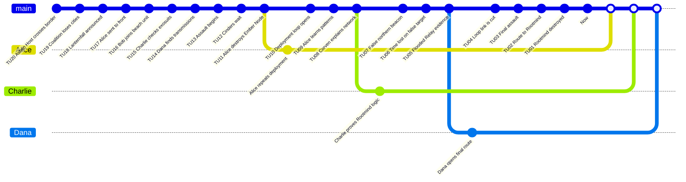

# Bataillon Cendre - Preparation MJ

Ce scenario original met en scene une enquete tactique dans une guerre contre une intelligence collective non humaine appelee l'Hote Cendreux.

## Premisse

L'Europe orientale est tombee. La coalition prepare l'operation Lanternfall sur la Cote du Sel Noir. L'assaut est un piege: les Cinders, sentinelles de l'Hote Cendreux, connaissent deja le plan. Alice detruit un Ember Node et se retrouve reliee au `Counter-System` ennemi: quand elle meurt, une `Branched Timeline` se rouvre au matin du deploiement.

La fausse cible est un phare de commandement au nord. La vraie source est le Rootmind cache dans le Flooded Relay.

## Verite du MJ

- La boucle n'est pas un pouvoir personnel: c'est une reaction du `Counter-System` ennemi.
- Les Cinders utilisent les echecs precedents comme donnees tactiques.
- Detruire le faux phare laisse le Rootmind intact.
- Une transfusion ou une synchronisation medicale peut couper Alice de la boucle.
- La victoire exige une derniere branche stable sans dependance a un reset infini.

## Main Timeline

| Time Unit | Visible or Discoverable Event |
|---:|---|
| 20 | L'Hote Cendreux traverse la frontiere est. |
| 19 | La coalition perd trois villes. |
| 18 | Le general Iren annonce Lanternfall. |
| 17 | Alice est envoyee au front par erreur disciplinaire. |
| 16 | Bob integre l'unite de plage. |
| 15 | Charlie inspecte les exosquelettes. |
| 14 | Dana identifie des transmissions ennemies. |
| 13 | L'assaut commence. |
| 12 | Les Cinders attendent deja la coalition. |
| 11 | Alice detruit un Ember Node. |
| 10 | La boucle de deploiement s'ouvre. |
| 9 | Alice apprend par repetitions. |
| 8 | Le docteur Corven explique le reseau. |
| 7 | Le phare nord est identifie a tort. |
| 6 | Le groupe perd du temps sur la fausse cible. |
| 5 | L'`Evidence` pointe vers le Flooded Relay. |
| 4 | Alice perd le lien de boucle apres traitement. |
| 3 | L'assaut final commence. |
| 2 | Dana ouvre une route vers le Rootmind. |
| 1 | Le Rootmind est detruit ou survit. |
| 0 | `Now`: le front se stabilise ou s'effondre. |

## Causal Table cachee

| ID | Conditions | Fact | Evidence |
|---|---|---|---|
| F01 | Simple: Lanternfall est public. | L'ennemi prepare une embuscade. | Ordres interceptes. |
| F02 | Dependency: F01. | Les Cinders massacrent la premiere vague. | Images de casque. |
| F03 | Dependency: F02. | Alice detruit un Ember Node. | Trace bioelectrique. |
| F04 | Dependency: F03. | Le `Counter-System` rouvre la branche. | Memoire conservee. |
| F05 | Dependency: F04. | Alice accumule des donnees tactiques. | Carnet de repetition. |
| F06 | Simple: le phare nord emet un signal. | Fausse cible credible. | Spectre radio. |
| F07 | Dependency: F05. | Corven identifie le Rootmind. | Carte sous-marine. |
| F08 | Dependency: F07. | Le groupe atteint le Flooded Relay. | Route d'assaut. |
| F09 | Dependency: F08. | Le Rootmind peut etre detruit. | Charge explosive. |

## Personnages

| Personnage | Role | Willpower | Health | Rewind Dice |
|---|---|---:|---:|---|
| Alice | Loop Bearer | 100 | 10 | d4, d6, d8, d10, d12, d20 |
| Bob | Investigator soldat | 100 | 10 | d4, d6, d8, d10, d12, d20 |
| Charlie | Investigator scientifique | 100 | 10 | d4, d6, d8, d10, d12, d20 |
| Dana | Investigator renseignement | 100 | 10 | d4, d6, d8, d10, d12, d20 |
| Rootmind | `Time Offender` collectif | 100 | Conflit | `Counter-System` |
| Iren | Commandement coalition | 80 | 10 | Aucun |
| Corven | Medecin reseau | 70 | 10 | Aucun |

## Statistiques de reference

| Joueur | Branches | Merged | Minor restants | Major restants | Total Rewind | Notes |
|---|---:|---:|---:|---:|---:|---|
| Alice | 3 | 2 | 0 | 0 | 3 | La boucle montre le danger mais reste limitee par le `Counter-System`. |
| Bob | 2 | 2 | 1 | 0 | 2 | Garde une pression militaire locale. |
| Charlie | 2 | 2 | 0 | 0 | 2 | Stabilise la vraie cible. |
| Dana | 2 | 2 | 0 | 0 | 2 | Ouvre la route finale. |

## GitGraph

Les points blancs correspondent aux `Merge` sur le `Now` de la branche `main`. Le carre blanc represente le `Now`.

