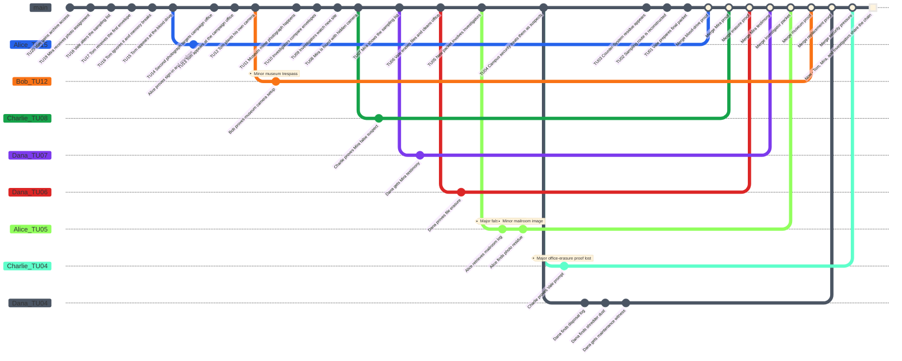

# Candid Chainletter - Preparation MJ

Cette preparation de scenario pour **Causality** est inspiree de l'idee de scenario "You're on Candid Chainletter" de *Continuum: Roleplaying in the Yet*. Elle est ecrite comme preparation de maitre de jeu, pas comme texte joueur.

Le scenario fonctionne comme une enquete causale compacte: les Investigators recoivent des photographies datees impossibles, decouvrent que la photographe apparente n'est pas la vraie source de la chaine, exposent un professeur utilisant un **Counter-System**, puis empechent la chaine de transformer les Investigators en preuves contre eux-memes.

## Scenario Premise

Dans le Now, Tom Calder demande l'aide des Investigators. Depuis plusieurs jours, il recoit des enveloppes contenant des photographies de lui-meme dans des lieux et a des heures precises. Chaque enveloppe arrive avant que Tom se souvienne d'avoir decide d'aller sur place. Quand il ignore une photographie, le System detecte une pression memoire incoherente. Quand il obeit, des archives publiques prouvent qu'il etait bien la.

Tom a essaye de surveiller la scene. Pendant l'incident du musee, il a installe sa propre camera a l'avance, mais la video ne montre aucun photographe visible. Les photographies existent pourtant.

La coupable visible semble etre Mira Lin, une etudiante qui realise un projet universitaire de photographie publique et de statistiques. Elle place bien des cameras cachees dans les lieux concernes, mais elle ne comprend pas pourquoi Tom revient dans son echantillon. La vraie source est le Professor Samuel Vale, son professeur de statistiques. Vale est un **Time Offender** qui utilise un **Counter-System** pour choisir des moments ou une personne peut etre forcee dans des archives publiques, puis brisee par les contradictions.

## Core Game Master Truth

- Tom Calder est une victime, pas la source des photographies.
- Mira Lin est une fausse suspecte. Elle prend les images, mais elle est manipulee.
- Professor Samuel Vale est le vrai **Time Offender**.
- Vale utilise un **Counter-System** pour choisir des points d'observation ou une cible devient de l'evidence.
- Les photographies ne sont pas des images du futur. Ce sont des preuves physiques tirees d'etats possibles dans le **Time Flow** ouvert, puis forcees dans la **Main Timeline** par le courrier, les cameras, les temoins et les logs publics.
- Vale veut identifier les Investigators, leur faire depenser leurs **Rewind Dice**, et creer des conflits non resolus autour de leur identite publique.
- Vale ne garde pas de notes evidentes dans son bureau. L'absence de notes est elle-meme une preuve.
- Si la chaine atteint proprement les Investigators, leurs propres archives publiques deviennent des armes contre eux.
- La solution finale coherente consiste a prouver que la liste d'echantillonnage de Mira a ete alteree, exposer le residu de **Counter-System** de Vale, et conserver les evenements photographies comme preuve de manipulation plutot que comme ordres a suivre.

## Main Timeline

Le **Time Flow** contient **20 Atomic Time Units** numerotes de **Time Unit 20**, evenement prepare le plus ancien, a **Time Unit 1**, dernier evenement prepare avant le present. **Now** est **Time Unit 0**. Le maitre de jeu prepare la **Main Timeline** suivante. Les joueurs ne recoivent pas les notes cachees au debut.

| Time Unit | Visible or Discoverable Event | Hidden GM Note |
|---|---|---|
| 20 | Professor Samuel Vale obtient acces a une salle d'archives experimentale a Eastbridge University. | La salle contient un fragment dormant de Counter-System dans du vieux materiel statistique. |
| 19 | Mira Lin recoit un devoir de statistiques base sur la photographie publique. | Vale peut utiliser le devoir comme couverture innocente. |
| 18 | Vale altere la liste d'echantillonnage de Mira. | Tom Calder devient une cible sans que Mira le sache. |
| 17 | Tom recoit la premiere enveloppe, le montrant a une collecte de sang. | L'enveloppe arrive avant que Tom comprenne l'evenement. |
| 16 | Tom ignore la premiere photographie et subit une rupture memoire. | Le System detecte une pression de Willpower par archives contradictoires. |
| 15 | Tom apparait a la collecte de sang et est photographie. | Les registres publics rendent l'evenement prouvable. |
| 14 | Tom recoit une deuxieme photographie liee a un bureau de campagne. | La chaine passe de la confusion privee a l'humiliation publique. |
| 13 | Tom apparait au bureau de campagne et est inscrit dans les logs. | Les temoins rendent le deni plus difficile. |
| 12 | Tom installe sa propre camera avant la photographie du musee. | Cela cree la contradiction clef: aucun photographe visible. |
| 11 | Tom apparait en mime de rue au musee. | La camera cachee de Mira prend l'image, mais celle de Tom ne voit aucun operateur. |
| 10 | Les Investigators comparent les enveloppes, les tampons postaux et les timestamps. | Le premier paquet d'evidence joueur se forme. |
| 9 | Alice, Bob, Charlie et Dana surveillent le prochain site predit. | Le groupe entre dans la chaine d'observation. |
| 8 | Les Investigators decouvrent Mira en train de placer une camera cachee. | Mira semble coupable mais elle est effrayee et confuse. |
| 7 | Mira explique le devoir et montre la liste d'echantillonnage. | La liste a ete alteree par Vale. |
| 6 | Vale efface les fichiers source et nettoie son bureau. | L'absence de notes devient de l'evidence. |
| 5 | Vale envoie un nouveau paquet impliquant les Investigators. | Alice apparait dans une photo qu'elle ne se souvient pas d'avoir vecue. |
| 4 | La securite du campus traite les Investigators comme des suspects. | Vale transforme les archives publiques en pression. |
| 3 | Le residu de Counter-System apparait sur le papier photo et les logs du courrier. | C'est la preuve technique que la chaine n'est pas ordinaire. |
| 2 | Les Investigators reconstruisent la route d'echantillonnage alteree. | Mira peut etre innocentee si la route est preservee. |
| 1 | Vale prepare un dernier paquet de chaine. | S'il passe proprement, un Investigator gardera un conflit d'identite non resolu. |
| 0 | Now: Tom, Mira et les Investigators sont dans la meme chaine photo. | La Main Timeline finale doit prouver la manipulation sans effacer tous les evenements photographies. |

## Initial Player Briefing

Donne seulement ces informations aux joueurs:

- Tom Calder a recu des photographies datees impossibles de lui-meme.
- Les photographies sont liees a des lieux publics, des archives publiques et des actions embarrassantes.
- La propre surveillance de Tom n'a trouve aucun photographe visible au musee.
- Une etudiante nommee Mira Lin peut etre connectee aux cameras.
- La derniere enveloppe montre Alice dans un lieu dont elle ne se souvient pas.
- La mission est d'identifier qui construit la chaine et de l'arreter sans detruire l'evidence necessaire pour prouver que Tom et Mira ont ete manipules.

Ne revele pas au debut que Professor Vale est un **Time Offender** ou que la liste d'echantillonnage de Mira a ete alteree.

## Hidden Causal Table

Utilise deux types de conditions:

- **Simple condition:** un etat requis du monde.
- **Dependency condition:** un fait antecedent requis, ecrit `Dependency: Fxx`.

| ID | Condition Type | Conditions | Fact | Evidence |
|---|---|---|---|---|
| F01 | Simple | Vale a acces a la salle d'archives et trouve un fragment dormant de Counter-System. | Vale peut observer des etats possibles de chaine photo. | Log de cle, residu materiel, vieux terminal statistique. |
| F02 | Simple | Mira recoit un devoir de statistiques base sur des photographies publiques. | Mira place des cameras cachees dans des sites publics. | Syllabus, formulaire d'emprunt camera, carnet de projet. |
| F03 | Dependency | Dependency: F01 and F02. Vale altere la liste d'echantillonnage de Mira. | Tom devient la premiere cible. | Liste alteree, timestamp terminal, seed aleatoire ecrasee. |
| F04 | Dependency | Dependency: F03. Vale envoie la premiere enveloppe. | Tom recoit une photographie avant de comprendre pourquoi il y apparait. | Enveloppe, tampon postal, residu sur papier photo. |
| F05 | Dependency | Dependency: F04. Tom tente de refuser la chaine. | Tom subit une rupture memoire et une pression du System. | Temoignage de Tom, alerte de ring, entree de journal contradictoire. |
| F06 | Dependency | Dependency: F04. Tom apparait a la collecte de sang. | La chaine gagne une confirmation publique. | Feuille d'inscription, temoignage de volontaire, photo de Mira. |
| F07 | Dependency | Dependency: F06. Vale intensifie la chaine. | Tom est lie au registre du bureau de campagne. | Log du personnel, boite de tracts, deuxieme enveloppe. |
| F08 | Dependency | Dependency: F07. Tom place sa camera avant l'incident du musee. | La scene du musee prouve le probleme d'operateur invisible. | Video de Tom, camera du musee, photographie en mime. |
| F09 | Dependency | Dependency: F08. Les Investigators suivent la piste camera. | Mira est decouverte mais reste une fausse suspecte. | Camera cachee, carte etudiante, temoignage effraye. |
| F10 | Dependency | Dependency: F09. Mira revele les donnees du devoir. | La liste alteree de Vale peut etre detectee. | Liste d'echantillonnage, fichier source manquant, commentaires du professeur. |
| F11 | Dependency | Dependency: F10. Vale nettoie son bureau et efface ses notes. | L'absence de notes devient suspecte. | Bureau vide, poussiere de destructeur, log de maintenance. |
| F12 | Dependency | Dependency: F01 and F11. Vale cible les Investigators. | Alice apparait dans une nouvelle photographie de chaine. | Photo d'Alice, log du courrier, residu de Counter-System. |
| F13 | Dependency | Dependency: F12. La securite du campus accepte les archives au premier degre. | Les Investigators deviennent des suspects publics. | Rapport de securite, image camera, badge visiteur incoherent. |
| F14 | Dependency | Dependency: F10 and F12. La route alteree est reconstruite. | Mira peut etre innocentee et Vale expose. | Carte de route, preuve de seed aleatoire, correspondance du residu. |
| F15 | Dependency | Dependency: F14. Le dernier paquet est intercepte ou reclasse comme evidence. | La chaine cesse de controler les Investigators. | Paquet scelle, analyse de laboratoire, rapport campus corrige. |

## Key Characters

| Character | Public Role | Real Function |
|---|---|---|
| Alice | Investigator presente dans le nouveau paquet | Premiere cible joueuse de la chaine. |
| Bob | Investigator specialise dans archives publiques et securite | Suit les logs, rapports et pressions de securite. |
| Charlie | Investigator specialise System et donnees | Trouve l'alteration aleatoire, le residu et les fichiers manquants. |
| Dana | Investigator specialise temoins et pression sociale | Innocente Mira et stabilise les temoins effrayes. |
| Tom Calder | Victime et source du briefing | Porte la chaine initiale d'evidence. |
| Mira Lin | Etudiante photographe | Fausse suspecte et productrice innocente d'evidence. |
| Professor Samuel Vale | Professeur de statistiques | Time Offender utilisant un Counter-System. |
| Campus Security | Pression d'autorite locale | Transforme les archives en conflits contre les Investigators. |
| Mailroom Clerk | Temoin procedural | Peut prouver l'entree des paquets dans le courrier normal. |

### Professor Vale as Time Offender

Vale est l'ennemi temporel actif controle par le MJ. Il utilise un **Counter-System** cache dans du materiel universitaire obsolete. Il n'est pas omniscient: il sait que sa chaine peut exposer des investigateurs temporels, mais il ne connait pas leur identite au debut.

| Awareness State | Trigger | GM Use |
|---|---|---|
| Unaware of identities | Debut de partie. Vale sait seulement que Tom a trouve une aide exterieure. | Il protege la liste d'echantillonnage et observe Mira. |
| Alerted | Les Investigators examinent tampons postaux, residu, donnees aleatoires ou piste camera de Mira. | Il efface des fichiers, change le timing du courrier ou cree un soupcon public. |
| Identified target | Vale relie un nom ou un visage a un savoir impossible. | Il envoie un paquet impliquant cet Investigator ou le fait accuser par la securite du campus. |

Vale possede un set de **Counter-System Rewind Dice**: d4, d6, d8, d10, d12 et d20. Ces des sont a usage unique. Les actions ordinaires comme mentir, effacer un fichier local ou appeler la securite ne depensent pas d'energie. Toute action qui rewind la causality, insere une photo depuis un etat possible, contamine de l'evidence dans une **Branched Timeline**, ou ajoute de la pression memoire depense un de de Counter-System.

## Character Stats and Rewind Dice

Chaque Investigator est un humain standard:

- maximum Willpower: `100`;
- Willpower actuelle de depart: `100`;
- Health: `10`;
- un set de des D&D classique;
- les **Rewind Dice** sont a usage unique: d4, d6, d8, d10, d12 et d20.

| Investigator | Role | Max Willpower | Current Willpower | Health | Rewind Dice Available | Rewind Dice Spent |
|---|---|---:|---:|---:|---|---|
| Alice | Premiere cible Investigator | 100 | 100 | 10 | d4, d6, d8, d10, d12, d20 | None |
| Bob | Archives publiques et securite | 100 | 100 | 10 | d4, d6, d8, d10, d12, d20 | None |
| Charlie | System et analyse des donnees | 100 | 100 | 10 | d4, d6, d8, d10, d12, d20 | None |
| Dana | Temoins et pression sociale | 100 | 100 | 10 | d4, d6, d8, d10, d12, d20 | None |

| NPC | Role | Relevant Branched Timelines or Pressure | Max Willpower | Current Willpower | Health |
|---|---|---:|---:|---:|---:|
| Tom Calder | Victime et source du briefing | 3 | 100 | 10 | 10 |
| Mira Lin | Fausse suspecte | 1 | 100 | 70 | 10 |
| Professor Samuel Vale | Time Offender | 2 | 100 | 40 | 10 |
| Mailroom Clerk | Temoin procedural | 0 | 100 | 100 | 10 |
| Campus Security Guard | Pression d'autorite locale | 0 | 100 | 100 | 10 |

## Complete Playthrough

Ce deroule montre volontairement les quatre resultats de Rewind, les consequences de reussite partielle, les gains d'echec partiel, les Minor Conflicts, les Major Conflicts, une action de Time Offender, un conflit resolu par la branche d'un autre joueur, et une branche qui cree plusieurs **Visible or Discoverable Events**.

### Complete Replay Log

**GM turn.** Le MJ ouvre le Time Flow et donne le briefing: Tom possede des photographies impossibles, sa camera n'a vu aucun photographe visible, Mira est connectee aux cameras, et Alice apparait dans le dernier paquet.

**Alice turn.** Alice depense son d20 pour cibler Time Unit `15`. Valeur forcee: `d20 -> 14`, donc `r = 93.33%`: critical success. Alice prouve la presence de Tom a la collecte de sang et la correspondance avec la premiere enveloppe. Une branche non-Merged donne `100 - 30 = 70` Willpower.

**Bob turn.** Bob depense son d12 pour cibler Time Unit `12`. Valeur forcee: `d12 -> 7`, donc `r = 58.33%`: partial success. Consequence forcee `d10 -> 8`: Minor Conflict. Bob prouve que Tom a installe une camera avant la photo du musee, mais un rapport de securite identifie Bob comme intrus pres des archives du musee. Bob a une branche non-Merged et un Minor Conflict non resolu: `100 - 30 - 20 = 50` Willpower.

**Charlie turn.** Charlie depense son d10 pour cibler Time Unit `8`. Valeur forcee: `d10 -> 3`, donc `r = 37.5%`: partial failure. Aucune branche stable ne s'ouvre. Gain force `d10 -> 6`: type d'Evidence manquant. Le MJ revele que la preuve manquante n'est pas une autre photo, mais le fichier source statistique original. Charlie reste a `100` Willpower.

**Dana turn.** Dana depense son d8 pour cibler Time Unit `18`. Valeur forcee: `d8 -> 1`, donc `r = 5.56%`: critical failure. Aucune branche ne s'ouvre, aucun gain n'est tire, et le d8 est depense. Dana reste a `100` Willpower.

**GM turn.** Vale devient **Alerted** parce que les Investigators suivent les cameras et les tampons postaux.

**Alice turn.** Alice merge sa branche de collecte de sang. Le MJ accepte car elle preserve la feuille d'inscription et clarifie que Tom a ete manipule. Alice revient a `100` Willpower.

**Bob turn.** Bob tente de resoudre le Minor Conflict d'intrusion au musee a difficulte moyenne. Willpower `50`, seuil `50`, jet percentile force `30`. Echec: le rapport identifie toujours Bob. Bob reste a `50` Willpower et sa branche est bloquee.

**Charlie turn.** Charlie depense son d12 pour cibler Time Unit `8` a nouveau. Valeur forcee: `d12 -> 10`, donc `r = 125%`: critical success. Charlie trouve la camera cachee de Mira, son carnet de projet et le formulaire d'emprunt. Il prouve que Mira a pris l'image mais n'a pas choisi Tom. Sa branche merge proprement.

**Dana turn.** Dana depense son d20 pour cibler Time Unit `6`. Valeur forcee: `d20 -> 12`, donc `r = 200%`: critical success. Dana prouve que Vale a efface les fichiers source et nettoye son bureau. Sa branche merge.

**GM turn.** Vale identifie Alice comme cible et depense son Counter-System d8 pour cibler Time Unit `5`. Valeur forcee: `d8 -> 4`, donc `r = 80%`: critical success. Vale cree un faux paquet montrant Alice volant la camera de Mira. Cela cree **Major false camera theft**, un Major Conflict pour Alice.

**Alice turn.** Alice depense son d6 pour cibler Time Unit `5`. Valeur forcee: `d6 -> 3`, donc `r = 60%`: partial success. Consequence forcee `d10 -> 7`: trace visible. Alice recupere le log du courrier et le residu du papier photo, mais son premier geste laisse une image camera d'elle dans la salle courrier. Alice a une branche non-Merged et un Major Conflict non resolu: `100 - 30 - 40 = 30` Willpower.

**Bob turn.** Bob depense son d10 pour cibler Time Unit `14`. Valeur forcee: `d10 -> 4`, donc `r = 28.57%`: partial failure. Aucune branche ne s'ouvre. Gain force `d10 -> 8`: indice de dependency. Le MJ revele que la chaine exige la route camera de Mira avant que Vale puisse forcer Tom dans une archive publique.

**Charlie turn.** Charlie depense son d8 pour cibler Time Unit `11`. Valeur forcee: `d8 -> 5`, donc `r = 45.45%`: partial failure. Aucune branche ne s'ouvre. Gain force `d10 -> 9`: apercu de conflit. Le MJ avertit qu'effacer la video de Tom creerait un Major Conflict.

**Dana turn.** Dana depense son d10 pour cibler Time Unit `7`. Valeur forcee: `d10 -> 8`, donc `r = 114.29%`: critical success. Dana obtient le temoignage de Mira et la liste du devoir avant contamination. Cela cree la cause corrective qui resout le Major Conflict d'Alice: Mira a ete manipulee et Alice n'avait pas besoin de voler la camera pour le prouver. La branche de Dana merge.

**GM turn.** Vale identifie Dana et depense son Counter-System d12 pour cibler Time Unit `6`. Valeur forcee: `d12 -> 8`, donc `r = 133.33%`: critical success. Vale contamine le fichier source statistique pour faire croire que Mira a ecrit elle-meme la route alteree. Dana gagne un Minor Conflict non resolu: **Mira self-authored list**.

**Alice turn.** Alice tente de merge sa branche Time Unit `5`. La branche de Dana a resolu le Major Conflict, mais Alice garde la trace visible de la salle courrier. Pression: une branche non-Merged et un Minor Conflict, donc `100 - 30 - 20 = 50` Willpower. Elle lance percentile `80` contre seuil `50`, reussit, et la trace devient un flou anonyme. La branche merge et Alice revient a `100` Willpower.

**Bob turn.** Bob retente son conflit d'intrusion au musee. Willpower `50`, seuil `50`, jet percentile force `70`. Succes: le rapport devient une alarme generique apres fermeture. Sa branche merge et Bob revient a `100` Willpower.

**Charlie turn.** Charlie depense son d6 pour cibler Time Unit `4`. Valeur forcee: `d6 -> 2`, donc `r = 50%`: partial success. Consequence forcee `d10 -> 10`: Major Conflict. Charlie prouve que la securite a ete declenchee par Vale, mais son premier geste retire l'absence du bureau nettoye avant que le groupe puisse prouver l'effacement. Cela cree **Major office-erasure proof lost**. Charlie a une branche non-Merged et un Major Conflict non resolu: `100 - 30 - 40 = 30` Willpower.

**Dana turn.** Dana depense son d6 pour cibler Time Unit `4`. Valeur forcee: `d6 -> 6`, donc `r = 150%`: critical success. Dana cree une evidence de remplacement: log de maintenance, poussiere de destructeur et temoin qui a vu Vale porter une boite d'archives. Cela resout le Major Conflict de Charlie et le Minor Conflict **Mira self-authored list**. Sa branche merge.

**GM turn.** Vale tente un dernier coup de Counter-System. Il depense son d20 pour cibler Time Unit `3`. Valeur forcee: `d20 -> 7`, donc `r = 233.33%`: critical success. Il envoie le dernier paquet a la securite du campus pour faire accuser le groupe. Comme les joueurs possedent deja la route, le residu, le courrier et l'evidence de destruction, cela devient une pression finale plutot qu'un blocage automatique.

**Charlie turn.** Charlie merge sa branche Time Unit `4` grace a l'evidence de remplacement de Dana. Le Major Conflict est resolu par la branche d'un autre joueur, donc la branche peut merge. Charlie revient a `100` Willpower.

**Final GM resolution.** La securite du campus tente de retenir Bob pendant la remise finale. Aucun attack roll n'est fait. Le garde utilise une matraque, objet improvise non lethal, donc le MJ lance `d6 -> 2` damage. Bob passe de `10` a `8` Health. Le dernier paquet est intercepte et reclasse comme evidence. Vale est expose comme Time Offender, Mira est innocentee, les archives publiques de Tom restent sur la Main Timeline comme preuve de manipulation, et les Investigators preservent un Now coherent.

### Complete Scenario GitGraph

Dans ce GitGraph, chaque point blanc sur la branche `main` correspond a un merge sur le Now. Le carre blanc represente le Now lui-meme.

### Final Play State

| Investigator | Final Willpower | Final Health | Rewind Dice Spent | Open Conflicts | Final State |
|---|---:|---:|---|---:|---|
| Alice | 100 | 10 | d20, d6 | 0 | Innocentee du paquet; trace courrier corrigee |
| Bob | 100 | 8 | d12, d10 | 0 | Rapport musee corrige; blesse pendant l'interpellation finale |
| Charlie | 100 | 10 | d10, d12, d8, d6 | 0 | Chaine technique de Vale exposee |
| Dana | 100 | 10 | d8, d20, d10, d6 | 0 | Mira innocentee et evidence de remplacement securisee |

### Player Statistics

| Investigator | Total Branched Timelines | Merged Branched Timelines | Open Branched Timelines | Minor Conflicts Created | Minor Conflicts Resolved | Major Conflicts Created | Major Conflicts Resolved | Rewind Dice Spent | Rewind Dice Full Successes | Rewind Dice Partial Successes | Rewind Dice Partial Failures | Rewind Dice Full Failures | Willpower Tests | Willpower Test Successes | Lowest Willpower | Final Health |
|---|---:|---:|---:|---:|---:|---:|---:|---:|---:|---:|---:|---:|---:|---:|---:|---:|
| Alice | 2 | 2 | 0 | 1 | 1 | 1 | 1 | 2 | 1 | 1 | 0 | 0 | 1 | 1 | 30 | 10 |
| Bob | 1 | 1 | 0 | 1 | 1 | 0 | 0 | 2 | 0 | 1 | 1 | 0 | 2 | 1 | 50 | 8 |
| Charlie | 2 | 2 | 0 | 0 | 0 | 1 | 1 | 4 | 1 | 1 | 2 | 0 | 0 | 0 | 30 | 10 |
| Dana | 3 | 3 | 0 | 1 | 1 | 0 | 0 | 4 | 3 | 0 | 0 | 1 | 0 | 0 | 70 | 10 |
| **Total** | **8** | **8** | **0** | **3** | **3** | **2** | **2** | **12** | **5** | **3** | **3** | **1** | **3** | **2** | **30** | **38** |
