# Scenario Edge of Tomorrow - Preparation MJ

Ce document est une structure de playtest pour **Causality**, basee sur le resume fourni de *Edge of Tomorrow*. Il s'agit d'une preparation de **MJ**, pas d'un texte destine directement aux joueurs.

Le scenario fonctionne mieux comme boucle d'enquete tactique : les **Investigators** pensent d'abord devoir survivre a un debarquement, alors que le vrai objectif jouable est de comprendre la structure de commandement Mimic, identifier l'Omega comme **Time Offender** utilisant un **Counter-System**, rejeter la fausse cible, identifier l'emplacement de l'Omega, et preserver un **Now** final coherent apres la rupture de la boucle.

Pour cette table, **Alice** est la **Loop Bearer Investigator**. Elle remplace le role de William Cage comme officier de communication force d'aller au front. **Bob**, **Charlie** et **Dana** sont d'autres **Investigators** integres a l'escouade J et a la structure de commandement de la coalition. William Cage peut etre retire, conserve comme alias, ou utilise comme dossier de propagande hors champ.

## Premisse du scenario

Les Mimics envahissent l'Europe. L'Allemagne est tombee, la France est proche de l'effondrement, et Londres sera la prochaine cible si la coalition echoue. Le general Brigham pense que **Operation Twilight** brisera le front alien. Il envoie Alice couvrir l'operation comme symbole de communication, mais elle refuse la premiere ligne. Brigham la fait arreter, la fait passer pour desertrice, et la transfere dans l'escouade J.

L'assaut est un guet-apens. Les Mimics savent que l'attaque arrive parce que leur organisme de commandement, l'**Omega**, est un **Time Offender** utilisant un **Counter-System** via les Alpha Mimics. Alice tue un Alpha et est aspergee par son sang. A partir de cet instant, sa mort permet au **Counter-System** de l'Omega de rouvrir le meme etat de **Branched Timeline** : Alice revient au matin avant le deploiement avec les souvenirs des tentatives precedentes.

Rita Vrataski et le docteur Carter savent reconnaitre le phenomene. Rita a eu le meme pouvoir apres Verdun et l'a perdu apres une transfusion. Carter comprend que l'Alpha n'est pas le chef : c'est un noeud. L'Omega est la tete. Le premier emplacement apparent, la Suisse, est un faux signal. Le vrai Omega est cache sous le Louvre.

## Verite cachee du MJ

- **Operation Twilight** n'est pas une percee ; c'est un guet-apens.
- Les Mimics ne font pas que predire la coalition. L'Omega corrige les issues defavorables via un reseau de **Counter-System**.
- Alice devient la **Loop Bearer** apres avoir tue un Alpha et recu son sang.
- La boucle ramene toujours Alice au meme point de depart de **Branched Timeline** tant que le pouvoir n'est pas perdu.
- Rita Vrataski a eu le meme pouvoir a Verdun et l'a perdu apres une transfusion.
- Le docteur Carter sait que l'ennemi est un organisme distribue : les Drones agissent, les Alphas signalent, et l'Omega utilise le **Counter-System** pour rouvrir les branches echouees.
- Le signal suisse est un piege ou un faux signal cree par le reseau Omega.
- L'Omega est cache sous le Louvre.
- Une transfusion coupe Alice de la boucle. Apres cela, il n'y a plus de reset automatique.
- Tuer l'Omega neutralise le **Counter-System** Mimic et permet aux **Investigators** de tenter un **Merge** final vers un **Now** de victoire.
- Si la **Main Timeline** finale tue l'Omega mais rend la boucle d'Alice impossible, la realite diverge sauf si l'ancre de boucle par sang d'Alpha ou une explication causale equivalente est preservee.

## Main Timeline

Le **Time Flow** possede toujours **20 Atomic Time Units**. Le **MJ** prepare la **Main Timeline** suivante. Les joueurs ne doivent pas recevoir les notes cachees au debut.

| Time Unit | Evenement visible ou decouvrable | Note cachee du MJ |
|---|---|---|
| 1 | Les Mimics envahissent l'Europe. | Le reseau Omega est deja actif. |
| 2 | L'Allemagne tombe. | La strategie de coalition devient desesperee et trop confiante. |
| 3 | La France faiblit et Londres devient la prochaine cible strategique. | Brigham a besoin d'une victoire publique avant l'effondrement. |
| 4 | Le general Brigham prepare Operation Twilight. | L'operation repose sur une fausse confiance. |
| 5 | Alice recoit l'ordre d'aller au front comme couverture de communication. | Son refus permet a Brigham de detruire son autorite. |
| 6 | Alice est arretee, etiquetee desertrice, et affectee a l'escouade J. | Son identite et sa credibilite sont detruites avant la boucle. |
| 7 | L'escouade J deploie ses exosquelettes. | Alice ne sait pas utiliser son armure. |
| 8 | L'assaut sur la plage devient un massacre. | Les Mimics connaissaient le plan. |
| 9 | Alice tue un Alpha et meurt dans son sang. | Cela lie Alice au **Counter-System** de l'Omega et cree la **Blood Loop**. |
| 10 | Le **Counter-System** de l'Omega rouvre l'etat de **Branched Timeline** du matin de deploiement. | Alice se souvient. Le reste du monde non. |
| 11 | Alice repete l'assaut et progresse par l'echec. | Traiter les tentatives repetees comme Evidence de boucle, pas comme scenes completes. |
| 12 | Rita reconnait le savoir impossible d'Alice. | Rita est le pont de credibilite de la boucle. |
| 13 | Carter explique la structure Alpha/Omega. | L'ennemi ne peut etre battu qu'en trouvant Omega. |
| 14 | Alice s'entraine avec Rita a travers de nombreuses morts. | La pression de Volonte augmente parce qu'Alice se souvient de chaque echec. |
| 15 | Alice suit le signal suisse. | Le signal est faux ou incomplet. |
| 16 | Alice est blessee et transfusee. | La **Blood Loop** est perdue. Plus de reset automatique. |
| 17 | Carter identifie le Louvre comme vrai emplacement d'Omega. | C'est la dependance clef de l'assaut final. |
| 18 | Alice, Rita, Bob, Charlie, Dana et l'escouade J attaquent le Louvre. | C'est la branche finale sans droit a l'erreur. |
| 19 | Rita meurt et Alice atteint l'Omega. | Alice doit accepter un sacrifice coherent. |
| 20 | Alice detruit l'Omega et est exposee a nouveau au sang d'Alpha. | Le **Merge** final peut produire un **Now** de victoire coherent avant la rencontre avec Brigham. |

### Graphique Mermaid de la Main Timeline

```mermaid
flowchart LR
  TU01["TU01<br/>Les Mimics envahissent l'Europe"] --> TU02["TU02<br/>L'Allemagne tombe"]
  TU02 --> TU03["TU03<br/>Londres menacee"]
  TU03 --> TU04["TU04<br/>Operation Twilight preparee"]
  TU04 --> TU05["TU05<br/>Alice envoyee au front"]
  TU05 --> TU06["TU06<br/>Alice affectee a l'escouade J"]
  TU06 --> TU07["TU07<br/>Escouade J deployee"]
  TU07 --> TU08["TU08<br/>Guet-apens sur la plage"]
  TU08 --> TU09["TU09<br/>Sang d'Alpha cree la boucle"]
  TU09 --> TU10["TU10<br/>Counter-System rouvre la branche"]
  TU10 --> TU11["TU11<br/>Apprentissage par boucles"]
  TU11 --> TU12["TU12<br/>Rita reconnait Alice"]
  TU12 --> TU13["TU13<br/>Carter explique Omega"]
  TU13 --> TU14["TU14<br/>Morts d'entrainement"]
  TU14 --> TU15["TU15<br/>Signal suisse"]
  TU15 --> TU16["TU16<br/>Transfusion, boucle brisee"]
  TU16 --> TU17["TU17<br/>Louvre prouve"]
  TU17 --> TU18["TU18<br/>Assaut final"]
  TU18 --> TU19["TU19<br/>Rita meurt, Alice atteint Omega"]
  TU19 --> TU20["TU20<br/>Omega detruit, Merge de victoire"]
```

## Briefing initial des joueurs

Donne seulement ceci aux joueurs :

- L'Europe s'effondre sous l'invasion Mimic.
- L'Allemagne est tombee et Londres sera bientot menacee.
- Le general Brigham pense qu'Operation Twilight sera decisive.
- Alice a ete forcee d'integrer l'escouade J apres avoir refuse une mission de propagande au front.
- Rita Vrataski est une soldate legendaire de Verdun.
- Le docteur Carter est discredite, mais suit encore les comportements Mimic anormaux.
- La mission semble etre : survivre au debarquement, comprendre pourquoi il echoue, et trouver comment stopper les Mimics.

Ne revele pas d'abord que la mort d'Alice permet a l'Omega de rouvrir la meme branche, que la Suisse est fausse, ou que l'Omega se trouve sous le Louvre.

## Table causale cachee

Utilise deux types de conditions :

- **Condition simple** : un etat du monde requis.
- **Condition de dependance** : un fait antecedent requis, note `Dependency: Fxx`.

| ID | Type de condition | Conditions | Fact | Evidence |
|---|---|---|---|---|
| F01 | Simple | Les Mimics controlent l'Europe continentale. | Londres est sous menace strategique. | Carte de guerre, rapports de refugies, front allemand detruit. |
| F02 | Dependency | Dependency: F01. Brigham fait confiance a Operation Twilight. | La coalition engage l'assaut sur la plage. | Dossier de briefing, calendrier d'invasion, ordre de propagande. |
| F03 | Dependency | Dependency: F02. Alice refuse le devoir de front. | Alice perd son statut et rejoint l'escouade J. | Ordre d'arrestation, etiquette de desertion, dossier de transfert. |
| F04 | Dependency | Dependency: F02. Les Mimics connaissent le plan d'assaut. | Le debarquement est un guet-apens. | Morts repetees, positions ennemies, timing de reponse impossible. |
| F05 | Dependency | Dependency: F04. Alice tue un Alpha en mourant. | Alice est liee au **Counter-System** de l'Omega et recoit la Blood Loop. | Cadavre d'Alpha, exposition au sang noir, memoire de branche rouverte. |
| F06 | Dependency | Dependency: F05. Alice meurt apres le transfert de sang Alpha. | Le **Counter-System** de l'Omega rouvre l'etat de **Branched Timeline** du matin de deploiement. | Reveil repete, baraquement inchange, memoire conservee. |
| F07 | Dependency | Dependency: F06. Alice montre un savoir impossible. | Rita identifie le schema de boucle. | Test de Rita, evenements de champ de bataille predits, reaction d'entrainement. |
| F08 | Dependency | Dependency: F07. Carter explique l'organisme ennemi. | Les Alphas sont des noeuds de signal et Omega est la source de commandement. | Notes de Carter, donnees de Verdun, schemas biologiques aliens. |
| F09 | Dependency | Dependency: F08. Alice suit le signal suisse. | La Suisse est fausse, incomplete ou manipulee. | Route echouee, site vide, vision contradictoire. |
| F10 | Dependency | Dependency: F08. Alice est transfusee apres blessure. | Alice perd la Blood Loop. | Dossier hospitalier, sang melange, test de reset echoue. |
| F11 | Dependency | Dependency: F09 et F10. Carter reinterprete le signal apres la perte de boucle. | L'Omega est sous le Louvre. | Superposition de cartes, acces immerge, motif de mouvement Mimic. |
| F12 | Dependency | Dependency: F11. L'escouade J atteint le Louvre apres la perte de boucle. | L'assaut final n'a pas de reset automatique. | Route de l'escouade J, transport vole, risque sans boucle. |
| F13 | Dependency | Dependency: F12. Alice atteint l'Omega apres la mort de Rita. | Alice peut detruire l'Omega. | Dernier combat de Rita, charge explosive, chambre Omega. |
| F14 | Dependency | Dependency: F13. Le sang d'Alpha atteint Alice pendant la mort d'Omega. | Le **Merge** final peut produire un **Now** de victoire coherent. | Effondrement Mimic, continuite avant la reunion, Rita vivante au baraquement. |

### Graphique Mermaid de la table causale

```mermaid
flowchart LR
  classDef condition fill:#fef3c7,stroke:#a16207,color:#0f172a
  classDef dependency fill:#fde68a,stroke:#a16207,color:#0f172a
  classDef fact fill:#dcfce7,stroke:#166534,color:#0f172a
  classDef evidence fill:#ede9fe,stroke:#7c3aed,color:#0f172a

  C01["C01 Simple<br/>Les Mimics controlent l'Europe"]:::condition --> F01["F01<br/>Londres menacee"]:::fact --> E01["E01<br/>Carte de guerre"]:::evidence
  F01 --> C02["C02 Dependency<br/>Brigham croit a Operation Twilight"]:::dependency --> F02["F02<br/>La coalition engage l'assaut"]:::fact --> E02["E02<br/>Dossier de briefing"]:::evidence
  F02 --> C03["C03 Dependency<br/>Alice refuse"]:::dependency --> F03["F03<br/>Alice rejoint l'escouade J"]:::fact --> E03["E03<br/>Ordre d'arrestation"]:::evidence
  F02 --> C04["C04 Dependency<br/>Les Mimics connaissent le plan"]:::dependency --> F04["F04<br/>Guet-apens"]:::fact --> E04["E04<br/>Morts repetees"]:::evidence
  F04 --> C05["C05 Dependency<br/>Alice tue un Alpha"]:::dependency --> F05["F05<br/>Blood Loop commence"]:::fact --> E05["E05<br/>Sang d'Alpha"]:::evidence
  F05 --> C06["C06 Dependency<br/>Alice meurt"]:::dependency --> F06["F06<br/>Counter-System rouvre la branche"]:::fact --> E06["E06<br/>Memoire conservee"]:::evidence
  F06 --> C07["C07 Dependency<br/>Savoir impossible"]:::dependency --> F07["F07<br/>Rita identifie la boucle"]:::fact --> E07["E07<br/>Test de Rita"]:::evidence
  F07 --> C08["C08 Dependency<br/>Carter explique l'organisme"]:::dependency --> F08["F08<br/>Omega commande"]:::fact --> E08["E08<br/>Notes de Carter"]:::evidence
  F08 --> C09["C09 Dependency<br/>Signal suisse suivi"]:::dependency --> F09["F09<br/>Fausse cible"]:::fact --> E09["E09<br/>Site vide"]:::evidence
  F08 --> C10["C10 Dependency<br/>Alice transfusee"]:::dependency --> F10["F10<br/>Boucle perdue"]:::fact --> E10["E10<br/>Dossier hospitalier"]:::evidence
  F09 --> C11["C11 Dependency<br/>Signal reinterprete"]:::dependency
  F10 --> C11
  C11 --> F11["F11<br/>Omega sous le Louvre"]:::fact --> E11["E11<br/>Superposition de cartes"]:::evidence
  F11 --> C12["C12 Dependency<br/>Route finale escouade J"]:::dependency --> F12["F12<br/>Assaut sans reset"]:::fact --> E12["E12<br/>Transport vole"]:::evidence
  F12 --> C13["C13 Dependency<br/>Alice atteint Omega"]:::dependency --> F13["F13<br/>Omega peut etre detruit"]:::fact --> E13["E13<br/>Charge explosive"]:::evidence
  F13 --> C14["C14 Dependency<br/>Sang d'Alpha pendant la mort d'Omega"]:::dependency --> F14["F14<br/>Merge vers Now de victoire"]:::fact --> E14["E14<br/>Effondrement Mimic"]:::evidence
```

## Regle speciale : Blood Loop

La **Blood Loop** est une regle de scenario, pas un pouvoir par defaut. Elle represente le **Counter-System** de l'Omega qui force la reouverture d'un etat connu de **Branched Timeline** autour d'Alice.

- Seule la **Loop Bearer** conserve automatiquement la memoire.
- Avant la transfusion, la mort de la **Loop Bearer** ne termine pas le scenario. Le **Counter-System** de l'Omega rouvre son etat a la **Time Unit** 10.
- Chaque boucle peut reveler une nouvelle **Evidence**, confirmer une **Condition**, ou tester une route de combat.
- Ne joue pas toutes les boucles repetees en detail. Utilise un montage sauf si la boucle introduit un nouveau **Fact**, une **Evidence** ou un conflit.
- Toutes les trois morts memorisees creent une penalite temporaire de `-5` a la **Volonte** de la **Loop Bearer** jusqu'au prochain **Merge** propre.
- La transfusion de la **Time Unit** 16 termine la **Blood Loop**. Apres ce point, la mort est finale sauf si une autre regle explicite de scenario ou le **Merge** final d'Omega preserve un **Now** coherent.
- Une reouverture de boucle ne **Merge** pas automatiquement les facts. Le groupe doit toujours prouver la chaine causale par les Evidence.

## Personnages clefs

| Nom | Role | Usage MJ |
|---|---|---|
| Alice | Loop Bearer Investigator | Commence reticente et non entrainee, puis devient porteuse de memoire. |
| Bob | Investigator tactique de l'escouade J | Suit les routes de plage, positions ennemies et logistique de l'assaut final. |
| Charlie | Investigator scientifique | Travaille avec Carter pour interpreter les Evidence Alpha/Omega. |
| Dana | Investigator medecin et moral | Suit les blessures, le risque de transfusion et la survie de l'escouade. |
| Rita Vrataski | Soldate veterane | Reconnait la boucle et entraine Alice. |
| Docteur Carter | Scientifique discredite | Explique l'organisme ennemi et transforme les Evidence en strategie. |
| General Brigham | Commandant de coalition | Cree la pression initiale et peut bloquer l'acces a l'escouade J. |
| Escouade J | Escouade d'assaut | Fournit les enjeux humains et les ressources de l'assaut final. |
| Alpha Mimic | Noeud de signal | Cree la **Blood Loop** et peut proteger le reseau Omega. |
| Omega | Source de commandement **Time Offender** | Cible finale cachee sous le Louvre ; utilise un **Counter-System** via les Alpha Mimics. |

## Caracteristiques et Rewind Dice

Chaque **Investigator** est un humain de base :

- **Volonte** maximum : `100` ;
- **Volonte** actuelle de depart : `100` ;
- points de vie : `10` ;
- un set de des D&D classique ;
- les **Rewind Dice** sont a usage unique.

Gestion simple recommandee : la **Blood Loop** rouvre la position de scene et les connaissances, mais pas les **Rewind Dice** depenses. Cela garde l'energie du **System** importante et evite les tentatives mecaniques infinies.

| Investigator | Role | Volonte max | Volonte actuelle | Points de vie | Rewind Dice disponibles |
|---|---|---:|---:|---:|---|
| Alice | Loop Bearer | 100 | 100 | 10 | d4, d6, d8, d10, d12, d20 |
| Bob | Routes tactiques | 100 | 100 | 10 | d4, d6, d8, d10, d12, d20 |
| Charlie | Science et Evidence | 100 | 100 | 10 | d4, d6, d8, d10, d12, d20 |
| Dana | Medecine et survie d'escouade | 100 | 100 | 10 | d4, d6, d8, d10, d12, d20 |

## Hooks de Branched Timeline recommandes

| Time Unit cible | Distance de rewind | Rewind Die suggere | Question utile |
|---|---:|---|---|
| 18 | 2 | d4 | L'escouade J peut-elle atteindre la chambre du Louvre apres la perte de boucle ? |
| 17 | 3 | d4 | Qu'est-ce qui prouve l'emplacement du Louvre ? |
| 16 | 4 | d4 | Qu'est-ce qui brise exactement la Blood Loop ? |
| 15 | 5 | d6 | Pourquoi la Suisse est-elle la mauvaise cible ? |
| 14 | 6 | d6 | Quelle route d'entrainement garde Alice en vie le plus longtemps ? |
| 12 | 8 | d8 | Pourquoi Rita croit-elle Alice ? |
| 10 | 10 | d10 | Qu'est-ce qui se rouvre quand Alice meurt ? |
| 9 | 11 | d12 | Qu'a fait le sang d'Alpha ? |
| 8 | 12 | d12 | Pourquoi l'assaut sur la plage etait-il un guet-apens ? |
| 4 | 16 | d20 | Pourquoi Brigham a-t-il engage Operation Twilight ? |

## Regles de conflit pour ce scenario

Conflits mineurs :

- Alice revele un savoir impossible trop tot et est retenue.
- L'escouade J traite Alice comme lache, desertrice ou instable.
- Une boucle d'entrainement modifie la confiance de Rita sans modifier la **Main Timeline** externe.
- Le groupe suit le signal suisse sans prouver la dependance du Louvre.
- Les notes de Carter sont saisies avant que Charlie puisse les preserver.
- Dana empeche la transfusion, mais Alice reste trop blessee pour continuer.

Conflits majeurs :

- La coalition annule Operation Twilight avant que la **Blood Loop** existe.
- Alice ne tue jamais l'Alpha et ne devient jamais **Loop Bearer**.
- Rita meurt avant d'identifier la boucle.
- Carter est retire avant d'expliquer la structure Alpha/Omega.
- Alice evite la transfusion mais le groupe utilise les reouvertures de boucle indefiniment au lieu d'atteindre une convergence finale.
- L'Omega est detruit sans explication coherente pour le **Now** de victoire final.

## Conditions de merge

Pour obtenir une convergence complete, la **Main Timeline** finale doit preserver ces facts :

1. Operation Twilight a lieu, ou un assaut equivalent expose le guet-apens Mimic.
2. Alice tue un Alpha et devient **Loop Bearer**.
3. Rita et Carter identifient la structure Alpha/Omega.
4. La Suisse est rejetee comme cible finale.
5. La **Blood Loop** est perdue avant l'assaut final.
6. L'emplacement du Louvre est prouve par des Evidence.
7. L'escouade J atteint Omega sans dependance a un autre reset.
8. Omega est detruit.
9. Le **Now** final reste coherent : les Mimics s'effondrent, et Alice revient a un etat stable avant la reunion avec Brigham ou a un autre etat de victoire equivalent.

## Fins possibles

| Fin | Condition | Resultat |
|---|---|---|
| Convergence complete | Omega est detruit et le Now final reste coherent. | Les Mimics s'effondrent, Alice se souvient assez pour retrouver Rita, et la victoire de coalition devient observable. |
| Victoire tactique, rupture causale | Omega est detruit, mais aucune ancre de boucle stable n'explique le Now final. | La guerre est gagnee, mais la realite des Investigators diverge de l'origine. |
| Epuisement de boucle | Alice perd sa Volonte ou l'energie du System avant de prouver le Louvre. | La boucle devient un effondrement psychologique plutot qu'une victoire. |
| Echec sur fausse cible | Le groupe transforme la Suisse en verite finale. | Omega survit, la defaite sur la plage reste inevitable, et Londres tombe. |
| Echec de l'assaut final | La boucle est perdue et l'escouade J ne peut pas atteindre Omega. | La mort est finale ; le reseau Mimic continue. |

## Deroulement simule

Ce replay a ete resolu avec `scripts/simulate_dice_rolls.py`. Chaque Rewind utilise `--causality --distance` et les seuils actuels de Rewind Percentage.

**Tour du MJ.** Le MJ ouvre le Time Flow sur le Now de guerre. Operation Twilight, le guet-apens de plage et la reputation de Rita sont visibles. Omega est cache comme Time Offender.

**Tour d'Alice.** Alice depense son d20 vers la Time Unit 9, distance `11`. Le script donne `d20 -> 13`, `r = 118.18%` : reussite critique. Elle prouve que le sang d'Alpha cree la Blood Loop. Volonte `70`.

**Tour de Bob.** Bob depense son d12 vers la Time Unit 8, distance `12`. Le script donne `d12 -> 10`, `r = 83.33%` : reussite critique. Il prouve que la plage est un guet-apens. Volonte `70`.

**Tour de Charlie.** Charlie depense son d12 vers la Time Unit 12, distance `8`. Le script donne `d12 -> 2`, `r = 25%` : echec partiel. Aucun branche ne s'ouvre. Gain `d10 -> 10` : lead immediat. Le MJ donne Carter comme piste concrete. Volonte `100`.

**Tour de Dana.** Dana depense son d8 vers la Time Unit 16, distance `4`. Le script donne `d8 -> 4`, `r = 100%` : reussite critique. Elle prouve que la transfusion coupe la Blood Loop. Volonte `70`.

**Tour d'Alice.** Alice depense son d10 vers la Time Unit 15, distance `5`. Le script donne `d10 -> 4`, `r = 80%` : reussite critique. La Suisse est prouvee comme fausse cible. Alice a deux branches non Merged, Volonte `40`.

**Tour de Bob.** Bob depense son d8 vers la Time Unit 18, distance `2`. Le script donne `d8 -> 1`, `r = 50%` : reussite partielle. Consequence `d10 -> 6` : plus proche du Now. La branche commence a la Time Unit 19, mais Bob prouve la route finale. Volonte `40`.

**Tour de Charlie.** Charlie depense son d10 vers la Time Unit 17, distance `3`. Le script donne `d10 -> 2`, `r = 66.67%` : reussite partielle. Consequence `d10 -> 3` : poursuite. La branche prouve le Louvre, mais avec pression Mimic. Volonte `70`.

**Tour de Dana.** Dana depense son d6 vers la Time Unit 18, distance `2`. Le script donne `d6 -> 2`, `r = 100%` : reussite critique. Elle prouve la route de survie de l'escouade J. Volonte la plus basse `40`.

**Tour du MJ.** Toutes les branches peuvent merge : Blood Loop, plage, fausse Suisse, Louvre, transfusion et route finale se soutiennent. Toutes les Volontes finales reviennent a `100`.

**Tour d'Alice.** Alice attaque Omega. Les degats letaux sont lances : `d10 -> 10`. Omega est detruit.

**Resultat final.** **Convergence complete** : les Mimics s'effondrent, le Now final reste coherent, et Alice garde assez de memoire pour retrouver Rita.

### Statistiques de simulation

| Investigator | Rewind Dice depenses | Branches ouvertes | Branches Merged | Conflits mineurs crees | Volonte finale | Points de vie finaux |
|---|---:|---:|---:|---:|---:|---:|
| Alice | d20, d10 | 2 | 2 | 0 | 100 | 10 |
| Bob | d12, d8 | 2 | 2 | 0 | 100 | 10 |
| Charlie | d12, d10 | 1 | 1 | 0 | 100 | 10 |
| Dana | d8, d6 | 2 | 2 | 0 | 100 | 10 |
| **Total** | **8 des** | **7** | **7** | **0** | **400** | **40** |

| Investigator | Reussites critiques | Reussites partielles | Echecs partiels | Echecs critiques | Consequences | Gains | Tests de Volonte | Tests reussis | Volonte la plus basse |
|---|---:|---:|---:|---:|---:|---:|---:|---:|---:|
| Alice | 2 | 0 | 0 | 0 | 0 | 0 | 0 | 0 | 40 |
| Bob | 1 | 1 | 0 | 0 | 1 | 0 | 0 | 0 | 40 |
| Charlie | 0 | 1 | 1 | 0 | 1 | 1 | 0 | 0 | 70 |
| Dana | 2 | 0 | 0 | 0 | 0 | 0 | 0 | 0 | 40 |
| **Total** | **5** | **2** | **1** | **0** | **2** | **1** | **0** | **0** | **40** |
