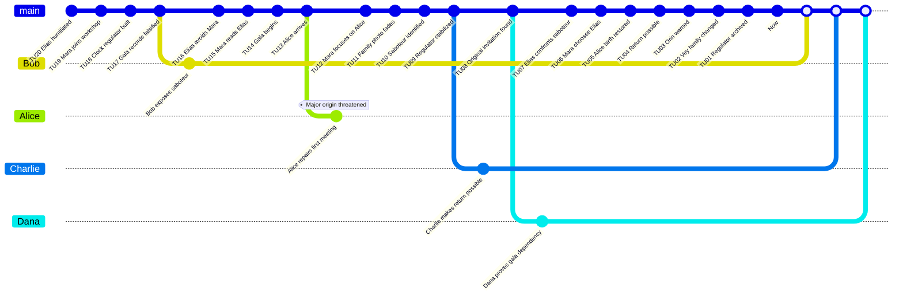

# L'enfant de l'horloger - Preparation MJ

Ce scenario original traite un paradoxe d'origine familiale sans reprendre de personnages, de lieux ou d'objets proteges.

## Premisse

En 2008, Alice vit dans une famille usee par l'echec. Son pere Elias Vey a abandonne l'ecriture apres une humiliation au Foundry Gala de 1978. Sa mere Mara Senn l'a pourtant choisi ce soir-la dans la `Main Timeline`. Quand l'inventeur Orin Pell active un regulateur d'horloge experimental, Alice est projetee dans une `Branched Timeline` de 1978 et empeche maladroitement la rencontre de ses parents.

Les `Investigators` doivent preserver la naissance d'Alice, reparer la confiance d'Elias, et ramener une `Main Timeline` amelioree mais coherente.

## Main Timeline

| Time Unit | Visible or Discoverable Event |
|---:|---|
| 20 | Elias est humilie dans sa jeunesse. |
| 19 | Mara rejoint l'atelier d'horlogerie du quartier. |
| 18 | Orin Pell construit le regulateur d'horloge. |
| 17 | Un saboteur falsifie les registres du gala. |
| 16 | Elias evite Mara avant le gala. |
| 15 | Mara lit un texte d'Elias. |
| 14 | Le gala commence. |
| 13 | Alice arrive dans la branche de 1978. |
| 12 | Mara s'interesse a Alice plutot qu'a Elias. |
| 11 | La photo familiale d'Alice s'efface. |
| 10 | Bob identifie le saboteur. |
| 9 | Charlie stabilise le regulateur. |
| 8 | Dana retrouve l'invitation originale. |
| 7 | Elias affronte publiquement le saboteur. |
| 6 | Mara choisit Elias. |
| 5 | Le baiser du gala restaure la naissance d'Alice. |
| 4 | Le retour vers 2008 devient possible. |
| 3 | Alice avertit Orin d'un danger futur. |
| 2 | La famille Vey devient differente mais coherente. |
| 1 | Le regulateur rejoint le dossier du `System`. |
| 0 | `Now`: Alice existe encore. |

## Causal Table cachee

| ID | Conditions | Fact | Evidence |
|---|---|---|---|
| F01 | Simple: Elias manque de confiance. | Il evite Mara. | Carnet, temoins. |
| F02 | Simple: Mara aime les textes d'Elias. | Une relation devient possible. | Lettre annotee. |
| F03 | Dependency: F01. | Le saboteur peut le dominer. | Registres falsifies. |
| F04 | Dependency: F02 et F03. | Le gala est fragile. | Invitation. |
| F05 | Dependency: F04. | Alice interrompt la rencontre. | Photo familiale instable. |
| F06 | Dependency: F05. | L'existence d'Alice menace de s'effacer. | Main translucide, souvenirs doubles. |
| F07 | Dependency: F03. | Elias affronte le saboteur. | Temoignages du gala. |
| F08 | Dependency: F07. | Mara choisit Elias. | Programme du bal. |
| F09 | Dependency: F08. | Alice peut `Merged` vers un `Now` coherent. | Photo restauree. |

## Personnages

| Personnage | Role | Charge mentale | Health | Rewind Dice |
|---|---|---:|---:|---|
| Alice | Investigator ancre familiale | 0 | 10 | d4, d6, d8, d10, d12, d20 |
| Bob | Investigator social | 0 | 10 | d4, d6, d8, d10, d12, d20 |
| Charlie | Investigator technique | 0 | 10 | d4, d6, d8, d10, d12, d20 |
| Dana | Investigator archives | 0 | 10 | d4, d6, d8, d10, d12, d20 |
| Elias Vey | Pere potentiel | 80 | 10 | Aucun |
| Mara Senn | Mere potentielle | 80 | 10 | Aucun |
| Saboteur | Antagoniste social | 90 | 10 | Aucun ou `Counter-System` optionnel |

## GitGraph

Les points blancs correspondent aux `Merge` sur le `Now` de la branche `main`. Le carre blanc represente le `Now`.

