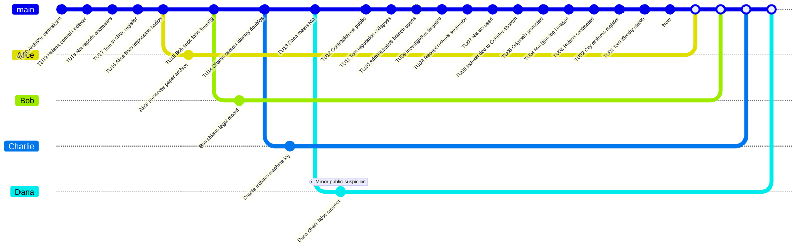

# Piege des archives publiques - Preparation MJ

Ce scenario original utilise des preuves administratives impossibles et une attaque contre l'identite publique des `Investigators`.

## Premisse

Tom Arlen decouvre que son nom apparait dans quatre documents publics contradictoires: un registre de clinique, une audience municipale, un badge d'archive et un recu d'association. Chaque document prouve qu'il aurait ete present a un endroit impossible. Les `Investigators` pensent d'abord a une chaine de canulars ou a Nia Rusk, une archiviste conflictuelle.

La vraie adversaire est Helena Orvek, la Registraire. Elle utilise un `Counter-System` integre a une machine d'indexation municipale pour creer des branches administratives qui piegent les identites des gens.

## Main Timeline

| Time Unit | Visible or Discoverable Event |
|---:|---|
| 20 | La ville centralise ses archives publiques. |
| 19 | Helena Orvek prend le controle de l'indexeur. |
| 18 | Nia Rusk denonce des anomalies. |
| 17 | Tom apparait dans un registre de clinique. |
| 16 | Alice trouve un badge d'archive impossible. |
| 15 | Bob repere une audience falsifiee. |
| 14 | Charlie detecte des doublons d'identite. |
| 13 | Dana rencontre Nia. |
| 12 | Les documents contradictoires deviennent publics. |
| 11 | La reputation de Tom s'effondre. |
| 10 | Helena ouvre une `Branched Timeline` administrative. |
| 9 | Les `Investigators` sont ajoutes a des registres faux. |
| 8 | Un recu d'association revele la sequence. |
| 7 | Nia est accusee. |
| 6 | Alice relie l'indexeur au `Counter-System`. |
| 5 | Bob protege les originaux papier. |
| 4 | Charlie isole le journal machine. |
| 3 | Dana confronte Helena. |
| 2 | La ville restaure un registre coherent. |
| 1 | Tom recupere une identite stable. |
| 0 | `Now`: les archives ne se contredisent plus. |

## Causal Table cachee

| ID | Conditions | Fact | Evidence |
|---|---|---|---|
| F01 | Simple: les archives sont centralisees. | L'indexeur peut reecrire la reputation publique. | Contrat municipal. |
| F02 | Dependency: F01. | Helena connecte un `Counter-System`. | Journal machine. |
| F03 | Simple: Nia denonce les anomalies. | Elle devient suspecte. | Lettre de plainte. |
| F04 | Dependency: F02. | Tom apparait dans des lieux impossibles. | Registres contradictoires. |
| F05 | Dependency: F04. | Les `Investigators` suivent la fausse piste Nia. | Entretien, dossier disciplinaire. |
| F06 | Dependency: F02. | Helena piege les identites des `Investigators`. | Badges et recus impossibles. |
| F07 | Dependency: F06. | Les conflits de reputation augmentent. | Avis public. |
| F08 | Dependency: F02 et F07. | L'indexeur peut etre isole. | Original papier, hash local. |
| F09 | Dependency: F08. | Le registre coherent est restaure. | Certificat corrige. |

## Personnages

| Personnage | Role | Willpower | Health | Rewind Dice |
|---|---|---:|---:|---|
| Alice | Investigator archives | 100 | 10 | d4, d6, d8, d10, d12, d20 |
| Bob | Investigator juridique | 100 | 10 | d4, d6, d8, d10, d12, d20 |
| Charlie | Investigator technique | 100 | 10 | d4, d6, d8, d10, d12, d20 |
| Dana | Investigator social | 100 | 10 | d4, d6, d8, d10, d12, d20 |
| Helena Orvek | `Time Offender` | 100 | 10 | `Counter-System` |
| Nia Rusk | Fausse suspecte | 70 | 10 | Aucun |
| Tom Arlen | Victime administrative | 60 | 10 | Aucun |

## GitGraph

Les points blancs correspondent aux `Merge` sur le `Now` de la branche `main`. Le carre blanc represente le `Now`.

