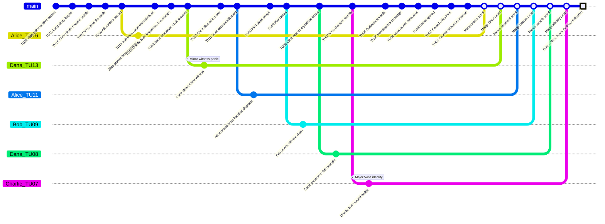

# Protocole Fievre de Verre - Preparation MJ

Ce scenario original est le scenario recommande pour debuter avec **Causality**. Il existe en deux modes: une partie starter sans `Time Offender`, puis une partie complete avec adversaire temporel.

## Premisse

Dans le `Now` de 2142, les cites scellees survivent encore aux consequences d'une maladie de cristallisation pulmonaire apparue en 2117, la Fievre de Verre. Les `Investigators` recoivent une mission simple: comprendre si l'epidemie etait inevitable, identifier la vraie source, et revenir avec assez d'`Evidence` pour stabiliser un `Now` ou le remede existe sans effacer leur realite.

Le faux coupable visible est le `Meridian Choir`, un mouvement de liberation animale. Le vrai responsable est le docteur Ilya Voss, medecin materiaux venu du `Now`, qui utilise un `Counter-System` pour proteger sa propre origine.

## Verite du MJ

- Le `Meridian Choir` n'a pas libere la maladie.
- Voss est un `Time Offender` conscient et capable d'identifier les `Investigators`.
- Les ampoules de la Fievre de Verre passent par Morrow Pier.
- Supprimer completement l'epidemie sans cause de remplacement peut rendre le `Now` originel incoherent.
- La victoire stable consiste a exposer Voss, proteger l'`Evidence` medicale, et creer une cause de remede coherente.

## Main Timeline

| Time Unit | Visible or Discoverable Event | Note MJ |
|---:|---|---|
| 20 | Voss accede a une archive interdite du `System`. | Racine du `Counter-System`. |
| 19 | Une etude pulmonaire cotiere est lancee. | Premiere couverture medicale. |
| 18 | Le `Meridian Choir` organise des rituels publics. | Fausse piste. |
| 17 | Voss devient consultant d'une clinique portuaire. | Acces logistique. |
| 16 | Alice retrouve un dossier d'admission degrade. | Premier indice joueur. |
| 15 | Bob repere un conflit de cargaison a Morrow Pier. | Route des ampoules. |
| 14 | Charlie trouve des horodatages impossibles. | Trace du `Counter-System`. |
| 13 | Dana interroge une survivante du `Meridian Choir`. | Fausse piste fragilisee. |
| 12 | Le `Meridian Choir` est accuse publiquement. | Le faux coupable devient solide. |
| 11 | Voss securise une cargaison medicale. | Vraie preparation. |
| 10 | Un docker tousse des filaments de verre. | Premier cas. |
| 9 | Morrow Pier ferme. | L'`Evidence` devient difficile. |
| 8 | La premiere autopsie revele les cristaux. | Preuve medicale. |
| 7 | Voss cree une identite de voyage. | Fuite. |
| 6 | Trois villes declarent des cas. | Propagation. |
| 5 | Les `Investigators` convergent vers Morrow Pier. | Point de pression. |
| 4 | Voss deplace les ampoules par une clinique mobile. | Derniere fenetre. |
| 3 | Les cites se ferment. | Catastrophe observable. |
| 2 | Le conseil des survivants autorise la mission. | Cause des `Investigators`. |
| 1 | Le `System` ouvre le dossier Protocole Fievre de Verre. | Briefing. |
| 0 | `Now`: l'enquete commence. | Etat present. |

## Causal Table cachee

| ID | Conditions | Fact | Evidence |
|---|---|---|---|
| F01 | Simple: Voss a acces aux archives interdites. | Voss comprend comment proteger sa propre origine. | Journal d'acces, clef cryptee. |
| F02 | Dependency: F01. | Voss active un `Counter-System`. | Horodatages impossibles. |
| F03 | Simple: le `Meridian Choir` agit publiquement. | Les archives futures accusent le mauvais groupe. | Affiches, temoins, coupures. |
| F04 | Dependency: F02. | Voss place les ampoules sur Morrow Pier. | Inventaire portuaire. |
| F05 | Dependency: F04. | Le premier cas apparait chez un docker. | Dossier medical, prelevement. |
| F06 | Dependency: F03 et F05. | Les autorites blament le `Meridian Choir`. | Article officiel. |
| F07 | Dependency: F05. | L'autopsie revele la cristallisation. | Lame de microscope. |
| F08 | Dependency: F02. | Voss attaque les `Investigators` identifies. | Filature, fausse preuve. |
| F09 | Dependency: F07. | Une formule de remede devient deduisible. | Notes biologiques. |
| F10 | Dependency: F04 et F09. | La `Main Timeline` peut `Merged` vers un `Now` stable. | Dossier complet. |

## Personnages

| Personnage | Role | Willpower | Health | Rewind Dice |
|---|---|---:|---:|---|
| Alice | Investigator medicale | 100 | 10 | d4, d6, d8, d10, d12, d20 |
| Bob | Investigator logistique | 100 | 10 | d4, d6, d8, d10, d12, d20 |
| Charlie | Investigator technique | 100 | 10 | d4, d6, d8, d10, d12, d20 |
| Dana | Investigator sociale | 100 | 10 | d4, d6, d8, d10, d12, d20 |
| Ilya Voss | `Time Offender` | 100 | 10 | `Counter-System` |
| Mira Senn | Survivante temoin | 80 | 10 | Aucun |

## Le Docteur Voss comme Time Offender

Voss commence **Unaware of identities**, devient **Alerted** lorsque le groupe touche aux registres de Morrow Pier, et atteint le stade **Identified target** lorsqu'un Investigator révèle une connaissance impossible de la route des ampoules.

Voss possède un unique set de **Counter-System Rewind Dice** à usage unique : d4, d6, d8, d10, d12, d20.

| Action | Effet mécanique | Evidence laissée derrière |
|---|---|---|
| Reframe the Choir | Ajoute un Minor Conflict à un Investigator innocentant le Choir. | Archive de presse modifiée. |
| Move ampoules | Force une branche corrective ou maintient un Major Conflict. | Incohérence sur la route du ferry. |
| Contaminate clinic sample | Bloque un merge jusqu'à ce qu'une Evidence de remplacement existe. | Sceau cryogénique brisé. |
| Identify an Investigator | Ajoute une pression de sécurité publique. | Inscription sur liste de surveillance. |

## Conseils de deroule

En mode starter, Voss n'agit pas comme `Time Offender`: il est seulement la cause cachee. En mode complet, Voss utilise son `Counter-System` pour augmenter les conflits des `Investigators`, detruire l'`Evidence`, et proteger la fausse accusation du `Meridian Choir`.

Utilise les `Rewind Dice` avec la formule officielle: `Rewind Die result / rewind distance x 100`. Calcule la `Willpower` a la fin de chaque tour: `100 - 30 par Branched Timeline non Merged - 20 par Minor Conflict non resolu - 40 par Major Conflict non resolu`.

## Statistiques de reference

| Joueur | Branches | Merged | Minor restants | Major restants | Reussites critiques | Reussites partielles | Echecs partiels | Echecs critiques |
|---|---:|---:|---:|---:|---:|---:|---:|---:|
| Alice | 2 | 1 | 0 | 1 | 1 | 1 | 0 | 0 |
| Bob | 2 | 2 | 0 | 0 | 1 | 0 | 1 | 0 |
| Charlie | 2 | 2 | 0 | 0 | 0 | 2 | 0 | 0 |
| Dana | 2 | 1 | 1 | 0 | 1 | 0 | 1 | 0 |

## GitGraph

Dans ce GitGraph, les points blancs sur `main` correspondent aux merges sur le Now. Le carré blanc représente le Now.

