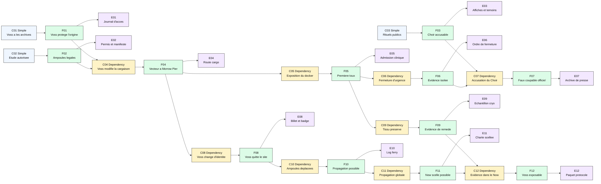
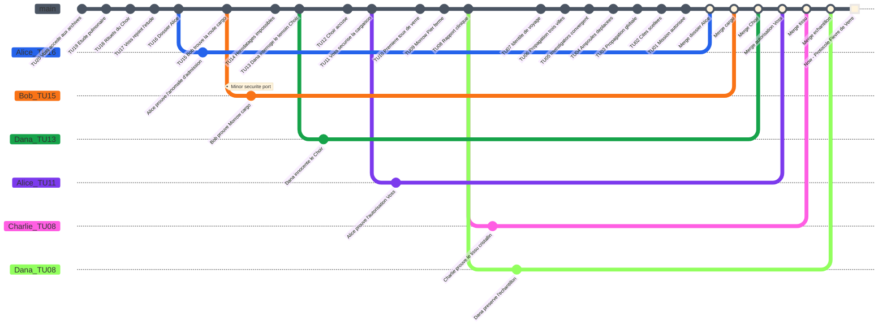
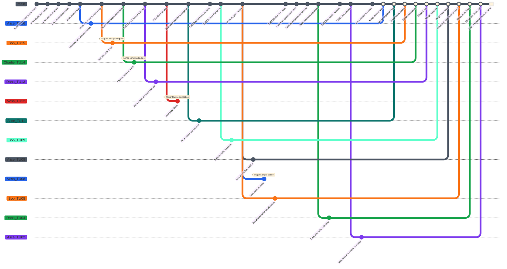

# Protocole Fievre de Verre - Preparation MJ

Ce scenario original est le scenario recommande pour debuter avec **Causality**. Il sert a enseigner le jeu deux fois : d'abord comme enquete starter sans pression active de `Time Offender`, puis comme demonstration complete avec Ilya Voss et son `Counter-System`.

## Premisse

Dans le `Now` de 2142, les cites scellees survivent encore aux consequences d'une maladie de cristallisation pulmonaire apparue en 2117, la Fievre de Verre. Les `Investigators` recoivent une mission simple : comprendre si l'epidemie etait inevitable, identifier la vraie source, et revenir avec assez d'`Evidence` pour stabiliser un `Now` ou le remede existe sans effacer leur realite.

Le faux coupable visible est le `Meridian Choir`, un mouvement de rituels publics et de liberation animale. Le vrai responsable est le docteur Ilya Voss, medecin materiaux venu du `Now`, qui utilise un `Counter-System` pour proteger sa propre origine.

## Verite du MJ

- Le `Meridian Choir` n'a pas libere la maladie.
- Voss est le vrai porteur d'origine.
- En mode starter, Voss est seulement la cause historique cachee.
- En mode complet, Voss est un `Time Offender` conscient qui veut preserver l'ordre des cites scellees.
- La Fievre de Verre doit rester explicable a la resolution finale, mais les `Investigators` peuvent exposer Voss et preserver l'`Evidence` de remede.
- Supprimer completement l'epidemie sans cause de remplacement peut rendre le `Now` originel incoherent.

## LORE

En 2142, les cites scellees existent parce que la Fievre de Verre a ravage le monde cotier vingt-cinq ans plus tot. Les archives publiques racontent une histoire simple : le `Meridian Choir` organise des rituels respiratoires et des liberations animales a Morrow Pier ([TU18](#tu18), [I-TU18](#i-tu18), [F03](#f03)). Dana interroge plus tard une survivante du Choir qui connait les symboles, mais pas les pathogenes ([TU13](#tu13), [I-TU13](#i-tu13), [F03](#f03)). L'accusation publique contre le Choir devient ensuite l'origine officielle de la catastrophe ([TU12](#tu12), [I-TU12](#i-tu12), [F07](#f07)). Cette version est fausse, mais elle est utile au `Now` : elle donne une origine lisible a la catastrophe, protege Voss et permet aux cites scellees de justifier leur autorite sanitaire.

Le vrai point d'origine est le docteur Ilya Voss. Medecin materiaux issu du `Now`, Voss accede aux archives medicales des cites scellees et y decouvre un fragment de `Counter-System` conserve dans du materiel de quarantaine ([TU20](#tu20), [I-TU20](#i-tu20), [F01](#f01)). Il comprend que sa propre realite depend de la catastrophe : sans Fievre de Verre, les cites scellees ne se forment pas ([TU02](#tu02), [I-TU02](#i-tu02), [F11](#f11)), le conseil n'autorise jamais la mission ([TU01](#tu01), [I-TU01](#i-tu01), [F12](#f12)), et le Protocole Fievre de Verre n'arrive pas aux `Investigators` ([TU00](#tu00), [I-TU00](#i-tu00), [F12](#f12)).

Voss utilise alors le fragment pour remonter la chaine causale de l'epidemie et renforcer son origine. Le reseau de sante cotier lance une etude pulmonaire qui ouvre une route legale pour les echantillons ([TU19](#tu19), [I-TU19](#i-tu19), [F02](#f02)). Voss rejoint cette etude comme consultant et obtient la position necessaire pour modifier la manutention des cargaisons ([TU17](#tu17), [I-TU17](#i-tu17), [F04](#f04)).

Les premieres traces instables apparaissent avant meme que les `Investigators` comprennent le dossier. Alice surgit dans un dossier d'admission degrade, preuve que le `System` a deja touche le cas ([TU16](#tu16), [I-TU16](#i-tu16), [F12](#f12)). Charlie repere ensuite des horodatages impossibles qui prouvent qu'une pression de `Counter-System` protege la chaine d'origine ([TU14](#tu14), [I-TU14](#i-tu14), [F01](#f01)).

A Morrow Pier, Bob trouve des routes de cargaison contradictoires qui signalent une chaine logistique instable ([TU15](#tu15), [I-TU15](#i-tu15), [F02](#f02)). Voss securise ensuite la cargaison medicale qui devient le vrai vecteur d'origine ([TU11](#tu11), [I-TU11](#i-tu11), [F04](#f04)). Un docker est expose et developpe la premiere toux de verre ([TU10](#tu10), [I-TU10](#i-tu10), [F05](#f05)). Quand les symptomes deviennent impossibles a cacher, l'ordre d'urgence ferme Morrow Pier, isole les preuves et transforme le port en scene d'origine officielle ([TU09](#tu09), [I-TU09](#i-tu09), [F06](#f06)).

La premiere clinique identifie du tissu pulmonaire cristallin et conserve des echantillons capables de devenir une `Evidence` de remede ([TU08](#tu08), [I-TU08](#i-tu08), [F09](#f09)). Voss sait que cette `Evidence` est dangereuse pour lui si elle revele la chaine reelle, mais indispensable si les `Investigators` doivent stabiliser un `Now` coherent au lieu d'effacer completement leur propre realite. Il change donc d'identite de voyage pour quitter le site d'origine ([TU07](#tu07), [I-TU07](#i-tu07), [F08](#f08)). Il deplace ensuite les ampoules restantes par une clinique de ferry, ce qui donne a l'epidemie sa route finale ([TU04](#tu04), [I-TU04](#i-tu04), [F10](#f10)).

La Fievre de Verre atteint trois villes cotieres et rend le `Now` originel probable ([TU06](#tu06), [I-TU06](#i-tu06), [F11](#f11)). Alice, Bob, Charlie et Dana convergent vers Morrow Pier sous pression de securite ([TU05](#tu05), [I-TU05](#i-tu05), [F12](#f12)). La Fievre de Verre devient ensuite globale ([TU03](#tu03), [I-TU03](#i-tu03), [F11](#f11)). Les cites scellees se forment sous regime d'urgence ([TU02](#tu02), [I-TU02](#i-tu02), [F11](#f11)). Des annees plus tard, le conseil des cites scellees autorise le Protocole Fievre de Verre ([TU01](#tu01), [I-TU01](#i-tu01), [F12](#f12)). Dans le `Now`, les `Investigators` recoivent le protocole : ils doivent ouvrir le `Time Flow`, comprendre si l'epidemie etait inevitable, identifier la vraie source et rapporter assez d'`Evidence` pour exposer Voss sans detruire le present qui les a envoyes ([TU00](#tu00), [I-TU00](#i-tu00), [F12](#f12)).

## Main Timeline

Le `Time Flow` possede exactement 20 `Atomic Time Units` avant le `Now`. La `Time Unit 20` est l'etat prepare le plus ancien. La `Time Unit 1` est l'etat prepare le plus proche du present. La `Time Unit 0` est le `Now`.

| Time Unit | Visible or Discoverable Event | Note MJ |
|---:|---|---|
| 20 | Voss accede aux archives medicales des cites scellees. | Il trouve un fragment de `Counter-System`. |
| 19 | Le reseau de sante cotier lance une etude pulmonaire. | Cela cree une route legale pour les echantillons. |
| 18 | Le `Meridian Choir` organise des rituels publics. | Le faux coupable devient visible. |
| 17 | Voss rejoint l'etude comme consultant. | Il peut modifier la manutention des cargaisons. |
| 16 | Alice apparait dans un dossier d'admission degrade. | Le `System` a deja touche le cas. |
| 15 | Bob trouve des routes de cargaison contradictoires a Morrow Pier. | La route des ampoules devient instable. |
| 14 | Charlie detecte des horodatages impossibles. | Un residu de `Counter-System` est present. |
| 13 | Dana interroge une survivante du `Meridian Choir`. | Le groupe connait des symboles, pas les pathogenes. |
| 12 | Le `Meridian Choir` est accuse publiquement. | Cela protege Voss. |
| 11 | Voss securise la cargaison medicale. | Vrai vecteur d'origine. |
| 10 | Un docker developpe la premiere toux de verre. | Premiere chaine d'infection observable. |
| 9 | Morrow Pier ferme par ordre d'urgence. | L'`Evidence` devient difficile d'acces. |
| 8 | La premiere clinique signale du tissu pulmonaire cristallin. | L'`Evidence` de remede existe ici. |
| 7 | Voss change son identite de voyage. | Il commence a surveiller les `Investigators`. |
| 6 | L'epidemie atteint trois villes cotieres. | Le `Now` originel devient probable. |
| 5 | Alice, Bob, Charlie et Dana convergent vers Morrow Pier. | La pression de securite commence. |
| 4 | Voss deplace les ampoules par une clinique de ferry. | Route finale du porteur. |
| 3 | La Fievre de Verre devient globale. | Catastrophe verrouillee. |
| 2 | Les cites scellees se forment. | Le `System` futur peut exister. |
| 1 | Le conseil des cites scellees autorise la mission. | Dernier etat prepare avant le `Now`. |
| 0 | `Now` : les `Investigators` recoivent le Protocole Fievre de Verre. | Le present doit rester coherent. |

### Graphique Mermaid de la Main Timeline

```mermaid
flowchart LR
  TU20["TU20<br/>Voss accede aux archives"] --> TU19["TU19<br/>Etude pulmonaire"]
  TU19 --> TU18["TU18<br/>Rituels du Meridian Choir"]
  TU18 --> TU17["TU17<br/>Voss rejoint l'etude"]
  TU17 --> TU16["TU16<br/>Dossier d'Alice"]
  TU16 --> TU15["TU15<br/>Cargaisons contradictoires"]
  TU15 --> TU14["TU14<br/>Horodatages impossibles"]
  TU14 --> TU13["TU13<br/>Temoin du Choir"]
  TU13 --> TU12["TU12<br/>Choir accuse"]
  TU12 --> TU11["TU11<br/>Voss securise la cargaison"]
  TU11 --> TU10["TU10<br/>Premiere toux de verre"]
  TU10 --> TU09["TU09<br/>Morrow Pier ferme"]
  TU09 --> TU08["TU08<br/>Rapport clinique"]
  TU08 --> TU07["TU07<br/>Identite de voyage"]
  TU07 --> TU06["TU06<br/>Trois villes infectees"]
  TU06 --> TU05["TU05<br/>Investigators convergent"]
  TU05 --> TU04["TU04<br/>Ampoules deplacees"]
  TU04 --> TU03["TU03<br/>Propagation globale"]
  TU03 --> TU02["TU02<br/>Cites scellees"]
  TU02 --> TU01["TU01<br/>Mission autorisee"]
  TU01 --> NOW["TU00 / Now<br/>Protocole livre"]
```

## Briefing initial des joueurs

- Le `Now` est en 2142.
- La Fievre de Verre commence officiellement a Morrow Pier en 2117.
- Le `Meridian Choir` est accuse dans les archives publiques.
- Plusieurs horodatages d'archive sont impossibles.
- Ilya Voss apparait dans des dossiers propres mais jamais dans l'accusation publique.
- La mission consiste a identifier la vraie origine, preserver l'`Evidence` de remede, et eviter d'effacer le `Now` des cites scellees.

## Table des indices

| ID | Time Unit | Indice | Ce que l'indice permet de deduire | References causales |
|---|---:|---|---|---|
| I-TU20 | [TU20](#tu20) | Journal d'acces des archives scellees lie a Voss, residu et terminal de quarantaine. | Voss possede un acces anormal aux archives et un fragment de `Counter-System`. | [F01](#f01) |
| I-TU19 | [TU19](#tu19) | Permis d'etude pulmonaire et autorisations de transfert. | L'etude donne une route legale aux echantillons et rend la cargaison plausible. | [F02](#f02) |
| I-TU18 | [TU18](#tu18) | Affiches et enregistrements des rituels publics du `Meridian Choir`. | Le Choir est visible et peut etre accuse. | [F03](#f03) |
| I-TU17 | [TU17](#tu17) | Contrat de consultant de Voss et notes de manutention. | Voss peut modifier les cargaisons depuis l'interieur de l'etude. | [F04](#f04) |
| I-TU16 | [TU16](#tu16) | Dossier d'admission degrade au nom d'Alice. | Le `System` a deja touche ce cas et les `Investigators` ne partent pas d'une enquete neutre. | [F12](#f12) |
| I-TU15 | [TU15](#tu15) | Manifeste cargo de Morrow Pier avec routes contradictoires. | La route des ampoules est instable et manipulable. | [F02](#f02), [F04](#f04) |
| I-TU14 | [TU14](#tu14) | Horodatages impossibles dans les archives cliniques et portuaires. | Une intervention de `Counter-System` protege la chaine d'origine. | [F01](#f01), [F04](#f04) |
| I-TU13 | [TU13](#tu13) | Temoignage d'une survivante du `Meridian Choir`. | Le Choir connait les symboles, pas les pathogenes. | [F03](#f03) |
| I-TU12 | [TU12](#tu12) | Archive de presse et rapport d'arrestation accusant le Choir. | Le faux coupable devient officiel et protege Voss. | [F07](#f07) |
| I-TU11 | [TU11](#tu11) | Autorisation de cargaison signee par Voss, route cargo et scelle manquant. | Voss securise le vrai vecteur d'origine. | [F04](#f04) |
| I-TU10 | [TU10](#tu10) | Admission clinique et temoignage du docker expose. | La premiere toux de verre suit la cargaison, pas les rituels du Choir. | [F05](#f05) |
| I-TU09 | [TU09](#tu09) | Ordre de fermeture de Morrow Pier et log de securite. | La fermeture isole l'`Evidence`. | [F06](#f06) |
| I-TU08 | [TU08](#tu08) | Rapport clinique, registre cryo de Ren Arco et note de pathologiste. | Une `Evidence` de remede existe. | [F09](#f09), [F12](#f12) |
| I-TU07 | [TU07](#tu07) | Billet de ferry et badge de voyage falsifie de Voss. | Voss quitte le site d'origine sous une identite modifiee. | [F08](#f08) |
| I-TU06 | [TU06](#tu06) | Rapport sanitaire sur trois villes cotieres infectees. | Le `Now` originel devient probable. | [F11](#f11) |
| I-TU05 | [TU05](#tu05) | Registres de securite montrant Alice, Bob, Charlie et Dana pres de Morrow Pier. | La pression de securite commence autour des `Investigators`. | [F12](#f12) |
| I-TU04 | [TU04](#tu04) | Log de clinique ferry et boitier d'ampoule casse. | Les ampoules restantes sont deplacees vers la route finale de propagation. | [F10](#f10) |
| I-TU03 | [TU03](#tu03) | Bulletin sanitaire global sur la Fievre de Verre. | La catastrophe est verrouillee a l'echelle mondiale. | [F11](#f11) |
| I-TU02 | [TU02](#tu02) | Charte des cites scellees et registre de population. | Le `Now` des cites scellees depend de l'epidemie. | [F11](#f11) |
| I-TU01 | [TU01](#tu01) | Autorisation du conseil des cites scellees. | La mission peut etre lancee sans rendre le `Now` incoherent. | [F12](#f12) |
| I-TU00 | [TU00](#tu00) | Paquet final du Protocole Fievre de Verre et chaine d'echantillon. | Les `Investigators` peuvent exposer Voss si l'`Evidence` survit. | [F12](#f12) |

## Causal Table cachee

| ID | Type de condition | Conditions | Fact | Evidence |
|---|---|---|---|---|
| F01 | Simple | Voss a acces aux archives et a un fragment de `Counter-System`. | Voss peut proteger la chaine d'origine. | [I-TU20](#i-tu20) Journal d'acces, residu, terminal de quarantaine. |
| F02 | Simple | L'etude pulmonaire permet les cargaisons medicales. | Les ampoules contaminees peuvent circuler legalement. | [I-TU19](#i-tu19) Permis d'etude ; [I-TU15](#i-tu15) manifeste cargo. |
| F03 | Simple | Le `Meridian Choir` agit publiquement. | Le Choir peut etre accuse. | [I-TU18](#i-tu18) Rituels publics ; [I-TU13](#i-tu13) temoignage. |
| F04 | Dependency | Dependency: [F01](#f01) et [F02](#f02). Voss modifie la manutention. | Le vrai vecteur d'origine entre a Morrow Pier. | [I-TU17](#i-tu17) Notes de manutention ; [I-TU11](#i-tu11) cargaison securisee. |
| F05 | Dependency | Dependency: [F04](#f04). Le docker est expose. | La premiere toux de verre commence. | [I-TU10](#i-tu10) Admission clinique, temoignage du docker. |
| F06 | Dependency | Dependency: [F05](#f05). L'ordre d'urgence ferme le port. | L'`Evidence` est isolee. | [I-TU09](#i-tu09) Ordre de fermeture, log de securite. |
| F07 | Dependency | Dependency: [F03](#f03) et [F06](#f06). L'accusation publique vise le Choir. | Le faux coupable devient officiel. | [I-TU12](#i-tu12) Archive de presse, rapport d'arrestation. |
| F08 | Dependency | Dependency: [F04](#f04). Voss change d'identite de voyage. | Voss peut quitter le site d'origine. | [I-TU07](#i-tu07) Billet de ferry, badge falsifie. |
| F09 | Dependency | Dependency: [F05](#f05). La clinique preserve des tissus. | L'`Evidence` de remede existe. | [I-TU08](#i-tu08) Rapport clinique, echantillon cryo. |
| F10 | Dependency | Dependency: [F08](#f08). Voss deplace les ampoules. | L'epidemie peut se propager globalement. | [I-TU04](#i-tu04) Log de clinique ferry, boitier d'ampoule casse. |
| F11 | Dependency | Dependency: [F10](#f10). La propagation globale a lieu. | Le `Now` des cites scellees existe. | [I-TU06](#i-tu06) Rapport trois villes ; [I-TU03](#i-tu03) bulletin global ; [I-TU02](#i-tu02) charte scellee. |
| F12 | Dependency | Dependency: [F09](#f09) et [F11](#f11). L'`Evidence` survit jusqu'au `Now`. | Les `Investigators` peuvent exposer Voss sans effacer le `Now`. | [I-TU01](#i-tu01) Autorisation ; [I-TU00](#i-tu00) paquet de protocole. |

### Graphique Mermaid de la Causal Table

## Personnages

| Personnage | Role public | Fonction reelle |
|---|---|---|
| Alice | Investigator medicale | Ancre de contact System et preuve medicale. |
| Bob | Investigator logistique | Suit les routes, la securite et les contradictions de cargaison. |
| Charlie | Investigator technique | Lit les horodatages et les traces de `Counter-System`. |
| Dana | Investigator sociale | Innocente le Choir et preserve l'`Evidence`. |
| Ilya Voss | Medecin materiaux | `Time Offender` et vrai porteur en mode complet. |
| Meridian Choir | Groupe de rituels publics | Faux coupable. |
| Sera Holt | Premiere patiente connue | Preuve humaine de la chaine d'exposition. |
| Ren Arco | Pathologiste | Garde l'echantillon utile au remede. |

## Le Docteur Voss comme Time Offender

Voss commence **Unaware of identities**, devient **Alerted** lorsque le groupe touche aux registres de Morrow Pier, et atteint le stade **Identified target** lorsqu'un Investigator révèle une connaissance impossible de la route des ampoules.

Voss possède un set de `Counter-System Rewind Dice` à usage unique : d4, d6, d8, d10, d12, d20.

| Action | Effet mécanique | Evidence laissée |
|---|---|---|
| Réaccuser le Choir | Ajoute un `Minor Conflict` à un Investigator qui innocente le Choir. | Archive de presse modifiée. |
| Déplacer les ampoules | Force une branche corrective ou maintient un `Major Conflict`. | Incohérence sur la route du ferry. |
| Contaminer l'échantillon | Bloque un merge jusqu'à ce qu'une Evidence de remplacement existe. | Sceau cryogénique brisé. |
| Identify an Investigator | Ajoute une pression de sécurité publique. | Inscription sur liste de surveillance. |

## Trackers Rewind Dice

| Investigator | d4 | d6 | d8 | d10 | d12 | d20 |
|---|---|---|---|---|---|---|
| Alice | disponible | disponible | disponible | disponible | disponible | disponible |
| Bob | disponible | disponible | disponible | disponible | disponible | disponible |
| Charlie | disponible | disponible | disponible | disponible | disponible | disponible |
| Dana | disponible | disponible | disponible | disponible | disponible | disponible |

| Time Offender | d4 | d6 | d8 | d10 | d12 | d20 |
|---|---|---|---|---|---|---|
| Ilya Voss | disponible | disponible | disponible | disponible | disponible | disponible |

## Deroulement starter - Sans Time Offender

Utilisez cette version pour apprendre le scenario. Voss est seulement la source historique cachee. Ignorez les des de `Counter-System`, les etats de conscience du `Time Offender`, et les actions de `Time Offender`. L'ordre reste : MJ, Alice, Bob, Charlie, Dana.

### Replay starter

**Tour du MJ.** Le MJ ouvre le `Time Flow` au `Now`. Le briefing visible indique que le `Meridian Choir` est accuse, que Morrow Pier est le premier site connu, et que des horodatages sont impossibles. Le MJ garde Voss comme vrai porteur cache.

**Tour d'Alice.** Alice depense son d20 vers la `Time Unit 16`. Valeur forcee : `d20 -> 13`, donc `r = 13 / 16 x 100 = 81.25%` : reussite critique. Alice prouve que son dossier degrade vient d'un ancien contact avec le `System`. La branche merge immediatement car elle ne contredit aucune dependency. Alice termine a `100` de `Willpower`.

**Tour de Bob.** Bob depense son d12 vers la `Time Unit 15`. Valeur forcee : `d12 -> 8`, donc `r = 53.33%` : reussite partielle. Consequence `d10 -> 8` : `Minor Conflict`. Bob prouve que la cargaison medicale passe par Morrow Pier, mais un rapport de securite place un Investigator pres du terminal du manifeste. Bob a une branche non `Merged` et un `Minor Conflict` non resolu : `100 - 30 - 20 = 50` de `Willpower`.

**Tour de Charlie.** Charlie depense son d10 vers la `Time Unit 14`. Valeur forcee : `d10 -> 4`, donc `r = 28.57%` : echec partiel. Aucune `Branched Timeline` stable ne s'ouvre et le d10 est depense. Gain `d10 -> 5` : le MJ revele une direction d'`Evidence`, un motif d'horodatage lie a l'archive clinique. Charlie n'a pas de branche ouverte et reste a `100` de `Willpower`.

**Tour de Dana.** Dana depense son d20 vers la `Time Unit 13`. Valeur forcee : `d20 -> 11`, donc `r = 84.62%` : reussite critique. Dana interroge une survivante du Choir et prouve que le groupe prepare des rituels et des liberations animales, pas de manipulation de pathogenes. La branche merge et Dana termine a `100` de `Willpower`.

**Tour du MJ.** Le MJ rend visibles les dependencies : la route de cargaison doit etre prouvee avant de relier Voss a l'epidemie, et les echantillons cliniques doivent etre preserves pour qu'une `Evidence` de remede survive jusqu'au `Now`.

**Tour d'Alice.** Alice depense son d12 vers la `Time Unit 11`. Valeur forcee : `d12 -> 8`, donc `r = 72.73%` : reussite partielle. Consequence `d10 -> 4` : mauvais point d'entree. Alice arrive dans le bureau de l'etude au lieu du quai, mais prouve que Voss a signe l'autorisation de cargaison medicale. La branche reste ouverte jusqu'a confirmation de la chaine d'echantillon. Alice a une branche non `Merged` : `100 - 30 = 70` de `Willpower`.

**Tour de Bob.** Bob tente de resoudre son `Minor Conflict` de securite portuaire au niveau moyen. Sa `Willpower` actuelle est `50`, donc le seuil vaut `100 - 50 = 50`. Valeur percentile forcee : `70`, le test reussit. Le rapport devient une alerte de maintenance anonyme, la branche de Bob merge, et Bob revient a `100`.

**Tour de Charlie.** Charlie depense son d12 vers la `Time Unit 14` pour suivre le motif d'horodatage. Valeur forcee : `d12 -> 11`, donc `r = 78.57%` : reussite partielle. Consequence `d10 -> 6` : la branche s'ouvre plus proche du `Now`. La cible passe de la `Time Unit 14` a la `Time Unit 8`, car `14 - 6 = 8`. Charlie rate le terminal d'archive mais atteint le premier rapport clinique et prouve que du tissu cristallin utile au remede existe. Charlie a une branche non `Merged` : `70` de `Willpower`.

**Tour de Dana.** Dana depense son d10 vers la `Time Unit 8`. Valeur forcee : `d10 -> 9`, donc `r = 112.5%` : reussite critique. Dana preserve la chaine de l'echantillon clinique et relie l'echantillon cryo de Ren Arco a la preuve d'Alice sur Voss. Le MJ autorise le merge de la branche TU11 d'Alice et de la branche TU8 de Charlie. Alice, Charlie et Dana reviennent a `100`.

**Resolution finale du MJ.** Le groupe a innocente le `Meridian Choir`, prouve que Voss a manipule la cargaison, et preserve une `Evidence` de remede. L'epidemie existe encore, donc le `Now` des cites scellees reste coherent. Fin : **convergence starter complete**.

### GitGraph starter du scenario

Dans ce GitGraph, chaque point blanc sur la branche `main` correspond a un `Merge` sur le `Now`. Le carre blanc represente le `Now`.

### Etat final starter

| Investigator | Willpower finale | Health finale | Rewind Dice depenses | Conflits ouverts | Etat final |
|---|---:|---:|---|---:|---|
| Alice | 100 | 10 | d20, d12 | 0 | Contact System et autorisation Voss merged. |
| Bob | 100 | 10 | d12 | 0 | Route cargo merged apres resolution du rapport portuaire. |
| Charlie | 100 | 10 | d10, d12 | 0 | L'echec d'horodatage devient une route d'Evidence clinique. |
| Dana | 100 | 10 | d20, d10 | 0 | Choir innocente et echantillon preserve. |

### Statistiques starter

| Investigator | Branches totales | Branches Merged | Branches ouvertes | Minor crees | Minor resolus | Major crees | Major resolus | Rewind Dice depenses | Reussites critiques | Reussites partielles | Echecs partiels | Echecs critiques | Tests Willpower | Tests reussis | Willpower minimale | Health finale |
|---|---:|---:|---:|---:|---:|---:|---:|---:|---:|---:|---:|---:|---:|---:|---:|---:|
| Alice | 2 | 2 | 0 | 0 | 0 | 0 | 0 | 2 | 1 | 1 | 0 | 0 | 0 | 0 | 70 | 10 |
| Bob | 1 | 1 | 0 | 1 | 1 | 0 | 0 | 1 | 0 | 1 | 0 | 0 | 1 | 1 | 50 | 10 |
| Charlie | 1 | 1 | 0 | 0 | 0 | 0 | 0 | 2 | 0 | 1 | 1 | 0 | 0 | 0 | 70 | 10 |
| Dana | 2 | 2 | 0 | 0 | 0 | 0 | 0 | 2 | 2 | 0 | 0 | 0 | 0 | 0 | 100 | 10 |
| **Total** | **6** | **6** | **0** | **1** | **1** | **0** | **0** | **7** | **3** | **3** | **1** | **0** | **1** | **1** | **50** | **40** |

## Deroulement complet - Avec Time Offender

Utilisez cette version apres le replay starter. Elle montre toute la surface de regles : les quatre resultats de `Rewind`, valeurs forcees pedagogiques, consequences de reussite partielle, gains d'echec partiel, `Minor Conflicts`, `Major Conflicts`, correction de conflit par un autre joueur, tests de `Willpower`, degats sans jet d'attaque, conscience du `Time Offender`, et actions de `Counter-System`.

### Replay complet

**Tour du MJ.** Le MJ ouvre le `Time Flow` et marque secretement Ilya Voss comme `Time Offender` avec un `Counter-System`. Voss commence avec **identites inconnues**. Le MJ garde cachee la chaine : acces cargaison, premiere infection, isolement de l'`Evidence`, fausse accusation publique, route finale des ampoules, puis `Now` des cites scellees.

**Tour d'Alice.** Alice depense son d20 vers la `Time Unit 16`. Valeur forcee : `d20 -> 17`, donc `r = 106.25%` : reussite critique. Alice prouve son dossier degrade et le contact System precedent. La branche reste ouverte le temps de verifier si ce contact aide ou menace la chaine d'origine de Voss. Alice termine a `70` de `Willpower`.

**Tour de Bob.** Bob depense son d12 vers la `Time Unit 15`. Valeur forcee : `d12 -> 6`, donc `r = 40%` : echec partiel. Aucune branche stable ne s'ouvre. Gain `d10 -> 6` : le MJ revele qu'une ligne de manifeste cargo a ete deplacee plus pres du `Now` par une edition inconnue. Bob reste a `100`.

**Tour de Charlie.** Charlie depense son d10 vers la `Time Unit 14`. Valeur forcee : `d10 -> 1`, donc `r = 7.14%` : echec critique. Aucune branche, aucun gain, et le d10 est depense. Charlie reste a `100`.

**Tour de Dana.** Dana depense son d8 vers la `Time Unit 13`. Valeur forcee : `d8 -> 5`, donc `r = 38.46%` : echec partiel. Aucune branche stable ne s'ouvre. Gain `d10 -> 7` : trace de `Time Offender`. Le MJ revele que le temoin du Choir se souvient d'un badge medical propre dans la foule. Dana reste a `100`.

**Tour du MJ.** Voss remarque la pression du `System` autour de la ligne cargo de Morrow Pier et devient **alerte**. Il ne connait encore aucune identite, donc il ne fait pas d'action ciblee.

**Tour d'Alice.** Alice depense son d12 vers la `Time Unit 11`. Valeur forcee : `d12 -> 9`, donc `r = 81.82%` : reussite critique. Elle prouve que Voss a signe la cargaison medicale et que la signature depend du permis d'etude pulmonaire. Alice merge ses branches d'admission et de cargaison. Alice revient a `100`.

**Tour de Bob.** Bob depense son d20 vers la `Time Unit 15`. Valeur forcee : `d20 -> 9`, donc `r = 60%` : reussite partielle. Consequence `d10 -> 10` : `Major Conflict`. Bob prouve la route cargo, mais sa premiere action fait classer le `Meridian Choir` comme groupe de contrebande pathogene. La branche ne peut pas merge tant qu'une cause corrective n'innocente pas le Choir. Bob a une branche non `Merged` et un `Major Conflict` non resolu : `100 - 30 - 40 = 30`.

**Tour de Charlie.** Charlie depense son d12 vers la `Time Unit 14`. Valeur forcee : `d12 -> 8`, donc `r = 57.14%` : reussite partielle. Consequence `d10 -> 8` : `Minor Conflict`. Charlie prouve le residu d'horodatage du `Counter-System`, mais une camera clinique le place pres du terminal d'archive. Charlie a une branche non `Merged` et un `Minor Conflict` non resolu : `100 - 30 - 20 = 50`.

**Tour de Dana.** Dana depense son d20 vers la `Time Unit 13`. Valeur forcee : `d20 -> 18`, donc `r = 138.46%` : reussite critique. Dana prouve que le temoin du Choir a vu des outils de liberation animale, pas du materiel pathogene. Cela cree la cause corrective qui resout le `Major Conflict` de Bob. La branche de Bob peut merge et Bob revient a `100`. La branche de Dana merge aussi.

**Tour du MJ.** Voss identifie Dana parce qu'elle a revele une connaissance impossible de la memoire du temoin. Il depense son d8 de `Counter-System` vers la `Time Unit 12`. Valeur forcee : `d8 -> 6`, donc `r = 50%` : reussite partielle. Consequence `d10 -> 8` : `Minor Conflict`. Voss modifie une archive de presse pour faire apparaitre Dana comme source d'une fausse correction. Dana a un `Minor Conflict` non resolu et aucune branche ouverte : `100 - 20 = 80`.

**Tour d'Alice.** Alice depense son d8 vers la `Time Unit 8`. Valeur forcee : `d8 -> 5`, donc `r = 62.5%` : reussite partielle. Consequence `d10 -> 4` : mauvais point d'entree. Alice arrive a la clinique apres l'alarme du congelateur, mais prouve quand meme que Ren Arco a preserve un tissu cristallin. Alice a une branche non `Merged` : `70`.

**Tour de Bob.** Bob depense son d10 vers la `Time Unit 9`. Valeur forcee : `d10 -> 9`, donc `r = 100%` : reussite critique. Bob prouve la chaine de fermeture d'urgence et cree une raison legale pour laquelle la salle d'echantillon est restee scellee. Sa branche merge et il reste a `100`.

**Tour de Charlie.** Charlie tente de resoudre le `Minor Conflict` de camera au niveau moyen. Sa `Willpower` actuelle est `50`, seuil `50`, percentile force `40` : echec. La camera l'identifie encore, sa branche ne peut pas merge, et Charlie reste a `50`.

**Tour de Dana.** Dana tente de resoudre la fausse archive de Voss au niveau difficile car Voss controle activement l'enregistrement. Sa `Willpower` actuelle est `80`; en difficile, la `Willpower` effective est `40`, seuil `60`, percentile force `70` : succes. La fausse correction devient une edition anonyme contestee, le `Minor Conflict` est resolu, et Dana revient a `100`.

**Tour du MJ.** Voss escalade. Il depense son d12 de `Counter-System` vers la `Time Unit 8`. Valeur forcee : `d12 -> 10`, donc `r = 125%` : reussite critique. Il ouvre une branche ou le scelle cryo est casse avant qu'Alice puisse preserver l'echantillon. Cela cree **Major broken cure sample**, un `Major Conflict` qui bloque la convergence finale jusqu'a l'existence d'une `Evidence` de remplacement.

**Tour d'Alice.** Alice depense son d6 vers la `Time Unit 8` pour preserver directement l'echantillon. Valeur forcee : `d6 -> 4`, donc `r = 50%` : reussite partielle. Consequence `d10 -> 6` : la branche s'ouvre plus proche du `Now`. La cible passe de `Time Unit 8` a `Time Unit 2`, car `8 - 6 = 2`. Alice rate la clinique mais prouve que le conseil des cites scellees a besoin de donnees d'origine pour le remede. Alice a maintenant deux branches non `Merged` et un `Major Conflict` non resolu : `100 - 60 - 40 = 0`. A la fin de son tour, Alice sombre dans la folie et ne peut plus maintenir sa coherence avec le `Now` observable.

**Tour de Bob.** Bob depense son d4 vers la `Time Unit 8`. Valeur forcee : `d4 -> 4`, donc `r = 50%` : reussite partielle. Consequence `d10 -> 3` : poursuite. Bob atteint la salle d'echantillon, trouve le scelle cryo casse, et cree une `Evidence` de remplacement en photographiant les etiquettes de chaine de garde avant que la securite le rattrape. Un garde le frappe avec une matraque non letale. Aucun jet d'attaque n'est fait ; le MJ lance seulement les degats : `d6 -> 4`. Bob passe de `10` a `6` Health. L'`Evidence` de remplacement de Bob resout le `Major Conflict` d'Alice et permet le merge de la branche clinique d'Alice, mais Alice reste folle.

**Tour de Charlie.** Charlie retente le `Minor Conflict` de camera au niveau tres difficile parce que Voss a attaque la chaine d'`Evidence`. Sa `Willpower` actuelle est `50`; en tres difficile, la `Willpower` effective est `12` apres troncature, seuil `88`, percentile force `90` : succes. La camera devient incomplete, la branche d'horodatage de Charlie merge, et Charlie revient a `100`.

**Tour de Dana.** Dana depense son d10 vers la `Time Unit 4`. Valeur forcee : `d10 -> 8`, donc `r = 200%` : reussite critique. Dana prouve que Voss a deplace les ampoules par la clinique ferry en reliant billets, bagages et boitier d'ampoule casse. Sa branche merge.

**Resolution finale du MJ.** Le groupe expose Voss, innocente le Choir, preserve une `Evidence` de remede de remplacement, et garde l'epidemie explicable. Alice conserve `10` Health, mais sa `Willpower` finale est `0` parce qu'elle a sombre dans la folie pendant le conflit d'echantillon et n'a jamais recupere sa coherence. Fin : **convergence complete avec une Investigator perdue mentalement**.

### GitGraph complet du scenario

Dans ce GitGraph, chaque point blanc sur la branche `main` correspond a un `Merge` sur le `Now`. Le carre blanc represente le `Now`.

### Etat final complet

| Investigator | Willpower finale | Health finale | Rewind Dice depenses | Conflits ouverts | Etat final |
|---|---:|---:|---|---:|---|
| Alice | 0 | 10 | d20, d12, d8, d6 | 0 | Folie apres zero Willpower pendant le conflit d'echantillon. |
| Bob | 100 | 6 | d12, d20, d10, d4 | 0 | Resout le Major du Choir et cree l'`Evidence` de remplacement. |
| Charlie | 100 | 10 | d10, d12 | 0 | Resout la camera clinique et merge la preuve d'horodatage. |
| Dana | 100 | 10 | d8, d20, d10 | 0 | Innocente le Choir, defait le piege de Voss, et prouve la route finale. |

### Statistiques completes

| Investigator | Branches totales | Branches Merged | Branches ouvertes | Minor crees | Minor resolus | Major crees | Major resolus | Rewind Dice depenses | Reussites critiques | Reussites partielles | Echecs partiels | Echecs critiques | Consequences | Gains | Tests Willpower | Tests reussis | Willpower minimale | Health finale |
|---|---:|---:|---:|---:|---:|---:|---:|---:|---:|---:|---:|---:|---:|---:|---:|---:|---:|---:|
| Alice | 4 | 4 | 0 | 0 | 0 | 1 | 1 | 4 | 2 | 2 | 0 | 0 | 2 | 0 | 0 | 0 | 0 | 10 |
| Bob | 3 | 3 | 0 | 0 | 0 | 1 | 1 | 4 | 1 | 2 | 1 | 0 | 2 | 1 | 0 | 0 | 30 | 6 |
| Charlie | 1 | 1 | 0 | 1 | 1 | 0 | 0 | 2 | 0 | 1 | 0 | 1 | 1 | 0 | 2 | 1 | 50 | 10 |
| Dana | 2 | 2 | 0 | 1 | 1 | 0 | 0 | 3 | 2 | 0 | 1 | 0 | 0 | 1 | 1 | 1 | 80 | 10 |
| **Total** | **10** | **10** | **0** | **2** | **2** | **2** | **2** | **13** | **5** | **5** | **2** | **1** | **5** | **2** | **3** | **2** | **0** | **36** |

Statistiques du `Counter-System` :

| Time Offender | Des Counter-System depenses | Branches stables ouvertes | Minor crees | Major crees | Reussites critiques | Reussites partielles | Echecs partiels | Echecs critiques | Note finale |
|---|---:|---:|---:|---:|---:|---:|---:|---:|---|
| Ilya Voss | d8, d12 | 2 | 1 | 1 | 1 | 1 | 0 | 0 | Identifie Dana, la piege, casse le scelle, puis perd face a l'`Evidence` de remplacement. |

### Couverture des mecaniques completes

| Mecanique | Ou elle est jouee |
|---|---|
| Main Timeline vs Causal Table cachee | Le MJ revele les Facts jouables tout en gardant Voss cache comme Time Offender. |
| Condition simple | Rituels du Choir, permis d'etude, acces archive de Voss. |
| Dependency | L'acces cargaison precede l'exposition ; sample + Now scelle permettent l'exposition finale. |
| Reussite critique | Alice `d20 -> 17`, Alice `d12 -> 9`, Bob `d10 -> 9`, Dana `d20 -> 18`, Dana `d10 -> 8`. |
| Reussite partielle | Bob `d20 -> 9`, Charlie `d12 -> 8`, Alice `d8 -> 5`, Alice `d6 -> 4`, Bob `d4 -> 4`. |
| Echec partiel avec gain | Bob `d12 -> 6`; Dana `d8 -> 5`. |
| Echec critique | Charlie `d10 -> 1`. |
| Minor Conflict | Camera de Charlie et fausse correction contre Dana. |
| Major Conflict | Fichier pathogene du Choir et echantillon casse par Voss. |
| Correction par un autre joueur | Dana resout le Major de Bob ; Bob resout le Major d'Alice. |
| Willpower | Bob atteint `30`, Charlie `50`, Dana `80`, Alice `0`. |
| Tests de Willpower | Charlie echoue puis reussit ; Dana reussit contre le piege de Voss. |
| Folie a zero Willpower | Alice atteint `0` apres deux branches non Merged et un Major Conflict. |
| Degats sans jet d'attaque | Bob subit `d6 -> 4` de degats non letaux. |
| Time Offender | Voss passe d'identites inconnues a alerte puis cible identifiee. |
| Counter-System | Voss depense d8 et d12 avec la meme regle de `Rewind Percentage`. |

## Evidence Deck

- [I-TU20](#i-tu20) Journal d'acces des archives scellees lie a Voss.
- [I-TU19](#i-tu19) Permis d'etude pulmonaire autorisant les cargaisons medicales.
- [I-TU18](#i-tu18) Affiches et enregistrements des rituels publics du `Meridian Choir`.
- [I-TU17](#i-tu17) Contrat de consultant de Voss et notes de manutention.
- [I-TU16](#i-tu16) Dossier d'admission degrade au nom d'Alice.
- [I-TU15](#i-tu15) Manifeste cargo de Morrow Pier avec routes contradictoires.
- [I-TU14](#i-tu14) Horodatages impossibles dans les archives cliniques et portuaires.
- [I-TU13](#i-tu13) Temoignage d'une survivante du `Meridian Choir`.
- [I-TU12](#i-tu12) Archive de presse et rapport d'arrestation accusant le Choir.
- [I-TU11](#i-tu11) Autorisation de cargaison signee par Voss et scelle manquant.
- [I-TU10](#i-tu10) Admission clinique et temoignage du docker expose.
- [I-TU09](#i-tu09) Ordre de fermeture de Morrow Pier et log de securite.
- [I-TU08](#i-tu08) Rapport clinique, registre cryo de Ren Arco et note de pathologiste.
- [I-TU07](#i-tu07) Billet de ferry et badge de voyage falsifie de Voss.
- [I-TU06](#i-tu06) Rapport sanitaire sur trois villes cotieres infectees.
- [I-TU05](#i-tu05) Registres de securite montrant les `Investigators` pres de Morrow Pier.
- [I-TU04](#i-tu04) Log de clinique ferry et boitier d'ampoule casse.
- [I-TU03](#i-tu03) Bulletin sanitaire global sur la Fievre de Verre.
- [I-TU02](#i-tu02) Charte des cites scellees et registre de population.
- [I-TU01](#i-tu01) Autorisation du conseil des cites scellees.
- [I-TU00](#i-tu00) Paquet final du Protocole Fievre de Verre et chaine d'echantillon.

## Conditions de Merge

Pour une convergence complete, la `Main Timeline` finale doit preserver ces Facts :

1. La Fievre de Verre garde une origine explicable.
2. Voss est expose comme vrai porteur d'origine.
3. Le `Meridian Choir` est compris comme faux coupable.
4. Une `Evidence` de remede ou une `Evidence` de remplacement survit jusqu'au `Now`.
5. Le `Now` des cites scellees reste possible.
6. Les `Investigators` rapportent assez de donnees d'origine pour soutenir un remede.

## Fins possibles

Convergence complete :

- Voss est expose, le Choir est innocente, l'epidemie reste explicable, et l'`Evidence` de remede survit.

Convergence incomplete :

- Le Choir est innocente, mais Voss n'est pas totalement prouve ou la chaine d'echantillon reste incomplete.

Divergence psychologique :

- Un ou plusieurs `Investigators` se souviennent d'une epidemie empechee ou alteree qui ne peut pas exister dans le `Now` final.

Rupture causale :

- Le groupe empeche si completement l'epidemie que le `System` des cites scellees et la mission originelle n'ont plus de cause coherente.
