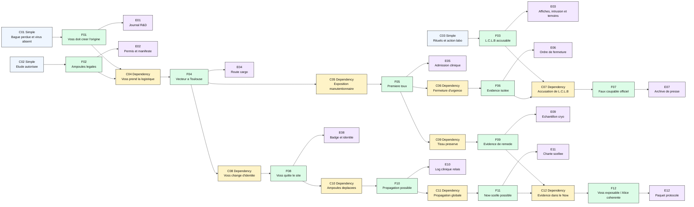
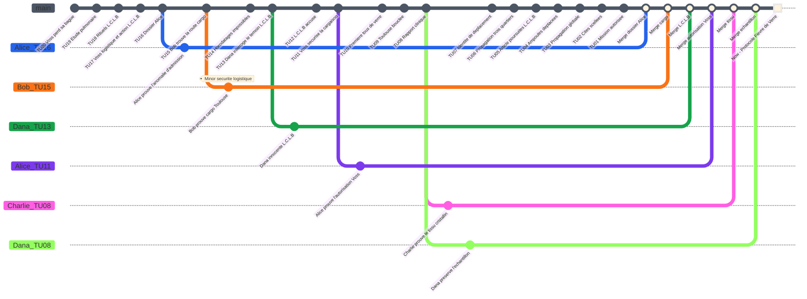
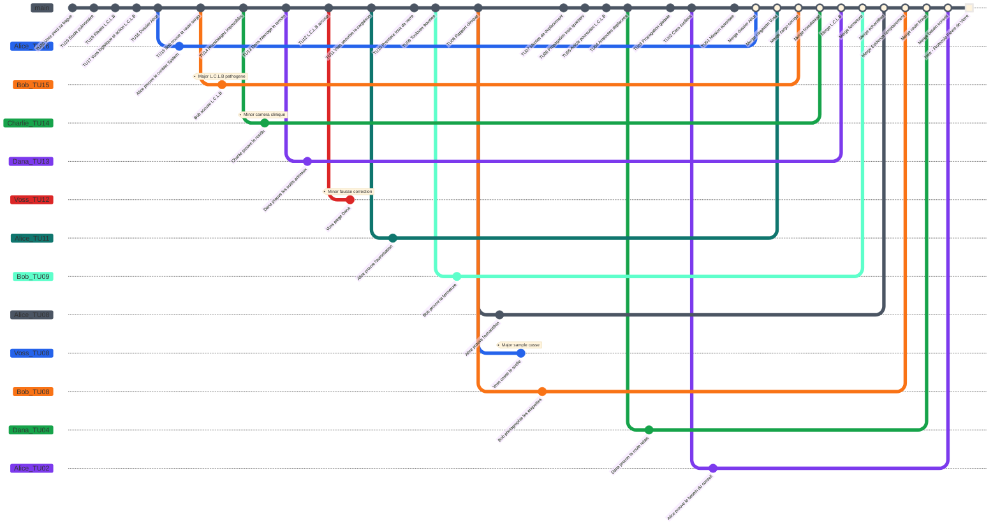

# Protocole Fievre de Verre - Preparation MJ

Ce scenario original est le scenario recommande pour debuter avec **Causality**. Il sert a enseigner le jeu deux fois : d'abord comme enquete starter sans pression active de `Time Offender`, puis comme demonstration complete avec Ilya Voss et son `Counter-System`.

## Premisse

Dans le `Now` de 2142, les cites scellees survivent encore aux consequences d'une maladie de cristallisation pulmonaire apparue a Toulouse en 2117, la Fievre de Verre. Les `Investigators` recoivent une mission simple : comprendre si l'epidemie etait inevitable, identifier la vraie source, et revenir avec assez d'`Evidence` pour stabiliser un `Now` ou le remede existe sans effacer leur realite.

Le faux coupable visible est `Les congénères de la liberation` (`L.C.L.B`), un mouvement de rituels publics et de liberation animale. Le vrai responsable est le docteur Ilya Voss, ancien expert en virologie biologique reconverti en medecin de l'equipe d'`Investigators` a cause de la situation, qui utilise un `Counter-System` pour proteger sa propre origine.

Le scenario est limite a la ville de Toulouse. Comme la profondeur temporelle, le rayon spatial d'influence du `System` depend de l'energie disponible pour rouvrir les probabilites de causalite dans l'espace-temps. Les `Investigators` peuvent consulter des consequences venues d'ailleurs, mais seules les causes situees dans Toulouse peuvent etre rouvertes, modifiees et mergees.

## Verite du MJ

- `L.C.L.B` n'a pas libere la maladie.
- Le seul lien reel entre `L.C.L.B` et le laboratoire R&D de virologie est une action activiste contre les experiences animales du labo en [TU17](#tu17).
- Cette action produit un article de journal, une enquete et des poursuites en justice en [TU5](#tu05), ce qui donne au public une raison credible mais fausse de relier `L.C.L.B` au labo.
- Voss est le vrai porteur d'origine.
- Voss n'est pas d'abord un criminel opportuniste : c'est un ancien virologue qui reconnait dans un indice ramene par un `Investigator` une premiere forme du virus qui ressemble a ses propres travaux.
- Voss cree son `Counter-System` pour ne pas etre identifie par l'organisation, puis remonte en [TU20](#tu20) chercher la structure originelle du virus.
- En [TU20](#tu20), il decouvre dans les archives R&D de virologie qu'il n'existe aucune trace du virus originel. Il comprend que la Fievre de Verre vient du futur, tres probablement de lui.
- Le fragment en quarantaine de [TU20](#tu20) est la bague de commande du `Counter-System` que Voss perd en fuyant les gardes du laboratoire. Sans cette bague, il ne peut plus revenir dans le `Now`.
- Alice est la fille de Voss. Son dossier public masque la filiation sous le nom administratif de sa mere, mais les donnees medicales et genetiques degradees peuvent le reveler.
- Le `System` ne peut agir que dans le rayon spatial de Toulouse pour ce protocole. Tout indice externe doit revenir vers une cause toulousaine avant de devenir jouable.
- En mode starter, Voss est seulement la cause historique cachee.
- En mode complet, Voss est un `Time Offender` conscient qui veut preserver l'ordre des cites scellees.
- La Fievre de Verre doit rester explicable a la resolution finale, mais les `Investigators` peuvent exposer Voss et preserver l'`Evidence` de remede.
- Supprimer completement l'epidemie sans cause de remplacement peut rendre le `Now` originel incoherent.

## LORE

En 2142, les cites scellees existent parce que la Fievre de Verre a ravage Toulouse vingt-cinq ans plus tot avant de devenir une crise globale. Les archives publiques racontent une histoire simple : `L.C.L.B` organise des rituels respiratoires et des liberations animales a Toulouse ([TU18](#tu18), [I-TU18](#i-tu18), [F03](#f03)). Le laboratoire R&D de virologie qui participe a l'etude pulmonaire mene aussi des experiences animales dans ce cadre. `L.C.L.B` y realise une action activiste en [TU17](#tu17), mais cette intrusion vise les animaux, pas les pathogenes ([I-TU17](#i-tu17), [F03](#f03)). Dana interroge plus tard une survivante de `L.C.L.B` qui connait les symboles, les cages et les liberations, mais pas les pathogenes ([TU13](#tu13), [I-TU13](#i-tu13), [F03](#f03)). L'accusation publique contre `L.C.L.B` devient ensuite l'origine officielle de la catastrophe ([TU12](#tu12), [I-TU12](#i-tu12), [F07](#f07)). En [TU5](#tu05), un article de journal relance l'incident du labo, l'enquete et les poursuites contre le groupe activiste ([I-TU05](#i-tu05), [F07](#f07)). Cette version est fausse, mais elle est utile au `Now` : elle donne une origine lisible a la catastrophe, protege Voss et permet aux cites scellees de justifier leur autorite sanitaire.

Le vrai point d'origine est le docteur Ilya Voss. Avant les cites scellees, Voss etait un expert en virologie biologique. Dans le `Now`, la crise le force a devenir medecin de l'equipe d'`Investigators`. Lorsqu'un `Investigator` rapporte un indice lie a la premiere forme de la Fievre de Verre, Voss reconnait une signature qui ressemble a ses anciens travaux de virologue. Il comprend qu'un lien personnel existe entre lui et le virus, cree un `Counter-System` pour echapper a l'identification par l'organisation, puis remonte en [TU20](#tu20) pour retrouver la structure originelle du pathogene.

En [TU20](#tu20), Voss infiltre les archives du laboratoire R&D de virologie. Les dossiers ne contiennent aucune trace credible d'un virus originel : pas de souche mere, pas de protocole initial, pas de chaine d'echantillon anterieure. Voss en deduit que la Fievre de Verre n'existe pas encore et qu'elle vient du futur, certainement de ses propres travaux. Des gardes l'entendent dans la salle de quarantaine. En fuyant, il perd sa bague de commande du `Counter-System`, l'equivalent des bagues utilisees par les `Investigators` pour communiquer avec le `System` et le piloter. La bague est confisquee comme fragment en quarantaine du laboratoire ([I-TU20](#i-tu20), [F01](#f01)). Sans elle, Voss ne peut plus revenir dans le `Now`.

Coince dans le passe, Voss comprend que sa propre realite depend de la catastrophe : sans Fievre de Verre, les cites scellees ne se forment pas ([TU02](#tu02), [I-TU02](#i-tu02), [F11](#f11)), il ne rencontre jamais sa femme dans une cite scellee, Alice ne nait pas, le conseil n'autorise jamais la mission ([TU01](#tu01), [I-TU01](#i-tu01), [F12](#f12)), et le Protocole Fievre de Verre n'arrive pas aux `Investigators` ([TU00](#tu00), [I-TU00](#i-tu00), [F12](#f12)).

Voss utilise alors ce qu'il sait de la `Main Timeline` pour reproduire les evenements au lieu de les empecher. Le reseau de sante toulousain lance une etude pulmonaire qui ouvre une route legale pour les echantillons ([TU19](#tu19), [I-TU19](#i-tu19), [F02](#f02)). Le laboratoire R&D de virologie participe a cette etude et fournit des protocoles sur tissus pulmonaires animaux. Voss attend le bon point d'entree, se fait embaucher dans l'etude en [TU17](#tu17) comme responsable logistique, et obtient l'acces au contenu des cargaisons medicales ([I-TU17](#i-tu17), [F04](#f04)). La meme `Time Unit` contient aussi l'action activiste de `L.C.L.B` dans le labo : elle cree du bruit judiciaire autour du bon lieu, mais pas la maladie.

Les premieres traces instables apparaissent avant meme que les `Investigators` comprennent le dossier. Alice surgit dans un dossier d'admission degrade, preuve que le `System` a deja touche le cas et que sa filiation avec Voss a ete masquee dans les archives du `Now` ([TU16](#tu16), [I-TU16](#i-tu16), [F12](#f12)). Charlie repere ensuite des horodatages impossibles qui prouvent qu'une pression de `Counter-System` protege la chaine d'origine ([TU14](#tu14), [I-TU14](#i-tu14), [F01](#f01)).

A Toulouse, Bob trouve des routes de cargaison contradictoires qui signalent une chaine logistique instable ([TU15](#tu15), [I-TU15](#i-tu15), [F02](#f02)). Voss securise ensuite la cargaison medicale qui devient le vrai vecteur d'origine ([TU11](#tu11), [I-TU11](#i-tu11), [F04](#f04)). Un manutentionnaire est expose et developpe la premiere toux de verre ([TU10](#tu10), [I-TU10](#i-tu10), [F05](#f05)). Quand les symptomes deviennent impossibles a cacher, l'ordre d'urgence ferme la zone toulousaine concernee, isole les preuves et transforme Toulouse en scene d'origine officielle ([TU09](#tu09), [I-TU09](#i-tu09), [F06](#f06)).

La premiere clinique identifie du tissu pulmonaire cristallin et conserve des echantillons capables de devenir une `Evidence` de remede ([TU08](#tu08), [I-TU08](#i-tu08), [F09](#f09)). Voss sait que cette `Evidence` est dangereuse pour lui si elle revele la chaine reelle, mais indispensable si les `Investigators` doivent stabiliser un `Now` coherent au lieu d'effacer completement leur propre realite. Il change donc d'identite de deplacement pour quitter le site d'origine sans sortir du rayon toulousain du `System` ([TU07](#tu07), [I-TU07](#i-tu07), [F08](#f08)). Il deplace ensuite les ampoules restantes par une clinique relais de Toulouse, ce qui donne a l'epidemie sa route finale ([TU04](#tu04), [I-TU04](#i-tu04), [F10](#f10)).

La Fievre de Verre atteint trois quartiers toulousains et rend le `Now` originel probable ([TU06](#tu06), [I-TU06](#i-tu06), [F11](#f11)). Alice, Bob, Charlie et Dana convergent vers Toulouse sous pression de securite ([TU05](#tu05), [I-TU05](#i-tu05), [F12](#f12)). La Fievre de Verre devient ensuite globale ([TU03](#tu03), [I-TU03](#i-tu03), [F11](#f11)). Les cites scellees se forment sous regime d'urgence ([TU02](#tu02), [I-TU02](#i-tu02), [F11](#f11)). Des annees plus tard, le conseil des cites scellees autorise le Protocole Fievre de Verre ([TU01](#tu01), [I-TU01](#i-tu01), [F12](#f12)). Dans le `Now`, les `Investigators` recoivent le protocole : ils doivent ouvrir le `Time Flow` dans le rayon toulousain du `System`, comprendre si l'epidemie etait inevitable, identifier la vraie source et rapporter assez d'`Evidence` pour exposer Voss sans detruire le present qui les a envoyes ([TU00](#tu00), [I-TU00](#i-tu00), [F12](#f12)).

## Main Timeline

Le `Time Flow` possede exactement 20 `Atomic Time Units` avant le `Now`. La `Time Unit 20` est l'etat prepare le plus ancien. La `Time Unit 1` est l'etat prepare le plus proche du present. La `Time Unit 0` est le `Now`. Toutes les `Time Units` jouables sont ancrees dans Toulouse : sortir du rayon spatial du `System` coute trop d'energie pour rouvrir une probabilite causale stable. Les periodes ci-dessous sont des reperes de table : elles aident les joueurs a se projeter sans transformer les `Time Units` en durees fixes.

| Time Unit | Periode | Visible or Discoverable Event | Note MJ |
|---:|---|---|---|
| 20 | Printemps 2116 | Voss infiltre les archives R&D de virologie. | Il ne trouve aucune trace du virus originel et perd sa bague de commande du `Counter-System`. |
| 19 | Ete 2116 | Le reseau de sante toulousain lance une etude pulmonaire. | Voss y voit la route legale dont il aura besoin pour les echantillons. |
| 18 | Automne 2116 | `L.C.L.B` organise des rituels publics. | Le faux coupable devient visible. |
| 17 | Hiver 2116-2117 | Voss est embauche dans l'etude comme responsable logistique ; `L.C.L.B` mene une action activiste au labo R&D contre les experiences animales. | Voss accede aux cargaisons ; `L.C.L.B` cree seulement un lien public avec le labo. |
| 16 | Janvier 2117 | Alice apparait dans un dossier d'admission degrade. | Le `System` a deja touche le cas et masque sa filiation avec Voss. |
| 15 | Fevrier 2117 | Bob trouve des routes de cargaison contradictoires a Toulouse. | La route des ampoules devient instable. |
| 14 | Mars 2117 | Charlie detecte des horodatages impossibles. | Un residu de `Counter-System` est present. |
| 13 | Avril 2117 | Dana interroge une survivante de `L.C.L.B`. | Le groupe connait des symboles, pas les pathogenes. |
| 12 | Mai 2117 | `L.C.L.B` est accuse publiquement. | Cela protege Voss. |
| 11 | Juin 2117 | Voss securise la cargaison medicale. | Vrai vecteur d'origine. |
| 10 | Juillet 2117 | Un manutentionnaire developpe la premiere toux de verre. | Premiere chaine d'infection observable. |
| 9 | Aout 2117 | Toulouse entre en fermeture sanitaire locale. | L'`Evidence` devient difficile d'acces. |
| 8 | Septembre 2117 | La premiere clinique signale du tissu pulmonaire cristallin. | L'`Evidence` de remede existe ici. |
| 7 | Octobre 2117 | Voss change son identite de deplacement. | Il commence a surveiller les `Investigators`. |
| 6 | Novembre 2117 | L'epidemie atteint trois quartiers toulousains. | Le `Now` originel devient probable. |
| 5 | Decembre 2117 | Alice, Bob, Charlie et Dana convergent vers Toulouse ; un article relance l'incident R&D, l'enquete et les poursuites contre `L.C.L.B`. | La pression de securite commence et la fausse piste judiciaire se renforce. |
| 4 | Janvier 2118 | Voss deplace les ampoules par une clinique relais de Toulouse. | Route finale du porteur. |
| 3 | Printemps 2118 | La Fievre de Verre devient globale. | Catastrophe verrouillee. |
| 2 | 2119-2122 | Les cites scellees se forment. | Le `System` futur peut exister. |
| 1 | Debut 2142 | Le conseil des cites scellees autorise la mission. | Dernier etat prepare avant le `Now`. |
| 0 | Now, 2142 | `Now` : les `Investigators` recoivent le Protocole Fievre de Verre. | Le present doit rester coherent. |

### Graphique Mermaid de la Main Timeline

```mermaid
flowchart LR
  TU20["TU20<br/>Bague perdue en R&D virologie"] --> TU19["TU19<br/>Etude pulmonaire"]
  TU19 --> TU18["TU18<br/>Rituels L.C.L.B"]
  TU18 --> TU17["TU17<br/>Voss logistique / action L.C.L.B au labo"]
  TU17 --> TU16["TU16<br/>Dossier d'Alice / filiation masquee"]
  TU16 --> TU15["TU15<br/>Cargaisons contradictoires"]
  TU15 --> TU14["TU14<br/>Horodatages impossibles"]
  TU14 --> TU13["TU13<br/>Temoin L.C.L.B"]
  TU13 --> TU12["TU12<br/>L.C.L.B accuse"]
  TU12 --> TU11["TU11<br/>Voss securise la cargaison"]
  TU11 --> TU10["TU10<br/>Premiere toux de verre"]
  TU10 --> TU09["TU09<br/>Toulouse bouclee"]
  TU09 --> TU08["TU08<br/>Rapport clinique"]
  TU08 --> TU07["TU07<br/>Identite de deplacement"]
  TU07 --> TU06["TU06<br/>Trois quartiers infectes"]
  TU06 --> TU05["TU05<br/>Article et poursuites L.C.L.B"]
  TU05 --> TU04["TU04<br/>Ampoules deplacees"]
  TU04 --> TU03["TU03<br/>Propagation globale"]
  TU03 --> TU02["TU02<br/>Cites scellees"]
  TU02 --> TU01["TU01<br/>Mission autorisee"]
  TU01 --> NOW["TU00 / Now<br/>Protocole livre"]
```

## Briefing initial des joueurs

- Le `Now` est en 2142.
- La Fievre de Verre commence officiellement a Toulouse en 2117.
- Le `System` ne peut rouvrir des probabilites causales que dans son rayon spatial toulousain ; le scenario reste donc limite a la ville.
- `L.C.L.B` est accuse dans les archives publiques.
- `L.C.L.B` a bien mene une action activiste contre un laboratoire R&D lie a l'etude pulmonaire, mais les premieres archives disponibles parlent d'animaux et de poursuites, pas de pathogene.
- Plusieurs horodatages d'archive sont impossibles.
- Ilya Voss apparait dans des dossiers propres mais jamais dans l'accusation publique.
- Le fragment conserve en quarantaine ressemble a une bague de commande du `System`, mais il est anterieur a toute version officielle du dispositif.
- Le dossier medical d'Alice contient des champs de filiation corrompus et des marqueurs genetiques non resolus.
- La mission consiste a identifier la vraie origine, preserver l'`Evidence` de remede, et eviter d'effacer le `Now` des cites scellees.

## Table des indices

| ID | Time Unit | Indice | Ce que l'indice permet de deduire | References causales |
|---|---:|---|---|---|
| I-TU20 | [TU20](#tu20) | Journal d'intrusion R&D lie a Voss, absence de souche originelle, bague de commande du `Counter-System` en quarantaine. | Voss vient du futur, a perdu son acces au retour, et comprend que le virus n'a pas d'origine historique. | [F01](#f01) |
| I-TU19 | [TU19](#tu19) | Permis d'etude pulmonaire et autorisations de transfert. | L'etude donne une route legale aux echantillons que Voss peut exploiter pour recreer la timeline. | [F02](#f02) |
| I-TU18 | [TU18](#tu18) | Affiches et enregistrements des rituels publics de `L.C.L.B`. | `L.C.L.B` est visible et peut etre accuse. | [F03](#f03) |
| I-TU17 | [TU17](#tu17) | Contrat de responsable logistique de Voss, notes de manutention, rapport interne sur une intrusion activiste de `L.C.L.B` au vivarium R&D. | Voss peut acceder aux cargaisons ; `L.C.L.B` a seulement attaque les experiences animales du labo. | [F03](#f03), [F04](#f04) |
| I-TU16 | [TU16](#tu16) | Dossier d'admission degrade au nom d'Alice, filiation paternelle effacee et marqueurs genetiques compatibles avec Voss. | Le `System` a deja touche ce cas, Alice est la fille de Voss, et les `Investigators` ne partent pas d'une enquete neutre. | [F12](#f12) |
| I-TU15 | [TU15](#tu15) | Manifeste cargo de Toulouse avec routes contradictoires. | La route des ampoules est instable et manipulable. | [F02](#f02), [F04](#f04) |
| I-TU14 | [TU14](#tu14) | Horodatages impossibles dans les archives cliniques et logistiques. | Une intervention de `Counter-System` protege la chaine d'origine. | [F01](#f01), [F04](#f04) |
| I-TU13 | [TU13](#tu13) | Temoignage d'une survivante de `L.C.L.B` sur les rituels et l'action au vivarium R&D. | `L.C.L.B` connait les symboles, les cages et les liberations animales, pas les pathogenes. | [F03](#f03) |
| I-TU12 | [TU12](#tu12) | Archive de presse et rapport d'arrestation accusant `L.C.L.B`. | Le faux coupable devient officiel et protege Voss. | [F07](#f07) |
| I-TU11 | [TU11](#tu11) | Autorisation de cargaison signee par Voss, route cargo et scelle manquant. | Voss securise le vrai vecteur d'origine. | [F04](#f04) |
| I-TU10 | [TU10](#tu10) | Admission clinique et temoignage du manutentionnaire expose. | La premiere toux de verre suit la cargaison, pas les rituels de `L.C.L.B`. | [F05](#f05) |
| I-TU09 | [TU09](#tu09) | Ordre de fermeture sanitaire de Toulouse et log de securite. | La fermeture isole l'`Evidence`. | [F06](#f06) |
| I-TU08 | [TU08](#tu08) | Rapport clinique, registre cryo de Ren Arco et note de pathologiste. | Une `Evidence` de remede existe. | [F09](#f09), [F12](#f12) |
| I-TU07 | [TU07](#tu07) | Badge de deplacement urbain et identite falsifiee de Voss. | Voss quitte le site d'origine sous une identite modifiee sans sortir du rayon toulousain. | [F08](#f08) |
| I-TU06 | [TU06](#tu06) | Rapport sanitaire sur trois quartiers toulousains infectes. | Le `Now` originel devient probable. | [F11](#f11) |
| I-TU05 | [TU05](#tu05) | Registres de securite montrant Alice, Bob, Charlie et Dana dans Toulouse ; article de journal sur l'incident R&D, l'enquete et les poursuites contre `L.C.L.B`. | La pression de securite commence autour des `Investigators` et la fausse piste judiciaire contre `L.C.L.B` se renforce. | [F07](#f07), [F12](#f12) |
| I-TU04 | [TU04](#tu04) | Log de clinique relais toulousaine et boitier d'ampoule casse. | Les ampoules restantes sont deplacees vers la route finale de propagation. | [F10](#f10) |
| I-TU03 | [TU03](#tu03) | Bulletin sanitaire global sur la Fievre de Verre. | La catastrophe est verrouillee a l'echelle mondiale. | [F11](#f11) |
| I-TU02 | [TU02](#tu02) | Charte des cites scellees et registre de population. | Le `Now` des cites scellees depend de l'epidemie. | [F11](#f11) |
| I-TU01 | [TU01](#tu01) | Autorisation du conseil des cites scellees. | La mission peut etre lancee sans rendre le `Now` incoherent. | [F12](#f12) |
| I-TU00 | [TU00](#tu00) | Paquet final du Protocole Fievre de Verre et chaine d'echantillon. | Les `Investigators` peuvent exposer Voss si l'`Evidence` survit. | [F12](#f12) |

## Causal Table cachee

| ID | Type de condition | Conditions | Fact | Evidence |
|---|---|---|---|---|
| F01 | Simple | En TU20, Voss constate l'absence de souche originelle et perd sa bague de commande du `Counter-System`. | Voss comprend qu'il doit creer l'origine depuis le futur pour preserver sa realite. | [I-TU20](#i-tu20) Journal d'intrusion, absence de souche, bague en quarantaine. |
| F02 | Simple | L'etude pulmonaire permet les cargaisons medicales. | Les ampoules contaminees peuvent circuler legalement si Voss controle la logistique. | [I-TU19](#i-tu19) Permis d'etude ; [I-TU15](#i-tu15) manifeste cargo. |
| F03 | Simple | `L.C.L.B` agit publiquement et mene une action activiste au labo R&D contre les experiences animales. | `L.C.L.B` peut etre accuse, mais son lien au labo est militant, pas virologique. | [I-TU18](#i-tu18) Rituels publics ; [I-TU17](#i-tu17) rapport d'intrusion ; [I-TU13](#i-tu13) temoignage. |
| F04 | Dependency | Dependency: [F01](#f01) et [F02](#f02). Voss prend le poste logistique et modifie la manutention. | Le vrai vecteur d'origine entre a Toulouse. | [I-TU17](#i-tu17) Notes de manutention ; [I-TU11](#i-tu11) cargaison securisee. |
| F05 | Dependency | Dependency: [F04](#f04). Le manutentionnaire est expose. | La premiere toux de verre commence. | [I-TU10](#i-tu10) Admission clinique, temoignage du manutentionnaire. |
| F06 | Dependency | Dependency: [F05](#f05). L'ordre d'urgence ferme la zone toulousaine. | L'`Evidence` est isolee. | [I-TU09](#i-tu09) Ordre de fermeture, log de securite. |
| F07 | Dependency | Dependency: [F03](#f03) et [F06](#f06). L'accusation publique vise `L.C.L.B` et recycle l'incident du labo R&D. | Le faux coupable devient officiel. | [I-TU12](#i-tu12) Archive de presse, rapport d'arrestation ; [I-TU05](#i-tu05) article, enquete et poursuites. |
| F08 | Dependency | Dependency: [F04](#f04). Voss change d'identite de deplacement. | Voss peut quitter le site d'origine sans sortir de Toulouse. | [I-TU07](#i-tu07) Badge urbain, identite falsifiee. |
| F09 | Dependency | Dependency: [F05](#f05). La clinique preserve des tissus. | L'`Evidence` de remede existe. | [I-TU08](#i-tu08) Rapport clinique, echantillon cryo. |
| F10 | Dependency | Dependency: [F08](#f08). Voss deplace les ampoules. | L'epidemie peut sortir du rayon toulousain et se propager globalement. | [I-TU04](#i-tu04) Log de clinique relais, boitier d'ampoule casse. |
| F11 | Dependency | Dependency: [F10](#f10). La propagation globale a lieu. | Le `Now` des cites scellees existe. | [I-TU06](#i-tu06) Rapport trois quartiers ; [I-TU03](#i-tu03) bulletin global ; [I-TU02](#i-tu02) charte scellee. |
| F12 | Dependency | Dependency: [F09](#f09) et [F11](#f11). L'`Evidence` survit jusqu'au `Now` et le dossier d'Alice reste coherent. | Les `Investigators` peuvent exposer Voss sans effacer le `Now` ni nier la naissance d'Alice. | [I-TU16](#i-tu16) Dossier degrade ; [I-TU01](#i-tu01) Autorisation ; [I-TU00](#i-tu00) paquet de protocole. |

### Graphique Mermaid de la Causal Table

## Personnages

| Personnage | Role public | Fonction reelle |
|---|---|---|
| Alice | Investigator medicale | Fille cachee de Voss, ancre de contact System et preuve medicale. |
| Bob | Investigator logistique | Suit les routes, la securite et les contradictions de cargaison. |
| Charlie | Investigator technique | Lit les horodatages et les traces de `Counter-System`. |
| Dana | Investigator sociale | Innocente `L.C.L.B` et preserve l'`Evidence`. |
| Ilya Voss | Ancien virologue, medecin des `Investigators` | Createur du `Counter-System`, `Time Offender` et vrai porteur en mode complet. |
| Les congénères de la liberation (`L.C.L.B`) | Groupe de rituels publics | Faux coupable. |
| Sera Holt | Premiere patiente connue | Preuve humaine de la chaine d'exposition. |
| Ren Arco | Pathologiste | Garde l'echantillon utile au remede. |

## Le Docteur Voss comme Time Offender

Voss commence **Unaware of identities**, devient **Alerted** lorsque le groupe touche aux registres logistiques de Toulouse, et atteint le stade **Identified target** lorsqu'un Investigator révèle une connaissance impossible de la route des ampoules.

Son moteur intime est simple : il sait que sans epidemie il ne rencontrera jamais sa femme dans une cite scellee et qu'Alice n'existera pas. Comme il est bloque dans le passe apres la perte de sa bague de commande en [TU20](#tu20), il ne peut pas revenir corriger depuis le `Now`. Il doit donc rejouer la catastrophe avec les moyens historiques disponibles.

Voss evite de cibler Alice directement tant qu'il peut interpreter ses actions comme recuperables. S'il comprend qu'elle va accepter d'effacer la chaine qui la fait naitre, il peut la traiter comme une cible identifiee, mais ses actions contre elle doivent laisser des traces emotionnelles : message parental non signe, hesitation dans une archive modifiee, ou ordre de securite annule puis reactive.

Voss possède un set de `Counter-System Rewind Dice` à usage unique : d4, d6, d8, d10, d12, d20.

| Action | Effet mécanique | Evidence laissée |
|---|---|---|
| Réaccuser `L.C.L.B` | Ajoute un `Minor Conflict` à un Investigator qui innocente `L.C.L.B`. | Archive de presse modifiée. |
| Déplacer les ampoules | Force une branche corrective ou maintient un `Major Conflict`. | Incohérence sur la route de la clinique relais. |
| Contaminer l'échantillon | Bloque un merge jusqu'à ce qu'une Evidence de remplacement existe. | Sceau cryogénique brisé. |
| Identify an Investigator | Ajoute une pression de sécurité publique. | Inscription sur liste de surveillance. |

## Trackers Rewind Dice

| Investigator | d4 | d6 | d8 | d10 | d12 | d20 |
|---|---|---|---|---|---|---|
| Alice | disponible | disponible | disponible | disponible | disponible | disponible |
| Bob | disponible | disponible | disponible | disponible | disponible | disponible |
| Charlie | disponible | disponible | disponible | disponible | disponible | disponible |
| Dana | disponible | disponible | disponible | disponible | disponible | disponible |

| Time Offender | d4 | d6 | d8 | d10 | d12 | d20 |
|---|---|---|---|---|---|---|
| Ilya Voss | disponible | disponible | disponible | disponible | disponible | disponible |

## Deroulement starter - Sans Time Offender

Utilisez cette version pour apprendre le scenario. Voss est seulement la source historique cachee. Ignorez les des de `Counter-System`, les etats de conscience du `Time Offender`, et les actions de `Time Offender`. L'ordre reste : MJ, Alice, Bob, Charlie, Dana.

### Replay starter

**Tour du MJ.** Le MJ ouvre le `Time Flow` au `Now`. Le briefing visible indique que `L.C.L.B` est accuse, que Toulouse est le premier site connu, que le rayon du `System` limite les sauts a la ville, et que des horodatages sont impossibles. Le MJ garde Voss comme vrai porteur cache.

**Tour d'Alice.** Alice depense son d20 vers la `Time Unit 16`. Valeur forcee : `d20 -> 13`, donc `r = 13 / 16 x 100 = 81.25%` : reussite critique. Alice prouve que son dossier degrade vient d'un ancien contact avec le `System` et contient une filiation paternelle volontairement effacee. En starter, le MJ peut garder le nom de Voss masque jusqu'a la resolution finale. La branche merge immediatement car elle ne contredit aucune dependency. Alice termine a `0` de `Charge mentale`.

**Tour de Bob.** Bob depense son d12 vers la `Time Unit 15`. Valeur forcee : `d12 -> 8`, donc `r = 53.33%` : reussite partielle. Consequence `d10 -> 8` : `Minor Conflict`. Bob prouve que la cargaison medicale passe par Toulouse, mais un rapport de securite place un Investigator pres du terminal du manifeste. Bob a une branche non `Merged` et un `Minor Conflict` non resolu : `30 + 20 = 50` de `Charge mentale`.

**Tour de Charlie.** Charlie depense son d10 vers la `Time Unit 14`. Valeur forcee : `d10 -> 4`, donc `r = 28.57%` : echec partiel. Aucune `Branched Timeline` stable ne s'ouvre et le d10 est depense. Gain `d10 -> 5` : le MJ revele une direction d'`Evidence`, un motif d'horodatage lie a l'archive clinique. Charlie n'a pas de branche ouverte et reste a `0` de `Charge mentale`.

**Tour de Dana.** Dana depense son d20 vers la `Time Unit 13`. Valeur forcee : `d20 -> 11`, donc `r = 84.62%` : reussite critique. Dana interroge une survivante de `L.C.L.B` et prouve que le groupe prepare des rituels et des liberations animales, pas de manipulation de pathogenes. Le temoignage confirme que l'action du labo R&D visait le vivarium de l'etude pulmonaire. La branche merge et Dana termine a `0` de `Charge mentale`.

**Tour du MJ.** Le MJ rend visibles les dependencies : la route de cargaison doit etre prouvee avant de relier Voss a l'epidemie, et les echantillons cliniques doivent etre preserves pour qu'une `Evidence` de remede survive jusqu'au `Now`.

**Tour d'Alice.** Alice depense son d12 vers la `Time Unit 11`. Valeur forcee : `d12 -> 8`, donc `r = 72.73%` : reussite partielle. Consequence `d10 -> 4` : mauvais point d'entree. Alice arrive dans le bureau de l'etude au lieu du terminal logistique, mais prouve que Voss a signe l'autorisation de cargaison medicale. La branche reste ouverte jusqu'a confirmation de la chaine d'echantillon. Alice a une branche non `Merged` : `30` de `Charge mentale`.

**Tour de Bob.** Bob tente de resoudre son `Minor Conflict` de securite logistique au niveau facile. Sa `Charge mentale` actuelle est `50`, donc le percentile force `70` donne un resultat final de `70 - 50 = 20`, egal au seuil facile `20` : succes. Le rapport devient une alerte de maintenance anonyme, la branche de Bob merge, et Bob revient a `0`.

**Tour de Charlie.** Charlie depense son d12 vers la `Time Unit 14` pour suivre le motif d'horodatage. Valeur forcee : `d12 -> 11`, donc `r = 78.57%` : reussite partielle. Consequence `d10 -> 6` : la branche s'ouvre plus proche du `Now`. La cible passe de la `Time Unit 14` a la `Time Unit 8`, car `14 - 6 = 8`. Charlie rate le terminal d'archive mais atteint le premier rapport clinique et prouve que du tissu cristallin utile au remede existe. Charlie a une branche non `Merged` : `30` de `Charge mentale`.

**Tour de Dana.** Dana depense son d10 vers la `Time Unit 8`. Valeur forcee : `d10 -> 9`, donc `r = 112.5%` : reussite critique. Dana preserve la chaine de l'echantillon clinique et relie l'echantillon cryo de Ren Arco a la preuve d'Alice sur Voss. Le MJ autorise le merge de la branche TU11 d'Alice et de la branche TU8 de Charlie. Alice, Charlie et Dana reviennent a `0`.

**Resolution finale du MJ.** Le groupe a innocente `L.C.L.B`, prouve que Voss a manipule la cargaison, et preserve une `Evidence` de remede. Si le MJ revele la filiation d'Alice dans cette version, elle devient la preuve intime du paradoxe : l'epidemie existe encore, donc le `Now` des cites scellees et Alice restent coherents. Fin : **convergence starter complete**.

### GitGraph starter du scenario

Dans ce GitGraph, chaque point blanc sur la branche `main` correspond a un `Merge` sur le `Now`. Le carre blanc represente le `Now`.

### Etat final starter

| Investigator | Charge mentale finale | Health finale | Rewind Dice depenses | Conflits ouverts | Etat final |
|---|---:|---:|---|---:|---|
| Alice | 0 | 10 | d20, d12 | 0 | Contact System, filiation masquee et autorisation Voss merged. |
| Bob | 0 | 10 | d12 | 0 | Route cargo merged apres resolution du rapport logistique. |
| Charlie | 0 | 10 | d10, d12 | 0 | L'echec d'horodatage devient une route d'Evidence clinique. |
| Dana | 0 | 10 | d20, d10 | 0 | `L.C.L.B` innocente et echantillon preserve. |

### Statistiques starter

| Investigator | Branches totales | Branches Merged | Branches ouvertes | Minor crees | Minor resolus | Major crees | Major resolus | Rewind Dice depenses | Reussites critiques | Reussites partielles | Echecs partiels | Echecs critiques | Jets d'action au pourcentage | Jets reussis | Charge mentale maximale | Health finale |
|---|---:|---:|---:|---:|---:|---:|---:|---:|---:|---:|---:|---:|---:|---:|---:|---:|
| Alice | 2 | 2 | 0 | 0 | 0 | 0 | 0 | 2 | 1 | 1 | 0 | 0 | 0 | 0 | 30 | 10 |
| Bob | 1 | 1 | 0 | 1 | 1 | 0 | 0 | 1 | 0 | 1 | 0 | 0 | 1 | 1 | 50 | 10 |
| Charlie | 1 | 1 | 0 | 0 | 0 | 0 | 0 | 2 | 0 | 1 | 1 | 0 | 0 | 0 | 30 | 10 |
| Dana | 2 | 2 | 0 | 0 | 0 | 0 | 0 | 2 | 2 | 0 | 0 | 0 | 0 | 0 | 0 | 10 |
| **Total** | **6** | **6** | **0** | **1** | **1** | **0** | **0** | **7** | **3** | **3** | **1** | **0** | **1** | **1** | **50** | **40** |

## Deroulement complet - Avec Time Offender

Utilisez cette version apres le replay starter. Elle montre toute la surface de regles : les quatre resultats de `Rewind`, valeurs forcees pedagogiques, consequences de reussite partielle, gains d'echec partiel, `Minor Conflicts`, `Major Conflicts`, correction de conflit par un autre joueur, tests de `Charge mentale`, degats sans jet d'attaque, conscience du `Time Offender`, et actions de `Counter-System`.

### Replay complet

**Tour du MJ.** Le MJ ouvre le `Time Flow` et marque secretement Ilya Voss comme `Time Offender` avec un `Counter-System`. Voss commence avec **identites inconnues**. Le MJ garde cachee la chaine : absence de souche originelle en TU20, bague de commande perdue, acces logistique aux cargaisons, premiere infection, isolement de l'`Evidence`, fausse accusation publique, route finale des ampoules, puis `Now` des cites scellees.

**Tour d'Alice.** Alice depense son d20 vers la `Time Unit 16`. Valeur forcee : `d20 -> 17`, donc `r = 106.25%` : reussite critique. Alice prouve son dossier degrade, le contact System precedent, et l'existence d'une filiation paternelle effacee dont les marqueurs pointent vers Voss. La branche reste ouverte le temps de verifier si ce contact aide ou menace la chaine d'origine de Voss. Alice termine a `30` de `Charge mentale`.

**Tour de Bob.** Bob depense son d12 vers la `Time Unit 15`. Valeur forcee : `d12 -> 6`, donc `r = 40%` : echec partiel. Aucune branche stable ne s'ouvre. Gain `d10 -> 6` : le MJ revele qu'une ligne de manifeste cargo a ete deplacee plus pres du `Now` par une edition inconnue. Bob reste a `0`.

**Tour de Charlie.** Charlie depense son d10 vers la `Time Unit 14`. Valeur forcee : `d10 -> 1`, donc `r = 7.14%` : echec critique. Aucune branche, aucun gain, et le d10 est depense. Charlie reste a `0`.

**Tour de Dana.** Dana depense son d8 vers la `Time Unit 13`. Valeur forcee : `d8 -> 5`, donc `r = 38.46%` : echec partiel. Aucune branche stable ne s'ouvre. Gain `d10 -> 7` : trace de `Time Offender`. Le MJ revele que le temoin de `L.C.L.B` se souvient d'un badge medical propre dans la foule. Dana reste a `0`.

**Tour du MJ.** Voss remarque la pression du `System` autour de la ligne cargo de Toulouse et devient **alerte**. Il ne connait encore aucune identite, donc il ne fait pas d'action ciblee.

**Tour d'Alice.** Alice depense son d12 vers la `Time Unit 11`. Valeur forcee : `d12 -> 9`, donc `r = 81.82%` : reussite critique. Elle prouve que Voss a signe la cargaison medicale et que la signature depend du permis d'etude pulmonaire. Alice merge ses branches d'admission et de cargaison. Alice revient a `0`.

**Tour de Bob.** Bob depense son d20 vers la `Time Unit 15`. Valeur forcee : `d20 -> 9`, donc `r = 60%` : reussite partielle. Consequence `d10 -> 10` : `Major Conflict`. Bob prouve la route cargo, mais sa premiere action fait classer `L.C.L.B` comme groupe de contrebande pathogene parce que l'incident activiste du labo R&D est rattache a la meme etude pulmonaire. La branche ne peut pas merge tant qu'une cause corrective n'innocente pas `L.C.L.B`. Bob a une branche non `Merged` et un `Major Conflict` non resolu : `30 + 40 = 70`.

**Tour de Charlie.** Charlie depense son d12 vers la `Time Unit 14`. Valeur forcee : `d12 -> 8`, donc `r = 57.14%` : reussite partielle. Consequence `d10 -> 8` : `Minor Conflict`. Charlie prouve le residu d'horodatage du `Counter-System`, mais une camera clinique le place pres du terminal d'archive. Charlie a une branche non `Merged` et un `Minor Conflict` non resolu : `30 + 20 = 50`.

**Tour de Dana.** Dana depense son d20 vers la `Time Unit 13`. Valeur forcee : `d20 -> 18`, donc `r = 138.46%` : reussite critique. Dana prouve que le temoin de `L.C.L.B` a vu des outils de liberation animale, des cages ouvertes et des dossiers de vivarium, pas du materiel pathogene. Cela cree la cause corrective qui resout le `Major Conflict` de Bob : `L.C.L.B` a bien touche au labo, mais pas au virus. La branche de Bob peut merge et Bob revient a `0`. La branche de Dana merge aussi.

**Tour du MJ.** Voss identifie Dana parce qu'elle a revele une connaissance impossible de la memoire du temoin. Il depense son d8 de `Counter-System` vers la `Time Unit 12`. Valeur forcee : `d8 -> 6`, donc `r = 50%` : reussite partielle. Consequence `d10 -> 8` : `Minor Conflict`. Voss modifie une archive de presse pour faire apparaitre Dana comme source d'une fausse correction sur l'incident du labo. Dana a un `Minor Conflict` non resolu et aucune branche ouverte : `20`.

**Tour d'Alice.** Alice depense son d8 vers la `Time Unit 8`. Valeur forcee : `d8 -> 5`, donc `r = 62.5%` : reussite partielle. Consequence `d10 -> 4` : mauvais point d'entree. Alice arrive a la clinique apres l'alarme du congelateur, mais prouve quand meme que Ren Arco a preserve un tissu cristallin. Alice a une branche non `Merged` : `30`.

**Tour de Bob.** Bob depense son d10 vers la `Time Unit 9`. Valeur forcee : `d10 -> 9`, donc `r = 100%` : reussite critique. Bob prouve la chaine de fermeture d'urgence et cree une raison legale pour laquelle la salle d'echantillon est restee scellee. Sa branche merge et il reste a `0`.

**Tour de Charlie.** Charlie tente de resoudre le `Minor Conflict` de camera au niveau moyen. Sa `Charge mentale` actuelle est `50`, donc le percentile force `40` donne un resultat final de `40 - 50 = -10`, inferieur au seuil moyen `50` : echec. La camera l'identifie encore, sa branche ne peut pas merge, et Charlie reste a `50`.

**Tour de Dana.** Dana tente de resoudre la fausse archive de Voss au niveau moyen parce qu.un autre Investigator a deja expose le motif cargo. Sa `Charge mentale` actuelle est `20`, donc le percentile force `70` donne un resultat final de `70 - 20 = 50`, egal au seuil moyen `50` : succes. La fausse correction devient une edition anonyme contestee, le `Minor Conflict` est resolu, et Dana revient a `0`.

**Tour du MJ.** Voss escalade. Il depense son d12 de `Counter-System` vers la `Time Unit 8`. Valeur forcee : `d12 -> 10`, donc `r = 125%` : reussite critique. Il ouvre une branche ou le scelle cryo est casse avant qu'Alice puisse preserver l'echantillon. Il ne l'attaque pas encore directement : il tente de bloquer la preuve qui pourrait pousser sa propre fille a effacer la catastrophe qui l'a fait naitre. Cela cree **Major broken cure sample**, un `Major Conflict` qui bloque la convergence finale jusqu'a l'existence d'une `Evidence` de remplacement.

**Tour d'Alice.** Alice depense son d6 vers la `Time Unit 8` pour preserver directement l'echantillon. Valeur forcee : `d6 -> 4`, donc `r = 50%` : reussite partielle. Consequence `d10 -> 6` : la branche s'ouvre plus proche du `Now`. La cible passe de `Time Unit 8` a `Time Unit 2`, car `8 - 6 = 2`. Alice rate la clinique mais prouve que le conseil des cites scellees a besoin de donnees d'origine pour le remede. Alice a maintenant deux branches non `Merged` et un `Major Conflict` non resolu : `60 + 40 = 100`. A la fin de son tour, Alice sombre dans la folie et ne peut plus maintenir sa coherence avec le `Now` observable.

**Tour de Bob.** Bob depense son d4 vers la `Time Unit 8`. Valeur forcee : `d4 -> 4`, donc `r = 50%` : reussite partielle. Consequence `d10 -> 3` : poursuite. Bob atteint la salle d'echantillon, trouve le scelle cryo casse, et cree une `Evidence` de remplacement en photographiant les etiquettes de chaine de garde avant que la securite le rattrape. Un garde le frappe avec une matraque non letale. Aucun jet d'attaque n'est fait ; le MJ lance seulement les degats : `d6 -> 4`. Bob passe de `10` a `6` Health. L'`Evidence` de remplacement de Bob resout le `Major Conflict` d'Alice et permet le merge de la branche clinique d'Alice, mais Alice reste folle.

**Tour de Charlie.** Charlie retente le `Minor Conflict` de camera au niveau facile parce que l.`Evidence` de remplacement de Bob a affaibli la chaine camera de Voss. Sa `Charge mentale` actuelle est `50`, donc le percentile force `90` donne un resultat final de `90 - 50 = 40`, superieur au seuil facile `20` : succes. La camera devient incomplete, la branche d'horodatage de Charlie merge, et Charlie revient a `0`.

**Tour de Dana.** Dana depense son d10 vers la `Time Unit 4`. Valeur forcee : `d10 -> 8`, donc `r = 200%` : reussite critique. Dana prouve que Voss a deplace les ampoules par la clinique relais de Toulouse en reliant badges, bagages et boitier d'ampoule casse. Sa branche merge.

**Resolution finale du MJ.** Le groupe expose Voss, innocente `L.C.L.B`, preserve une `Evidence` de remede de remplacement, et garde l'epidemie explicable. La revelation finale confirme qu'Alice est la fille de Voss : l'exposition de Voss ne doit donc pas effacer les cites scellees, sinon Alice devient elle aussi incoherente. Alice conserve `10` Health, mais sa `Charge mentale` finale est `100` parce qu'elle a sombre dans la folie pendant le conflit d'echantillon et n'a jamais recupere sa coherence. Fin : **convergence complete avec une Investigator perdue mentalement**.

### GitGraph complet du scenario

Dans ce GitGraph, chaque point blanc sur la branche `main` correspond a un `Merge` sur le `Now`. Le carre blanc represente le `Now`.

### Etat final complet

| Investigator | Charge mentale finale | Health finale | Rewind Dice depenses | Conflits ouverts | Etat final |
|---|---:|---:|---|---:|---|
| Alice | 100 | 10 | d20, d12, d8, d6 | 0 | Fille de Voss ; folie apres 100 de Charge mentale pendant le conflit d'echantillon. |
| Bob | 0 | 6 | d12, d20, d10, d4 | 0 | Resout le Major de `L.C.L.B` et cree l'`Evidence` de remplacement. |
| Charlie | 0 | 10 | d10, d12 | 0 | Resout la camera clinique et merge la preuve d'horodatage. |
| Dana | 0 | 10 | d8, d20, d10 | 0 | Innocente `L.C.L.B` en separant action anti-vivarium et pathogene, defait le piege de Voss, et prouve la route finale. |

### Statistiques completes

| Investigator | Branches totales | Branches Merged | Branches ouvertes | Minor crees | Minor resolus | Major crees | Major resolus | Rewind Dice depenses | Reussites critiques | Reussites partielles | Echecs partiels | Echecs critiques | Consequences | Gains | Jets d'action au pourcentage | Jets reussis | Charge mentale maximale | Health finale |
|---|---:|---:|---:|---:|---:|---:|---:|---:|---:|---:|---:|---:|---:|---:|---:|---:|---:|---:|
| Alice | 4 | 4 | 0 | 0 | 0 | 1 | 1 | 4 | 2 | 2 | 0 | 0 | 2 | 0 | 0 | 0 | 100 | 10 |
| Bob | 3 | 3 | 0 | 0 | 0 | 1 | 1 | 4 | 1 | 2 | 1 | 0 | 2 | 1 | 0 | 0 | 70 | 6 |
| Charlie | 1 | 1 | 0 | 1 | 1 | 0 | 0 | 2 | 0 | 1 | 0 | 1 | 1 | 0 | 2 | 1 | 50 | 10 |
| Dana | 2 | 2 | 0 | 1 | 1 | 0 | 0 | 3 | 2 | 0 | 1 | 0 | 0 | 1 | 1 | 1 | 20 | 10 |
| **Total** | **10** | **10** | **0** | **2** | **2** | **2** | **2** | **13** | **5** | **5** | **2** | **1** | **5** | **2** | **3** | **2** | **0** | **36** |

Statistiques du `Counter-System` :

| Time Offender | Des Counter-System depenses | Branches stables ouvertes | Minor crees | Major crees | Reussites critiques | Reussites partielles | Echecs partiels | Echecs critiques | Note finale |
|---|---:|---:|---:|---:|---:|---:|---:|---:|---|
| Ilya Voss | d8, d12 | 2 | 1 | 1 | 1 | 1 | 0 | 0 | Identifie Dana, la piege, casse le scelle, puis perd face a l'`Evidence` de remplacement. |

### Couverture des mecaniques completes

| Mecanique | Ou elle est jouee |
|---|---|
| Main Timeline vs Causal Table cachee | Le MJ revele les Facts jouables tout en gardant Voss cache comme Time Offender. |
| Condition simple | Rituels de `L.C.L.B`, action activiste au labo R&D, permis d'etude, absence de souche originelle et bague perdue de Voss. |
| Dependency | L'acces logistique aux cargaisons precede l'exposition ; sample + Now scelle permettent l'exposition finale. |
| Reussite critique | Alice `d20 -> 17`, Alice `d12 -> 9`, Bob `d10 -> 9`, Dana `d20 -> 18`, Dana `d10 -> 8`. |
| Reussite partielle | Bob `d20 -> 9`, Charlie `d12 -> 8`, Alice `d8 -> 5`, Alice `d6 -> 4`, Bob `d4 -> 4`. |
| Echec partiel avec gain | Bob `d12 -> 6`; Dana `d8 -> 5`. |
| Echec critique | Charlie `d10 -> 1`. |
| Minor Conflict | Camera de Charlie et fausse correction contre Dana. |
| Major Conflict | Fichier pathogene de `L.C.L.B` fonde sur l'incident R&D et echantillon casse par Voss. |
| Correction par un autre joueur | Dana resout le Major de Bob ; Bob resout le Major d'Alice. |
| Charge mentale | Bob atteint `70`, Charlie `50`, Dana `20`, Alice `100`. |
| Tests de Charge mentale | Charlie echoue puis reussit ; Dana reussit contre le piege de Voss. |
| Folie a 100 de Charge mentale | Alice atteint `100` apres deux branches non Merged et un Major Conflict. |
| Degats sans jet d'attaque | Bob subit `d6 -> 4` de degats non letaux. |
| Time Offender | Voss passe d'identites inconnues a alerte puis cible identifiee. |
| Counter-System | Voss depense d8 et d12 avec la meme regle de `Rewind Percentage`. |

## Evidence Deck

- [I-TU20](#i-tu20) Journal d'intrusion R&D lie a Voss, absence de souche originelle et bague de commande en quarantaine.
- [I-TU19](#i-tu19) Permis d'etude pulmonaire autorisant les cargaisons medicales.
- [I-TU18](#i-tu18) Affiches et enregistrements des rituels publics de `L.C.L.B`.
- [I-TU17](#i-tu17) Contrat de responsable logistique de Voss, notes de manutention et rapport d'intrusion activiste au vivarium R&D.
- [I-TU16](#i-tu16) Dossier d'admission degrade au nom d'Alice, filiation paternelle effacee et marqueurs genetiques compatibles avec Voss.
- [I-TU15](#i-tu15) Manifeste cargo de Toulouse avec routes contradictoires.
- [I-TU14](#i-tu14) Horodatages impossibles dans les archives cliniques et logistiques.
- [I-TU13](#i-tu13) Temoignage d'une survivante de `L.C.L.B` sur les rituels et l'action au vivarium R&D.
- [I-TU12](#i-tu12) Archive de presse et rapport d'arrestation accusant `L.C.L.B`.
- [I-TU11](#i-tu11) Autorisation de cargaison signee par Voss et scelle manquant.
- [I-TU10](#i-tu10) Admission clinique et temoignage du manutentionnaire expose.
- [I-TU09](#i-tu09) Ordre de fermeture sanitaire de Toulouse et log de securite.
- [I-TU08](#i-tu08) Rapport clinique, registre cryo de Ren Arco et note de pathologiste.
- [I-TU07](#i-tu07) Badge de deplacement urbain et identite falsifiee de Voss.
- [I-TU06](#i-tu06) Rapport sanitaire sur trois quartiers toulousains infectes.
- [I-TU05](#i-tu05) Registres de securite montrant les `Investigators` dans Toulouse ; article sur l'incident R&D, l'enquete et les poursuites contre `L.C.L.B`.
- [I-TU04](#i-tu04) Log de clinique relais toulousaine et boitier d'ampoule casse.
- [I-TU03](#i-tu03) Bulletin sanitaire global sur la Fievre de Verre.
- [I-TU02](#i-tu02) Charte des cites scellees et registre de population.
- [I-TU01](#i-tu01) Autorisation du conseil des cites scellees.
- [I-TU00](#i-tu00) Paquet final du Protocole Fievre de Verre et chaine d'echantillon.

## Conditions de Merge

Pour une convergence complete, la `Main Timeline` finale doit preserver ces Facts :

1. La Fievre de Verre garde une origine explicable.
2. Voss est expose comme vrai porteur d'origine.
3. `L.C.L.B` est compris comme faux coupable : son action au labo R&D est reelle, mais limitee a l'activisme anti-experimentation animale.
4. Une `Evidence` de remede ou une `Evidence` de remplacement survit jusqu'au `Now`.
5. Le `Now` des cites scellees reste possible.
6. Alice reste causalement possible : sa naissance depend encore des cites scellees et de la rencontre de ses parents.
7. Les `Investigators` rapportent assez de donnees d'origine pour soutenir un remede.

## Fins possibles

Convergence complete :

- Voss est expose, `L.C.L.B` est innocente du pathogene malgre l'incident du labo R&D, l'epidemie reste explicable, l'`Evidence` de remede survit, et Alice peut exister sans devoir nier ce qu'elle a appris.

Convergence incomplete :

- `L.C.L.B` est innocente, mais Voss n'est pas totalement prouve, la chaine d'echantillon reste incomplete, ou la filiation d'Alice reste un indice non stabilise.

Divergence psychologique :

- Un ou plusieurs `Investigators` se souviennent d'une epidemie empechee ou alteree qui ne peut pas exister dans le `Now` final. Pour Alice, cette divergence peut se manifester comme deux souvenirs incompatibles de son pere.

Rupture causale :

- Le groupe empeche si completement l'epidemie que le `System` des cites scellees, la mission originelle et la naissance d'Alice n'ont plus de cause coherente.
