# Scenario Retour vers le futur - Preparation MJ

Ce document est une structure de playtest pour **Causality**, basee sur le resume fourni de *Retour vers le futur*. Il s'agit d'une preparation de **MJ**, pas d'un texte destine directement aux joueurs.

Le scenario fonctionne mieux comme enquete de paradoxe familial : les **Investigators** pensent d'abord devoir ramener Alice en 1985, alors que le vrai objectif jouable est plus precis : preserver la naissance d'Alice, reparer la rencontre entre George et Lorraine, avertir Doc Brown sans effondrer la timeline, et accepter qu'une **Main Timeline** coherente puisse revenir amelioree mais transformee.

Pour cette table, **Alice** remplace Marty McFly comme enfant de la famille McFly deplace dans une **Branched Timeline**. **Bob**, **Charlie** et **Dana** sont d'autres **Investigators** qui observent, conseillent ou entrent dans des **Branched Timelines** via le **System**. Marty peut etre retire, conserve comme alias, ou utilise comme identite archivee si la table veut rester proche de la source.

## Premisse du scenario

En 1985, Alice reve de devenir une grande guitariste, mais la famille McFly semble prisonniere d'un schema d'humiliation et de resignation. George McFly est domine par Biff Tannen et considere comme un paresseux depuis toujours. Lorraine est malheureuse, les autres enfants McFly semblent bloques, et Alice craint que l'histoire familiale soit plus forte que la volonte individuelle.

Une nuit, le docteur Emmett Brown revele une interface de **System** en forme de DeLorean alimentee au plutonium. Le plutonium a ete vole a des terroristes libyens, qui retrouvent Doc et l'abattent. Alice utilise l'interface DeLorean pendant la crise et se retrouve projetee dans un etat de **Branched Timeline** de 1955.

En 1955, Alice contacte le jeune Doc Brown, mais empeche accidentellement la rencontre correcte de George et Lorraine. Lorraine s'interesse a Alice au lieu de George. Si George et Lorraine ne tombent pas amoureux, l'existence meme d'Alice devient impossible.

Les **Investigators** doivent reconstruire la chaine causale qui mene a la naissance d'Alice, pousser George a tenir tete a Biff, preserver l'attirance de Lorraine pour George, utiliser la foudre pour soutenir le **Merge** de retour vers 1985, et decider si avertir Doc Brown de sa mort future peut merge sans casser l'origine.

## Verite cachee du MJ

- L'echec familial des McFly en 1985 n'est pas un destin fixe ; c'est la consequence d'un George qui n'a jamais vraiment affronte Biff.
- L'intervention accidentelle d'Alice en 1955 brise la chaine originale de rencontre des parents.
- L'attirance mal dirigee de Lorraine pour Alice est la pression paradoxale centrale.
- Si George et Lorraine ne s'embrassent pas au bal, Alice et les autres enfants McFly ne peuvent plus etre expliques par le **Now** final.
- George doit affronter Biff d'une facon qui preserve la relation avec Lorraine et change sa confiance future.
- Doc Brown peut utiliser la foudre pour stabiliser le **Merge** de retour d'Alice parce que l'interface DeLorean n'a plus de plutonium.
- La fusillade de Doc en 1985 est une cible d'avertissement dangereuse : le sauver ameliore le **Now**, mais l'avertissement doit rester compatible avec sa survie et l'ouverture de branche d'Alice.
- Un meilleur 1985 peut etre coherent si la chaine causale reste intacte : Alice existe, Doc survit, et la transformation des McFly a une cause claire.
- Le retour de Doc depuis le futur est un hook, pas une resolution obligatoire pour ce scenario.

## Main Timeline

Le **Time Flow** possede toujours **20 Atomic Time Units**. Le **MJ** prepare la **Main Timeline** suivante. Les joueurs ne doivent pas recevoir les notes cachees au debut.

| Time Unit | Evenement visible ou decouvrable | Note cachee du MJ |
|---|---|---|
| 1 | George est humilie adolescent et manque de confiance. | C'est la racine du mauvais schema familial McFly. |
| 2 | Lorraine doit rencontrer George apres un accident de voiture. | La rencontre originale depend du fait que George soit percute par le pere de Lorraine. |
| 3 | George et Lorraine commencent une connexion maladroite. | Elle est fragile et facile a perturber. |
| 4 | Biff domine George socialement. | Biff est la pression qui maintient George passif. |
| 5 | Le bal de l'ecole devient l'ancre de relation. | Le baiser est l'evenement observable clef pour l'existence d'Alice. |
| 6 | George et Lorraine s'embrassent au bal. | Cela preserve les enfants McFly. |
| 7 | George n'affronte jamais vraiment Biff dans la version originale. | Cela mene a la soumission de George adulte. |
| 8 | En 1985, Alice grandit dans une famille McFly en echec. | Le Now originel est coherent mais malheureux. |
| 9 | Doc construit l'interface de **System** DeLorean et vole le plutonium. | Le mecanisme de retour existe parce que Doc survit assez longtemps pour le construire. |
| 10 | Les terroristes libyens tirent sur Doc en 1985. | Cet evenement motive la fuite d'Alice. |
| 11 | Alice utilise l'interface DeLorean et ouvre un etat de **Branched Timeline** de 1955. | Alice devient l'intruse causale. |
| 12 | Alice empeche la rencontre originale de George et Lorraine. | Le paradoxe central commence. |
| 13 | Lorraine devient attiree par Alice. | L'existence d'Alice devient instable. |
| 14 | Alice trouve le Doc Brown de 1955. | Doc peut comprendre le probleme temporel et la solution par la foudre. |
| 15 | Alice et les Investigators poussent George a agir. | George doit devenir une cause active, pas un accident passif. |
| 16 | George affronte Biff et gagne l'admiration de Lorraine. | Cela peut ameliorer le futur si le merge est propre. |
| 17 | George et Lorraine s'embrassent au bal. | L'existence d'Alice se stabilise. |
| 18 | La foudre alimente le **Merge** de retour via la DeLorean. | Cela remplace le plutonium comme energie de retour. |
| 19 | Alice avertit Doc de la fusillade future. | L'avertissement ne doit pas empecher l'ouverture de branche initiale. |
| 20 | Alice merge dans un 1985 ameliore. | George est confiant, Doc survit, et le Now familial est change mais coherent. |

### Graphique Mermaid de la Main Timeline

```mermaid
flowchart LR
  TU01["TU01<br/>George manque de confiance"] --> TU02["TU02<br/>Rencontre originale preparee"]
  TU02 --> TU03["TU03<br/>George et Lorraine se rapprochent"]
  TU03 --> TU04["TU04<br/>Biff domine George"]
  TU04 --> TU05["TU05<br/>Le bal devient ancre"]
  TU05 --> TU06["TU06<br/>George et Lorraine s'embrassent"]
  TU06 --> TU07["TU07<br/>George reste passif"]
  TU07 --> TU08["TU08<br/>Famille McFly faible en 1985"]
  TU08 --> TU09["TU09<br/>Doc construit l'interface DeLorean"]
  TU09 --> TU10["TU10<br/>Doc est abattu"]
  TU10 --> TU11["TU11<br/>Alice ouvre la branche de 1955"]
  TU11 --> TU12["TU12<br/>Rencontre originale brisee"]
  TU12 --> TU13["TU13<br/>Lorraine aime Alice"]
  TU13 --> TU14["TU14<br/>Alice trouve Doc"]
  TU14 --> TU15["TU15<br/>George pousse a agir"]
  TU15 --> TU16["TU16<br/>George affronte Biff"]
  TU16 --> TU17["TU17<br/>Baiser du bal restaure"]
  TU17 --> TU18["TU18<br/>Merge de retour par la foudre"]
  TU18 --> TU19["TU19<br/>Doc averti"]
  TU19 --> TU20["TU20<br/>Now 1985 ameliore"]
```

## Briefing initial des joueurs

Donne seulement ceci aux joueurs :

- Alice est une adolescente de 1985 qui reve de devenir musicienne.
- La famille McFly semble prisonniere de l'echec et du manque de confiance.
- George McFly est domine par Biff Tannen.
- Le docteur Emmett Brown a cree une interface de **System** basee sur une DeLorean.
- Doc a vole du plutonium et des personnes dangereuses le cherchent.
- Alice risque d'etre bloquee dans une **Branched Timeline** de 1955 sans solution evidente pour merge vers le **Now**.
- La mission semble etre : ramener Alice en 1985 et empecher sa famille de disparaitre.

Ne revele pas d'abord quel evenement cree exactement l'existence d'Alice, comment fonctionne le retour par la foudre, ou si sauver Doc peut merge proprement.

## Table causale cachee

Utilise deux types de conditions :

- **Condition simple** : un etat du monde requis.
- **Condition de dependance** : un fait antecedent requis, note `Dependency: Fxx`.

| ID | Type de condition | Conditions | Fact | Evidence |
|---|---|---|---|---|
| F01 | Simple | George est passif et socialement humilie en 1955. | George ne s'affirme pas dans la chaine originale. | Dossiers scolaires, harcelement de Biff, carnet de George. |
| F02 | Dependency | Dependency: F01. George est percute par la voiture du pere de Lorraine. | Lorraine rencontre George par pitie et curiosite. | Histoire familiale, lieu de la route, memoire de Lorraine. |
| F03 | Dependency | Dependency: F02. George et Lorraine arrivent ensemble au bal. | L'ancre de relation devient possible. | Affiche du bal, horaire scolaire, temoins eleves. |
| F04 | Dependency | Dependency: F03. George et Lorraine s'embrassent au bal. | Alice et ses freres et soeurs peuvent exister dans le **Now** final. | Photo familiale, enfants qui s'effacent, coherence restauree. |
| F05 | Dependency | Dependency: F04. George reste passif apres 1955. | Le foyer McFly faible de 1985 existe. | Domination adulte de Biff, preuves de famille malheureuse, memoire d'Alice. |
| F06 | Simple | Doc construit l'interface de **System** DeLorean et obtient le plutonium. | L'ouverture de la **Branched Timeline** de 1955 devient possible. | DeLorean, caisse de plutonium, notes de test de Doc. |
| F07 | Dependency | Dependency: F06. Les terroristes libyens attaquent Doc. | Alice ouvre la **Branched Timeline** de 1955 via l'interface DeLorean. | Impacts de balles, trace de mort de Doc, trace de **System** de la DeLorean. |
| F08 | Dependency | Dependency: F07. Alice interfere avec l'accident de la route. | Lorraine s'attache a Alice au lieu de George. | Rencontre modifiee, attention de Lorraine, photo qui s'efface. |
| F09 | Dependency | Dependency: F08. Alice trouve le Doc de 1955. | Le plan de retour par la foudre devient possible. | Flyer de l'horloge, calculs de Doc, trajet des cables. |
| F10 | Dependency | Dependency: F08. George affronte Biff. | George devient une cause romantique credible. | Biff vaincu, reaction de Lorraine, temoins au bal. |
| F11 | Dependency | Dependency: F10. George et Lorraine s'embrassent au bal. | L'existence d'Alice se stabilise a nouveau. | Photo restauree, stabilisation physique, temoignage du bal. |
| F12 | Dependency | Dependency: F09 et F11. La foudre frappe l'horloge au bon moment. | Alice peut tenter le **Merge** de retour vers 1985. | Releve meteo, horloge endommagee, trace d'energie DeLorean. |
| F13 | Dependency | Dependency: F12. Alice avertit Doc sans empecher l'ouverture de branche. | Doc survit a la fusillade de 1985. | Lettre, gilet pare-balles, survie de Doc. |
| F14 | Dependency | Dependency: F10 et F13. La confiance de George et la survie de Doc merge toutes les deux. | Le 1985 final est ameliore mais coherent. | George a succes, famille saine, Doc vivant, memoires d'Alice. |

### Graphique Mermaid de la table causale

```mermaid
flowchart LR
  classDef condition fill:#fef3c7,stroke:#a16207,color:#0f172a
  classDef dependency fill:#fde68a,stroke:#a16207,color:#0f172a
  classDef fact fill:#dcfce7,stroke:#166534,color:#0f172a
  classDef evidence fill:#ede9fe,stroke:#7c3aed,color:#0f172a

  C01["C01 Simple<br/>George est passif"]:::condition --> F01["F01<br/>George ne s'affirme pas"]:::fact --> E01["E01<br/>Harcelement de Biff"]:::evidence
  F01 --> C02["C02 Dependency<br/>Accident de route"]:::dependency --> F02["F02<br/>Lorraine rencontre George"]:::fact --> E02["E02<br/>Histoire familiale"]:::evidence
  F02 --> C03["C03 Dependency<br/>Bal ensemble"]:::dependency --> F03["F03<br/>Ancre de relation possible"]:::fact --> E03["E03<br/>Affiche du bal"]:::evidence
  F03 --> C04["C04 Dependency<br/>Baiser du bal"]:::dependency --> F04["F04<br/>Alice peut exister"]:::fact --> E04["E04<br/>Photo familiale"]:::evidence
  F04 --> C05["C05 Dependency<br/>George reste passif"]:::dependency --> F05["F05<br/>Foyer McFly faible"]:::fact --> E05["E05<br/>Biff adulte domine"]:::evidence
  C06["C06 Simple<br/>Doc construit l'interface DeLorean"]:::condition --> F06["F06<br/>Branche 1955 possible"]:::fact --> E06["E06<br/>Notes DeLorean"]:::evidence
  F06 --> C07["C07 Dependency<br/>Doc attaque"]:::dependency --> F07["F07<br/>Alice ouvre la branche 1955"]:::fact --> E07["E07<br/>Trace System"]:::evidence
  F07 --> C08["C08 Dependency<br/>Interference de route"]:::dependency --> F08["F08<br/>Lorraine aime Alice"]:::fact --> E08["E08<br/>Photo qui s'efface"]:::evidence
  F08 --> C09["C09 Dependency<br/>Alice trouve Doc"]:::dependency --> F09["F09<br/>Plan de foudre possible"]:::fact --> E09["E09<br/>Flyer de l'horloge"]:::evidence
  F08 --> C10["C10 Dependency<br/>George affronte Biff"]:::dependency --> F10["F10<br/>George devient credible"]:::fact --> E10["E10<br/>Temoins"]:::evidence
  F10 --> C11["C11 Dependency<br/>Baiser restaure"]:::dependency --> F11["F11<br/>Alice se stabilise"]:::fact --> E11["E11<br/>Photo restauree"]:::evidence
  F09 --> C12["C12 Dependency<br/>Foudre au bon moment"]:::dependency
  F11 --> C12
  C12 --> F12["F12<br/>Merge de retour possible"]:::fact --> E12["E12<br/>Horloge endommagee"]:::evidence
  F12 --> C13["C13 Dependency<br/>Avertissement preserve"]:::dependency --> F13["F13<br/>Doc survit"]:::fact --> E13["E13<br/>Gilet pare-balles"]:::evidence
  F10 --> C14["C14 Dependency<br/>Confiance amelioree merge"]:::dependency
  F13 --> C14
  C14 --> F14["F14<br/>1985 ameliore coherent"]:::fact --> E14["E14<br/>George a succes"]:::evidence
```

## Regle speciale : existence qui s'efface

La photo qui s'efface et le corps instable d'Alice sont des outils de pression paradoxale. Ils representent des conflits et de la pression de **Volonte**, pas une regle d'effacement physique automatique.

- Quand la chaine de relation des parents est brisee, Alice subit une penalite temporaire de `-10` a la **Volonte**.
- Si George et Lorraine restent separes a la fin du tour d'Alice alors que ce tour devait les rapprocher, ajoute un conflit mineur non resolu a Alice.
- Si George et Lorraine ne peuvent pas s'embrasser au bal, cela devient un conflit majeur : l'existence d'Alice est bloquee.
- La photo familiale est une **Evidence**. Elle peut montrer l'etat de la chaine causale, mais elle ne resout pas la chaine seule.
- Quand George et Lorraine s'embrassent, retire les penalites d'effacement causees par la chaine de relation brisee.
- Si le 1985 final est ameliore, ne le traite pas comme un echec en soi. Il est coherent si la chaine causale explique pourquoi l'amelioration a eu lieu.

## Personnages clefs

| Nom | Role | Usage MJ |
|---|---|---|
| Alice | Investigator McFly deplacee | Doit preserver sa propre naissance tout en essayant d'ameliorer le futur familial. |
| Bob | Investigator de pression sociale | Suit Biff, Strickland et les conflits de statut scolaire. |
| Charlie | Investigator technique | Travaille avec Doc sur la DeLorean, le timing de la foudre et le plan de retour. |
| Dana | Investigator famille et identite | Suit Lorraine, George, la photo qui s'efface et les consequences emotionnelles. |
| George McFly | Pere d'Alice | Doit devenir une cause active au lieu d'un accident passif. |
| Lorraine Baines | Mere d'Alice | Doit rediriger son attirance d'Alice vers George. |
| Biff Tannen | Harceleur et oppresseur futur | Antagoniste social principal. |
| Docteur Emmett Brown | Allie scientifique | Cree le plan de retour et peut etre averti de sa mort future. |
| M. Strickland | Autorite scolaire | Renforce l'etiquette de paresseux et peut creer des conflits mineurs. |
| Terroristes libyens | Menace de 1985 | Creent la cause de fuite et le probleme de survie de Doc. |

## Caracteristiques et Rewind Dice

Chaque **Investigator** est un humain de base :

- **Volonte** maximum : `100` ;
- **Volonte** actuelle de depart : `100` ;
- points de vie : `10` ;
- un set de des D&D classique ;
- les **Rewind Dice** sont a usage unique.

| Investigator | Role | Volonte max | Volonte actuelle | Points de vie | Rewind Dice disponibles |
|---|---|---:|---:|---:|---|
| Alice | Enfant deplacee et ancre de paradoxe | 100 | 100 | 10 | d4, d6, d8, d10, d12, d20 |
| Bob | Pression scolaire et suivi de Biff | 100 | 100 | 10 | d4, d6, d8, d10, d12, d20 |
| Charlie | DeLorean et plan de l'horloge | 100 | 100 | 10 | d4, d6, d8, d10, d12, d20 |
| Dana | Chaine de relation familiale | 100 | 100 | 10 | d4, d6, d8, d10, d12, d20 |

## Hooks de Branched Timeline recommandes

| Time Unit cible | Distance de rewind | Rewind Die suggere | Question utile |
|---|---:|---|---|
| 19 | 1 | d4 | Doc peut-il etre averti sans empecher l'ouverture de branche d'Alice ? |
| 18 | 2 | d4 | La foudre peut-elle alimenter le **Merge** de retour avec precision ? |
| 17 | 3 | d4 | George et Lorraine s'embrassent-ils au bal ? |
| 16 | 4 | d4 | George peut-il vaincre ou deplacer Biff ? |
| 15 | 5 | d6 | Qu'est-ce qui pousse George a agir au lieu de se cacher ? |
| 14 | 6 | d6 | Le Doc de 1955 peut-il construire le plan de retour ? |
| 13 | 7 | d8 | A quel point l'attirance de Lorraine pour Alice est-elle dangereuse ? |
| 12 | 8 | d8 | Qu'est-ce qui a exactement brise la rencontre originale ? |
| 10 | 10 | d10 | Pourquoi Alice a-t-elle ouvert la branche de 1955 ? |
| 2 | 18 | d20 | Quelle etait la chaine originale de rencontre des parents ? |

## Regles de conflit pour ce scenario

Conflits mineurs :

- Lorraine passe plus de temps avec Alice qu'avec George.
- George evite le bal ou refuse d'agir.
- Biff humilie George a nouveau et renforce l'ancien futur.
- Strickland marque Alice, George ou Bob comme fauteurs de trouble.
- Doc refuse de lire une information venue du futur.
- Le plan d'horloge de Charlie modifie le timing de la foudre.
- Dana revele trop de savoir familial a Lorraine.

Conflits majeurs :

- George et Lorraine ne vont jamais ensemble au bal.
- Le baiser echoue et aucune ancre de relation de remplacement n'existe.
- Biff empeche George de devenir la cause admiree.
- La DeLorean ne peut pas recevoir la foudre a la bonne Time Unit.
- Alice revient en 1985 mais n'a plus d'origine familiale coherente.
- Doc est sauve d'une facon qui empeche l'ouverture de branche originale via la DeLorean.

## Conditions de merge

Pour obtenir une convergence complete, la **Main Timeline** finale doit preserver ces facts :

1. Doc construit la DeLorean.
2. Alice ouvre la **Branched Timeline** de 1955.
3. Alice perturbe la rencontre originale, creant une vraie pression paradoxale.
4. George devient la cause visible de l'admiration de Lorraine.
5. George et Lorraine s'embrassent au bal.
6. La foudre alimente le **Merge** de retour vers 1985.
7. Alice existe dans le **Now** final.
8. Doc ne survit que si sa survie n'empeche pas l'ouverture de branche initiale.
9. Le 1985 ameliore a une cause claire dans la confiance transformee de George.

## Fins possibles

| Fin | Condition | Resultat |
|---|---|---|
| Convergence complete | Alice revient, existe, Doc survit, et le 1985 ameliore a une cause coherente. | La famille McFly est transformee et Alice conserve la memoire de l'ancien Now. |
| Now originel restaure | Alice revient et existe, mais George reste surtout passif. | La famille survit, mais peu de choses s'ameliorent. |
| Now ameliore mais instable | George change, mais le baiser ou la chaine de retour est faiblement prouve. | Alice existe avec des souvenirs instables et le MJ peut ajouter une pression de Volonte persistante. |
| Effacement | George et Lorraine ne deviennent pas un couple. | Alice et ses freres et soeurs sont retires du Now final. |
| Bloquee en 1955 | Le **Merge** de retour par la foudre echoue. | Alice survit mais ne peut pas rejoindre le Now originel sans autre solution causale. |
| Paradoxe de Doc | Doc survit d'une facon qui empeche la fuite originale. | La Main Timeline finale diverge et doit etre reparee par une autre branche. |

## Deroulement simule

Ce replay a ete resolu avec `scripts/simulate_dice_rolls.py`. Chaque Rewind utilise `--causality --distance`. Les seuils actuels sont appliques strictement : un echec partiel n'ouvre pas de branche stable, un echec critique ne donne aucun gain, et la Volonte est recalculee a partir des Branched Timelines non Merged et des conflits non resolus.

**Tour du MJ.** Le MJ ouvre le Time Flow au Now de 1985. Les faits visibles sont la famille McFly faible, l'interface DeLorean du System et la photo familiale instable.

**Tour d'Alice.** Alice depense son d20 vers la Time Unit 2, distance `18`, pour reconstruire la rencontre parentale. Le script donne `d20 -> 16`, `r = (16 / 18) x 100 = 88.89%` : reussite critique. La branche s'ouvre proprement et prouve que George doit etre present chez la famille de Lorraine. Volonte de fin de tour : `70`.

**Tour de Bob.** Bob depense son d12 vers la Time Unit 15, distance `5`, pour faire de George la cause visible de l'admiration de Lorraine. Le script donne `d12 -> 7`, `r = 140%` : reussite critique. La branche s'ouvre proprement. Volonte `70`.

**Tour de Charlie.** Charlie depense son d10 vers la Time Unit 14, distance `6`, pour contacter Doc 1955. Le script donne `d10 -> 9`, `r = 150%` : reussite critique. Doc peut calculer le retour sans contradiction visible. Volonte `70`.

**Tour de Dana.** Dana depense son d8 vers la Time Unit 17, distance `3`, pour stabiliser le baiser du bal. Le script donne `d8 -> 2`, `r = 66.67%` : reussite partielle. Consequence `d10 -> 1` : personnes effrayees. La scene se complique, mais aucun conflit de regle automatique n'est cree. Volonte `70`.

**Tour du MJ.** Le MJ verifie les dependances : rencontre, courage de George, baiser et aide de Doc sont prouves. Il manque le timing de la foudre.

**Tour de Charlie.** Charlie depense son d12 vers la Time Unit 18, distance `2`. Le script donne `d12 -> 11`, `r = 550%` : reussite critique. La foudre peut alimenter le retour. Charlie a temporairement deux branches non Merged, donc sa Volonte la plus basse est `40`, puis ses branches merge et il revient a `100`.

**Tour d'Alice.** Alice depense son d8 vers la Time Unit 19, distance `1`, pour avertir Doc sans empecher la fuite initiale. Le script donne `d8 -> 1`, `r = 100%` : reussite critique. Le merge est difficile : Volonte courante `70`, effective `35`, seuil `65`. Le percentile donne `20`, donc le test echoue. La branche d'avertissement reste non Merged avec un conflit mineur de survie de Doc. Volonte finale d'Alice : `50`.

**Resultat final.** La chaine familiale converge : Alice revient, existe, et le 1985 ameliore a une cause claire dans la transformation de George. La survie de Doc ne converge pas. Fin : **Now ameliore avec convergence incomplete**.

### Statistiques de simulation

| Investigator | Rewind Dice depenses | Branches ouvertes | Branches Merged | Conflits mineurs crees | Conflits mineurs resolus | Volonte finale | Points de vie finaux |
|---|---:|---:|---:|---:|---:|---:|---:|
| Alice | d20, d8 | 2 | 1 | 1 | 0 | 50 | 10 |
| Bob | d12 | 1 | 1 | 0 | 0 | 100 | 10 |
| Charlie | d10, d12 | 2 | 2 | 0 | 0 | 100 | 10 |
| Dana | d8 | 1 | 1 | 0 | 0 | 100 | 10 |
| **Total** | **6 des** | **6** | **5** | **1** | **0** | **350** | **40** |

| Investigator | Reussites critiques | Reussites partielles | Echecs partiels | Echecs critiques | Consequences | Gains | Tests de Volonte | Tests reussis | Volonte la plus basse |
|---|---:|---:|---:|---:|---:|---:|---:|---:|---:|
| Alice | 2 | 0 | 0 | 0 | 0 | 0 | 1 | 0 | 50 |
| Bob | 1 | 0 | 0 | 0 | 0 | 0 | 0 | 0 | 70 |
| Charlie | 2 | 0 | 0 | 0 | 0 | 0 | 0 | 0 | 40 |
| Dana | 0 | 1 | 0 | 0 | 1 | 0 | 0 | 0 | 70 |
| **Total** | **5** | **1** | **0** | **0** | **1** | **0** | **1** | **0** | **40** |
