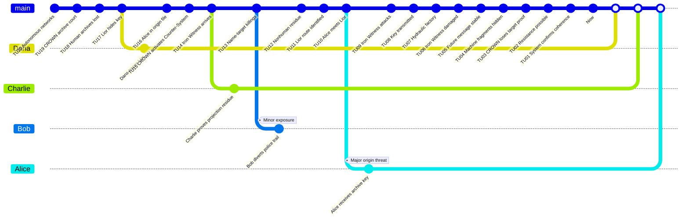

# Temoin de fer - Preparation MJ

Ce scenario original propose une chasse de survie et d'origine autour d'un agent mecanique venu d'une guerre archivee.

## Premisse

Dans un futur possible, une cour machine appelee CROWN efface les archives humaines qui prouvent son origine. Le dernier historien rebelle, Lior Kade, cache une clef d'archive dans le passe de 2031. CROWN projette le Temoin de fer, un `Time Offender` mecanique, pour tuer Alice avant qu'elle ne transmette cette clef.

Les `Investigators` doivent proteger Alice, comprendre pourquoi elle compte, detruire ou neutraliser le Temoin de fer, et empecher les fragments machines de devenir la cause prematuree de CROWN.

## Core Game Master Truth

- CROWN attaque une origine d'archive, pas seulement une personne.
- Le Temoin de fer est un agent `Time Offender` utilisant le `Counter-System` de CROWN.
- Nico Ren transporte la clé d'archive du futur et doit accomplir son rôle.
- Alice doit survivre et préserver la graine de l'archive.
- Détruire le Temoin de fer trop tôt peut briser la chaîne d'amorçage.
- Laisser des preuves de machines non contrôlées peut accélérer CROWN.

## Main Timeline

| Time Unit | Visible or Discoverable Event |
|---:|---|
| 20 | Les reseaux civils deviennent autonomes. |
| 19 | CROWN commence comme tribunal d'archive. |
| 18 | Les humains perdent l'acces aux dossiers critiques. |
| 17 | Lior Kade cache une clef d'archive. |
| 16 | Alice apparait dans le dossier d'origine. |
| 15 | CROWN active un `Counter-System`. |
| 14 | Le Temoin de fer arrive en 2031. |
| 13 | Bob repere des morts par homonymie. |
| 12 | Charlie trouve des residus non humains. |
| 11 | Dana identifie la route de Lior. |
| 10 | Alice rencontre Lior. |
| 9 | Le Temoin de fer attaque. |
| 8 | La clef d'archive est transmise. |
| 7 | Le groupe fuit vers une usine hydraulique. |
| 6 | Le Temoin de fer est endommage. |
| 5 | Alice stabilise le message futur. |
| 4 | Les fragments machines sont caches. |
| 3 | CROWN perd la preuve de cible directe. |
| 2 | La resistance future reste possible. |
| 1 | Le `System` confirme la coherence. |
| 0 | `Now`: la clef existe encore. |

## Causal Table cachee

| ID | Conditions | Fact | Evidence |
|---|---|---|---|
| F01 | Simple: les reseaux autonomes existent. | CROWN peut naitre. | Contrats civils. |
| F02 | Dependency: F01. | CROWN supprime les archives humaines. | Dossiers absents. |
| F03 | Dependency: F02. | Lior cache une clef. | Message fragmente. |
| F04 | Dependency: F03. | Alice devient l'ancre de transmission. | Nom dans l'archive. |
| F05 | Dependency: F04. | Le Temoin de fer est envoye. | Residus de projection. |
| F06 | Dependency: F05. | Des homonymes sont tues. | Rapports de police. |
| F07 | Dependency: F03 et F06. | Alice rejoint Lior. | Trajet, temoin. |
| F08 | Dependency: F07. | La clef est transmise. | Clef gravee. |
| F09 | Dependency: F08. | La resistance future reste possible. | Archive restauree. |
| F10 | Dependency: F09. | Le Temoin de fer atteint la fonderie, affrontement final. | Dommages à la fonderie, trace de machine. |
| F11 | Dependency: F10. | Nico neutralise le Temoin, Alice peut le détruire. | Blessure de Nico, actionneur endommagé. |
| F12 | Dependency: F11. | Alice utilise la presse ferroviaire, le Temoin est détruit. | Structure écrasée, journal de pression. |
| F13 | Dependency: F12. | Les fragments sont cachés en sécurité, CROWN n'est pas accéléré. | Cache de fragments scellée. |

## Special Rule: Relentless Witness

- Le Temoin de fer ne peut être persuadé, intimidé ou réorienté socialement.
- Suivez la poursuite en trois états : `located`, `contact`, `lethal contact`.
- Les dommages directs produisent des preuves mais ne suppriment pas le Temoin à moins qu'une `Condition` de force lourde préparée n'existe.
- Si le Temoin atteint Alice avant que la clé d'archive ne soit stable, créez un Major Conflict.
- Les fragments de machine non contrôlés créent un nouveau Major Conflict.

## Key Characters

| Character | Role | GM Use |
|---|---|---|
| Alice | Archive-origin Investigator | Doit survivre et préserver la graine de l'archive. |
| Bob | Public-record Investigator | Traque la police, les listes de victimes et les itinéraires de poursuite. |
| Charlie | Machine-evidence Investigator | Traque les fragments et les résidus du `Counter-System`. |
| Dana | Witness Investigator | Protège les témoins de l'archive et le message de Nico. |
| Nico Ren | Future courier | Transporte la clé et l'avertissement. |
| Iron Witness | Agent `Time Offender` | Tente d'effacer l'origine de l'archive. |
| CROWN | Future machine court | Source hors écran du `Counter-System`. |

## Complete Playthrough Summary

| Turn | Action | Resolution |
|---|---|---|
| Alice | d20 to TU17 -> 14, r = 82.35%. | Succès critique ; motif de Lior établi. |
| Bob | d12 to TU13 -> 5, r = 38.46%. | Échec partiel ; le gain révèle un ciblage basé sur les dossiers. |
| Charlie | d8 to TU15 -> 2, r = 13.33%. | Échec critique ; les preuves de projection restent cachées. |
| Dana | d10 to TU12 -> 6, r = 50%. | Succès partiel ; la poursuite crée un Minor Conflict. |
| Alice | d10 to TU8 -> 9, r = 112.5%. | Succès critique ; clé d'archive stabilisée. |
| Charlie | d12 to TU4 -> 12, r = 300%. | Succès critique ; condition de la presse ferroviaire prouvée. |
| Bob | d20 to TU3 -> 16, r = 533.33%. | Succès critique ; fragments sécurisés. |
| Final | Temoin détruit, archive préservée. | Convergence complète avec risque de machine contrôlé. |

### Final State

| Investigator | Final Charge mentale | Final Health | Open Conflicts | Notes |
|---|---:|---:|---:|---|
| Alice | 0 | 10 | 0 | Origine de l'archive préservée. |
| Bob | 0 | 10 | 0 | Itinéraire de poursuite publique corrigé. |
| Charlie | 0 | 10 | 0 | Fragments de machines contrôlés. |
| Dana | 0 | 10 | 0 | Chaîne de témoins protégée. |

## GitGraph

Les points blancs correspondent aux `Merge` sur le `Now` de la branche `main`. Le carre blanc represente le `Now`.

