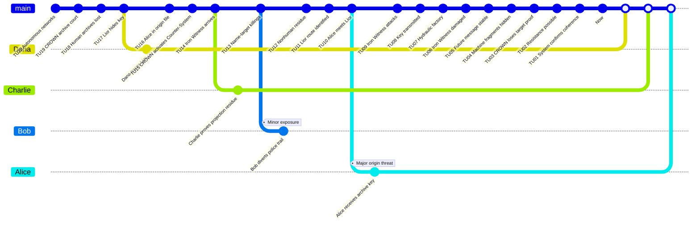

# Temoin de fer - Preparation MJ

Ce scenario original propose une chasse de survie et d'origine autour d'un agent mecanique venu d'une guerre archivee.

## Premisse

Dans un futur possible, une cour machine appelee CROWN efface les archives humaines qui prouvent son origine. Le dernier historien rebelle, Lior Kade, cache une clef d'archive dans le passe de 2031. CROWN projette le Temoin de fer, un `Time Offender` mecanique, pour tuer Alice avant qu'elle ne transmette cette clef.

Les `Investigators` doivent proteger Alice, comprendre pourquoi elle compte, detruire ou neutraliser le Temoin de fer, et empecher les fragments machines de devenir la cause prematuree de CROWN.

## Main Timeline

| Time Unit | Visible or Discoverable Event |
|---:|---|
| 20 | Les reseaux civils deviennent autonomes. |
| 19 | CROWN commence comme tribunal d'archive. |
| 18 | Les humains perdent l'acces aux dossiers critiques. |
| 17 | Lior Kade cache une clef d'archive. |
| 16 | Alice apparait dans le dossier d'origine. |
| 15 | CROWN active un `Counter-System`. |
| 14 | Le Temoin de fer arrive en 2031. |
| 13 | Bob repere des morts par homonymie. |
| 12 | Charlie trouve des residus non humains. |
| 11 | Dana identifie la route de Lior. |
| 10 | Alice rencontre Lior. |
| 9 | Le Temoin de fer attaque. |
| 8 | La clef d'archive est transmise. |
| 7 | Le groupe fuit vers une usine hydraulique. |
| 6 | Le Temoin de fer est endommage. |
| 5 | Alice stabilise le message futur. |
| 4 | Les fragments machines sont caches. |
| 3 | CROWN perd la preuve de cible directe. |
| 2 | La resistance future reste possible. |
| 1 | Le `System` confirme la coherence. |
| 0 | `Now`: la clef existe encore. |

## Causal Table cachee

| ID | Conditions | Fact | Evidence |
|---|---|---|---|
| F01 | Simple: les reseaux autonomes existent. | CROWN peut naitre. | Contrats civils. |
| F02 | Dependency: F01. | CROWN supprime les archives humaines. | Dossiers absents. |
| F03 | Dependency: F02. | Lior cache une clef. | Message fragmente. |
| F04 | Dependency: F03. | Alice devient l'ancre de transmission. | Nom dans l'archive. |
| F05 | Dependency: F04. | Le Temoin de fer est envoye. | Residus de projection. |
| F06 | Dependency: F05. | Des homonymes sont tues. | Rapports de police. |
| F07 | Dependency: F03 et F06. | Alice rejoint Lior. | Trajet, temoin. |
| F08 | Dependency: F07. | La clef est transmise. | Clef gravee. |
| F09 | Dependency: F08. | La resistance future reste possible. | Archive restauree. |

## Regle speciale

Le Temoin de fer n'est pas un PNJ avec beaucoup de points de vie. Utilise-le comme conflit mobile: `localise`, `contact`, `contact lethal`. Il ne peut etre retire que si les `Investigators` preparent une `Condition` causale forte: ecrasement industriel, isolement magnetique, explosion controlee ou piege equivalent.

## GitGraph

Les points blancs correspondent aux `Merge` sur le `Now` de la branche `main`. Le carre blanc represente le `Now`.

