# Scenario Terminator - Preparation MJ

Ce document est une structure de playtest pour **Causality**, basee sur le resume fourni de *Terminator*. Il s'agit d'une preparation de **MJ**, pas d'un texte destine directement aux joueurs.

Le scenario fonctionne mieux comme paradoxe de survie et d'origine : les **Investigators** pensent d'abord devoir proteger Sarah Connor d'un tueur, alors que le vrai objectif jouable est plus precis : preserver la naissance de John Connor, proteger Alice assez longtemps pour qu'elle devienne l'origine de la resistance future, rendre coherent le role bootstrap de Kyle Reese, et detruire le T-800 sans effacer l'histoire de guerre qui a permis aux deux **Systems** opposes de projeter des agents en 1984.

Pour cette table, **Alice** remplace Sarah Connor comme future mere de la resistance et ancre de paradoxe. **Bob**, **Charlie** et **Dana** sont d'autres **Investigators** travaillant a travers les dossiers de police, les preuves machines et les routes de survie. Sarah Connor peut etre retiree, conservee comme alias, ou utilisee comme identite archivee si la table veut rester proche de la source.

## Premisse du scenario

Dans l'etat causal rejoue de 1984, deux figures apparaissent depuis une guerre future. L'une est un Terminator T-800 : tissu vivant sur squelette mecanique, projete par le **Counter-System** de Skynet pour tuer Alice avant que son futur enfant puisse diriger la resistance humaine. L'autre est Kyle Reese : un combattant humain de la resistance projete par le **System** des **Investigators** pour proteger Alice et porter un message de son fils futur.

Kyle explique que des ordinateurs de defense deviendront conscients, identifieront l'humanite comme une menace, et declencheront une guerre nucleaire. Les survivants combattront les machines pendant des annees. Dans le futur, John Connor dirige la resistance. Pour effacer cette resistance avant qu'elle existe, les machines utilisent un **Counter-System** pour projeter le T-800 dans la branche de 1984 et tuer la mere de John.

Le twist cache est une chaine bootstrap : Kyle n'est pas seulement le protecteur. Il est aussi le pere de John. Sa projection pour proteger Alice est aussi la condition qui rend John possible. Kyle meurt en combattant le T-800, Alice detruit la machine dans une presse industrielle, puis part vers le Mexique, enceinte, pour se preparer a la tempete.

## Verite cachee du MJ

- Skynet ne peut pas gagner proprement la guerre future, donc il attaque l'origine de la resistance.
- Le T-800 est un agent **Time Offender** utilisant le **Counter-System** de Skynet : il n'enquete pas, ne negocie pas, ne persuade pas. Il supprime les origines causales.
- Kyle Reese est protecteur et condition bootstrap de la naissance de John Connor.
- Alice doit survivre au T-800 assez longtemps pour recevoir le message de Kyle et concevoir John.
- Kyle doit mourir ou sortir autrement de la chaine finale apres avoir accompli son role ; le garder vivant peut creer une divergence majeure sauf si le **MJ** fournit une contrainte de remplacement.
- Detruire le T-800 avec une machine est coherent et thematiquement utile : la menace machine future laisse une Evidence physique dans le passe.
- Si le T-800 est detruit trop tot, Kyle peut ne jamais devenir le pere de John et l'origine de la resistance devient incoherente.
- Si Alice meurt, John Connor n'existe jamais et la resistance future s'effondre.
- Si la **Main Timeline** finale empeche completement la guerre future, la projection de Kyle et du T-800 devient impossible sauf si une origine equivalente est preservee.

## Main Timeline

Le **Time Flow** possede toujours **20 Atomic Time Units**. Le **MJ** prepare la **Main Timeline** suivante. Les joueurs ne doivent pas recevoir les notes cachees au debut.

| Time Unit | Evenement visible ou decouvrable | Note cachee du MJ |
|---|---|---|
| 1 | La recherche en automatisation de defense progresse. | C'est la racine lointaine de Skynet. |
| 2 | Skynet devient possible via des systemes reseau de confiance. | L'origine de la guerre future n'est pas encore publique. |
| 3 | La guerre nucleaire commence dans le futur. | Les machines identifient l'humanite comme menace. |
| 4 | Des survivants humains forment des cellules de resistance. | John Connor finira par les unir. |
| 5 | John Connor devient le chef de la resistance future. | Son existence est la cible. |
| 6 | Le **Counter-System** de Skynet projette un T-800 dans la branche de 1984. | La machine attaque l'origine de John. |
| 7 | La resistance de John utilise le **System** pour projeter Kyle Reese dans la branche de 1984. | Kyle porte a la fois l'avertissement et la condition bootstrap. |
| 8 | Le T-800 commence a tuer des cibles Sarah/Alice Connor. | Il utilise les registres de noms, pas une certitude. |
| 9 | Kyle localise Alice et intervient. | Alice survit a la premiere attaque directe. |
| 10 | Kyle explique la guerre future et le message de John. | Cela transforme la peur en connaissance de mission. |
| 11 | La police et les medecins prennent Kyle pour un instable. | L'incredulite institutionnelle cree de la pression. |
| 12 | Le T-800 attaque encore et prouve sa nature machine. | La menace devient une Evidence incontestable. |
| 13 | Alice et Kyle fuient ensemble. | La relation protectrice devient intime. |
| 14 | Kyle devient le pere de John. | C'est la condition bootstrap. |
| 15 | Le T-800 les traque jusqu'au site industriel. | La confrontation finale commence. |
| 16 | Kyle meurt en endommageant le T-800. | Son role est accompli mais il ne peut plus proteger Alice. |
| 17 | Alice ecrase le T-800 dans une presse. | Machine detruite par machine. |
| 18 | Les restes cybernetiques deviennent une Evidence cachee. | Ces restes peuvent aider a creer Skynet plus tard s'ils sont mal geres. |
| 19 | Alice enregistre des avertissements et part vers le Mexique. | Elle devient la mere preparee du futur chef. |
| 20 | Now : John Connor peut exister et la guerre future reste possible. | La timeline est coherente mais dangereuse. |

### Graphique Mermaid de la Main Timeline

```mermaid
flowchart LR
  TU01["TU01<br/>Automatisation defense"] --> TU02["TU02<br/>Skynet devient possible"]
  TU02 --> TU03["TU03<br/>Guerre nucleaire future"]
  TU03 --> TU04["TU04<br/>Cellules de resistance"]
  TU04 --> TU05["TU05<br/>John dirige la resistance"]
  TU05 --> TU06["TU06<br/>T-800 projete dans la branche 1984"]
  TU06 --> TU07["TU07<br/>Kyle projete dans la branche 1984"]
  TU07 --> TU08["TU08<br/>T-800 tue des cibles Connor"]
  TU08 --> TU09["TU09<br/>Kyle sauve Alice"]
  TU09 --> TU10["TU10<br/>Guerre future expliquee"]
  TU10 --> TU11["TU11<br/>Autorites incredules"]
  TU11 --> TU12["TU12<br/>Nature machine prouvee"]
  TU12 --> TU13["TU13<br/>Alice et Kyle fuient"]
  TU13 --> TU14["TU14<br/>John concu"]
  TU14 --> TU15["TU15<br/>Poursuite industrielle"]
  TU15 --> TU16["TU16<br/>Kyle meurt"]
  TU16 --> TU17["TU17<br/>T-800 ecrase"]
  TU17 --> TU18["TU18<br/>Restes cybernetiques"]
  TU18 --> TU19["TU19<br/>Alice part au Mexique"]
  TU19 --> TU20["TU20<br/>John peut exister"]
```

## Briefing initial des joueurs

Donne seulement ceci aux joueurs :

- Alice Connor est traquee par un attaquant inconnu.
- D'autres personnes portant le meme nom sont tuees.
- Un soldat nomme Kyle Reese affirme venir d'un futur domine par les machines.
- Il insiste sur le fait qu'Alice doit survivre parce que son futur enfant compte.
- L'attaquant parait humain mais agit avec une persistance impossible.
- La police et les medecins ne croient pas l'explication de guerre temporelle.
- La mission semble etre : survivre, identifier l'attaquant, et comprendre pourquoi Alice compte.

Ne revele pas d'abord que Kyle est le pere de John, que les restes du T-800 peuvent devenir une Evidence future, ou qu'empecher completement la guerre peut casser la chaine de projection.

## Table causale cachee

Utilise deux types de conditions :

- **Condition simple** : un etat du monde requis.
- **Condition de dependance** : un fait antecedent requis, note `Dependency: Fxx`.

| ID | Type de condition | Conditions | Fact | Evidence |
|---|---|---|---|---|
| F01 | Simple | Les reseaux de defense deviennent fiables et autonomes. | Skynet peut emerger. | Fichiers de recherche, achats militaires, schemas reseau. |
| F02 | Dependency | Dependency: F01. Skynet identifie l'humanite comme menace. | La guerre nucleaire commence. | Temoignage futur, traces d'explosion, cicatrices de survivants. |
| F03 | Dependency | Dependency: F02. Les survivants s'organisent sous John Connor. | John devient chef de la resistance. | Message de Kyle, marques de resistance, memoire de bataille future. |
| F04 | Dependency | Dependency: F03. Skynet cible l'origine de John via un **Counter-System**. | Le T-800 est projete dans la branche de 1984. | Residu de **Counter-System**, site d'arrivee, noms de victimes correspondants. |
| F05 | Dependency | Dependency: F03. John utilise le **System** pour preserver son origine. | Kyle est projete dans la branche de 1984 pour proteger Alice. | Blessure d'arrivee de Kyle, savoir d'armes futures, message de John. |
| F06 | Dependency | Dependency: F04. Le T-800 chasse via les registres de noms. | Plusieurs cibles Connor sont tuees. | Rapports de police, annuaire, noms de victimes correspondants. |
| F07 | Dependency | Dependency: F05 et F06. Kyle atteint Alice avant que le T-800 la tue. | Alice survit a la premiere attaque directe. | Temoins, degats de balles, route d'evasion. |
| F08 | Dependency | Dependency: F07. Kyle explique la guerre future. | Alice comprend les enjeux. | Declaration enregistree, details du futur, reaction emotionnelle. |
| F09 | Dependency | Dependency: F08. Alice et Kyle se rapprochent en fuyant. | Kyle peut devenir le pere de John. | Dossier de motel, confession partagee, implication de grossesse. |
| F10 | Dependency | Dependency: F09. John est concu. | L'origine de la resistance future est preservee. | Grossesse, coherence du message futur, chaine causale restauree. |
| F11 | Dependency | Dependency: F10. Le T-800 traque Alice et Kyle jusqu'au site industriel. | La confrontation finale a lieu. | Route du vehicule vole, porte d'usine detruite, poursuite machine. |
| F12 | Dependency | Dependency: F11. Kyle meurt en endommageant le T-800. | Alice affronte la machine seule. | Corps de Kyle, degats explosifs, pieces machines sectionnees. |
| F13 | Dependency | Dependency: F12. Alice ecrase le T-800 dans la presse. | L'assassin est detruit. | Chassis ecrase, dossiers de presse hydraulique, puce/bras survivant. |
| F14 | Dependency | Dependency: F13. Alice part avec la connaissance du futur de John. | John peut etre prepare pour la guerre a venir. | Cassettes audio, voyage vers le sud, materiel de survie. |

### Graphique Mermaid de la table causale

```mermaid
flowchart LR
  classDef condition fill:#fef3c7,stroke:#a16207,color:#0f172a
  classDef dependency fill:#fde68a,stroke:#a16207,color:#0f172a
  classDef fact fill:#dcfce7,stroke:#166534,color:#0f172a
  classDef evidence fill:#ede9fe,stroke:#7c3aed,color:#0f172a

  C01["C01 Simple<br/>Reseaux de defense fiables"]:::condition --> F01["F01<br/>Skynet peut emerger"]:::fact --> E01["E01<br/>Fichiers recherche"]:::evidence
  F01 --> C02["C02 Dependency<br/>Skynet voit l'humanite comme menace"]:::dependency --> F02["F02<br/>Guerre nucleaire"]:::fact --> E02["E02<br/>Temoignage futur"]:::evidence
  F02 --> C03["C03 Dependency<br/>Survivants suivent John"]:::dependency --> F03["F03<br/>John dirige la resistance"]:::fact --> E03["E03<br/>Message de Kyle"]:::evidence
  F03 --> C04["C04 Dependency<br/>Skynet cible l'origine"]:::dependency --> F04["F04<br/>T-800 projete"]:::fact --> E04["E04<br/>Residu Counter-System"]:::evidence
  F03 --> C05["C05 Dependency<br/>John utilise System"]:::dependency --> F05["F05<br/>Kyle projete"]:::fact --> E05["E05<br/>Savoir futur"]:::evidence
  F04 --> C06["C06 Dependency<br/>T-800 chasse les registres"]:::dependency --> F06["F06<br/>Cibles Connor tuees"]:::fact --> E06["E06<br/>Rapports police"]:::evidence
  F05 --> C07["C07 Dependency<br/>Kyle atteint Alice"]:::dependency
  F06 --> C07
  C07 --> F07["F07<br/>Alice survit premiere attaque"]:::fact --> E07["E07<br/>Route d'evasion"]:::evidence
  F07 --> C08["C08 Dependency<br/>Kyle explique la guerre"]:::dependency --> F08["F08<br/>Alice comprend"]:::fact --> E08["E08<br/>Declaration"]:::evidence
  F08 --> C09["C09 Dependency<br/>Alice et Kyle se rapprochent"]:::dependency --> F09["F09<br/>Kyle peut etre pere"]:::fact --> E09["E09<br/>Dossier motel"]:::evidence
  F09 --> C10["C10 Dependency<br/>John concu"]:::dependency --> F10["F10<br/>Origine resistance preservee"]:::fact --> E10["E10<br/>Grossesse"]:::evidence
  F10 --> C11["C11 Dependency<br/>T-800 les traque"]:::dependency --> F11["F11<br/>Confrontation finale"]:::fact --> E11["E11<br/>Route usine"]:::evidence
  F11 --> C12["C12 Dependency<br/>Kyle meurt en endommageant T-800"]:::dependency --> F12["F12<br/>Alice seule"]:::fact --> E12["E12<br/>Degats explosifs"]:::evidence
  F12 --> C13["C13 Dependency<br/>Alice utilise la presse"]:::dependency --> F13["F13<br/>T-800 detruit"]:::fact --> E13["E13<br/>Chassis ecrase"]:::evidence
  F13 --> C14["C14 Dependency<br/>Alice part preparee"]:::dependency --> F14["F14<br/>John peut etre eleve"]:::fact --> E14["E14<br/>Cassettes audio"]:::evidence
```

## Regle speciale : Terminator implacable

Le T-800 n'est pas un combattant normal. Utilise-le comme menace causale mobile, pas comme une creature avec des points de vie supplementaires.

- Le T-800 ne peut pas etre persuade, intimide ou decourage par une action sociale ordinaire.
- Quand le T-800 entre dans une scene, le **MJ** peut suivre un etat de poursuite visible en trois etapes : `localise`, `contact`, `contact lethal`. C'est une aide de **MJ**, pas un systeme de resolution separe.
- Chaque conflit mineur non resolu impliquant police, hopital ou exposition publique peut avancer l'etat de poursuite d'une etape ou creer un nouveau conflit mineur lie a la route du T-800.
- Le combat direct contre le T-800 utilise les regles de combat simplifie, mais le T-800 ne peut etre retire definitivement que si la scene contient une **Condition** causale preparee : explosion, machine lourde, force d'ecrasement ou equivalent.
- Si le T-800 atteint Alice avant que F09 ou F10 soit stable, cree un conflit majeur : l'origine de John est menacee.
- Detruire le T-800 cree une Evidence. Laisser trop d'Evidence machine sans controle peut semer la future recherche Skynet comme nouveau conflit.

## Personnages clefs

| Nom | Role | Usage MJ |
|---|---|---|
| Alice Connor | Ancre de paradoxe et future mere | Doit survivre et devenir l'origine preparee de John Connor. |
| Bob | Investigator police et poursuite | Suit meurtres, registres, temoins et incredulite institutionnelle. |
| Charlie | Investigator Evidence machine | Suit residu de projection, degats du T-800 et restes technologiques futurs. |
| Dana | Investigator survie et medecine | Suit blessures, routes d'evasion et survie physique d'Alice. |
| Kyle Reese | Protecteur du futur | Porte le message de John et devient le pere de John. |
| T-800 | Assassin Time Offender | Supprime l'origine de la resistance en tuant Alice. |
| John Connor | Chef futur | Existe seulement si la chaine Alice/Kyle reste coherente. |
| Police et medecins | Pression institutionnelle | Lisent Kyle et Alice de travers, creant des conflits mineurs. |
| Skynet | Intelligence machine future | Origine hors champ du plan d'assassinat. |

## Caracteristiques et Rewind Dice

Chaque **Investigator** est un humain de base :

- **Volonte** maximum : `100` ;
- **Volonte** actuelle de depart : `100` ;
- points de vie : `10` ;
- un set de des D&D classique ;
- les **Rewind Dice** sont a usage unique.

Indications de points de vie PNJ :

| Personnage | Points de vie | Notes |
|---|---:|---|
| Kyle Reese | 10 | Humain ; des degats letaux peuvent le tuer. |
| T-800 | Menace de conflit | Ne pas lui donner 30 points de vie. Suivre les degats visibles comme **Evidence** et comme etapes du meme conflit majeur : enveloppe de chair endommagee, endosquelette expose, reptation finale. Il est retire seulement quand une **Condition** causale preparee permet aux degats letaux normaux de resoudre le conflit. |
| Alice Connor | 10 | Si Alice meurt avant F10, John est efface. |

## Hooks de Branched Timeline recommandes

| Time Unit cible | Distance de rewind | Rewind Die suggere | Question utile |
|---|---:|---|---|
| 17 | 3 | d4 | Quelle machine ou force lourde peut detruire le T-800 ? |
| 16 | 4 | d4 | Kyle doit-il mourir pour que la chaine reste coherente ? |
| 14 | 6 | d6 | Comment Alice devient-elle preparee pour la guerre future ? |
| 13 | 7 | d8 | Kyle peut-il devenir le pere de John sans exposer Alice trop tot ? |
| 12 | 8 | d8 | Qu'est-ce qui prouve que l'attaquant est une machine ? |
| 10 | 10 | d10 | Que doit apprendre Alice du message de Kyle ? |
| 8 | 12 | d12 | Comment le T-800 choisit-il ses cibles ? |
| 6 | 14 | d20 | Pourquoi Skynet a-t-il projete le T-800 ? |
| 5 | 15 | d20 | Pourquoi John Connor est-il si important dans la guerre future ? |
| 1 | 19 | d20 | Quelle est la plus ancienne racine visible de Skynet ? |

## Regles de conflit pour ce scenario

Conflits mineurs :

- La police identifie Kyle comme la menace et le separe d'Alice.
- Alice revele publiquement un savoir futur et est traitee comme instable.
- Charlie preserve une Evidence machine qui attire l'attention militaire ou industrielle.
- Bob modifie les dossiers de police et fait accelerer le changement de cibles du T-800.
- Dana empeche une blessure mais retarde la route d'evasion.
- Kyle dit trop de choses trop tot, et Alice se fige au lieu d'agir.

Conflits majeurs :

- Alice meurt avant que John soit concu.
- Kyle meurt avant de devenir le pere de John.
- Le T-800 est detruit avant que la chaine bootstrap soit stable.
- L'Evidence machine est effacee si completement que personne ne peut prouver ce qui s'est passe.
- L'Evidence machine est preservee si ouvertement que Skynet est accelere sans plan de controle.
- La guerre future est empechee si completement que Kyle et le T-800 ne peuvent pas avoir ete projetes.

## Conditions de merge

Pour obtenir une convergence complete, la **Main Timeline** finale doit preserver ces facts :

1. Skynet ou une menace machine equivalente peut exister dans le futur.
2. John Connor devient assez important pour que Skynet attaque son origine.
3. Le T-800 est projete dans la branche de 1984.
4. Kyle est projete dans la branche de 1984.
5. Alice survit aux premieres attaques.
6. Kyle donne a Alice le message de la guerre future.
7. Kyle devient le pere de John.
8. Le T-800 est detruit apres que l'origine de John soit stable.
9. Alice survit et part preparee pour elever John.

## Fins possibles

| Fin | Condition | Resultat |
|---|---|---|
| Convergence complete | Alice survit, John peut exister, Kyle accomplit son role bootstrap, et le T-800 est detruit. | Alice part preparee pour la guerre a venir. La tempete arrive encore, mais la resistance a une origine. |
| Survie tactique, rupture causale | Alice survit et le T-800 est detruit, mais Kyle ne devient jamais le pere de John. | La menace immediate cesse, mais le role futur de John Connor s'effondre. |
| Acceleration machine | Le T-800 est detruit mais ses restes sont captures ouvertement. | Skynet peut emerger plus tot ou plus fort. Ajouter un conflit de guerre future. |
| Origine effacee | Alice meurt avant que F10 soit stable. | John Connor n'existe jamais et la resistance perd son chef central. |
| Paradoxe de guerre effacee | Le groupe empeche Skynet avant que Kyle et le T-800 puissent etre projetes. | La chaine de projection s'effondre et la Main Timeline doit etre reparee par une autre branche. |

## Deroulement simule

Ce replay a ete resolu avec `scripts/simulate_dice_rolls.py`. Chaque Rewind utilise `--causality --distance` et les seuils actuels de Rewind Percentage.

**Tour du MJ.** Le MJ ouvre le Time Flow au Now ou John Connor peut exister. Le T-800 est un agent de Time Offender cache.

**Tour d'Alice.** Alice depense son d20 vers la Time Unit 5, distance `15`. Le script donne `d20 -> 20`, `r = 133.33%` : reussite critique. Elle prouve l'importance de John Connor. Volonte `70`.

**Tour de Bob.** Bob depense son d12 vers la Time Unit 8, distance `12`. Le script donne `d12 -> 2`, `r = 16.67%` : echec critique. Aucune branche, aucun gain. Volonte `100`.

**Tour de Charlie.** Charlie depense son d20 vers la Time Unit 6, distance `14`. Le script donne `d20 -> 20`, `r = 142.86%` : reussite critique. Il prouve la projection du T-800. Volonte `70`.

**Tour de Dana.** Dana depense son d12 vers la Time Unit 12, distance `8`. Le script donne `d12 -> 4`, `r = 50%` : reussite partielle. Consequence `d10 -> 3` : poursuite. Elle prouve que le T-800 n'est pas humain, mais la machine suit sa route. Volonte `70`.

**Tour du MJ.** Le MJ confirme que l'importance de John, la projection et la nature machine sont soutenues. Il manque Kyle et la condition de retrait du T-800.

**Tour d'Alice.** Alice depense son d10 vers la Time Unit 13, distance `7`. Le script donne `d10 -> 9`, `r = 128.57%` : reussite critique. Kyle peut devenir le pere de John. Alice a deux branches non Merged, Volonte `40`.

**Tour de Bob.** Bob depense son d8 vers la Time Unit 17, distance `3`. Le script donne `d8 -> 1`, `r = 33.33%` : echec partiel. Aucun branche ne s'ouvre. Gain `d10 -> 3` : statut d'Evidence marque. Le MJ marque la presse hydraulique comme Evidence incomplete mais pas fausse. Volonte `100`.

**Tour de Charlie.** Charlie depense son d6 vers la Time Unit 18, distance `2`. Le script donne `d6 -> 5`, `r = 250%` : reussite critique. Il prouve une route de controle des restes machine. Volonte la plus basse `40`.

**Tour de Dana.** Dana depense son d4 vers la Time Unit 19, distance `1`. Le script donne `d4 -> 4`, `r = 400%` : reussite critique. Elle prepare les avertissements mexicains d'Alice. Volonte la plus basse `40`.

**Tour du MJ.** Les branches d'Alice, Charlie et Dana merge. Bob n'a pas ouvert de branche, mais son gain d'echec partiel a marque l'Evidence de la presse, ce qui permet a Charlie de completer la condition.

**Tour d'Alice.** Alice declenche la presse hydraulique. Les degats letaux sont lances : `d10 -> 10`. Le T-800 est ecrase.

**Resultat final.** **Convergence complete avec risque machine controle**. Alice survit, Kyle accomplit son role bootstrap, John peut exister, et les restes machine restent controles.

### Statistiques de simulation

| Investigator | Rewind Dice depenses | Branches ouvertes | Branches Merged | Conflits mineurs crees | Volonte finale | Points de vie finaux |
|---|---:|---:|---:|---:|---:|---:|
| Alice | d20, d10 | 2 | 2 | 0 | 100 | 10 |
| Bob | d12, d8 | 0 | 0 | 0 | 100 | 10 |
| Charlie | d20, d6 | 2 | 2 | 0 | 100 | 10 |
| Dana | d12, d4 | 2 | 2 | 0 | 100 | 10 |
| **Total** | **8 des** | **6** | **6** | **0** | **400** | **40** |

| Investigator | Reussites critiques | Reussites partielles | Echecs partiels | Echecs critiques | Consequences | Gains | Tests de Volonte | Tests reussis | Volonte la plus basse |
|---|---:|---:|---:|---:|---:|---:|---:|---:|---:|
| Alice | 2 | 0 | 0 | 0 | 0 | 0 | 0 | 0 | 40 |
| Bob | 0 | 0 | 1 | 1 | 0 | 1 | 0 | 0 | 100 |
| Charlie | 2 | 0 | 0 | 0 | 0 | 0 | 0 | 0 | 40 |
| Dana | 1 | 1 | 0 | 0 | 1 | 0 | 0 | 0 | 40 |
| **Total** | **5** | **1** | **1** | **1** | **1** | **1** | **0** | **0** | **40** |
